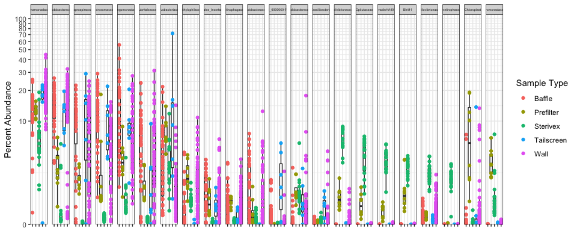
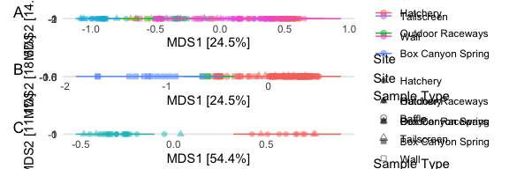

```r
if (!require("pacman")) install.packages("pacman")
```

```
## Loading required package: pacman
```

```r
pacman::p_load(phyloseq, BiocManager, qiime2R, tidyverse, viridis, pheatmap, ggplot2, vegan, patchwork, ggpubr, ranacapa, nlme, compositions, readr, devtools, DESeq2, microViz, ANCOMBC, microbiome, GUniFrac, rstatix, corncob, scales, MicEco, btools, dplyr, tibble, pairwiseAdonis, metagMisc)

set.seed(1234)
permutations = 9999
```

Import


```r
phy = qza_to_phyloseq(features = "filtered-table-2017-2018-2019.qza", tree = "phylogeny/rooted_tree.qza", taxonomy = "filtered-taxonomy-silva-2017-2018-2019.qza", metadata = "Mapping_File_filtered_FINAL.txt",tmp = "/var/folders/67/6dbph7ys1d3240bqc4wgn7380000gp/T/")
ntaxa(phy)
```

```
## [1] 25790
```

```r
tax_fix_interactive(phy)
```

```
## ------ tax_fix_interactive looks best fullscreen! ------
```

```
## Click red stop button or hit Esc in console to stop app!
```

```
## Warning: The select input "selected" contains a large number of options;
## consider using server-side selectize for massively improved performance. See the
## Details section of the ?selectizeInput help topic.
```

```
## PhantomJS not found. You can install it with webshot::install_phantomjs(). If it is installed, please make sure the phantomjs executable can be found via the PATH variable.
```

preserve36af629d5e568984

```r
#adjust tax table for use in microviz
phy = phy %>%
 tax_fix(
  min_length = 3,
  unknowns = c("NA", "uncultured", "unidentified", "uncultured_soil", "uncultured_beta", "uncultured_delta", "uncultured_gamma", "uncultured_rumen", "uncultured_Green", "uncultured_fungus", "uncultured_marine", "uncultured_diatom", "uncultured_sludge", "uncultured_Crater", "uncultured_compost", "Unknown_Family Family", "Unknown_Family", "uncultured_bacterium", "metagenome", "Incertae_Sedis"),
  sep = "_", anon_unique = TRUE,
  suffix_rank = "classified"
 )
#remove prefix
phy@tax_table = gsub("d__", "", phy@tax_table)
```

Subset by sample type and rarefy


```r
phy_wall_swabs = subset_samples(phy, Sample_Type == "Wall")
phy_wall_swabs_rarefy = rarefy_even_depth(phy_wall_swabs, 10000, rngseed = 1234)
```

```
## `set.seed(1234)` was used to initialize repeatable random subsampling.
```

```
## Please record this for your records so others can reproduce.
```

```
## Try `set.seed(1234); .Random.seed` for the full vector
```

```
## ...
```

```
## 16661OTUs were removed because they are no longer 
## present in any sample after random subsampling
```

```
## ...
```

```r
phy_wall_swabs_maturity = subset_samples(phy_wall_swabs, Maturity == "Young"|Maturity == "Youngest"|Maturity =="Mature")
phy_wall_swabs_maturity_rarefy = rarefy_even_depth(phy_wall_swabs_maturity, 10000, rngseed = 1234)
```

```
## `set.seed(1234)` was used to initialize repeatable random subsampling.
```

```
## Please record this for your records so others can reproduce.
```

```
## Try `set.seed(1234); .Random.seed` for the full vector
```

```
## ...
```

```
## 21842OTUs were removed because they are no longer 
## present in any sample after random subsampling
```

```
## ...
```

```r
nsamples(phy_wall_swabs_maturity_rarefy)
```

```
## [1] 57
```

```r
phy_sterivex = subset_samples(phy, Sample_Type == "Sterivex")
phy_sterivex_rarefy = rarefy_even_depth(phy_sterivex, 10000, rngseed = 1234)
```

```
## `set.seed(1234)` was used to initialize repeatable random subsampling.
```

```
## Please record this for your records so others can reproduce.
```

```
## Try `set.seed(1234); .Random.seed` for the full vector
```

```
## ...
```

```
## 16850OTUs were removed because they are no longer 
## present in any sample after random subsampling
```

```
## ...
```

```r
phy_sterivex_maturity = subset_samples(phy_sterivex, Maturity == "Young"|Maturity == "Youngest"|Maturity =="Mature")
phy_sterivex_maturity_rarefy = rarefy_even_depth(phy_sterivex_maturity, 10000, rngseed = 1234)
```

```
## `set.seed(1234)` was used to initialize repeatable random subsampling.
```

```
## Please record this for your records so others can reproduce.
```

```
## Try `set.seed(1234); .Random.seed` for the full vector
```

```
## ...
```

```
## 19466OTUs were removed because they are no longer 
## present in any sample after random subsampling
```

```
## ...
```

```r
phy_prefilter = subset_samples(phy, Sample_Type == "Prefilter")
phy_prefilter_rarefy = rarefy_even_depth(phy_prefilter, 10000, rngseed = 1234)
```

```
## `set.seed(1234)` was used to initialize repeatable random subsampling.
```

```
## Please record this for your records so others can reproduce.
```

```
## Try `set.seed(1234); .Random.seed` for the full vector
```

```
## ...
```

```
## 21633OTUs were removed because they are no longer 
## present in any sample after random subsampling
```

```
## ...
```

```r
phy_baffles = subset_samples(phy, Sample_Type == "Baffle")
phy_baffles_rarefy = rarefy_even_depth(phy_baffles, 10000, rngseed = 1234)
```

```
## `set.seed(1234)` was used to initialize repeatable random subsampling.
```

```
## Please record this for your records so others can reproduce.
```

```
## Try `set.seed(1234); .Random.seed` for the full vector
```

```
## ...
```

```
## 23413OTUs were removed because they are no longer 
## present in any sample after random subsampling
```

```
## ...
```

```r
phy_tailscreen = subset_samples(phy, Sample_Type == "Tailscreen")
phy_tailscreen_rarefy = rarefy_even_depth(phy_tailscreen, 10000, rngseed = 1234)
```

```
## `set.seed(1234)` was used to initialize repeatable random subsampling.
```

```
## Please record this for your records so others can reproduce.
```

```
## Try `set.seed(1234); .Random.seed` for the full vector
```

```
## ...
```

```
## 25259OTUs were removed because they are no longer 
## present in any sample after random subsampling
```

```
## ...
```

```r
phy_wall_swabs_sterivex_maturity = merge_phyloseq(phy_sterivex_maturity, phy_wall_swabs_maturity)
phy_wall_swabs_sterivex_maturity_rarefy = rarefy_even_depth(phy_wall_swabs_sterivex_maturity, 10000, rngseed = 1234)
```

```
## `set.seed(1234)` was used to initialize repeatable random subsampling.
```

```
## Please record this for your records so others can reproduce.
```

```
## Try `set.seed(1234); .Random.seed` for the full vector
```

```
## ...
```

```
## 16454OTUs were removed because they are no longer 
## present in any sample after random subsampling
```

```
## ...
```

```r
#filter out non-hatchery samples and only keep ws,sx,bfs,bbs,ts,pf sample types; remove diversion center; remove dry raceways
phy_cleaned = subset_samples(phy, Site == "Hatchery")
phy_cleaned = subset_samples(phy_cleaned, Sample_Type != "external_fecal" & Sample_Type != "DivCen")
phy_cleaned = subset_samples(phy_cleaned, Specific_Site != "HR3" & Specific_Site != "HR5")
phy_cleaned = subset_samples(phy_cleaned, sample_names(phy_cleaned) != "Id20190828HatchR8outsx")

phy_cleaned_rarefy = rarefy_even_depth(phy_cleaned, 10000, rngseed = 1234)
```

```
## `set.seed(1234)` was used to initialize repeatable random subsampling.
```

```
## Please record this for your records so others can reproduce.
```

```
## Try `set.seed(1234); .Random.seed` for the full vector
```

```
## ...
```

```
## 13236OTUs were removed because they are no longer 
## present in any sample after random subsampling
```

```
## ...
```

```r
#subset to only include water samples for planktonic vs particle-associated comparison
phy_cleaned_water = subset_samples(phy_cleaned, Surface_or_Water == "Water")
#subset to only include surface samples for surface type comparison
phy_cleaned_surfaces = subset_samples(phy_cleaned, Surface_or_Water == "Surface")
phy_cleaned_surfaces_rarefy = rarefy_even_depth(phy_cleaned_surfaces, 10000, rngseed = 1234)
```

```
## `set.seed(1234)` was used to initialize repeatable random subsampling.
```

```
## Please record this for your records so others can reproduce.
```

```
## Try `set.seed(1234); .Random.seed` for the full vector
```

```
## ...
```

```
## 20962OTUs were removed because they are no longer 
## present in any sample after random subsampling
```

```
## ...
```

```r
#only inflowing water and surfaces
phy_cleaned_inflow_only_with_surfaces = subset_samples(phy_cleaned, Inflow_Outflow != "Out")

phy_cleaned_outflow_only_with_surfaces = subset_samples(phy_cleaned, Inflow_Outflow != "In")
```


Barplots


```r
barplot_class = comp_barplot(phy_cleaned, tax_level = "Class", n_taxa = 20, bar_outline_colour = "black", sample_order = "bray") + 
  facet_grid(rows = vars(Sample_Type), scales = "free", space = "free") +
  coord_flip() +
  theme(axis.text.y = element_blank(), axis.ticks.y = element_blank(), strip.text.y = element_text(size = 12, face = "bold"), axis.text.x = element_text(size = 12, face = "bold"), axis.title.x = element_text(size = 18, face = "bold")) +
  guides(fill = guide_legend(ncol = 1, reverse = T, title = "Class"))
```

```
## Short values detected in phyloseq tax_table (nchar<4) :
## Consider using tax_fix() to make taxa uniquely identifiable
## Short values detected in phyloseq tax_table (nchar<4) :
## Consider using tax_fix() to make taxa uniquely identifiable
```

```
## Registered S3 method overwritten by 'seriation':
##   method         from 
##   reorder.hclust vegan
```

```r
barplot_class
```

<!-- -->

```r
ggsave("hatchery_2017-2019_barplots_class.png", height = 18, width = 12)
ggsave("hatchery_2017-2019_barplots_class.eps", height = 18, width = 12)
ggsave("hatchery_2017-2019_barplots_class.tiff", compression = "lzw", height = 18, width = 12)
```

Boxplots (Most Abundant Groups)


```r
phy_cleaned_family_glom = tax_glom(phy_cleaned, "Family")
phy_cleaned_normalize_family= transform_sample_counts(phy_cleaned_family_glom, function(x) x / sum(x)*100)
tax_top(phy_cleaned_normalize_family, rank = "Family", n = 20, by = median, na.rm = T)
```

```
## Short values detected in phyloseq tax_table (nchar<4) :
## Consider using tax_fix() to make taxa uniquely identifiable
```

```
##  [1] "Comamonadaceae"             "Rhodobacteraceae"          
##  [3] "Saprospiraceae"             "Spirosomaceae"             
##  [5] "Sphingomonadaceae"          "Rubritaleaceae"            
##  [7] "Flavobacteriaceae"          "Methylophilaceae"          
##  [9] "Rhizobiales_Incertae_Sedis" "Chitinophagaceae"          
## [11] "Bdellovibrionaceae"         "Caulobacteraceae"          
## [13] "Moraxellaceae"              "env.OPS_17"                
## [15] "Micavibrionales_Order"      "Bacteria_Kingdom"          
## [17] "Hyphomonadaceae"            "Chitinophagales_Order"     
## [19] "Sandaracinaceae"            "OM190"
```

```r
melted_phy_family = psmelt(phy_cleaned_normalize_family)
melted_phy_subset_family = subset(melted_phy_family, Family %in% c("Comamonadaceae", "Rhodobacteraceae", "Saprospiraceae", "Spirosomaceae", "Sphingomonadaceae", "Rubritaleaceae","Flavobacteriaceae", "Methylophilaceae", "Rhizobiales_Incertae_Sedis", "Chitinophagaceae", "Caulobacteraceae", "JGI_0000069-P22", "Oxalobacteraceae", "Gracilibacteria", "Cellvibrionaceae", "Opitutaceae", "vadinHA49", "BIrii41", "Bacteriovoraceae", "Bdellovibrionaceae", "Omnitrophaceae", "Chloroplast", "Aeromonadaceae"))
melted_phy_subset_family$Family = factor(melted_phy_subset_family$Family, levels = c("Comamonadaceae", "Rhodobacteraceae", "Saprospiraceae", "Spirosomaceae", "Sphingomonadaceae", "Rubritaleaceae","Flavobacteriaceae", "Methylophilaceae", "Rhizobiales_Incertae_Sedis", "Chitinophagaceae", "Caulobacteraceae", "JGI_0000069-P22", "Oxalobacteraceae", "Gracilibacteria", "Cellvibrionaceae", "Opitutaceae", "vadinHA49", "BIrii41", "Bacteriovoraceae", "Bdellovibrionaceae", "Omnitrophaceae", "Chloroplast", "Aeromonadaceae"))
phy_cleaned_family_comp <- ggplot(melted_phy_subset_family, aes(x=Sample_Type, y=Abundance)) + geom_boxplot(outlier.shape = NA) + geom_dotplot(binaxis='y', stackdir='center', dotsize = 0) + theme_bw() + facet_grid(~Family) + geom_point(aes(colour = Sample_Type)) + theme(axis.text.x=element_blank(), axis.title.x = element_blank(), strip.text.x = element_text(size = 4)) + scale_y_continuous(trans = "pseudo_log", limits = c(0, 110), expand = c(0,0), breaks = c(0, 10, 20, 30, 40, 50, 60, 70, 80, 90, 100)) + labs(y = "Percent Abundance", color = "Sample Type")
phy_cleaned_family_comp
```

```
## Bin width defaults to 1/30 of the range of the data. Pick better value with `binwidth`.
```

<!-- -->

```r
ggsave("hatchery_2017-2019_boxplots_family.png", height = 10, width = 20)
```

```
## Bin width defaults to 1/30 of the range of the data. Pick better value with `binwidth`.
```

```r
ggsave("hatchery_2017-2019_boxplots_family.eps", height = 10, width = 20)
```

```
## Bin width defaults to 1/30 of the range of the data. Pick better value with `binwidth`.
```


```r
#Phylum
phy_cleaned_phylum_glom = tax_glom(phy_cleaned, "Phylum")
phy_cleaned_normalize_phylum= transform_sample_counts(phy_cleaned_phylum_glom, function(x) x / sum(x))
as.factor(tax_top(phy_cleaned_normalize_phylum, rank = "Phylum", n = 10))
```

```
## Short values detected in phyloseq tax_table (nchar<4) :
## Consider using tax_fix() to make taxa uniquely identifiable
```

```
##  [1] Proteobacteria    Bacteroidota      Verrucomicrobiota Myxococcota      
##  [5] Bdellovibrionota  Patescibacteria   Cyanobacteria     Planctomycetota  
##  [9] Firmicutes        Acidobacteriota  
## 10 Levels: Acidobacteriota Bacteroidota Bdellovibrionota ... Verrucomicrobiota
```

```r
melted_phy_phylum = psmelt(phy_cleaned_normalize_phylum)
melted_phy_subset_phylum = subset(melted_phy_phylum, Phylum %in% c("Proteobacteria", "Bacteroidota", "Verrucomicrobiota", "Myxococcota", "Bdellovibrionota", "Patescibacteria","Cyanobacteria", "Planctomycetota", "Firmicutes", "Acidobacteriota"))
melted_phy_subset_phylum$Phylum = factor(melted_phy_subset_phylum$Phylum, levels = c("Proteobacteria", "Bacteroidota", "Verrucomicrobiota", "Myxococcota", "Bdellovibrionota", "Patescibacteria","Cyanobacteria", "Planctomycetota", "Firmicutes", "Acidobacteriota"))
phy_cleaned_phylum_comp <- ggplot(melted_phy_subset_phylum, aes(x=Sample_Type, y=Abundance)) + geom_boxplot(outlier.shape = NA) + geom_dotplot(binaxis='y', stackdir='center', dotsize = 0) + theme_bw() + facet_grid(~Phylum) + geom_point(aes(colour = Sample_Type)) + theme(axis.text.x=element_blank())
phy_cleaned_phylum_comp
```

```
## Bin width defaults to 1/30 of the range of the data. Pick better value with `binwidth`.
```

<!-- -->

```r
ggsave("hatchery_2017-2019_boxplots_phylum.png", height = 10, width = 18)
```

```
## Bin width defaults to 1/30 of the range of the data. Pick better value with `binwidth`.
```


```r
#Class
phy_cleaned_class_glom = tax_glom(phy_cleaned, "Class")
phy_cleaned_normalize_class= transform_sample_counts(phy_cleaned_class_glom, function(x) (x / sum(x))*100)
tax_top(phy_cleaned_normalize_class, rank = "Class", n = 15)
```

```
## Short values detected in phyloseq tax_table (nchar<4) :
## Consider using tax_fix() to make taxa uniquely identifiable
```

```
##  [1] "Gammaproteobacteria" "Alphaproteobacteria" "Bacteroidia"        
##  [4] "Verrucomicrobiae"    "Polyangia"           "Bdellovibrionia"    
##  [7] "Cyanobacteriia"      "Gracilibacteria"     "Omnitrophia"        
## [10] "vadinHA49"           "Bacilli"             "Oligoflexia"        
## [13] "OM190"               "Bacteria_Kingdom"    "Parcubacteria"
```

```r
melted_phy_class = psmelt(phy_cleaned_normalize_class)
melted_phy_subset_class = subset(melted_phy_class, Class %in% c("Gammaproteobacteria", "Alphaproteobacteria", "Bacteroidia", "Verrucomicrobiae", "Polyangia", "Bdellovibrionia","Cyanobacteriia", "Gracilibacteria", "Bacilli", "Omnitrophia", "vadinHA49", "Oligoflexia", "OM190"))
melted_phy_subset_class$Class = factor(melted_phy_subset_class$Class, levels = c("Gammaproteobacteria", "Alphaproteobacteria", "Bacteroidia", "Verrucomicrobiae", "Polyangia", "Bdellovibrionia","Cyanobacteriia", "Gracilibacteria", "Bacilli", "Omnitrophia", "vadinHA49", "Oligoflexia", "OM190"))
phy_cleaned_class_comp <- ggplot(melted_phy_subset_class, aes(x=Sample_Type, y=Abundance)) + geom_boxplot(outlier.shape = NA) + geom_dotplot(binaxis='y', stackdir='center', dotsize = 0) + theme_bw() + facet_grid(~Class) + geom_point(aes(colour = Sample_Type)) + theme(axis.text.x=element_blank(), axis.title.x = element_blank()) + scale_y_continuous(trans = "pseudo_log", limits = c(0, 110), expand = c(0,0), breaks = c(0, 10, 20, 30, 40, 50, 60, 70, 80, 90, 100)) + labs(y = "Percent Abundance", color = "Sample Type")
phy_cleaned_class_comp
```

```
## Bin width defaults to 1/30 of the range of the data. Pick better value with `binwidth`.
```

<!-- -->

```r
ggsave("hatchery_2017-2019_boxplots_class.png", height = 10, width = 20)
```

```
## Bin width defaults to 1/30 of the range of the data. Pick better value with `binwidth`.
```

```r
ggsave("hatchery_2017-2019_boxplots_class.eps", height = 10, width = 20)
```

```
## Bin width defaults to 1/30 of the range of the data. Pick better value with `binwidth`.
```


Alpha Diversity - Hatchery Only - All Years - All Sample Types - ASV Level


```r
#Faith PD
faith_all_groups = estimate_pd(phy_cleaned_rarefy)
```

```
## Calculating Faiths PD-index...
```

```
## This is a large object, it may take awhile...
```

```r
faith_all_groups = rownames_to_column(faith_all_groups, "Sample")
psmelt_cleaned_rarefy = psmelt(phy_cleaned_rarefy)
psmelt_cleaned_rarefy = psmelt_cleaned_rarefy %>% distinct(Sample, .keep_all = T)
merged_for_faith = merge(psmelt_cleaned_rarefy, faith_all_groups, by = "Sample")
merged_for_faith = as_data_frame(merged_for_faith)
```

```
## Warning: `as_data_frame()` was deprecated in tibble 2.0.0.
## Please use `as_tibble()` instead.
## The signature and semantics have changed, see `?as_tibble`.
## This warning is displayed once every 8 hours.
## Call `lifecycle::last_lifecycle_warnings()` to see where this warning was generated.
```

```r
faith = ggplot(merged_for_faith, aes(y=PD, x=Sample_Type, color=Sample_Type)) + geom_boxplot(show.legend = T, outlier.size = 0.2, lwd = 0.25) + geom_point(size = 0.2) 
faith = faith + theme_bw() + theme(axis.text.x = element_blank(), axis.title.x = element_blank(), axis.title.y = element_blank()) + labs(color = "Sample Type")
faith
```

<!-- -->

```r
merged_for_faith %>% group_by(Sample_Type) %>% shapiro_test(PD)
```

```
## # A tibble: 5 × 4
##   Sample_Type variable statistic       p
##   <chr>       <chr>        <dbl>   <dbl>
## 1 Baffle      PD           0.921 0.00581
## 2 Prefilter   PD           0.966 0.868  
## 3 Sterivex    PD           0.903 0.0546 
## 4 Tailscreen  PD           0.937 0.610  
## 5 Wall        PD           0.976 0.307
```

```r
faith_wilcox_all_groups = merged_for_faith %>% wilcox_test(PD ~ Sample_Type)
write.table(faith_wilcox_all_groups, file = "faith_wilcox.csv", sep = ",")

#Shannon
shannon_hatchery_samptype = plot_richness(phy_cleaned_rarefy, x = "Sample_Type", measures = "Shannon", color = "Sample_Type")
shannon_hatchery_samptype = shannon_hatchery_samptype + geom_boxplot(data = shannon_hatchery_samptype$data, show.legend = T, outlier.size = 0.2, lwd = 0.25) + geom_point(size = 0.2)
shannon_hatchery_samptype$layers = shannon_hatchery_samptype$layers[-1]
shannon_hatchery_samptype = shannon_hatchery_samptype + theme_bw() + theme(axis.text.x = element_blank(), axis.title.x = element_blank(), strip.background = element_blank(), strip.text.x = element_blank()) + labs(color = "Sample Type")
shannon_hatchery_samptype
```

<!-- -->

```r
shannon_wilcox_all_groups = shannon_hatchery_samptype$data %>% wilcox_test(value ~ Sample_Type)

write.table(shannon_wilcox_all_groups, "shannon_wilcox.csv", sep = ",")

alpha_diversity = shannon_hatchery_samptype + faith
alpha_diversity = alpha_diversity + plot_annotation(tag_levels = 'A') + plot_layout(guides = 'collect')
alpha_diversity
```

<!-- -->

```r
ggsave("alpha_sample_type.png", height = 4, width = 6)
ggsave("alpha_sample_type.eps", height = 4, width = 6)
ggsave("alpha_sample_type.tiff", height = 4, width = 6)
```


Ordinations - Hatchery Only - All Years - All Sample Types - ASV Level


```r
#bray
bray_all_hatchery = phy_cleaned_rarefy %>%
 tax_transform(rank = "unique", transformation = "identity") %>%
 dist_calc(dist = "bray") %>%
 ord_calc(
  method = "auto"
 ) %>% 
 ord_plot(
  axes = c(1, 2),
  colour = "Sample_Type", fill = "Sample_Type",
  shape = "circle", alpha = 0.5,
  size = 2, auto_caption = NA
 ) +
 ggplot2::stat_ellipse(
  ggplot2::aes(colour = Sample_Type)
 ) + 
  labs(color = "Sample Type", fill = "Sample Type")
bray_all_hatchery
```

```
## Warning in MASS::cov.trob(data[, vars]): Probable convergence failure
```

<!-- -->

```r
ggsave("bray_hatchery.png", height = 6, width = 8)
```

```
## Warning in MASS::cov.trob(data[, vars]): Probable convergence failure
```

```r
ggsave("bray_hatchery.eps", height = 6, width = 8)
```

```
## Warning in MASS::cov.trob(data[, vars]): Probable convergence failure
```

```
## Warning in grid.Call.graphics(C_points, x$x, x$y, x$pch, x$size): semi-
## transparency is not supported on this device: reported only once per page
```

```r
ggsave("bray_hatchery.tiff", height = 6, width = 8, compression = "lzw")
```

```
## Warning in MASS::cov.trob(data[, vars]): Probable convergence failure
```

```r
bray_perm_results = phy_cleaned_rarefy %>%
 tax_transform(rank = "unique", transformation = "identity") %>%
 dist_calc(dist = "bray") %>%
 dist_permanova(
    seed = 1234,
    variables = c("Sample_Type"),
    n_processes = 10,
    n_perms = 9999
  ) 
```

```
## 2022-04-28 11:24:16 - Starting PERMANOVA with 9999 perms with 10 processes
```

```
## 2022-04-28 11:24:17 - Finished PERMANOVA
```

```r
bray_perm_results
```

```
## ps_extra object - a list with phyloseq and extras:
## 
## phyloseq-class experiment-level object
## otu_table()   OTU Table:         [ 12554 taxa and 134 samples ]
## sample_data() Sample Data:       [ 134 samples by 20 sample variables ]
## tax_table()   Taxonomy Table:    [ 12554 taxa by 8 taxonomic ranks ]
## phy_tree()    Phylogenetic Tree: [ 12554 tips and 12516 internal nodes ]
## 
## ps_extra info:
## tax_agg = unique tax_transform = identity
## 
## bray distance matrix of size 134 
## 0.5683 0.5149 0.997 0.9818 0.9967 ...
## 
## permanova:
## Permutation test for adonis under NA model
## Marginal effects of terms
## Permutation: free
## Number of permutations: 9999
## 
## vegan::adonis2(formula = formula, data = metadata, permutations = n_perms, by = by, parallel = parall)
##              Df SumOfSqs   R2      F Pr(>F)    
## Sample_Type   4   14.057 0.31 14.489  1e-04 ***
## Residual    129   31.287 0.69                  
## Total       133   45.344 1.00                  
## ---
## Signif. codes:  0 '***' 0.001 '**' 0.01 '*' 0.05 '.' 0.1 ' ' 1
```

```r
pairwise.adonis(x = otu_get(phy_cleaned_rarefy@otu_table), factors = sample_data(phy_cleaned_rarefy)$Sample_Type, sim.method = "bray", p.adjust.m = "holm")
```

```
##                      pairs Df SumsOfSqs   F.Model         R2 p.value p.adjusted
## 1       Sterivex vs Baffle  1  7.660058 36.064760 0.37542133   0.001       0.01
## 2   Sterivex vs Tailscreen  1  2.953271 16.910919 0.41335955   0.001       0.01
## 3    Sterivex vs Prefilter  1  1.975326 13.899310 0.35731507   0.001       0.01
## 4         Sterivex vs Wall  1  7.101600 29.084968 0.28214558   0.001       0.01
## 5     Baffle vs Tailscreen  1  1.420591  5.640580 0.10515508   0.001       0.01
## 6      Baffle vs Prefilter  1  2.989412 12.792529 0.20702387   0.001       0.01
## 7           Baffle vs Wall  1  2.256070  8.514786 0.07993994   0.001       0.01
## 8  Tailscreen vs Prefilter  1  1.793557  8.045709 0.38229688   0.001       0.01
## 9       Tailscreen vs Wall  1  1.694832  6.034396 0.08869625   0.001       0.01
## 10       Prefilter vs Wall  1  2.374643  8.918146 0.12400412   0.001       0.01
##    sig
## 1    *
## 2    *
## 3    *
## 4    *
## 5    *
## 6    *
## 7    *
## 8    *
## 9    *
## 10   *
```

```r
#gunifrac
gunifrac_all_hatchery = phy_cleaned_rarefy %>%
 tax_transform(rank = "unique", transformation = "identity") %>%
 dist_calc(dist = "gunifrac") %>%
 ord_calc(
  method = "auto"
 ) %>% 
 ord_plot(
  axes = c(1, 2),
  colour = "Sample_Type", fill = "Sample_Type",
  shape = "circle", alpha = 0.5,
  size = 2, auto_caption = NA
 ) +
 ggplot2::stat_ellipse(
  ggplot2::aes(colour = Sample_Type)
 ) + 
  labs(color = "Sample Type", fill = "Sample Type")
gunifrac_all_hatchery
```

<!-- -->

```r
ggsave("gunifrac_hatchery.png", height = 6, width = 8)
ggsave("gunifrac_hatchery.eps", height = 6, width = 8)
```

```
## Warning in grid.Call.graphics(C_points, x$x, x$y, x$pch, x$size): semi-
## transparency is not supported on this device: reported only once per page
```

```r
ggsave("gunifrac_hatchery.tiff", height = 6, width = 8, compression = "lzw")

#jaccard
jaccard_all_hatchery = phy_cleaned_rarefy %>%
 tax_transform(rank = "unique", transformation = "identity") %>%
 dist_calc(dist = "jaccard") %>%
 ord_calc(
  method = "auto"
 ) %>% 
 ord_plot(
  axes = c(1, 2),
  colour = "Sample_Type", fill = "Sample_Type",
  shape = "circle", alpha = 0.5,
  size = 2, auto_caption = NA
 ) +
 ggplot2::stat_ellipse(
  ggplot2::aes(colour = Sample_Type)
 ) + 
  labs(color = "Sample Type", fill = "Sample Type")

jaccard_all_hatchery
```

<!-- -->

```r
ggsave("jaccard_hatchery.png", height = 6, width = 8)
ggsave("jaccard_hatchery.eps", height = 6, width = 8)
```

```
## Warning in grid.Call.graphics(C_points, x$x, x$y, x$pch, x$size): semi-
## transparency is not supported on this device: reported only once per page
```

```r
ggsave("jaccard_hatchery.tiff", height = 6, width = 8)

jaccard_perm_results = phy_cleaned_rarefy %>%
 tax_transform(rank = "unique", transformation = "identity") %>%
 dist_calc(dist = "jaccard") %>%
 dist_permanova(
    seed = 1234,
    variables = c("Sample_Type"),
    n_processes = 10,
    n_perms = 9999
  ) 
```

```
## 2022-04-28 11:33:34 - Starting PERMANOVA with 9999 perms with 10 processes
```

```
## 2022-04-28 11:33:35 - Finished PERMANOVA
```

```r
jaccard_perm_results
```

```
## ps_extra object - a list with phyloseq and extras:
## 
## phyloseq-class experiment-level object
## otu_table()   OTU Table:         [ 12554 taxa and 134 samples ]
## sample_data() Sample Data:       [ 134 samples by 20 sample variables ]
## tax_table()   Taxonomy Table:    [ 12554 taxa by 8 taxonomic ranks ]
## phy_tree()    Phylogenetic Tree: [ 12554 tips and 12516 internal nodes ]
## 
## ps_extra info:
## tax_agg = unique tax_transform = identity
## 
## jaccard distance matrix of size 134 
## 0.7247338 0.6797808 0.9984977 0.9908164 0.9983473 ...
## 
## permanova:
## Permutation test for adonis under NA model
## Marginal effects of terms
## Permutation: free
## Number of permutations: 9999
## 
## vegan::adonis2(formula = formula, data = metadata, permutations = n_perms, by = by, parallel = parall)
##              Df SumOfSqs      R2      F Pr(>F)    
## Sample_Type   4   11.328 0.21367 8.7634  1e-04 ***
## Residual    129   41.688 0.78633                  
## Total       133   53.016 1.00000                  
## ---
## Signif. codes:  0 '***' 0.001 '**' 0.01 '*' 0.05 '.' 0.1 ' ' 1
```

```r
pairwise.adonis(x = otu_get(phy_cleaned_rarefy@otu_table), factors = sample_data(phy_cleaned_rarefy)$Sample_Type, sim.method = "jaccard", p.adjust.m = "holm")
```

```
##                      pairs Df SumsOfSqs   F.Model         R2 p.value p.adjusted
## 1       Sterivex vs Baffle  1  5.751848 19.330473 0.24367021   0.001       0.01
## 2   Sterivex vs Tailscreen  1  2.295933  8.706066 0.26619117   0.001       0.01
## 3    Sterivex vs Prefilter  1  1.852349  7.760192 0.23687870   0.001       0.01
## 4         Sterivex vs Wall  1  5.428491 16.736635 0.18445289   0.001       0.01
## 5     Baffle vs Tailscreen  1  1.287108  3.892157 0.07500473   0.001       0.01
## 6      Baffle vs Prefilter  1  2.425129  7.660840 0.13520519   0.001       0.01
## 7           Baffle vs Wall  1  2.064527  6.031267 0.05797553   0.001       0.01
## 8  Tailscreen vs Prefilter  1  1.476410  4.813352 0.27021035   0.001       0.01
## 9       Tailscreen vs Wall  1  1.423866  4.008744 0.06073050   0.001       0.01
## 10       Prefilter vs Wall  1  2.019975  5.875257 0.08530287   0.001       0.01
##    sig
## 1    *
## 2    *
## 3    *
## 4    *
## 5    *
## 6    *
## 7    *
## 8    *
## 9    *
## 10   *
```

```r
#wunifrac
wunifrac_all_hatchery = phy_cleaned_rarefy %>%
 tax_transform(rank = "unique", transformation = "identity") %>%
 dist_calc(dist = "wunifrac") %>%
 ord_calc(
  method = "auto"
 ) %>% 
 ord_plot(
  axes = c(1, 2),
  colour = "Sample_Type", fill = "Sample_Type",
  shape = "circle", alpha = 0.5,
  size = 2, auto_caption = NA
 ) +
 ggplot2::stat_ellipse(
  ggplot2::aes(colour = Sample_Type)
 ) + 
  labs(color = "Sample Type", fill = "Sample Type")

wunifrac_all_hatchery
```

<!-- -->

```r
ggsave("wunifrac_hatchery.png", height = 6, width = 8)
ggsave("wunifrac_hatchery.eps", height = 6, width = 8)
```

```
## Warning in grid.Call.graphics(C_points, x$x, x$y, x$pch, x$size): semi-
## transparency is not supported on this device: reported only once per page
```

```r
ggsave("wunifrac_hatchery.tiff", height = 6, width = 8, compression = "lzw")

wunifrac_perm_results = phy_cleaned_rarefy %>%
 tax_transform(rank = "unique", transformation = "identity") %>%
 dist_calc(dist = "wunifrac") %>%
 dist_permanova(
    seed = 1234,
    variables = c("Sample_Type"),
    n_processes = 10,
    n_perms = 9999
  ) 
```

```
## 2022-04-28 11:52:02 - Starting PERMANOVA with 9999 perms with 10 processes
```

```
## 2022-04-28 11:52:03 - Finished PERMANOVA
```

```r
wunifrac_perm_results
```

```
## ps_extra object - a list with phyloseq and extras:
## 
## phyloseq-class experiment-level object
## otu_table()   OTU Table:         [ 12554 taxa and 134 samples ]
## sample_data() Sample Data:       [ 134 samples by 20 sample variables ]
## tax_table()   Taxonomy Table:    [ 12554 taxa by 8 taxonomic ranks ]
## phy_tree()    Phylogenetic Tree: [ 12554 tips and 12516 internal nodes ]
## 
## ps_extra info:
## tax_agg = unique tax_transform = identity
## 
## wunifrac distance matrix of size 134 
## 0.1449549 0.1654111 0.4499547 0.4012006 0.5095618 ...
## 
## permanova:
## Permutation test for adonis under NA model
## Marginal effects of terms
## Permutation: free
## Number of permutations: 9999
## 
## vegan::adonis2(formula = formula, data = metadata, permutations = n_perms, by = by, parallel = parall)
##              Df SumOfSqs      R2      F Pr(>F)    
## Sample_Type   4   3.0367 0.39848 21.364  1e-04 ***
## Residual    129   4.5841 0.60152                  
## Total       133   7.6209 1.00000                  
## ---
## Signif. codes:  0 '***' 0.001 '**' 0.01 '*' 0.05 '.' 0.1 ' ' 1
```

```r
#unifrac
unifrac_all_hatchery = phy_cleaned_rarefy %>%
 tax_transform(rank = "unique", transformation = "identity") %>%
 dist_calc(dist = "unifrac") %>%
 ord_calc(
  method = "auto"
 ) %>% 
 ord_plot(
  axes = c(1, 2),
  colour = "Sample_Type", fill = "Sample_Type",
  shape = "circle", alpha = 0.5,
  size = 2, auto_caption = NA
 ) +
 ggplot2::stat_ellipse(
  ggplot2::aes(colour = Sample_Type)
 ) + 
  labs(color = "Sample Type", fill = "Sample Type")

unifrac_all_hatchery
```

<!-- -->

```r
ggsave("unifrac_hatchery.png", height = 6, width = 8)
ggsave("unifrac_hatchery.eps", height = 6, width = 8)
```

```
## Warning in grid.Call.graphics(C_points, x$x, x$y, x$pch, x$size): semi-
## transparency is not supported on this device: reported only once per page
```

```r
ggsave("unifrac_hatchery.tiff", height = 6, width = 8, dpi = 300)

unifrac_perm_results = phy_cleaned_rarefy %>%
 tax_transform(rank = "unique", transformation = "identity") %>%
 dist_calc(dist = "unifrac") %>%
 dist_permanova(
    seed = 1234,
    variables = c("Sample_Type"),
    n_processes = 10,
    n_perms = 9999
  ) 
```

```
## 2022-04-28 12:10:34 - Starting PERMANOVA with 9999 perms with 10 processes
```

```
## 2022-04-28 12:10:35 - Finished PERMANOVA
```

```r
unifrac_perm_results
```

```
## ps_extra object - a list with phyloseq and extras:
## 
## phyloseq-class experiment-level object
## otu_table()   OTU Table:         [ 12554 taxa and 134 samples ]
## sample_data() Sample Data:       [ 134 samples by 20 sample variables ]
## tax_table()   Taxonomy Table:    [ 12554 taxa by 8 taxonomic ranks ]
## phy_tree()    Phylogenetic Tree: [ 12554 tips and 12516 internal nodes ]
## 
## ps_extra info:
## tax_agg = unique tax_transform = identity
## 
## unifrac distance matrix of size 134 
## 0.5492387 0.5375607 0.9391566 0.9010434 0.9374316 ...
## 
## permanova:
## Permutation test for adonis under NA model
## Marginal effects of terms
## Permutation: free
## Number of permutations: 9999
## 
## vegan::adonis2(formula = formula, data = metadata, permutations = n_perms, by = by, parallel = parall)
##              Df SumOfSqs      R2      F Pr(>F)    
## Sample_Type   4   10.980 0.31682 14.956  1e-04 ***
## Residual    129   23.678 0.68318                  
## Total       133   34.658 1.00000                  
## ---
## Signif. codes:  0 '***' 0.001 '**' 0.01 '*' 0.05 '.' 0.1 ' ' 1
```

```r
hatchery_ordinations <- bray_all_hatchery + jaccard_all_hatchery + wunifrac_all_hatchery + unifrac_all_hatchery
hatchery_ordinations + plot_annotation(tag_levels = "A") + plot_layout(guides = "collect")
```

```
## Warning in MASS::cov.trob(data[, vars]): Probable convergence failure
```

<!-- -->

```r
ggsave("all_ordinations_hatchery.png", height = 8, width = 12)
```

```
## Warning in MASS::cov.trob(data[, vars]): Probable convergence failure
```

```r
ggsave("all_ordinations_hatchery.eps", height = 8, width = 12)
```

```
## Warning in MASS::cov.trob(data[, vars]): Probable convergence failure

## Warning in MASS::cov.trob(data[, vars]): semi-transparency is not supported on
## this device: reported only once per page
```

```r
ggsave("all_ordinations_hatchery.tiff", height = 8, width = 12, dpi = 300)
```

```
## Warning in MASS::cov.trob(data[, vars]): Probable convergence failure
```

Heatmap


```r
#Filter low abundance taxa (if less than 250 reads summed across all samples, remove)
phy_cleaned_trimmed = tax_filter(phy_cleaned, min_prevalence = 1, prev_detection_threshold = 1000, tax_level = "Class")
#Agglomerate to the genus level
phy_class_glom_trimmed = tax_glom(phy_cleaned_trimmed, "Class", NArm = T)
ntaxa(phy_class_glom_trimmed)
```

```
## [1] 26
```

```r
#phy_class_glom_trimmed = tax_select(phy_class_glom_trimmed, c("Bacteria", "Unassigned_Kingdom"), ranks_searched = "Class", strict_matches = T, deselect = T)
#ntaxa(phy_class_glom_trimmed)
#tax_fix_interactive(phy_class_glom_trimmed)
#Normalize all samples to percent abundance. *THIS IS DIFFERENT THAN RAREFACTION*
phy_tax_glom_class_trimmed_normalize = transform_sample_counts(phy_class_glom_trimmed, function(x) (x / sum(x))*100)
#Convert class names to a factor
classfac = factor(tax_table(phy_tax_glom_class_trimmed_normalize)[, "Class"])
#Generate table using genfac as index and pulling values from the otu_table
classtab = apply(otu_table(phy_tax_glom_class_trimmed_normalize), MARGIN = 2, function(x) {
     tapply(x, INDEX = classfac, FUN = sum, na.rm = TRUE, simplify = TRUE)
 })

#Use psmelt function to convert phyloseq object into single, large R object
melted_phy_table = psmelt(phy_tax_glom_class_trimmed_normalize)
#Reorder based on class name
reordered_melted = melted_phy_table[order(melted_phy_table$Class),]
#Remove duplicate class names
reordered_melted_unique = reordered_melted %>% distinct(Class, .keep_all = T)
#Create data frame with phylum and class names paired 
phyla_frame = subset(reordered_melted_unique, select = c(Phylum, Class))
#Set rownames to the class names
rownames(phyla_frame) = phyla_frame$Class
#Remove column we just used as rownames (no longer needed)
phyla_frame = subset(phyla_frame, select = -c(Class))

#Only keep unique samples within the melted R object created above
reordered_melted_unique_sample = reordered_melted %>% distinct(Sample, .keep_all = T)
#Create data frame with Sample ID and NAFLD status
sample_type_frame = subset(reordered_melted_unique_sample, select = c(Sample_Type, Year, Sample))
#Set rownames to SampleID
rownames(sample_type_frame) = sample_type_frame$Sample
#Remove column we just used as rownames (no longer needed)
sample_type_frame = subset(sample_type_frame, select = -c(Sample))
sample_type_frame[, "Year"] <- sapply(sample_type_frame[, "Year"], as.character)

#Order phyla within melted object  alphabetically. The "order" function defaults to this automatically
reordered_melted_phyla = melted_phy_table[order(melted_phy_table$Phylum),]
#Remove duplicate class entries
reordered_melted_phyla_no_class_dups = reordered_melted_phyla %>% distinct(Class, .keep_all = TRUE)
#Reorder classtab based on class ordered by phylum, alphabetically
classtab_reorder = classtab[reordered_melted_phyla_no_class_dups$Class, order(colnames(classtab))]
classtab_reorder
```

```
##                     ID20171016HatchInsx ID20171016HatchOutsx1
## Blastocatellia              0.017126514            0.00000000
## Actinobacteria              0.000000000            0.00000000
## Acidimicrobiia              0.017126514            0.00000000
## Bacteria_Kingdom            0.748428642            0.76690973
## Bacteroidia                 8.333761496            5.98441036
## Bdellovibrionia             5.560978952            5.86497360
## Oligoflexia                 3.233485759            3.74025647
## Anaerolineae                0.006850605            0.00000000
## Nitrososphaeria             1.072119749            0.95549409
## Cyanobacteriia              0.106184384            0.02514458
## Fibrobacteria               0.897429310            0.93034951
## Bacilli                     0.214081419            8.19713352
## Clostridia                  0.044528935            0.35202414
## Fusobacteriia               0.017126514            0.09429218
## Gemmatimonadetes            0.077069311            0.04400302
## Polyangia                   6.208361164            7.00905205
## Nanoarchaeia                1.901043005            1.58410862
## Nitrospiria                 1.224545719            1.25094292
## Gracilibacteria             0.484680334            0.28287654
## Parcubacteria               2.077446094            0.86748806
## vadinHA49                   3.310555070            3.01106362
## OM190                       1.695524842            1.63439779
## Gammaproteobacteria        40.324376167           30.67638924
## Alphaproteobacteria         7.523677405           12.55343224
## Verrucomicrobiae            9.241466715            7.27307015
## Omnitrophia                 5.662025381            6.90218758
##                     ID20171016HatchOutsx2 ID20171016HatchR14bs
## Blastocatellia                 0.00000000           1.09688254
## Actinobacteria                 0.00000000           0.31489451
## Acidimicrobiia                 0.00000000           0.00000000
## Bacteria_Kingdom               0.88395823           0.00000000
## Bacteroidia                    5.68936877          16.50047234
## Bdellovibrionia                6.11058377           0.02099297
## Oligoflexia                    4.43165638           0.00000000
## Anaerolineae                   0.00000000           0.00000000
## Nitrososphaeria                1.29924063           0.00000000
## Cyanobacteriia                 0.03559563           0.00000000
## Fibrobacteria                  1.31703844           0.00000000
## Bacilli                       10.09136213           0.00000000
## Clostridia                     0.03559563           0.00000000
## Fusobacteriia                  0.06525866           0.00000000
## Gemmatimonadetes               0.07712387           0.00000000
## Polyangia                      7.10132890           0.00000000
## Nanoarchaeia                   1.58993830           0.00000000
## Nitrospiria                    1.25177978           0.00000000
## Gracilibacteria                0.42121500           0.77149155
## Parcubacteria                  1.16872330           0.03148945
## vadinHA49                      3.12648315           0.00000000
## OM190                          1.82724252           0.00000000
## Gammaproteobacteria           27.52135738           2.70809279
## Alphaproteobacteria           14.43996203          78.42972604
## Verrucomicrobiae               6.05719032           0.12595780
## Omnitrophia                    5.45799715           0.00000000
##                     ID20171016HatchR19bbs ID20171016HatchR20bs
## Blastocatellia                0.072293234           0.25570578
## Actinobacteria                0.247642779           0.00000000
## Acidimicrobiia                0.000000000           0.00000000
## Bacteria_Kingdom              0.352237245           0.00000000
## Bacteroidia                  24.450494516          49.75653546
## Bdellovibrionia               0.695245566           0.02448247
## Oligoflexia                   0.019996001           0.00000000
## Anaerolineae                  0.000000000           0.00000000
## Nitrososphaeria               0.000000000           0.00000000
## Cyanobacteriia                0.000000000           0.02720274
## Fibrobacteria                 0.000000000           0.00000000
## Bacilli                       0.050759079           0.00000000
## Clostridia                    0.000000000           0.00000000
## Fusobacteriia                 0.000000000           0.00000000
## Gemmatimonadetes              0.000000000           0.00000000
## Polyangia                     1.125928660           0.10609069
## Nanoarchaeia                  0.000000000           0.00000000
## Nitrospiria                   0.000000000           0.00000000
## Gracilibacteria               1.675049605           0.35635592
## Parcubacteria                 0.000000000           0.00000000
## vadinHA49                     0.000000000           0.00000000
## OM190                         0.006152616           0.00000000
## Gammaproteobacteria          56.488702260           3.66964990
## Alphaproteobacteria          10.184117023          45.53194962
## Verrucomicrobiae              4.631381416           0.27202742
## Omnitrophia                   0.000000000           0.00000000
##                     ID20171016HatchR6bbs ID20171016HatchR6bs
## Blastocatellia               0.909411058          0.91223276
## Actinobacteria               0.399809417          0.17280180
## Acidimicrobiia               0.000000000          0.00000000
## Bacteria_Kingdom             0.323162016          0.00000000
## Bacteroidia                  9.423487250         39.60778010
## Bdellovibrionia              0.100470242          0.69924449
## Oligoflexia                  0.018643962          0.00000000
## Anaerolineae                 0.000000000          0.00000000
## Nitrososphaeria              0.000000000          0.00000000
## Cyanobacteriia               0.000000000          0.00000000
## Fibrobacteria                0.000000000          0.00000000
## Bacilli                      0.000000000          0.00000000
## Clostridia                   0.000000000          0.00000000
## Fusobacteriia                0.000000000          0.00000000
## Gemmatimonadetes             0.005178878          0.00000000
## Polyangia                    0.288981418          0.74746825
## Nanoarchaeia                 0.000000000          0.00000000
## Nitrospiria                  0.031073271          0.00000000
## Gracilibacteria              0.000000000          3.92621765
## Parcubacteria                0.000000000          0.03214917
## vadinHA49                    0.000000000          0.00000000
## OM190                        2.302529364          0.00000000
## Gammaproteobacteria         22.431794171          3.56855811
## Alphaproteobacteria         63.625629234         47.73348336
## Verrucomicrobiae             0.139829718          2.60006430
## Omnitrophia                  0.000000000          0.00000000
##                     ID20171016HatchR6Outpr ID20171016HatchR6ts
## Blastocatellia                 0.195263466         0.000000000
## Actinobacteria                 0.117158080         0.000000000
## Acidimicrobiia                 0.055789562         0.000000000
## Bacteria_Kingdom               0.524421881         0.019091985
## Bacteroidia                   35.097213311        77.034251021
## Bdellovibrionia                0.245474072         0.000000000
## Oligoflexia                    0.089263299         0.000000000
## Anaerolineae                   0.156210773         0.000000000
## Nitrososphaeria                0.000000000         0.000000000
## Cyanobacteriia                 3.551005607         0.017182787
## Fibrobacteria                  0.027894781         0.000000000
## Bacilli                        2.954057296         0.024819581
## Clostridia                     0.273368853         0.000000000
## Fusobacteriia                  0.022315825         0.000000000
## Gemmatimonadetes               0.000000000         0.000000000
## Polyangia                      1.598370945         0.005727596
## Nanoarchaeia                   0.000000000         0.000000000
## Nitrospiria                    0.212000335         0.000000000
## Gracilibacteria                0.410053279         0.000000000
## Parcubacteria                  0.231526681         0.000000000
## vadinHA49                      0.131105470         0.000000000
## OM190                          0.237105638         0.000000000
## Gammaproteobacteria           29.526625568         0.070640345
## Alphaproteobacteria           19.816452342        22.803467105
## Verrucomicrobiae               4.521743982         0.024819581
## Omnitrophia                    0.005578956         0.000000000
##                     ID20171016HatchR8bfs ID20171017HatchInpr
## Blastocatellia               0.558634547          0.12716110
## Actinobacteria               1.492636181          0.01412901
## Acidimicrobiia               0.026496500          0.08348961
## Bacteria_Kingdom             0.037536709          0.99031521
## Bacteroidia                 17.132195456         16.83150512
## Bdellovibrionia              0.306917795          0.63708994
## Oligoflexia                  0.024288459          0.59470291
## Anaerolineae                 0.000000000          0.11816991
## Nitrososphaeria              0.000000000          0.02954248
## Cyanobacteriia               0.000000000          3.88933131
## Fibrobacteria                0.000000000          0.22734863
## Bacilli                      0.143522710          0.30826932
## Clostridia                   0.000000000          0.12459219
## Fusobacteriia                0.000000000          0.04110258
## Gemmatimonadetes             0.000000000          0.10404090
## Polyangia                    0.086113626          7.15698615
## Nanoarchaeia                 0.000000000          0.01284456
## Nitrospiria                  0.000000000          0.96205718
## Gracilibacteria              0.046368875          0.23377090
## Parcubacteria                0.008832167          0.36606982
## vadinHA49                    0.000000000          0.86443856
## OM190                        0.000000000          1.61070722
## Gammaproteobacteria         50.149042814         48.99812469
## Alphaproteobacteria         28.269557729         10.87548488
## Verrucomicrobiae             1.717856433          4.66385799
## Omnitrophia                  0.000000000          0.13486783
##                     ID20171017HatchInsx ID20181022HatchInsx
## Blastocatellia              0.040910092          0.03692619
## Actinobacteria              0.004195907          0.01554787
## Acidimicrobiia              0.050350883          0.00583045
## Bacteria_Kingdom            1.219959929          1.16414662
## Bacteroidia                 9.177497351         11.13810394
## Bdellovibrionia             7.524310036          8.99444164
## Oligoflexia                 5.521813471          4.48361643
## Anaerolineae                0.025175441          0.00583045
## Nitrososphaeria             1.571367131          1.34294710
## Cyanobacteriia              0.251754414          0.08551327
## Fibrobacteria               1.788505313          1.90072686
## Bacilli                     0.607357523          0.64718001
## Clostridia                  0.056644743          0.04275664
## Fusobacteriia               0.030420325          0.01166090
## Gemmatimonadetes            0.152101625          0.05441754
## Polyangia                   6.980940093          6.16084269
## Nanoarchaeia                3.723867367          2.29719750
## Nitrospiria                 1.394090065          1.58005209
## Gracilibacteria             0.865405797          0.67050181
## Parcubacteria               2.935036872          1.24965989
## vadinHA49                   3.494141465          5.13662689
## OM190                       2.252153025          1.48676488
## Gammaproteobacteria        26.787718581         27.95117969
## Alphaproteobacteria         9.404076324          4.84121740
## Verrucomicrobiae            6.877091397         10.78827691
## Omnitrophia                 7.263114831          7.90803436
##                     ID20181022HatchR11bbs1 ID20181022HatchR11bfs1
## Blastocatellia                  0.00000000            0.154334916
## Actinobacteria                  2.16741490            0.117330638
## Acidimicrobiia                  0.00000000            0.059567862
## Bacteria_Kingdom                0.05910098            0.015343237
## Bacteroidia                    11.24623515           37.008790772
## Bdellovibrionia                 0.30573393            0.509034459
## Oligoflexia                     0.00000000            0.002707630
## Anaerolineae                    0.00000000            0.000000000
## Nitrososphaeria                 0.00000000            0.000000000
## Cyanobacteriia                  0.01932148            0.000000000
## Fibrobacteria                   0.00000000            0.000000000
## Bacilli                        13.81371825            0.029783931
## Clostridia                      0.00000000            0.000000000
## Fusobacteriia                   0.00000000            0.000000000
## Gemmatimonadetes                0.00000000            0.029783931
## Polyangia                       1.25816901            2.570443510
## Nanoarchaeia                    0.00000000            0.000000000
## Nitrospiria                     0.00000000            0.000000000
## Gracilibacteria                 0.23413082            2.333074604
## Parcubacteria                   0.00000000            0.007220347
## vadinHA49                       0.00000000            0.000000000
## OM190                           0.00000000            0.056860232
## Gammaproteobacteria            63.47559243           21.988664055
## Alphaproteobacteria             7.03983634           26.082600769
## Verrucomicrobiae                0.38074672            9.034459106
## Omnitrophia                     0.00000000            0.000000000
##                     ID20181022HatchR11bfs2 ID20181022HatchR11ts
## Blastocatellia                 0.061087355           0.02437241
## Actinobacteria                 0.000000000           0.00000000
## Acidimicrobiia                 0.042495551           0.00000000
## Bacteria_Kingdom               0.300124831           0.03249655
## Bacteroidia                   37.829008526          31.79787148
## Bdellovibrionia                0.663992988           0.55244130
## Oligoflexia                    0.058431383           0.00000000
## Anaerolineae                   0.005311944           0.00000000
## Nitrososphaeria                0.000000000           0.00000000
## Cyanobacteriia                 0.000000000           0.02437241
## Fibrobacteria                  0.000000000           0.00000000
## Bacilli                        0.023903748           0.17060687
## Clostridia                     0.000000000           0.00000000
## Fusobacteriia                  0.000000000           0.00000000
## Gemmatimonadetes               0.159358317           0.00000000
## Polyangia                      2.278823936           0.16248274
## Nanoarchaeia                   0.000000000           0.00000000
## Nitrospiria                    0.000000000           0.00000000
## Gracilibacteria                0.154046373           3.35526850
## Parcubacteria                  0.018591804           0.04874482
## vadinHA49                      0.000000000           0.00000000
## OM190                          0.363868158           0.00000000
## Gammaproteobacteria           19.370003453          22.11390040
## Alphaproteobacteria           26.437544820          38.43529125
## Verrucomicrobiae              12.233406815           3.28215127
## Omnitrophia                    0.000000000           0.00000000
##                     ID20181022HatchR11ws1 ID20181022HatchR11ws2
## Blastocatellia                0.533021321            0.34390353
## Actinobacteria                2.253965159            0.00000000
## Acidimicrobiia                0.121067343            0.20098258
## Bacteria_Kingdom              0.669526781            0.17865118
## Bacteroidia                  25.286011440           27.13264850
## Bdellovibrionia               0.629712689            1.29968736
## Oligoflexia                   0.002437598            0.04912908
## Anaerolineae                  0.002437598            0.00000000
## Nitrososphaeria               0.000000000            0.00000000
## Cyanobacteriia                0.014625585            0.00000000
## Fibrobacteria                 0.000000000            0.00000000
## Bacilli                       0.924661986            0.00000000
## Clostridia                    0.003250130            0.00000000
## Fusobacteriia                 0.000000000            0.01339884
## Gemmatimonadetes              0.000000000            0.51808843
## Polyangia                     1.998829953            2.13041536
## Nanoarchaeia                  0.000000000            0.00000000
## Nitrospiria                   0.000000000            0.00000000
## Gracilibacteria               0.421704368            0.29030817
## Parcubacteria                 0.013000520            0.09379187
## vadinHA49                     0.000000000            0.00000000
## OM190                         0.091003640            0.84859312
## Gammaproteobacteria          30.247334893           16.40017865
## Alphaproteobacteria          32.156786271           39.14694060
## Verrucomicrobiae              4.630622725           11.35328272
## Omnitrophia                   0.000000000            0.00000000
##                     ID20181022HatchR11ws4 ID20181022HatchR16ws1
## Blastocatellia                 0.47795164           3.176098131
## Actinobacteria                 0.00000000           4.092956756
## Acidimicrobiia                 0.01706970           0.052197397
## Bacteria_Kingdom               0.23328592           0.231484108
## Bacteroidia                   31.35135135          38.436574489
## Bdellovibrionia                0.59174964           0.742110817
## Oligoflexia                    0.00000000           0.009077808
## Anaerolineae                   0.00000000           0.000000000
## Nitrososphaeria                0.00000000           0.000000000
## Cyanobacteriia                 0.00000000           0.012481986
## Fibrobacteria                  0.00000000           0.000000000
## Bacilli                        0.00000000           0.000000000
## Clostridia                     0.00000000           0.000000000
## Fusobacteriia                  0.00000000           0.000000000
## Gemmatimonadetes               0.08534851           0.127089314
## Polyangia                      1.48506401           1.598828963
## Nanoarchaeia                   0.00000000           0.000000000
## Nitrospiria                    0.00000000           0.000000000
## Gracilibacteria                0.25604552           0.456159860
## Parcubacteria                  0.19345661           0.000000000
## vadinHA49                      0.00000000           0.000000000
## OM190                          0.19914651           0.027233424
## Gammaproteobacteria           21.55903272          27.354840174
## Alphaproteobacteria           41.63300142          22.839765339
## Verrucomicrobiae               1.91749644           0.843101433
## Omnitrophia                    0.00000000           0.000000000
##                     ID20181022HatchR9bbs1 ID20181022HatchR9bbs2
## Blastocatellia                0.019049720           0.041128414
## Actinobacteria                0.679774211           0.000000000
## Acidimicrobiia                0.015039252           0.016825260
## Bacteria_Kingdom              0.080209346           0.134602083
## Bacteroidia                  29.753657045          21.715802658
## Bdellovibrionia               0.776025426           1.000168253
## Oligoflexia                   0.000000000           0.005608420
## Anaerolineae                  0.000000000           0.007477893
## Nitrososphaeria               0.000000000           0.000000000
## Cyanobacteriia                0.019049720           0.029911574
## Fibrobacteria                 0.000000000           0.000000000
## Bacilli                       0.136355889           0.003738947
## Clostridia                    0.000000000           0.011216840
## Fusobacteriia                 0.000000000           0.000000000
## Gemmatimonadetes              0.000000000           0.011216840
## Polyangia                     1.673367489           1.095511394
## Nanoarchaeia                  0.000000000           0.000000000
## Nitrospiria                   0.000000000           0.000000000
## Gracilibacteria               1.602181694           0.697313567
## Parcubacteria                 0.006015701           0.003738947
## vadinHA49                     0.000000000           0.000000000
## OM190                         0.006015701           0.100951562
## Gammaproteobacteria          43.308033969          27.647641659
## Alphaproteobacteria          16.147144046          38.245686190
## Verrucomicrobiae              5.778080791           9.231459498
## Omnitrophia                   0.000000000           0.000000000
##                     ID20181022HatchR9bfs1 ID20181022HatchR9bfs2
## Blastocatellia                0.009883620           0.053408292
## Actinobacteria                0.243795969           0.005621926
## Acidimicrobiia                0.004118175           0.019676739
## Bacteria_Kingdom              0.270975925           0.073085032
## Bacteroidia                  32.997290241          11.547434996
## Bdellovibrionia               0.772569659           0.635277583
## Oligoflexia                   0.000000000           0.000000000
## Anaerolineae                  0.000000000           0.000000000
## Nitrososphaeria               0.000000000           0.000000000
## Cyanobacteriia                0.077421693           0.148981026
## Fibrobacteria                 0.000000000           0.000000000
## Bacilli                       0.000000000           0.955727337
## Clostridia                    0.000000000           0.000000000
## Fusobacteriia                 0.000000000           0.000000000
## Gemmatimonadetes              0.000000000           0.030920590
## Polyangia                     1.465246720           0.314827829
## Nanoarchaeia                  0.000000000           0.000000000
## Nitrospiria                   0.000000000           0.014054814
## Gracilibacteria               6.170673651           1.976106817
## Parcubacteria                 0.000000000           0.140548138
## vadinHA49                     0.000000000           0.000000000
## OM190                         0.000000000           0.000000000
## Gammaproteobacteria          19.692289952          29.225579761
## Alphaproteobacteria          19.520973866          46.577652846
## Verrucomicrobiae             18.774760528           8.281096275
## Omnitrophia                   0.000000000           0.000000000
##                     ID20181022HatchR9inpr ID20181022HatchR9insx
## Blastocatellia                 0.11270781            0.03765592
## Actinobacteria                 0.27237720            0.04048011
## Acidimicrobiia                 0.25359256            0.01976936
## Bacteria_Kingdom               0.54475439            1.28500824
## Bacteroidia                   18.60618014           13.64556366
## Bdellovibrionia                0.54475439            9.28877383
## Oligoflexia                    0.28176951            5.62108731
## Anaerolineae                   0.21602329            0.00941398
## Nitrososphaeria                0.00000000            1.36314427
## Cyanobacteriia                 4.65858927            0.18263121
## Fibrobacteria                  0.28176951            1.72746529
## Bacilli                        0.14088476            0.67027536
## Clostridia                     0.14088476            0.07154625
## Fusobacteriia                  0.00000000            0.01600377
## Gemmatimonadetes               0.00000000            0.09225700
## Polyangia                      3.38123415            4.76064956
## Nanoarchaeia                   0.00000000            3.75994352
## Nitrospiria                    0.64806988            1.15038833
## Gracilibacteria                0.08453085            0.73899741
## Parcubacteria                  0.19723866            2.34313956
## vadinHA49                      0.79834695            4.09602259
## OM190                          1.00497793            1.24923511
## Gammaproteobacteria           38.15159200           25.44787009
## Alphaproteobacteria           22.95482295            7.01059073
## Verrucomicrobiae               6.72489903            7.94351612
## Omnitrophia                    0.00000000            7.42857143
##                     ID20181022HatchR9outpr ID20181022HatchR9outsx
## Blastocatellia                 0.050303392             0.00000000
## Actinobacteria                 0.039299525             0.09774252
## Acidimicrobiia                 0.050303392             0.00000000
## Bacteria_Kingdom               0.630364385             0.55826018
## Bacteroidia                   23.093973025            14.16702694
## Bdellovibrionia                0.216933379             3.86458901
## Oligoflexia                    0.117898576             2.58077856
## Anaerolineae                   0.146194234             0.00000000
## Nitrososphaeria                0.009431886             0.77818086
## Cyanobacteriia                 1.535825447             0.04511193
## Fibrobacteria                  0.086458956             1.46613785
## Bacilli                        0.358411670             0.73306893
## Clostridia                     3.403338888             0.09022387
## Fusobacteriia                  2.556041123            10.42273641
## Gemmatimonadetes               0.034583582             0.03947294
## Polyangia                      1.905240985             5.18411308
## Nanoarchaeia                   0.011003867             0.87968271
## Nitrospiria                    0.163486025             0.51878724
## Gracilibacteria                0.297104411             1.01501851
## Parcubacteria                  0.050303392             1.28569012
## vadinHA49                      0.345835822             1.64470593
## OM190                          0.449586569             0.81577414
## Gammaproteobacteria           50.841009841            36.17037274
## Alphaproteobacteria           10.885968498            14.31176106
## Verrucomicrobiae               2.697519414             2.68979906
## Omnitrophia                    0.023579715             0.64096540
##                     ID20181022HatchR9ts ID20181022HatchR9ws1
## Blastocatellia               0.02466091          0.501172270
## Actinobacteria               0.00000000          1.550837797
## Acidimicrobiia               0.00000000          0.049471941
## Bacteria_Kingdom             4.16769420          0.690456217
## Bacteroidia                 25.62885327         26.265298660
## Bdellovibrionia              0.35758323          0.496870362
## Oligoflexia                  0.00000000          0.000000000
## Anaerolineae                 0.00000000          0.000000000
## Nitrososphaeria              0.00000000          0.000000000
## Cyanobacteriia               0.09247842          0.034415263
## Fibrobacteria                0.00000000          0.000000000
## Bacilli                      0.00000000          0.204340625
## Clostridia                   0.17879162          0.008603816
## Fusobacteriia                0.00000000          0.000000000
## Gemmatimonadetes             0.00000000          0.000000000
## Polyangia                    0.22811344          0.967929277
## Nanoarchaeia                 0.00000000          0.000000000
## Nitrospiria                  0.00000000          0.000000000
## Gracilibacteria              1.13440197          1.419629606
## Parcubacteria                0.00000000          0.000000000
## vadinHA49                    0.00000000          0.000000000
## OM190                        0.00000000          0.017207632
## Gammaproteobacteria         44.45129470         28.788367641
## Alphaproteobacteria         14.18618989         31.464154352
## Verrucomicrobiae             9.54993835          7.541244542
## Omnitrophia                  0.00000000          0.000000000
##                     ID20181022HatchR9ws3 ID20181022HatchR9ws4
## Blastocatellia                1.28905163           2.36849353
## Actinobacteria                0.47750583           0.18589920
## Acidimicrobiia                0.21626946           0.17557147
## Bacteria_Kingdom              0.92289244           0.45786285
## Bacteroidia                  20.14303762          21.46447260
## Bdellovibrionia               1.09847755           0.99834756
## Oligoflexia                   0.04068435           0.09294960
## Anaerolineae                  0.09207512           0.07917929
## Nitrososphaeria               0.00000000           0.00000000
## Cyanobacteriia                0.19699792           0.16868631
## Fibrobacteria                 0.00000000           0.00000000
## Bacilli                       0.01713025           0.00000000
## Clostridia                    0.01927154           0.02065547
## Fusobacteriia                 0.00000000           0.00000000
## Gemmatimonadetes              1.32545342           0.74359681
## Polyangia                     2.08560845           1.61801157
## Nanoarchaeia                  0.00000000           0.00000000
## Nitrospiria                   0.02997794           0.00000000
## Gracilibacteria               0.17344382           0.67474525
## Parcubacteria                 0.05995589           0.09983476
## vadinHA49                     0.00000000           0.00000000
## OM190                         0.74302477           0.81244836
## Gammaproteobacteria          28.59253549          23.18576150
## Alphaproteobacteria          38.66726623          29.88846048
## Verrucomicrobiae              3.80934027          16.96502341
## Omnitrophia                   0.00000000           0.00000000
##                     Id20190828HatchR8bfs3 Id20190828HatchR8bfs4
## Blastocatellia                1.808056701            0.32891731
## Actinobacteria                0.007232227            0.00000000
## Acidimicrobiia                0.292905186            0.02740978
## Bacteria_Kingdom              0.426701381            0.10963910
## Bacteroidia                  35.813987127           32.34353586
## Bdellovibrionia               1.493454835            1.24257652
## Oligoflexia                   0.000000000            0.00000000
## Anaerolineae                  0.000000000            0.00000000
## Nitrososphaeria               0.000000000            0.00000000
## Cyanobacteriia                0.000000000            0.00000000
## Fibrobacteria                 0.000000000            0.00000000
## Bacilli                       0.000000000            0.02740978
## Clostridia                    0.000000000            0.00000000
## Fusobacteriia                 0.000000000            0.00000000
## Gemmatimonadetes              0.000000000            0.00000000
## Polyangia                     2.307080350            1.85472819
## Nanoarchaeia                  0.000000000            0.00000000
## Nitrospiria                   0.000000000            0.00000000
## Gracilibacteria               1.077601794            2.57651896
## Parcubacteria                 0.000000000            0.00000000
## vadinHA49                     0.000000000            0.00000000
## OM190                         0.173573443            0.15532206
## Gammaproteobacteria          12.030809286           20.08222933
## Alphaproteobacteria          26.274679974           26.06669712
## Verrucomicrobiae             18.293917697           15.18501599
## Omnitrophia                   0.000000000            0.00000000
##                     Id20190828HatchR8bfs6 Id20190828HatchR8ts3
## Blastocatellia                  0.8795733           0.02301982
## Actinobacteria                  0.0000000           0.00000000
## Acidimicrobiia                  0.1216431           0.00000000
## Bacteria_Kingdom                0.1403574           0.02493813
## Bacteroidia                    31.0470665          47.36327188
## Bdellovibrionia                 0.6830729           0.53712905
## Oligoflexia                     0.0000000           0.00000000
## Anaerolineae                    0.0000000           0.00000000
## Nitrososphaeria                 0.0000000           0.00000000
## Cyanobacteriia                  0.2245719           0.00000000
## Fibrobacteria                   0.0000000           0.00000000
## Bacilli                         0.0000000           0.07097777
## Clostridia                      0.0000000           0.01726486
## Fusobacteriia                   0.0000000           0.00000000
## Gemmatimonadetes                0.0000000           0.00000000
## Polyangia                       2.2550763           1.15674577
## Nanoarchaeia                    0.0000000           0.00000000
## Nitrospiria                     0.0000000           0.00000000
## Gracilibacteria                 0.5427154           7.13038808
## Parcubacteria                   0.0000000           0.20142339
## vadinHA49                       0.0000000           0.00000000
## OM190                           0.1590718           0.00000000
## Gammaproteobacteria            14.0638159          19.22346487
## Alphaproteobacteria            36.1092917          23.67779931
## Verrucomicrobiae               13.7737438           0.57357709
## Omnitrophia                     0.0000000           0.00000000
##                     Id20190828HatchR8ts6 Id20190828HatchR8ts7
## Blastocatellia                0.00000000           0.00000000
## Actinobacteria                0.00000000           0.00000000
## Acidimicrobiia                0.00000000           0.00000000
## Bacteria_Kingdom              1.56372566           1.23856282
## Bacteroidia                  35.56495345          42.12973295
## Bdellovibrionia               0.67357866           0.68065164
## Oligoflexia                   0.00000000           0.00000000
## Anaerolineae                  0.00000000           0.00000000
## Nitrososphaeria               0.00000000           0.00000000
## Cyanobacteriia               13.76828894           0.38681842
## Fibrobacteria                 0.00000000           0.00000000
## Bacilli                       0.22168412           0.07066875
## Clostridia                    0.03581051           0.00000000
## Fusobacteriia                 0.00000000           0.00000000
## Gemmatimonadetes              0.00000000           0.00000000
## Polyangia                     2.33962007           3.51484044
## Nanoarchaeia                  0.00000000           0.00000000
## Nitrospiria                   0.00000000           0.00000000
## Gracilibacteria               4.45926128           9.84527263
## Parcubacteria                 0.09208417           0.98564309
## vadinHA49                     0.00000000           0.00000000
## OM190                         0.00682105           0.00000000
## Gammaproteobacteria          21.94672760          22.74045972
## Alphaproteobacteria          17.86603458          15.06732128
## Verrucomicrobiae              1.46140991           3.34002827
## Omnitrophia                   0.00000000           0.00000000
##                     Id20190828HatchR8ws11 Id20190828HatchR8ws2
## Blastocatellia                 0.19725697          1.553889530
## Actinobacteria                 0.00000000          0.000000000
## Acidimicrobiia                 0.06033743          0.092912982
## Bacteria_Kingdom               0.66603235          0.768935025
## Bacteroidia                   33.93748114         31.183519159
## Bdellovibrionia                2.25801211          1.739715494
## Oligoflexia                    0.14620222          0.009611688
## Anaerolineae                   0.42700332          0.000000000
## Nitrososphaeria                0.00000000          0.000000000
## Cyanobacteriia                 0.03248938          0.028835063
## Fibrobacteria                  0.00000000          0.000000000
## Bacilli                        0.01856536          0.000000000
## Clostridia                     0.00000000          0.000000000
## Fusobacteriia                  0.00000000          0.000000000
## Gemmatimonadetes               1.38311944          0.112136358
## Polyangia                      3.13058411          2.140202486
## Nanoarchaeia                   0.00000000          0.000000000
## Nitrospiria                    0.93290942          0.000000000
## Gracilibacteria                0.25991506          0.140971421
## Parcubacteria                  0.00000000          0.054466231
## vadinHA49                      0.00000000          0.000000000
## OM190                          2.41581769          0.378059721
## Gammaproteobacteria           21.78645193         21.994745611
## Alphaproteobacteria           25.09340698         29.933999744
## Verrucomicrobiae               7.24049105          9.867999487
## Omnitrophia                    0.01392402          0.000000000
##                     Id20190828HatchR8ws6 ID20191014HatchR10D1ws2
## Blastocatellia               1.972963968              0.00000000
## Actinobacteria               0.000000000              0.00000000
## Acidimicrobiia               0.161835404              0.00000000
## Bacteria_Kingdom             0.664001142              0.05577428
## Bacteroidia                 31.086677138              0.52165354
## Bdellovibrionia              2.210957209              0.07874016
## Oligoflexia                  0.040458851              0.00000000
## Anaerolineae                 0.000000000              0.00000000
## Nitrososphaeria              0.000000000              0.00000000
## Cyanobacteriia               0.014279594              0.08202100
## Fibrobacteria                0.000000000              0.00000000
## Bacilli                      0.390308915              0.34448819
## Clostridia                   0.049978581              0.02952756
## Fusobacteriia                0.000000000              0.00000000
## Gemmatimonadetes             0.747298777              0.00000000
## Polyangia                    2.525108287              0.03280840
## Nanoarchaeia                 0.000000000              0.00000000
## Nitrospiria                  0.007139797              0.00000000
## Gracilibacteria              0.668761007              0.05905512
## Parcubacteria                0.140416012              0.03937008
## vadinHA49                    0.004759865              0.00000000
## OM190                        0.368889524              0.01640420
## Gammaproteobacteria         19.922414203             96.76181102
## Alphaproteobacteria         28.889999524              1.93897638
## Verrucomicrobiae            10.133752201              0.03937008
## Omnitrophia                  0.000000000              0.00000000
##                     ID20191014HatchR10D3ws1 ID20191014HatchR10D4ws1
## Blastocatellia                  0.007198647             0.000000000
## Actinobacteria                  0.019796278             0.056643346
## Acidimicrobiia                  0.000000000             0.000000000
## Bacteria_Kingdom                0.188964475             0.078075963
## Bacteroidia                     0.872835907             0.970591387
## Bdellovibrionia                 0.093582407             0.306180248
## Oligoflexia                     0.000000000             0.000000000
## Anaerolineae                    0.000000000             0.000000000
## Nitrososphaeria                 0.000000000             0.000000000
## Cyanobacteriia                  0.104380376             0.091854074
## Fibrobacteria                   0.000000000             0.000000000
## Bacilli                         0.737861282             0.766981522
## Clostridia                      0.125976316             0.131657507
## Fusobacteriia                   0.000000000             0.000000000
## Gemmatimonadetes                0.000000000             0.003061802
## Polyangia                       0.053989850             0.059705148
## Nanoarchaeia                    0.000000000             0.000000000
## Nitrospiria                     0.000000000             0.000000000
## Gracilibacteria                 0.122376993             2.134076331
## Parcubacteria                   0.242954325             1.800339860
## vadinHA49                       0.000000000             0.000000000
## OM190                           0.003599323             0.019901716
## Gammaproteobacteria            94.403052226            83.458612085
## Alphaproteobacteria             2.931648850             9.938610860
## Verrucomicrobiae                0.091782745             0.183708149
## Omnitrophia                     0.000000000             0.000000000
##                     ID20191014HatchR10D4ws2 ID20191014HatchR11D3ws1
## Blastocatellia                  0.000000000              0.00000000
## Actinobacteria                  0.016864828              0.06342160
## Acidimicrobiia                  0.000000000              0.00000000
## Bacteria_Kingdom                0.133713997              0.11627292
## Bacteroidia                     0.829990483              1.86565192
## Bdellovibrionia                 0.605929192              0.48094710
## Oligoflexia                     0.002409261              0.00000000
## Anaerolineae                    0.000000000              0.05813646
## Nitrososphaeria                 0.000000000              0.00000000
## Cyanobacteriia                  0.131304735              0.66592675
## Fibrobacteria                   0.000000000              0.00000000
## Bacilli                         0.396323467              4.93631415
## Clostridia                      0.078300989              0.10570266
## Fusobacteriia                   0.000000000              0.00000000
## Gemmatimonadetes                0.000000000              0.00000000
## Polyangia                       0.165034392              0.05285133
## Nanoarchaeia                    0.000000000              0.00000000
## Nitrospiria                     0.000000000              0.00000000
## Gracilibacteria                 4.189705227              0.10041753
## Parcubacteria                   0.451736475              0.20083505
## vadinHA49                       0.000000000              0.00000000
## OM190                           0.010841675              0.00000000
## Gammaproteobacteria            84.766241432             84.69954019
## Alphaproteobacteria             8.136075073              6.48485809
## Verrucomicrobiae                0.085528773              0.16912425
## Omnitrophia                     0.000000000              0.00000000
##                     ID20191014HatchR11D3ws2 ID20191014HatchR11D4ws1
## Blastocatellia                  0.007254613             0.000000000
## Actinobacteria                  0.029018451             0.064615538
## Acidimicrobiia                  0.000000000             0.000000000
## Bacteria_Kingdom                0.246656833             0.549232069
## Bacteroidia                     3.806253476             2.390774889
## Bdellovibrionia                 0.507822891             0.308166410
## Oligoflexia                     0.000000000             0.004970426
## Anaerolineae                    0.014509225             0.029822556
## Nitrososphaeria                 0.000000000             0.000000000
## Cyanobacteriia                  0.302275530             1.294795964
## Fibrobacteria                   0.000000000             0.000000000
## Bacilli                         1.431576911             6.262736717
## Clostridia                      0.038691268             0.104378945
## Fusobacteriia                   0.000000000             0.000000000
## Gemmatimonadetes                0.000000000             0.000000000
## Polyangia                       0.053200493             0.104378945
## Nanoarchaeia                    0.000000000             0.000000000
## Nitrospiria                     0.007254613             0.000000000
## Gracilibacteria                 0.290184509             0.787812516
## Parcubacteria                   0.239402220             1.006511258
## vadinHA49                       0.019345634             0.022366917
## OM190                           0.029018451             0.052189473
## Gammaproteobacteria            85.998597442            73.937571450
## Alphaproteobacteria             6.913645927            12.843580695
## Verrucomicrobiae                0.065291515             0.236095233
## Omnitrophia                     0.000000000             0.000000000
##                     ID20191014HatchR11D4ws2 ID20191014HatchR12D1bbs1
## Blastocatellia                  0.000000000               1.08273477
## Actinobacteria                  0.000000000               0.02394254
## Acidimicrobiia                  0.005298715               0.32189412
## Bacteria_Kingdom                0.249039608               0.34849694
## Bacteroidia                     0.985561001              39.11678638
## Bdellovibrionia                 2.092992449               1.36206438
## Oligoflexia                     0.000000000               0.02394254
## Anaerolineae                    0.000000000               0.01330141
## Nitrososphaeria                 0.000000000               0.00000000
## Cyanobacteriia                  0.132467877               0.17557861
## Fibrobacteria                   0.000000000               0.00000000
## Bacilli                         0.908729633               0.00000000
## Clostridia                      0.039740363               0.00000000
## Fusobacteriia                   0.000000000               0.00000000
## Gemmatimonadetes                0.000000000               0.17557861
## Polyangia                       0.190753742               1.91806331
## Nanoarchaeia                    0.000000000               0.00000000
## Nitrospiria                     0.000000000               0.00000000
## Gracilibacteria                 7.924228375               0.19952115
## Parcubacteria                   0.792157902               0.41234371
## vadinHA49                       0.000000000               0.00000000
## OM190                           0.005298715               0.55333865
## Gammaproteobacteria            79.303218969              15.55998936
## Alphaproteobacteria             7.351967148              26.40595903
## Verrucomicrobiae                0.018545503              12.30646449
## Omnitrophia                     0.000000000               0.00000000
##                     ID20191014HatchR12D1bbs2 ID20191014HatchR12D1bfs1
## Blastocatellia                   0.506146059              0.907897205
## Actinobacteria                   0.019281755              0.095666854
## Acidimicrobiia                   0.267534346              0.472706809
## Bacteria_Kingdom                 0.484454085              0.358281748
## Bacteroidia                     27.353579176             30.377039955
## Bdellovibrionia                  0.667630754              0.688426186
## Oligoflexia                      0.021691974              0.050647158
## Anaerolineae                     0.007230658              0.018758207
## Nitrososphaeria                  0.000000000              0.000000000
## Cyanobacteriia                   7.548806941              0.767210655
## Fibrobacteria                    0.000000000              0.000000000
## Bacilli                          0.000000000              0.011254924
## Clostridia                       0.000000000              0.000000000
## Fusobacteriia                    0.000000000              0.000000000
## Gemmatimonadetes                 0.060255483              0.285124742
## Polyangia                        1.976379851              2.087788407
## Nanoarchaeia                     0.000000000              0.000000000
## Nitrospiria                      0.000000000              0.000000000
## Gracilibacteria                  0.137382502              0.326392797
## Parcubacteria                    0.161484695              0.534608891
## vadinHA49                        0.000000000              0.003751641
## OM190                            0.320559171              0.290752204
## Gammaproteobacteria             19.399855387             17.248171075
## Alphaproteobacteria             29.556519643             32.284749578
## Verrucomicrobiae                11.511207520             13.190770962
## Omnitrophia                      0.000000000              0.000000000
##                     ID20191014HatchR12D1bfs2 ID20191014HatchR12D1ws1
## Blastocatellia                    0.83321091             0.598169601
## Actinobacteria                    0.00000000             0.123621718
## Acidimicrobiia                    0.05876550             0.659980460
## Bacteria_Kingdom                  0.23506202             0.382828545
## Bacteroidia                      34.06930132            40.585807429
## Bdellovibrionia                   0.56246983             0.903236098
## Oligoflexia                       0.01469138             0.043865771
## Anaerolineae                      0.00000000             0.231292246
## Nitrososphaeria                   0.00000000             0.000000000
## Cyanobacteriia                    0.00000000             0.885291010
## Fibrobacteria                     0.00000000             0.000000000
## Bacilli                           0.00000000             0.000000000
## Clostridia                        0.00000000             0.000000000
## Fusobacteriia                     0.00000000             0.003987797
## Gemmatimonadetes                  0.08395072             0.087731541
## Polyangia                         1.62024891             1.740673539
## Nanoarchaeia                      0.00000000             0.000000000
## Nitrospiria                       0.00000000             0.003987797
## Gracilibacteria                   0.26024723             0.231292246
## Parcubacteria                     0.17839528             0.340956673
## vadinHA49                         0.00000000             0.000000000
## OM190                             0.17000021             0.398779734
## Gammaproteobacteria              12.69544777            17.279125875
## Alphaproteobacteria              38.53757844            24.429246506
## Verrucomicrobiae                 10.68063047            11.070125416
## Omnitrophia                       0.00000000             0.000000000
##                     ID20191014HatchR12D1ws2 ID20191014HatchR12D3bbs1
## Blastocatellia                  0.182648402               0.42592863
## Actinobacteria                  0.053603335               0.00731208
## Acidimicrobiia                  0.277943220               0.15355367
## Bacteria_Kingdom                0.512209649               1.10046797
## Bacteroidia                    37.845940044              33.07801989
## Bdellovibrionia                 1.135596585               0.99444282
## Oligoflexia                     0.037720866               0.04570050
## Anaerolineae                    0.107206671               0.04935654
## Nitrososphaeria                 0.000000000               0.00365604
## Cyanobacteriia                  0.317649394               0.45700497
## Fibrobacteria                   0.000000000               0.00000000
## Bacilli                         0.000000000               0.00000000
## Clostridia                      0.000000000               0.00000000
## Fusobacteriia                   0.000000000               0.00000000
## Gemmatimonadetes                0.089338892               0.29431120
## Polyangia                       2.513400834               1.93404504
## Nanoarchaeia                    0.000000000               0.00000000
## Nitrospiria                     0.000000000               0.00000000
## Gracilibacteria                 0.226325194               0.13710149
## Parcubacteria                   0.204486798               0.33635566
## vadinHA49                       0.005955926               0.00000000
## OM190                           0.547945205               0.78056449
## Gammaproteobacteria            20.734564225              18.89806961
## Alphaproteobacteria            28.413738336              29.99963440
## Verrucomicrobiae                6.793726424              11.30447499
## Omnitrophia                     0.000000000               0.00000000
##                     ID20191014HatchR12D3bbs2 ID20191014HatchR12D3bfs1
## Blastocatellia                   0.202493415              0.261528743
## Actinobacteria                   0.009438252              0.007580543
## Acidimicrobiia                   0.132993556              0.162981680
## Bacteria_Kingdom                 1.290466507              0.458622868
## Bacteroidia                     30.548190859             26.462413140
## Bdellovibrionia                  1.067380542              0.597599495
## Oligoflexia                      0.067783813              0.039166140
## Anaerolineae                     0.046333239              0.030322173
## Nitrososphaeria                  0.000000000              0.000000000
## Cyanobacteriia                   6.792967644              0.451042325
## Fibrobacteria                    0.000000000              0.000000000
## Bacilli                          0.004290115              0.003790272
## Clostridia                       0.033462895              0.002526848
## Fusobacteriia                    0.000000000              0.000000000
## Gemmatimonadetes                 0.150154015              0.501579280
## Polyangia                        2.208551057              1.258370183
## Nanoarchaeia                     0.000000000              0.000000000
## Nitrospiria                      0.000000000              0.006317119
## Gracilibacteria                  0.229950149              0.142766898
## Parcubacteria                    0.202493415              0.197094125
## vadinHA49                        0.000000000              0.002526848
## OM190                            0.458184252              0.530638029
## Gammaproteobacteria             19.931014955             15.700568541
## Alphaproteobacteria             26.663920993             28.068224889
## Verrucomicrobiae                 9.959930329             25.114339861
## Omnitrophia                      0.000000000              0.000000000
##                     ID20191014HatchR12D4ws1 ID20191014HatchR12D4ws2
## Blastocatellia                  0.709866493             0.202664294
## Actinobacteria                  0.010656878             0.001235758
## Acidimicrobiia                  0.698617566             0.122340031
## Bacteria_Kingdom                0.630531956             0.684609871
## Bacteroidia                    29.988455049            30.964385458
## Bdellovibrionia                 1.728190403             1.102296038
## Oligoflexia                     0.309049466             0.231704604
## Anaerolineae                    0.863207128             0.149526705
## Nitrososphaeria                 0.000000000             0.000000000
## Cyanobacteriia                  0.711642639             4.023009812
## Fibrobacteria                   0.000000000             0.000000000
## Bacilli                         0.031970634             0.004325153
## Clostridia                      0.007104585             0.001853637
## Fusobacteriia                   0.004144341             0.001235758
## Gemmatimonadetes                2.969716705             1.046686933
## Polyangia                       2.442793286             1.848693804
## Nanoarchaeia                    0.000000000             0.000000000
## Nitrospiria                     0.011840976             0.003089395
## Gracilibacteria                 0.144459903             0.857615976
## Parcubacteria                   0.060981025             0.035836979
## vadinHA49                       0.001184098             0.000000000
## OM190                           1.284745863             0.572155903
## Gammaproteobacteria            16.011959385            25.417686167
## Alphaproteobacteria            32.913768094            28.921677665
## Verrucomicrobiae                8.450904355             3.801809150
## Omnitrophia                     0.014209171             0.005560911
##                     ID20191014HatchR16D1ws1 ID20191014HatchR16D1ws2
## Blastocatellia                   0.33422681              3.10932383
## Actinobacteria                   0.00000000              0.00000000
## Acidimicrobiia                   0.08603858              0.06633224
## Bacteria_Kingdom                 0.19193223              0.36897309
## Bacteroidia                      8.54098415             12.65702085
## Bdellovibrionia                  1.00268043              0.78769537
## Oligoflexia                      0.01654588              0.00829153
## Anaerolineae                     0.00000000              0.03316612
## Nitrososphaeria                  0.00000000              0.00000000
## Cyanobacteriia                   0.22833317              0.12851872
## Fibrobacteria                    0.00000000              0.00000000
## Bacilli                          0.01323671              0.00000000
## Clostridia                       0.00000000              0.00000000
## Fusobacteriia                    0.00000000              0.00000000
## Gemmatimonadetes                 0.20185976              0.20314249
## Polyangia                        0.96958867              0.65503089
## Nanoarchaeia                     0.00000000              0.00000000
## Nitrospiria                      0.00000000              0.00000000
## Gracilibacteria                  0.01985506              0.01243730
## Parcubacteria                    0.00000000              0.01243730
## vadinHA49                        0.03309176              0.02072883
## OM190                            1.04239055              0.56796982
## Gammaproteobacteria             28.66077633             34.47203681
## Alphaproteobacteria             45.49124723             42.03805812
## Verrucomicrobiae                13.16721268              4.85883670
## Omnitrophia                      0.00000000              0.00000000
##                     ID20191014HatchR16D3ws1 ID20191014HatchR16D3ws2
## Blastocatellia                   0.28042625              0.90729056
## Actinobacteria                   0.00000000              0.00000000
## Acidimicrobiia                   0.04722968              0.00000000
## Bacteria_Kingdom                 0.59627476              0.16119375
## Bacteroidia                      8.13826490             12.90931700
## Bdellovibrionia                  1.01248635              0.90268503
## Oligoflexia                      0.00590371              0.01381661
## Anaerolineae                     0.00590371              0.04144982
## Nitrososphaeria                  0.00000000              0.00000000
## Cyanobacteriia                   0.30404109              0.56187537
## Fibrobacteria                    0.00000000              0.00000000
## Bacilli                          0.04132597              0.03223875
## Clostridia                       0.00000000              0.00000000
## Fusobacteriia                    0.00000000              0.00000000
## Gemmatimonadetes                 0.09150751              0.08750518
## Polyangia                        0.86489359              0.76912449
## Nanoarchaeia                     0.00000000              0.00000000
## Nitrospiria                      0.02361484              0.00000000
## Gracilibacteria                  0.00000000              0.00000000
## Parcubacteria                    0.00000000              0.14277161
## vadinHA49                        0.04722968              0.00000000
## OM190                            0.74091567              0.35002072
## Gammaproteobacteria             28.81010715             31.48804863
## Alphaproteobacteria             49.47899755             49.10882881
## Verrucomicrobiae                 9.51087759              2.52383365
## Omnitrophia                      0.00000000              0.00000000
##                     ID20191014HatchR17D1ws1 ID20191014HatchR17D1ws2
## Blastocatellia                  0.000000000             0.040027575
## Actinobacteria                  0.011966732             0.057817608
## Acidimicrobiia                  0.149584156             0.202361627
## Bacteria_Kingdom                0.487644349             1.514376571
## Bacteroidia                    11.772273081            19.264382130
## Bdellovibrionia                 1.663375815             0.600413618
## Oligoflexia                     0.000000000             0.000000000
## Anaerolineae                    0.005983366             0.046698837
## Nitrososphaeria                 0.000000000             0.000000000
## Cyanobacteriia                  1.038114043             2.372745669
## Fibrobacteria                   0.000000000             0.000000000
## Bacilli                         0.059833662             0.117858970
## Clostridia                      0.000000000             0.004447508
## Fusobacteriia                   0.000000000             0.000000000
## Gemmatimonadetes                0.053850296             0.135649003
## Polyangia                       0.589361575             0.473659632
## Nanoarchaeia                    0.000000000             0.000000000
## Nitrospiria                     0.000000000             0.011118771
## Gracilibacteria                 0.553461377             0.809446508
## Parcubacteria                   0.206426135             0.044475083
## vadinHA49                       0.104708909             0.051146345
## OM190                           0.478669299             0.426960795
## Gammaproteobacteria            23.290253096            33.376325913
## Alphaproteobacteria            48.833243583            35.938090685
## Verrucomicrobiae               10.701250524             4.511997154
## Omnitrophia                     0.000000000             0.000000000
##                     ID20191014HatchR17D4ws1 ID20191014HatchR17D4ws2
## Blastocatellia                   0.00000000             0.000000000
## Actinobacteria                   0.00000000             0.012765957
## Acidimicrobiia                   0.08166342             0.097872340
## Bacteria_Kingdom                 1.67724103             1.195744681
## Bacteroidia                     23.99648219            15.191489362
## Bdellovibrionia                  1.61442302             1.272340426
## Oligoflexia                      0.01256360             0.000000000
## Anaerolineae                     0.00000000             0.000000000
## Nitrososphaeria                  0.00000000             0.000000000
## Cyanobacteriia                  13.64407312             8.693617021
## Fibrobacteria                    0.01256360             0.000000000
## Bacilli                          0.08794522             0.174468085
## Clostridia                       0.00000000             0.012765957
## Fusobacteriia                    0.00000000             0.008510638
## Gemmatimonadetes                 0.00000000             0.161702128
## Polyangia                        0.71612538             0.510638298
## Nanoarchaeia                     0.00000000             0.000000000
## Nitrospiria                      0.00000000             0.000000000
## Gracilibacteria                  0.66587097             0.417021277
## Parcubacteria                    0.01884540             0.089361702
## vadinHA49                        0.04397261             0.042553191
## OM190                            0.48369872             0.200000000
## Gammaproteobacteria             20.61687292            36.374468085
## Alphaproteobacteria             22.60192223            33.902127660
## Verrucomicrobiae                13.72573654             1.642553191
## Omnitrophia                      0.00000000             0.000000000
##                     ID20191014HatchR18D1ws1 ID20191014HatchR18D1ws2
## Blastocatellia                  0.000000000             0.033558372
## Actinobacteria                  0.000000000             0.019740219
## Acidimicrobiia                  0.067180222             0.124363378
## Bacteria_Kingdom                0.631494088             0.434284812
## Bacteroidia                    11.595306342            22.736783924
## Bdellovibrionia                 2.893228234             0.886335821
## Oligoflexia                     0.008957363             0.009870109
## Anaerolineae                    0.000000000             0.025662284
## Nitrososphaeria                 0.000000000             0.000000000
## Cyanobacteriia                  0.322465066             0.635635043
## Fibrobacteria                   0.000000000             0.007896087
## Bacilli                         0.022393407             0.009870109
## Clostridia                      0.000000000             0.000000000
## Fusobacteriia                   0.000000000             0.000000000
## Gemmatimonadetes                0.000000000             0.116467290
## Polyangia                       0.716589036             0.763946465
## Nanoarchaeia                    0.000000000             0.000000000
## Nitrospiria                     0.000000000             0.000000000
## Gracilibacteria                 0.326943748             1.381815311
## Parcubacteria                   0.277678252             0.361246003
## vadinHA49                       0.035829452             0.000000000
## OM190                           0.344858474             0.406648506
## Gammaproteobacteria            33.612504479            33.112242884
## Alphaproteobacteria            42.113041920            36.633897904
## Verrucomicrobiae                7.031529918             2.299735481
## Omnitrophia                     0.000000000             0.000000000
##                     ID20191014HatchR18D3ws1 ID20191014HatchR18D3ws2
## Blastocatellia                   0.00000000             0.000000000
## Actinobacteria                   0.00000000             0.000000000
## Acidimicrobiia                   0.07509857             0.076616610
## Bacteria_Kingdom                 0.11264785             0.446291756
## Bacteroidia                      9.85042869            15.645111860
## Bdellovibrionia                  2.77864697             3.572249464
## Oligoflexia                      0.00000000             0.009577076
## Anaerolineae                     0.00000000             0.007661661
## Nitrososphaeria                  0.00000000             0.000000000
## Cyanobacteriia                   0.48188247             0.388829298
## Fibrobacteria                    0.01251643             0.011492492
## Bacilli                          0.04380750             0.000000000
## Clostridia                       0.00000000             0.000000000
## Fusobacteriia                    0.00000000             0.000000000
## Gemmatimonadetes                 0.04380750             0.166641128
## Polyangia                        0.75098567             0.496092553
## Nanoarchaeia                     0.00000000             0.000000000
## Nitrospiria                      0.00000000             0.000000000
## Gracilibacteria                  0.20026284             2.196981306
## Parcubacteria                    0.99505601             1.425068955
## vadinHA49                        0.08761499             0.009577076
## OM190                            0.13768071             0.346690162
## Gammaproteobacteria             33.29369798            33.653846154
## Alphaproteobacteria             42.38688278            39.505439779
## Verrucomicrobiae                 8.74898304             2.041832669
## Omnitrophia                      0.00000000             0.000000000
##                     ID20191014HatchR18D4ws1 ID20191014HatchR18D4ws2
## Blastocatellia                   0.00000000             0.006598918
## Actinobacteria                   0.02830100             0.000000000
## Acidimicrobiia                   0.07546932             0.046192424
## Bacteria_Kingdom                 1.03141411             0.706084202
## Bacteroidia                     23.49926103            17.582816418
## Bdellovibrionia                  1.18549731             1.864194272
## Oligoflexia                      0.00000000             0.000000000
## Anaerolineae                     0.00000000             0.000000000
## Nitrososphaeria                  0.00000000             0.000000000
## Cyanobacteriia                   9.22612496             1.695921869
## Fibrobacteria                    0.00000000             0.000000000
## Bacilli                          0.07546932             0.029695130
## Clostridia                       0.00000000             0.000000000
## Fusobacteriia                    0.00000000             0.000000000
## Gemmatimonadetes                 0.11634854             0.065989178
## Polyangia                        0.99053489             0.805067969
## Nanoarchaeia                     0.00000000             0.000000000
## Nitrospiria                      0.00000000             0.000000000
## Gracilibacteria                  0.83959624             0.791870133
## Parcubacteria                    0.01572278             0.267256170
## vadinHA49                        0.00000000             0.023096212
## OM190                            0.42765951             0.141876732
## Gammaproteobacteria             33.84484765            37.059522238
## Alphaproteobacteria             25.35454860            37.742510228
## Verrucomicrobiae                 3.28920474             1.171307906
## Omnitrophia                      0.00000000             0.000000000
##                     ID20191014HatchR1D1bbs1 ID20191014HatchR1D1bbs2
## Blastocatellia                  1.761360161             0.244992074
## Actinobacteria                  0.000000000             0.000000000
## Acidimicrobiia                  0.242594744             0.062448960
## Bacteria_Kingdom                0.000000000             0.000000000
## Bacteroidia                    35.553381037            35.350915117
## Bdellovibrionia                 0.603428944             0.086467791
## Oligoflexia                     0.000000000             0.014411298
## Anaerolineae                    0.006115834             0.000000000
## Nitrososphaeria                 0.000000000             0.000000000
## Cyanobacteriia                  0.038733615             0.000000000
## Fibrobacteria                   0.000000000             0.000000000
## Bacilli                         0.000000000             0.009607532
## Clostridia                      0.004077223             0.000000000
## Fusobacteriia                   0.000000000             0.000000000
## Gemmatimonadetes                0.065235562             0.000000000
## Polyangia                       0.523923104             0.859874141
## Nanoarchaeia                    0.000000000             0.000000000
## Nitrospiria                     0.000000000             0.000000000
## Gracilibacteria                 2.827553870             2.911082289
## Parcubacteria                   0.044849449             0.024018831
## vadinHA49                       0.000000000             0.000000000
## OM190                           0.004077223             0.000000000
## Gammaproteobacteria            16.476056510            15.333621559
## Alphaproteobacteria            39.284039712            36.628716914
## Verrucomicrobiae                2.564573013             8.473843493
## Omnitrophia                     0.000000000             0.000000000
##                     ID20191014HatchR1D1bfs1 ID20191014HatchR1D1bfs2
## Blastocatellia                  0.827659442             2.087298433
## Actinobacteria                  0.000000000             0.048104072
## Acidimicrobiia                  0.034355675             1.054106624
## Bacteria_Kingdom                0.000000000             0.004182963
## Bacteroidia                    35.945405709            25.624830067
## Bdellovibrionia                 0.140545943             0.194507770
## Oligoflexia                     0.000000000             0.000000000
## Anaerolineae                    0.000000000             0.000000000
## Nitrososphaeria                 0.000000000             0.000000000
## Cyanobacteriia                  0.006246486             0.031372221
## Fibrobacteria                   0.000000000             0.000000000
## Bacilli                         0.000000000             0.000000000
## Clostridia                      0.000000000             0.000000000
## Fusobacteriia                   0.000000000             0.000000000
## Gemmatimonadetes                0.015616216             0.020914814
## Polyangia                       0.256105940             0.713195156
## Nanoarchaeia                    0.000000000             0.000000000
## Nitrospiria                     0.000000000             0.000000000
## Gracilibacteria                 2.942095072             2.721017297
## Parcubacteria                   0.078081079             0.052287035
## vadinHA49                       0.000000000             0.000000000
## OM190                           0.000000000             0.000000000
## Gammaproteobacteria            15.275782372            13.071758727
## Alphaproteobacteria            38.609532138            41.189634618
## Verrucomicrobiae                5.868573927            13.186790204
## Omnitrophia                     0.000000000             0.000000000
##                     ID20191014HatchR1D1ws1 ID20191014HatchR1D1ws2
## Blastocatellia                 1.631933457             0.69823812
## Actinobacteria                 0.143152058             0.03256033
## Acidimicrobiia                 0.042192185             0.66567780
## Bacteria_Kingdom               0.503292497             0.22068666
## Bacteroidia                   31.879209801            27.36876379
## Bdellovibrionia                2.201527960             1.11428675
## Oligoflexia                    0.013561774             0.00000000
## Anaerolineae                   0.000000000             0.00000000
## Nitrososphaeria                0.000000000             0.00000000
## Cyanobacteriia                 0.067808869             0.03979596
## Fibrobacteria                  0.000000000             0.00000000
## Bacilli                        0.000000000             0.01447126
## Clostridia                     0.004520591             0.00000000
## Fusobacteriia                  0.000000000             0.00000000
## Gemmatimonadetes               0.000000000             0.00000000
## Polyangia                      1.888100297             2.64462212
## Nanoarchaeia                   0.000000000             0.00000000
## Nitrospiria                    0.000000000             0.00000000
## Gracilibacteria                0.292331570             0.56437900
## Parcubacteria                  0.254659976             0.09044535
## vadinHA49                      0.000000000             0.00000000
## OM190                          0.081370643             0.09768098
## Gammaproteobacteria           24.998869852            14.30483702
## Alphaproteobacteria           32.391543481            39.10495279
## Verrucomicrobiae               3.605924988            13.03860208
## Omnitrophia                    0.000000000             0.00000000
##                     ID20191014HatchR1D3bbs1 ID20191014HatchR1D3bbs2
## Blastocatellia                  3.282352426              2.14740064
## Actinobacteria                  0.000000000              0.04782629
## Acidimicrobiia                  0.127087077              0.35391458
## Bacteria_Kingdom                0.000000000              0.00000000
## Bacteroidia                    37.365791665             29.80056435
## Bdellovibrionia                 0.144616328              0.12913100
## Oligoflexia                     0.000000000              0.01913052
## Anaerolineae                    0.000000000              0.00000000
## Nitrososphaeria                 0.000000000              0.00000000
## Cyanobacteriia                  0.017529252              0.04304367
## Fibrobacteria                   0.000000000              0.00000000
## Bacilli                         0.008764626              0.00000000
## Clostridia                      0.000000000              0.00000000
## Fusobacteriia                   0.000000000              0.00000000
## Gemmatimonadetes                1.452736754              1.06652638
## Polyangia                       0.313335378              0.22478359
## Nanoarchaeia                    0.000000000              0.00000000
## Nitrospiria                     0.000000000              0.00000000
## Gracilibacteria                 0.931241509              0.93739538
## Parcubacteria                   0.021911565              0.02869578
## vadinHA49                       0.000000000              0.00000000
## OM190                           0.004382313              0.00000000
## Gammaproteobacteria            12.231035541              7.87699077
## Alphaproteobacteria            38.036285552             53.66588550
## Verrucomicrobiae                6.062930014              3.65871156
## Omnitrophia                     0.000000000              0.00000000
##                     ID20191014HatchR1D3bfs2 ID20191014HatchR1D3ws1
## Blastocatellia                  1.338464517            1.082509376
## Actinobacteria                  0.053248136            0.000000000
## Acidimicrobiia                  0.917320167            0.240794408
## Bacteria_Kingdom                0.009681479            0.353733379
## Bacteroidia                    27.795527157           24.667575861
## Bdellovibrionia                 0.099235163            0.573218548
## Oligoflexia                     0.007261109            0.138510058
## Anaerolineae                    0.000000000            0.151295602
## Nitrososphaeria                 0.000000000            0.000000000
## Cyanobacteriia                  0.026624068            0.926951926
## Fibrobacteria                   0.000000000            0.000000000
## Bacilli                         0.000000000            0.004261848
## Clostridia                      0.000000000            0.000000000
## Fusobacteriia                   0.000000000            0.000000000
## Gemmatimonadetes                1.086746055            2.301397886
## Polyangia                       0.244457353            1.934878964
## Nanoarchaeia                    0.000000000            0.000000000
## Nitrospiria                     0.000000000            0.000000000
## Gracilibacteria                 0.934262755            0.080975111
## Parcubacteria                   0.055668506            0.044749403
## vadinHA49                       0.000000000            0.000000000
## OM190                           0.000000000            0.485850665
## Gammaproteobacteria             4.826217446           21.859018070
## Alphaproteobacteria            57.701616807           41.459256734
## Verrucomicrobiae                4.903669281            3.695022162
## Omnitrophia                     0.000000000            0.000000000
##                     ID20191014HatchR1D3ws2 ID20191014HatchR1D4ws1
## Blastocatellia                 0.580270793            0.099236641
## Actinobacteria                 0.000000000            0.000000000
## Acidimicrobiia                 0.236042356            0.129770992
## Bacteria_Kingdom               0.301609678            0.335877863
## Bacteroidia                   24.997541225           25.338422392
## Bdellovibrionia                0.911385765            0.508905852
## Oligoflexia                    0.213093794            0.063613232
## Anaerolineae                   0.101629348            0.150127226
## Nitrososphaeria                0.000000000            0.000000000
## Cyanobacteriia                 0.370455365            6.740458015
## Fibrobacteria                  0.000000000            0.000000000
## Bacilli                        0.019670196            0.000000000
## Clostridia                     0.000000000            0.005089059
## Fusobacteriia                  0.000000000            0.005089059
## Gemmatimonadetes               3.668491624            4.284987277
## Polyangia                      1.635904665            1.956743003
## Nanoarchaeia                   0.000000000            0.000000000
## Nitrospiria                    0.000000000            0.000000000
## Gracilibacteria                0.236042356            0.111959288
## Parcubacteria                  0.059010589            0.038167939
## vadinHA49                      0.000000000            0.000000000
## OM190                          1.065468970            0.699745547
## Gammaproteobacteria           18.834213028           20.005089059
## Alphaproteobacteria           36.904566764           36.666666667
## Verrucomicrobiae               9.858046750            2.854961832
## Omnitrophia                    0.006556732            0.005089059
##                     ID20191014HatchR1D4ws2 ID20191014HatchR1D5ws1
## Blastocatellia                  0.10261673            0.103581589
## Actinobacteria                  0.00000000            0.000000000
## Acidimicrobiia                  0.12399521            0.061273616
## Bacteria_Kingdom                0.50880794            0.303450288
## Bacteroidia                    30.74653669           24.985046320
## Bdellovibrionia                 0.67128442            0.428915311
## Oligoflexia                     0.16247648            0.037931286
## Anaerolineae                    0.04703267            0.154642935
## Nitrososphaeria                 0.00000000            0.000000000
## Cyanobacteriia                  0.26509321            8.349259610
## Fibrobacteria                   0.00000000            0.000000000
## Bacilli                         0.01282709            0.000000000
## Clostridia                      0.00000000            0.004376687
## Fusobacteriia                   0.00000000            0.002917791
## Gemmatimonadetes                4.75885069            1.791523816
## Polyangia                       2.20625962            1.654387629
## Nanoarchaeia                    0.00000000            0.000000000
## Nitrospiria                     0.00000000            0.000000000
## Gracilibacteria                 0.17102788            0.156101831
## Parcubacteria                   0.00000000            0.018965643
## vadinHA49                       0.02137848            0.000000000
## OM190                           1.13733539            0.386607338
## Gammaproteobacteria            19.50145374           20.596688307
## Alphaproteobacteria            33.08534291           37.565103217
## Verrucomicrobiae                6.44775098            3.394850098
## Omnitrophia                     0.02992988            0.004376687
##                     ID20191014HatchR1Inpr ID20191014HatchR1Insx
## Blastocatellia                 0.23976780           0.031507089
## Actinobacteria                 0.40381946           0.000000000
## Acidimicrobiia                 0.85811635           0.000000000
## Bacteria_Kingdom               0.74454213           1.221774899
## Bacteroidia                   15.00862323          11.430071766
## Bdellovibrionia                0.60993564           7.411167513
## Oligoflexia                    0.16405166           4.249956240
## Anaerolineae                   1.04740672           0.010502363
## Nitrososphaeria                0.04206453           1.393313496
## Cyanobacteriia                21.16686998           0.210047261
## Fibrobacteria                  0.08833551           1.470330824
## Bacilli                        1.14415513           0.308069316
## Clostridia                     0.19770328           0.031507089
## Fusobacteriia                  0.00000000           0.007001575
## Gemmatimonadetes               0.19770328           0.094521267
## Polyangia                      3.07912338           5.758795729
## Nanoarchaeia                   0.00000000           2.377034833
## Nitrospiria                    0.32810331           2.156485209
## Gracilibacteria                0.21873554           0.388587432
## Parcubacteria                  0.17246456           1.011727639
## vadinHA49                      0.28183233           6.119376860
## OM190                          0.87494216           1.928934010
## Gammaproteobacteria           31.03941446          29.672676352
## Alphaproteobacteria           17.34741093           6.094871346
## Verrucomicrobiae               4.69440121           9.819709435
## Omnitrophia                    0.05047743           6.802030457
##                     ID20191014HatchR1Outsx ID20191014HatchR4D1bbs2
## Blastocatellia                 0.000000000              0.23310921
## Actinobacteria                 0.000000000              0.00000000
## Acidimicrobiia                 0.000000000              0.22925617
## Bacteria_Kingdom               0.620415171              0.01541218
## Bacteroidia                    7.015764008             42.90172809
## Bdellovibrionia                5.252068051              0.08091394
## Oligoflexia                    3.094271890              0.01155913
## Anaerolineae                   0.000000000              0.00000000
## Nitrososphaeria                1.408615577              0.00000000
## Cyanobacteriia                 0.007803964              0.00000000
## Fibrobacteria                  1.264242235              0.00000000
## Bacilli                        0.261432808              0.00000000
## Clostridia                     0.128765413              0.00000000
## Fusobacteriia                 14.203215233              0.00000000
## Gemmatimonadetes               0.019509911              0.19650529
## Polyangia                      4.740908381              0.88234727
## Nanoarchaeia                   1.666146402              0.00000000
## Nitrospiria                    0.987201498              0.00000000
## Gracilibacteria                0.667238957              0.76097636
## Parcubacteria                  0.998907445              0.09632612
## vadinHA49                      3.367410645              0.00000000
## OM190                          1.084751054              0.00770609
## Gammaproteobacteria           39.304666771             17.44080760
## Alphaproteobacteria            7.441080069             26.43766737
## Verrucomicrobiae               3.184017481             10.70568517
## Omnitrophia                    3.281567036              0.00000000
##                     ID20191014HatchR4D1bfs1 ID20191014HatchR4D1ts1
## Blastocatellia                  0.614189349             0.06632099
## Actinobacteria                  0.020997926             0.00000000
## Acidimicrobiia                  0.191606079             0.00000000
## Bacteria_Kingdom                0.013123704             0.12962740
## Bacteroidia                    39.872437597            45.52333293
## Bdellovibrionia                 0.070868002             0.13565658
## Oligoflexia                     0.000000000             0.00000000
## Anaerolineae                    0.039371112             0.00000000
## Nitrososphaeria                 0.000000000             0.00000000
## Cyanobacteriia                  0.041995853             0.01205836
## Fibrobacteria                   0.000000000             0.00000000
## Bacilli                         0.000000000             0.02110213
## Clostridia                      0.000000000             0.00000000
## Fusobacteriia                   0.000000000             0.00000000
## Gemmatimonadetes                0.186356597             0.00000000
## Polyangia                       0.721803722             0.48233450
## Nanoarchaeia                    0.000000000             0.00000000
## Nitrospiria                     0.000000000             0.00000000
## Gracilibacteria                 0.530197643             7.88616906
## Parcubacteria                   0.146985485             0.00000000
## vadinHA49                       0.000000000             0.00000000
## OM190                           0.007874222             0.00000000
## Gammaproteobacteria            18.226200163            16.41444592
## Alphaproteobacteria            35.588860600            28.58133365
## Verrucomicrobiae                3.727131946             0.74761847
## Omnitrophia                     0.000000000             0.00000000
##                     ID20191014HatchR4D1ws1 ID20191014HatchR4D1ws2
## Blastocatellia                 0.261349337            0.201122049
## Actinobacteria                 0.109702191            0.088211425
## Acidimicrobiia                 0.138741006            0.148195194
## Bacteria_Kingdom               0.658213145            0.568081578
## Bacteroidia                   33.659213371           36.392505557
## Bdellovibrionia                1.858484174            1.997106665
## Oligoflexia                    0.100022586            0.105853710
## Anaerolineae                   0.022585745            0.007056914
## Nitrososphaeria                0.000000000            0.000000000
## Cyanobacteriia                 0.035491885            0.059983769
## Fibrobacteria                  0.000000000            0.000000000
## Bacilli                        0.000000000            0.000000000
## Clostridia                     0.000000000            0.000000000
## Fusobacteriia                  0.009679605            0.000000000
## Gemmatimonadetes               0.064530700            0.102325253
## Polyangia                      1.893976059            2.399350764
## Nanoarchaeia                   0.000000000            0.000000000
## Nitrospiria                    0.000000000            0.000000000
## Gracilibacteria                0.048398025            0.155252108
## Parcubacteria                  0.035491885            0.049398398
## vadinHA49                      0.000000000            0.000000000
## OM190                          0.051624560            0.141138280
## Gammaproteobacteria           22.501855258           25.062630112
## Alphaproteobacteria           26.228503210           25.041459370
## Verrucomicrobiae              12.322137257            7.480328852
## Omnitrophia                    0.000000000            0.000000000
##                     ID20191014HatchR4D3bbs1 ID20191014HatchR4D3bbs2
## Blastocatellia                  0.570321748             0.187621832
## Actinobacteria                  0.000000000             0.004873294
## Acidimicrobiia                  0.072251003             0.136452242
## Bacteria_Kingdom                0.035356874             0.009746589
## Bacteroidia                    37.247697960            34.846491228
## Bdellovibrionia                 0.159874560             0.073099415
## Oligoflexia                     0.000000000             0.000000000
## Anaerolineae                    0.000000000             0.000000000
## Nitrososphaeria                 0.000000000             0.000000000
## Cyanobacteriia                  0.023058831             0.000000000
## Fibrobacteria                   0.000000000             0.000000000
## Bacilli                         0.003074511             0.009746589
## Clostridia                      0.000000000             0.000000000
## Fusobacteriia                   0.000000000             0.000000000
## Gemmatimonadetes                0.953098338             0.738304094
## Polyangia                       0.767090437             0.582358674
## Nanoarchaeia                    0.000000000             0.000000000
## Nitrospiria                     0.000000000             0.000000000
## Gracilibacteria                 0.550337428             0.886939571
## Parcubacteria                   0.090698068             0.168128655
## vadinHA49                       0.000000000             0.000000000
## OM190                           0.044580406             0.004873294
## Gammaproteobacteria            17.300272094            16.172027290
## Alphaproteobacteria            35.667399425            37.270955166
## Verrucomicrobiae                6.514888318             8.908382066
## Omnitrophia                     0.000000000             0.000000000
##                     ID20191014HatchR4D3bfs1 ID20191014HatchR4D3bfs2
## Blastocatellia                  0.208199266             0.072416540
## Actinobacteria                  0.000000000             0.000000000
## Acidimicrobiia                  0.238482795             0.195524658
## Bacteria_Kingdom                0.037854412             0.009655539
## Bacteroidia                    46.735056971            36.855191059
## Bdellovibrionia                 0.158988530             0.161730273
## Oligoflexia                     0.006309069             0.000000000
## Anaerolineae                    0.003785441             0.000000000
## Nitrososphaeria                 0.000000000             0.000000000
## Cyanobacteriia                  0.026498088             0.048277693
## Fibrobacteria                   0.000000000             0.000000000
## Bacilli                         0.020189020             0.007241654
## Clostridia                      0.000000000             0.000000000
## Fusobacteriia                   0.000000000             0.000000000
## Gemmatimonadetes                0.064352500             0.398290970
## Polyangia                       2.026472852             0.666232167
## Nanoarchaeia                    0.000000000             0.000000000
## Nitrospiria                     0.000000000             0.000000000
## Gracilibacteria                 1.025854563             0.895551211
## Parcubacteria                   0.436587551             0.043449924
## vadinHA49                       0.000000000             0.000000000
## OM190                           0.070661569             0.031380501
## Gammaproteobacteria            17.636370519            11.984937360
## Alphaproteobacteria            23.262797946            36.268617085
## Verrucomicrobiae                8.041538908            12.361503367
## Omnitrophia                     0.000000000             0.000000000
##                     ID20191014HatchR4D4ws1 ID20191014HatchR4D4ws2
## Blastocatellia                 0.413175976            0.159082875
## Actinobacteria                 0.004565480            0.000000000
## Acidimicrobiia                 0.111854270            0.434321499
## Bacteria_Kingdom               0.346976511            0.560577749
## Bacteroidia                   32.035975986           28.614716428
## Bdellovibrionia                0.872006757            0.661582748
## Oligoflexia                    0.089026868            0.212110499
## Anaerolineae                   0.089026868            0.239886874
## Nitrososphaeria                0.000000000            0.000000000
## Cyanobacteriia                 0.278494305            0.419170749
## Fibrobacteria                  0.000000000            0.000000000
## Bacilli                        0.018261922            0.017675875
## Clostridia                     0.013696441            0.007575375
## Fusobacteriia                  0.000000000            0.007575375
## Gemmatimonadetes               4.001643573            1.694358871
## Polyangia                      2.033921519            1.901419120
## Nanoarchaeia                   0.000000000            0.000000000
## Nitrospiria                    0.000000000            0.000000000
## Gracilibacteria                0.563836830            0.404019999
## Parcubacteria                  0.257949643            0.000000000
## vadinHA49                      0.000000000            0.000000000
## OM190                          0.698518502            0.924195748
## Gammaproteobacteria           20.877941881           19.360133327
## Alphaproteobacteria           32.978747689           33.164991667
## Verrucomicrobiae               4.305248020           11.198929347
## Omnitrophia                    0.009130961            0.017675875
##                     ID20191014HatchR4D5ws1 ID20191014HatchR4Insx
## Blastocatellia                 0.336016801           0.015414428
## Actinobacteria                 0.014000700           0.000000000
## Acidimicrobiia                 0.112005600           0.000000000
## Bacteria_Kingdom               0.411270564           0.856601779
## Bacteroidia                   28.279663983          16.317272967
## Bdellovibrionia                0.528526426           6.313309257
## Oligoflexia                    0.056002800           3.877829649
## Anaerolineae                   0.042002100           0.004404122
## Nitrososphaeria                0.000000000           2.461904342
## Cyanobacteriia                 0.113755688           0.057253589
## Fibrobacteria                  0.000000000           1.477583018
## Bacilli                        0.003500175           0.251034969
## Clostridia                     0.000000000           0.022020611
## Fusobacteriia                  0.005250263           0.017616489
## Gemmatimonadetes               2.108855443           0.134325729
## Polyangia                      1.463073154           5.326785872
## Nanoarchaeia                   0.000000000           3.419800934
## Nitrospiria                    0.000000000           2.147009601
## Gracilibacteria                0.241512076           0.695851317
## Parcubacteria                  0.003500175           2.047916850
## vadinHA49                      0.000000000           6.227428873
## OM190                          0.523276164           1.876156082
## Gammaproteobacteria           20.932796640          25.259843213
## Alphaproteobacteria           41.387819391           5.749581608
## Verrucomicrobiae               3.431921596           8.828063067
## Omnitrophia                    0.005250263           6.614991632
##                     ID20191014HatchR4Outsx ID20191014HatchR9D1ws1
## Blastocatellia                  0.03749180            0.003706174
## Actinobacteria                  0.02811885            0.276109999
## Acidimicrobiia                  0.00000000            0.255726040
## Bacteria_Kingdom                0.60924173            0.133422282
## Bacteroidia                     9.18549067           25.037061745
## Bdellovibrionia                 7.23591714            0.533689126
## Oligoflexia                     3.13993814            0.000000000
## Anaerolineae                    0.00000000            0.066711141
## Nitrososphaeria                 2.43696691            0.000000000
## Cyanobacteriia                  0.00000000            0.524423690
## Fibrobacteria                   1.26534821            0.000000000
## Bacilli                         0.12184835            0.337261878
## Clostridia                      0.01874590            0.029649396
## Fusobacteriia                   0.27181554            0.000000000
## Gemmatimonadetes                0.04686475            0.000000000
## Polyangia                       5.84872059            0.201986510
## Nanoarchaeia                    2.38072922            0.000000000
## Nitrospiria                     1.30284000            0.000000000
## Gracilibacteria                 1.37782360            3.513453413
## Parcubacteria                   1.71524979            0.257579127
## vadinHA49                       3.88040116            0.025943221
## OM190                           1.27472115            0.044474094
## Gammaproteobacteria            42.71253163           31.528426358
## Alphaproteobacteria             7.52647858           21.881254169
## Verrucomicrobiae                3.69294217           15.349121637
## Omnitrophia                     3.88977411            0.000000000
##                     ID20191014HatchR9D1ws2 ID20191014HatchR9D3ws2
## Blastocatellia                 0.009944641             0.00000000
## Actinobacteria                 0.072927371             0.00000000
## Acidimicrobiia                 0.046408327             0.00000000
## Bacteria_Kingdom               0.646401697             0.59280727
## Bacteroidia                   17.578811284            18.71953629
## Bdellovibrionia                0.228726754             2.12093268
## Oligoflexia                    0.000000000             0.27005665
## Anaerolineae                   0.006629761             0.00000000
## Nitrososphaeria                0.000000000             0.00000000
## Cyanobacteriia                 0.202207710             0.36885786
## Fibrobacteria                  0.000000000             0.02634699
## Bacilli                        0.188948188             0.28981689
## Clostridia                     0.053038088             0.04610723
## Fusobacteriia                  0.000000000             0.00000000
## Gemmatimonadetes               0.000000000             0.27664339
## Polyangia                      0.420989823             0.21077592
## Nanoarchaeia                   0.000000000             0.00000000
## Nitrospiria                    0.000000000             0.00000000
## Gracilibacteria                4.219842875             1.54129891
## Parcubacteria                  0.742533232             1.63351337
## vadinHA49                      0.000000000             0.00000000
## OM190                          0.009944641             0.27005665
## Gammaproteobacteria           58.196042033            33.26966144
## Alphaproteobacteria           13.756754069            36.47740746
## Verrucomicrobiae               3.619849504             3.88618100
## Omnitrophia                    0.000000000             0.00000000
##                     ID20191015HatchR10Insx ID20191015HatchR10Outsx
## Blastocatellia                  0.05256439              0.02051535
## Actinobacteria                  0.01877300              0.00000000
## Acidimicrobiia                  0.02628220              0.00000000
## Bacteria_Kingdom                1.01749643              0.60315116
## Bacteroidia                    13.50529399             19.64549483
## Bdellovibrionia                 5.53427949              6.22435582
## Oligoflexia                     3.12007209              2.86394223
## Anaerolineae                    0.02252760              0.00000000
## Nitrososphaeria                 2.04250207              1.94485475
## Cyanobacteriia                  0.09386498              0.05744297
## Fibrobacteria                   1.39671097              0.87805679
## Bacilli                         0.57445371              0.22156573
## Clostridia                      0.02628220              0.08616445
## Fusobacteriia                   0.02628220              0.00000000
## Gemmatimonadetes                0.10888338              0.03692762
## Polyangia                       5.26770294              3.84457574
## Nanoarchaeia                    3.19516408              3.35631052
## Nitrospiria                     1.92986408              1.23092073
## Gracilibacteria                 1.21649020              0.53339898
## Parcubacteria                   4.05121274              1.46889874
## vadinHA49                       5.38409552              3.71738060
## OM190                           1.82473530              0.97242738
## Gammaproteobacteria            28.31718856             36.96865255
## Alphaproteobacteria             6.04865961              5.15755785
## Verrucomicrobiae                9.46534505              5.37091745
## Omnitrophia                     5.73327326              4.79648777
##                     ID20191015HatchR16Insx ID20191015HatchR16Outsx
## Blastocatellia                 0.016075878             0.012074864
## Actinobacteria                 0.008037939             0.008049909
## Acidimicrobiia                 0.000000000             0.000000000
## Bacteria_Kingdom               0.843983603             0.660092574
## Bacteroidia                   13.929748413            16.132018515
## Bdellovibrionia                5.972188731             5.932783256
## Oligoflexia                    2.777107950             3.099215134
## Anaerolineae                   0.008037939             0.000000000
## Nitrososphaeria                1.294108191             1.960152948
## Cyanobacteriia                 0.337593441             0.144898370
## Fibrobacteria                  0.896230207             1.122962367
## Bacilli                        0.807812877             0.627892936
## Clostridia                     0.000000000             0.008049909
## Fusobacteriia                  0.000000000             0.008049909
## Gemmatimonadetes               0.084398360             0.088549004
## Polyangia                      3.749698577             4.777621252
## Nanoarchaeia                   3.078530665             3.058965587
## Nitrospiria                    1.426734185             1.634131616
## Gracilibacteria                0.510409131             0.994163816
## Parcubacteria                  1.712081022             2.543771383
## vadinHA49                      4.899123865             4.890319984
## OM190                          1.607587814             1.634131616
## Gammaproteobacteria           34.410417169            30.742604146
## Alphaproteobacteria            6.225383812             6.423827732
## Verrucomicrobiae               9.167269512             8.303481586
## Omnitrophia                    6.237440720             5.192191588
##                     ID20191015HatchR2D1bbs1 ID20191015HatchR2D1bbs2
## Blastocatellia                  0.128933671              0.18186017
## Actinobacteria                  0.011938303              0.00000000
## Acidimicrobiia                  0.027458097              0.02020669
## Bacteria_Kingdom                0.007162982              0.01732002
## Bacteroidia                    28.199465164             30.22342821
## Bdellovibrionia                 0.065660666              0.11258011
## Oligoflexia                     0.000000000              0.00000000
## Anaerolineae                    0.000000000              0.00000000
## Nitrososphaeria                 0.000000000              0.00000000
## Cyanobacteriia                  0.000000000              0.00000000
## Fibrobacteria                   0.000000000              0.00000000
## Bacilli                         0.009550642              0.12990012
## Clostridia                      0.000000000              0.00000000
## Fusobacteriia                   0.000000000              0.00000000
## Gemmatimonadetes                0.038202569              0.19340685
## Polyangia                       0.377250370              1.11714104
## Nanoarchaeia                    0.000000000              0.00000000
## Nitrospiria                     0.000000000              0.00000000
## Gracilibacteria                 1.319182465              1.98891519
## Parcubacteria                   0.074017478              0.11258011
## vadinHA49                       0.000000000              0.00000000
## OM190                           0.000000000              0.00000000
## Gammaproteobacteria            23.462346593             17.95797009
## Alphaproteobacteria            37.667733155             41.52185209
## Verrucomicrobiae                8.611097846              6.42283933
## Omnitrophia                     0.000000000              0.00000000
##                     ID20191015HatchR2D1bfs2 ID20191015HatchR2D1ws1
## Blastocatellia                  0.185392714            0.036440024
## Actinobacteria                  0.004150583            0.000000000
## Acidimicrobiia                  0.053957581            0.075023579
## Bacteria_Kingdom                0.002767055            0.169338935
## Bacteroidia                    28.139570276           26.927034211
## Bdellovibrionia                 0.023519971            0.962445340
## Oligoflexia                     0.005534111            0.019291777
## Anaerolineae                    0.002767055            0.006430592
## Nitrososphaeria                 0.000000000            0.000000000
## Cyanobacteriia                  0.004150583            0.040727086
## Fibrobacteria                   0.000000000            0.000000000
## Bacilli                         0.048423470            0.075023579
## Clostridia                      0.009684694            0.012861185
## Fusobacteriia                   0.000000000            0.000000000
## Gemmatimonadetes                0.044272887            0.027865901
## Polyangia                       1.319885444            1.678384635
## Nanoarchaeia                    0.000000000            0.000000000
## Nitrospiria                     0.000000000            0.000000000
## Gracilibacteria                 1.611809793            2.265712081
## Parcubacteria                   0.114832801            0.600188631
## vadinHA49                       0.000000000            0.000000000
## OM190                           0.000000000            0.040727086
## Gammaproteobacteria            18.142198979           18.948812484
## Alphaproteobacteria            38.383209508           21.851153220
## Verrucomicrobiae               11.903872494           26.262539655
## Omnitrophia                     0.000000000            0.000000000
##                     ID20191015HatchR2D1ws2 ID20191015HatchR2D3bbs1
## Blastocatellia                  0.07435866             0.172713977
## Actinobacteria                  0.03594002             0.000000000
## Acidimicrobiia                  0.01487173             0.011142837
## Bacteria_Kingdom                0.20572562             0.002785709
## Bacteroidia                    30.07311935            32.176335399
## Bdellovibrionia                 0.62956996             0.054321332
## Oligoflexia                     0.01487173             0.000000000
## Anaerolineae                    0.00000000             0.000000000
## Nitrososphaeria                 0.00000000             0.000000000
## Cyanobacteriia                  0.02974346             0.026464238
## Fibrobacteria                   0.00000000             0.000000000
## Bacilli                         0.12393109             0.019499965
## Clostridia                      0.02478622             0.004178564
## Fusobacteriia                   0.00000000             0.000000000
## Gemmatimonadetes                0.00000000             0.054321332
## Polyangia                       1.22196059             0.176892541
## Nanoarchaeia                    0.00000000             0.000000000
## Nitrospiria                     0.00000000             0.004178564
## Gracilibacteria                 2.66947577             1.551640086
## Parcubacteria                   0.34081051             0.027857093
## vadinHA49                       0.00000000             0.000000000
## OM190                           0.01487173             0.000000000
## Gammaproteobacteria            24.30784484            17.761682568
## Alphaproteobacteria            31.69289875            44.015599972
## Verrucomicrobiae                8.52521998             3.940385821
## Omnitrophia                     0.00000000             0.000000000
##                     ID20191015HatchR2D3bbs2 ID20191015HatchR2D3bfs1
## Blastocatellia                  0.294410530              0.11793148
## Actinobacteria                  0.000000000              0.00000000
## Acidimicrobiia                  0.012988700              0.01179315
## Bacteria_Kingdom                0.008659133              0.00000000
## Bacteroidia                    28.891197991             25.93313285
## Bdellovibrionia                 0.090920899              0.00000000
## Oligoflexia                     0.000000000              0.00000000
## Anaerolineae                    0.000000000              0.00000000
## Nitrososphaeria                 0.000000000              0.00000000
## Cyanobacteriia                  0.051954799              0.00000000
## Fibrobacteria                   0.000000000              0.00000000
## Bacilli                         0.000000000              0.31251843
## Clostridia                      0.000000000              0.04717259
## Fusobacteriia                   0.000000000              0.00000000
## Gemmatimonadetes                0.034636533              0.10024176
## Polyangia                       0.532536693              0.00000000
## Nanoarchaeia                    0.000000000              0.00000000
## Nitrospiria                     0.000000000              0.00000000
## Gracilibacteria                 2.277352037              0.81372722
## Parcubacteria                   0.056284366              0.00000000
## vadinHA49                       0.000000000              0.00000000
## OM190                           0.000000000              0.00000000
## Gammaproteobacteria            20.024245573             12.51842679
## Alphaproteobacteria            44.512274321             58.49401498
## Verrucomicrobiae                3.212538425              1.65104075
## Omnitrophia                     0.000000000              0.00000000
##                     ID20191015HatchR2D3bfs2 ID20191015HatchR2D3ws1
## Blastocatellia                  0.058345610            0.007936298
## Actinobacteria                  0.000000000            0.021163461
## Acidimicrobiia                  0.119608501            0.185180286
## Bacteria_Kingdom                0.000000000            0.306870189
## Bacteroidia                    29.649780475           25.943758102
## Bdellovibrionia                 0.037924647            0.465596148
## Oligoflexia                     0.000000000            0.084653845
## Anaerolineae                    0.000000000            0.023808894
## Nitrososphaeria                 0.000000000            0.000000000
## Cyanobacteriia                  0.000000000            0.031745192
## Fibrobacteria                   0.000000000            0.000000000
## Bacilli                         0.123984422            0.486759610
## Clostridia                      0.014586403            0.066135817
## Fusobacteriia                   0.000000000            0.015872596
## Gemmatimonadetes                0.068556092            0.584640618
## Polyangia                       0.299021252            1.962911034
## Nanoarchaeia                    0.000000000            0.000000000
## Nitrospiria                     0.000000000            0.005290865
## Gracilibacteria                 2.831220736            0.666649030
## Parcubacteria                   0.024796884            0.677230761
## vadinHA49                       0.000000000            0.000000000
## OM190                           0.004375921            0.777757202
## Gammaproteobacteria            17.417623292           11.975873654
## Alphaproteobacteria            45.748792975           22.359196847
## Verrucomicrobiae                3.601382791           33.350969551
## Omnitrophia                     0.000000000            0.000000000
##                     ID20191015HatchR2D3ws2 ID20191015HatchR2D4ws1
## Blastocatellia                  0.00709824             0.03342805
## Actinobacteria                  0.00000000             0.00000000
## Acidimicrobiia                  0.15616127             0.13789069
## Bacteria_Kingdom                0.36437630             0.23817483
## Bacteroidia                    33.60306644            28.96540197
## Bdellovibrionia                 0.53710013             0.70616747
## Oligoflexia                     0.05678592             0.00000000
## Anaerolineae                    0.05915200             0.00000000
## Nitrososphaeria                 0.00000000             0.00000000
## Cyanobacteriia                  0.09464320             0.00000000
## Fibrobacteria                   0.00000000             0.00000000
## Bacilli                         0.13013439             5.21895370
## Clostridia                      0.03549120             0.04178506
## Fusobacteriia                   0.00000000             0.00000000
## Gemmatimonadetes                1.36286201             2.98763162
## Polyangia                       2.50331251             2.21042955
## Nanoarchaeia                    0.00000000             0.00000000
## Nitrospiria                     0.01183040             0.02089253
## Gracilibacteria                 0.61044861             0.88584322
## Parcubacteria                   0.40933182             0.04178506
## vadinHA49                       0.00000000             0.00000000
## OM190                           0.44955518             1.32458633
## Gammaproteobacteria            16.89381034            15.15961892
## Alphaproteobacteria            32.83172440            21.45662711
## Verrucomicrobiae                9.88311565            20.57078389
## Omnitrophia                     0.00000000             0.00000000
##                     ID20191015HatchR2D4ws2 ID20191015HatchR2Inpr
## Blastocatellia                 0.029738893           0.244414905
## Actinobacteria                 0.005947779           0.090047597
## Acidimicrobiia                 0.127877238           0.467389906
## Bacteria_Kingdom               0.740498424           1.303546160
## Bacteroidia                   31.963361684          18.734188071
## Bdellovibrionia                0.407422828           0.716092792
## Oligoflexia                    0.074347231           0.553149522
## Anaerolineae                   0.074347231           0.728956734
## Nitrososphaeria                0.000000000           0.098623558
## Cyanobacteriia                 0.068399453          21.161185198
## Fibrobacteria                  0.000000000           0.102911539
## Bacilli                        2.961993695           0.424510098
## Clostridia                     0.059477785           0.115775481
## Fusobacteriia                  0.017843336           0.008575962
## Gemmatimonadetes               2.066853030           0.081471635
## Polyangia                      1.831915779           2.894387033
## Nanoarchaeia                   0.000000000           0.017151923
## Nitrospiria                    0.038660560           0.613181253
## Gracilibacteria                0.996252900           0.308734617
## Parcubacteria                  0.068399453           0.295870674
## vadinHA49                      0.000000000           0.844732216
## OM190                          1.052756795           0.900475966
## Gammaproteobacteria           18.649259502          27.961922731
## Alphaproteobacteria           26.993992744          15.080828438
## Verrucomicrobiae              11.770653661           6.127524549
## Omnitrophia                    0.000000000           0.124351443
##                     ID20191015HatchR2Insx ID20191015HatchR2Outpr
## Blastocatellia                 0.02641485             0.03729952
## Actinobacteria                 0.00000000             0.03729952
## Acidimicrobiia                 0.00000000             0.11722705
## Bacteria_Kingdom               0.63395628             0.66606277
## Bacteroidia                   14.44892029            24.19672830
## Bdellovibrionia                6.43201479             0.28773912
## Oligoflexia                    3.05091461             0.30905313
## Anaerolineae                   0.00000000             0.44759418
## Nitrososphaeria                2.06696163             0.05861352
## Cyanobacteriia                 0.81225649            13.27329888
## Fibrobacteria                  1.03678267             0.09058454
## Bacilli                        0.45565608             0.84190334
## Clostridia                     0.01320742             0.17584057
## Fusobacteriia                  0.00000000             0.03197101
## Gemmatimonadetes               0.05943340             0.00000000
## Polyangia                      4.87353893             3.39425587
## Nanoarchaeia                   3.84335997             0.00000000
## Nitrospiria                    1.43960906             0.39430916
## Gracilibacteria                0.62074886             0.38365216
## Parcubacteria                  1.18206432             0.14386956
## vadinHA49                      5.06504656             0.69270528
## OM190                          1.51224988             0.77263281
## Gammaproteobacteria           32.38460015            36.15388714
## Alphaproteobacteria            6.41220366            12.23956946
## Verrucomicrobiae               7.73294592             5.23258912
## Omnitrophia                    5.89711418             0.02131401
##                     ID20191015HatchR2Outsx ID20191015HatchR9Inpr
## Blastocatellia                  0.00000000            0.29802294
## Actinobacteria                  0.00000000            0.38583327
## Acidimicrobiia                  0.00000000            0.87012054
## Bacteria_Kingdom                0.73861498            1.06170671
## Bacteroidia                    14.94636808           17.34653149
## Bdellovibrionia                 5.74896500            0.59870679
## Oligoflexia                     3.35434701            0.31132753
## Anaerolineae                    0.00000000            0.97921822
## Nitrososphaeria                 2.94975536            0.09047125
## Cyanobacteriia                  0.05175009           13.96982518
## Fibrobacteria                   1.42077531            0.14901147
## Bacilli                         0.30579601            0.71578723
## Clostridia                      0.04234099            0.31398845
## Fusobacteriia                   0.04704554            0.03193103
## Gemmatimonadetes                0.11761385            0.14901147
## Polyangia                       6.46405721            3.58159708
## Nanoarchaeia                    3.03443734            0.01330460
## Nitrospiria                     1.52898005            0.52952290
## Gracilibacteria                 0.59747836            0.35124132
## Parcubacteria                   1.36902522            0.13836779
## vadinHA49                       4.53048551            1.08831590
## OM190                           1.67011667            1.02179293
## Gammaproteobacteria            33.94335717           35.47537319
## Alphaproteobacteria             8.27060595           15.33487667
## Verrucomicrobiae                4.14000753            5.12226923
## Omnitrophia                     4.72807678            0.07184482
##                     ID20191015HatchR9Insx ID20191015HatchR9Outsx
## Blastocatellia                 0.01612470             0.00000000
## Actinobacteria                 0.00000000             0.00000000
## Acidimicrobiia                 0.00000000             0.00656836
## Bacteria_Kingdom               0.68261220             0.84075011
## Bacteroidia                   10.00806235             9.55367992
## Bdellovibrionia                4.47729105             6.82452626
## Oligoflexia                    2.90782048             2.62405990
## Anaerolineae                   0.00000000             0.00000000
## Nitrososphaeria                2.49395324             2.02305494
## Cyanobacteriia                 0.02687450             0.04597852
## Fibrobacteria                  1.05885515             1.12975796
## Bacilli                        0.18274657             0.55502644
## Clostridia                     0.03762429             0.03612598
## Fusobacteriia                  0.04299919             0.07882032
## Gemmatimonadetes               0.03762429             0.07553614
## Polyangia                      4.25692018             3.04115078
## Nanoarchaeia                   2.53157753             2.73243785
## Nitrospiria                    1.38134910             0.85388683
## Gracilibacteria                0.55361462             0.85388683
## Parcubacteria                  1.34909970             1.69792111
## vadinHA49                      4.47729105             3.27761174
## OM190                          1.85971513             1.27426188
## Gammaproteobacteria           42.11771029            44.91444711
## Alphaproteobacteria            9.58882021             8.54215245
## Verrucomicrobiae               5.67051868             4.18732963
## Omnitrophia                    4.24079549             4.83102893
```

```r
#Regenerate phyla frame (for row annotations) using reordered objects from above
phyla_frame = data.frame(Phylum = reordered_melted_phyla_no_class_dups$Phylum)
rownames(phyla_frame) = reordered_melted_phyla_no_class_dups$Class

#custom colors for annotation
phyla_palette = distinct_palette(n = 19)
names(phyla_palette) = unique(phyla_frame$Phylum)
phyla_palette = phyla_palette[order(names(phyla_palette))]
phyla_palette
```

```
##   Acidobacteriota  Actinobacteriota  Bacteria_Kingdom      Bacteroidota 
##         "#A6CEE3"         "#1F78B4"         "#B2DF8A"         "#33A02C" 
##  Bdellovibrionota       Chloroflexi     Crenarchaeota     Cyanobacteria 
##         "#FB9A99"         "#E31A1C"         "#FDBF6F"         "#FF7F00" 
##    Fibrobacterota        Firmicutes    Fusobacteriota   Gemmatimonadota 
##         "#CAB2D6"         "#6A3D9A"         "#FFFF99"         "#B15928" 
##       Myxococcota     Nanoarchaeota      Nitrospirota   Patescibacteria 
##         "#1ff8ff"         "#1B9E77"         "#D95F02"         "#7570B3" 
##   Planctomycetota    Proteobacteria Verrucomicrobiota 
##         "#E7298A"         "#66A61E"         "#E6AB02"
```

```r
ann_colors = list(
    Sample_Type = c(Baffle = "red", Wall = "orange", Tailscreen = "yellow", Sterivex = "blue", Prefilter = "purple"),
    Year = c("2017" = "lightblue", "2018" = "lightsalmon", "2019" = "lightgoldenrod"),
    Phylum = phyla_palette
    )

heatmap = pheatmap(log10(classtab_reorder+1), cluster_rows = FALSE, cluster_cols = T, annotation_row = phyla_frame, annotation_col = sample_type_frame, angle_col = "315", fontsize_row = 10, fontsize_col = 8, show_colnames = F, border_color = NA, annotation_colors = ann_colors, clustering_distance_cols = "correlation", legend_breaks = c(0.5, 1, 1.5, 2))
```

<!-- -->

```r
ggsave("heatmap.png", width = 16, height = 12)
```

```
## Warning in MASS::cov.trob(data[, vars]): Probable convergence failure
```

```r
ggsave("heatmap.eps", width = 16, height = 12)
```

```
## Warning in MASS::cov.trob(data[, vars]): Probable convergence failure
```

```
## Warning in grid.Call.graphics(C_points, x$x, x$y, x$pch, x$size): semi-
## transparency is not supported on this device: reported only once per page
```

```r
ggsave("heatmap.tiff", width = 16, height = 12, plot = heatmap, compression = "lzw", dpi = 300)
#, filename = "heatmap.png", width = 16, height = 12
```

Venn Diagrams


```r
#Family
phy_cleaned_inflow_only_with_surfaces_family = tax_filter(phy_cleaned_inflow_only_with_surfaces, min_prevalence = 1, prev_detection_threshold = 100, tax_level = "Family")
phy_cleaned_inflow_only_with_surfaces_family = tax_glom(phy_cleaned_inflow_only_with_surfaces_family, "Family")
venn_family_inflow = ps_venn(phy_cleaned_inflow_only_with_surfaces_family, group = "Sample_Type", fraction = 0)
venn_family_inflow
```

<!-- -->

```r
ps_venn(phy_cleaned_inflow_only_with_surfaces_family, group = "Sample_Type", fraction = 0, plot = F)
```

```
## $Sterivex
## [1] "234b02001d6a708d3c6290288d6bbee5" "b5e282adbfd77150d4fa33c84c5b2781"
## [3] "1f5d2b2ca5876ff0b8eb92f2610926bb" "a11ac6890637ea3eed09fa40c783814e"
## [5] "339d61c01b7dba867f8921b5505d2629" "e5947a991a153988718f061e9cb8fe57"
## [7] "04c580ecbe5aa261f403dbda41084605" "9817d66e8cfd9f2db78ee36689115e4e"
## 
## $Wall
## [1] "747045f35c39edc1ffe3ca22701a6283"
## 
## $Baffle__Prefilter__Sterivex__Tailscreen__Wall
##  [1] "229e88347ffbed9a8125bb9331977cdb" "034cb898cf494668615216c792d4626e"
##  [3] "fd9bd8d24826eb178000b8f45e4050c8" "329ce8672117d5057d325502e8531cde"
##  [5] "507e4dd09895bd1f3272c8f02674e9a0" "72294178aa1b28b6296870c5eafa24e0"
##  [7] "b9f154663a53f22cd5766279276ad03b" "78829e02e5b2082bfb48fc3c8350134a"
##  [9] "5715ae257ea8de07cca43aa863484aa0" "53353d0dc7c66cd1e58ed094c399e197"
## [11] "c3dc89741dfcf91fff80a6b385f9a10e" "690c48464d506b0e07bf7bdf6ccc0758"
## [13] "e26ac8a308708b9168c44e424d59181b" "be9366635716f7f671acd24c8661033b"
## [15] "fca1ed7792b0c80cd00c60203ba400e8" "1516cd1f7a1e4da4a9318783cb437b3f"
## [17] "9524997172d12c18788cdb5d2e863ba7" "e8d3cad5fe82f9f21f015cd0ae9c252b"
## [19] "2154cf230bacc0a9f1b9a88fe320b0e5" "7ff503cd6c1c3f1dc412c34a3ff7ffe8"
## [21] "05ebc5aa6eb67f3c042d841a6b7be919" "494db538559fffe9f1233e228cf3b4e0"
## [23] "b2e00f64bfea2920e9a25843f82aaf47" "289811f7d4d770d3aafc67c5f8983af6"
## [25] "aeb6fefcfc434472ac6bf805a9148b78" "6daf00db26f47f437ca8c836bb876bb7"
## [27] "6941803daa991b40606d0163bec07c1b" "c58754f3613677615cb80ce5013b088c"
## [29] "d59b03c62eaf30de3890642686c53687" "08d49e0333b6e372fd0baf54c3351788"
## [31] "1c9a3d02354aad1f3c95229ca29460cc" "cc363a9ccd3549e646859ab1ffe9d460"
## [33] "887a96a5ea8890f2592a0fd3e5933b0d" "3dc11093f4068c02efd29fbdcbafdb15"
## [35] "ddda46304ca8e89e44fd849ff393fc18" "791fa03c1ac35887375c30a4cf4bd379"
## [37] "b9ea7eb3b2303644436e94e87da35ca1" "03366a49e3c60ae52b81866b6ce07ce8"
## [39] "f6a735678d35c9764b66f3f545119dcc" "e4dbe0e77cbabbd4e38a3559adf9f4ce"
## [41] "eab76ddec2a9192ab04baf92a904bab6" "646bf3bedddb909f0e06085af94f0a9e"
## [43] "0ca2eb01c2e69f3b10c46f06b0d5c236" "f37d89376367b7b4564713fdda79135e"
## [45] "7f694214e4ab77f4c155e2b23b2b066e" "4473ac847f597164696bc96da74ca753"
## [47] "22b545cd4650317c5335dc492e3bf8cf" "5a7244da389d6835288abbd081a83130"
## [49] "2e6158200aa118945c95ebff28b7309c" "64203f3029bfab84b488a6b2f7b47bd9"
## [51] "36ecd054f5309a9658926a0926d7ee82" "1c2b8892a0d7f828d72808cd01cfd199"
## [53] "07dd4d18e1bdec35570574e0dd8f97af" "1a298ba59766effa6f4c865965630b26"
## [55] "380c43a247ad9c72706bf1081188a8b2" "48acf8376f1ef903e63d83e8ad1fec5e"
## [57] "5183d97b2862d0ab4cacfd081ab5d0fe" "47f280a62d3cbe2edbfada40370a17d4"
## [59] "3787e4012f518cef0a97fd2eca50f015" "aab3e2efa200f84c183b5e068304f671"
## [61] "61c99e8c05e4ec601235ebdd8cee0f9b" "f0ab98ac4dc76f949d36f331cdae8b47"
## [63] "29dc5e233e6212968411a9fdd1a6b10f" "d185fd325996f96d566a28b426095b7f"
## [65] "45b8a0578d1b068c901a69ed80c38a1f" "4476092366ba7881809303f6478a343f"
## [67] "698c2277eab55c254b162eda7403bf27" "a5af4c19fb434687bdba6613efa366e7"
## [69] "d6122a0717877cf7fa6bac67db2742b8" "fe71521ec5e990c1f5b7f401778f0261"
## [71] "27af011f1ebcc0867bb168193e6a9d27" "12afae8577bf5b00fffd1cad076c7017"
## [73] "cc4fa36d40bc7a4d412d0e7cb87ef853" "026b68ad384fbb3f5bb0f6769b1b4fce"
## [75] "4cfe5b5468150f8a54cf003ea4c15603" "dcba105f35d8ebc9e22269c7491ad3a7"
## [77] "cb5b9907447a49154182dee3ea78d16e" "c3b23b9ab4bcaeea648cb0813939e2b9"
## [79] "616da8ccdb6d20939976f728a62cb70c" "8c2b832dd5491a40a79aea2525e54341"
## [81] "adf8882d5fd60155f03f9a52e900d32d" "7868d6921c44a1babcae1476f16277c3"
## [83] "107273e73071282e4d0f4a0b46548da5" "3481fa43fe5fba6aecdc7f9aae6ed9c0"
## [85] "945184b6386c192c0066e0a98a154780" "8ab5839e2d02ec865646c5f29d6d55c7"
## [87] "3dbf66ee7707a9c91038139380697b07" "8052cc02fc1077a0a7949d62bed7f0f0"
## 
## $Baffle__Prefilter__Sterivex__Tailscreen
## [1] "9e606fa47b180313e3188b61f9d820e5"
## 
## $Baffle__Prefilter__Sterivex__Wall
##  [1] "c1aae27f5da14bf8a78806408e5c6d1c" "3c97fe3589ece86d7039d209dedf0e9d"
##  [3] "12b48e04ab0943eaf627efb2adf0926d" "7d74b9425e04821baca8cb198ac1c948"
##  [5] "b6aedab4f09b4404cc2c8091cb05d275" "65d43491988bfe557da4d86a5ba25dae"
##  [7] "a4cbe987942964b584e95e4efab6a176" "4917aac33a81cd79c4f602577f9d65e7"
##  [9] "7ce9e4f259db2c94136e470eb8ccfabd" "26294b0e6333469f6246a652180b70c1"
## [11] "581a55014641e1cd55cdc272c0365a28" "dbb20e8c91f23cb06ca8b64fe9e0b7c5"
## [13] "ea7511e05bc2efa788f5d313689d0f95" "40fd293faefeea530b4746751f78b575"
## [15] "09de3dde6c465b74bcb8e6f8a478e4e0" "f82d882a81dfaa511f8f229c1e5b7617"
## [17] "2a9533ce2d71ccc26fe67b90521eb73b" "7440de30b2068eeeb916d98e1e2cde72"
## [19] "34e7cb2d4507e4403dda55b70bb85e9a" "f720bde4ea405deeb83b14715955fe69"
## [21] "77a2853ab380172ccfefbcfeac625be7" "1938a337508607230bf35c81cf35e959"
## [23] "b7186a2d9789263c742011554326a927" "ff92cc04320f776e66bbcdad786fd413"
## [25] "8408a3fe413a5229bdabd1d67e542517" "48a7af65c55adc4dd66178efefb01ed9"
## [27] "768d500dec54c80d5ef769902dadd792" "9d974aa1aac1ea7c3ef8462df2cfc09e"
## [29] "573966a852ba3c0b2d7e5512720fc9d2" "05c00bfce313cbe2b5f432aaf82ce151"
## [31] "318a2dc4bf9117dd3a03ab8c2a4b16cc" "85566c59685da0fe8bd653a406d224a4"
## [33] "54c4655f526b3ad33d4b4c475599d959" "4607b4e3b75cc57cf455834ca5ab990c"
## [35] "a7c27b48a68ccb9eb10863d44fe5f78b" "e5d5be77c7b9ca64b53994427af0cc7d"
## [37] "f5fab172b06ecb22a6fa3a3e46aebf8b" "0378483db41e45edb12ae5cc03a1f9c4"
## [39] "979907b17c95310cbb65f52505ea6e0f" "0bfedfd3d215cf73dac75b71e6b84d42"
## [41] "fb4a12b7cda7e9481f0a40ac0597744d" "c252134efa44f25e744c20e9ade0781e"
## [43] "dc46664bf91f904ea80879edd0c0e7b4" "db94e2359c63ba3b372fafc57e761db3"
## [45] "159444bc0b813da46a659d21a4d714fe" "d4034a06ae2374e7e12f0a62c2aefad6"
## [47] "c9dac1b01afbcbb851165547387c3f11" "d315b263972e7a7c30ddb2bd5dce4d02"
## [49] "721fc28e9f917c289ff05bd4b748b5e8" "57bcf77e9e5f9d0f8abcf7b3f0484fef"
## [51] "e68c674b1a1a7605afd87276062dc93e" "c0c6dea060404ea17972053bc9e98ae7"
## [53] "bebe0d7fb3dcb52b47fa05da386d8420" "0518e21e2e362fd0ecbfe97e1971604d"
## [55] "ff596e25490a25a29dab024f137de54d" "e4d1a7edc70a5b859d68e0146708f3fa"
## [57] "f8429be4085b86e92c99ed78e4d3923e"
## 
## $Baffle__Prefilter__Tailscreen__Wall
## [1] "7bac2593b3f8ef7473e07335f503b0b3" "8b4c05e7101e6840102663b1bbce6936"
## 
## $Baffle__Sterivex__Tailscreen__Wall
## [1] "1f6dc14774fa81af803773217204753d"
## 
## $Prefilter__Sterivex__Tailscreen__Wall
## [1] "fd69fa3430defdbb0544e459bde2ced5"
## 
## $Baffle__Prefilter__Sterivex
## [1] "5da32e051bdda695c26f4cc556c3aede" "111b56a30067a935b5b8b5ea3e4337ce"
## 
## $Baffle__Prefilter__Wall
## [1] "8ae518dbb29595b3f79214be0b589066" "6539f59062d16f8454aa0eeb82a123c1"
## [3] "f963be2062b9a088c922feb4752b2de6" "a2a175fe976493f075756934f4bf243f"
## [5] "f99de7380dec3796fa065b4a99083536"
## 
## $Baffle__Sterivex__Wall
## [1] "57f295f1e37d390a0d93e4b898f5a1ac"
## 
## $Baffle__Tailscreen__Wall
## [1] "d114fb4c335125128be28401522dd41a"
## 
## $Prefilter__Sterivex__Wall
##  [1] "b5da70304926e3dcc581fce312054d02" "3dfa8df2687d92ac8b25a5b1b107b1f0"
##  [3] "951ad5af27e2de26ef68004140c17c7c" "a57e5dd7af17153dad0b02c3cda58f8a"
##  [5] "d2af7bdf9adcd90ee5bdcd3a7532f222" "81f88d801c1df1a80c8f338d45ff23cf"
##  [7] "ee3db159305ffb82934ecbfade9efa2c" "6790f6586f97a7c538c67ebf5c90e2ed"
##  [9] "6b753260e274e901b7dbbbc70c93a9c2" "2400ce09c912be192c5c36896bf52cd9"
## [11] "c0c121ea0f8ce127a08f9aed2b8fbd1d" "af98dd052edbf41bafe68edbebac7e38"
## [13] "cd58a8379f5bc9097c1b01021daa6c62" "93d00b2474ea5ccdb9843b8725a97a5f"
## [15] "ede15fb563222a59b54464ff3857badb" "fd92cd3743c93ad07ff3a64d899202dc"
## [17] "5d1c9a78e3cea0d52ff7acc1aa12453e" "58d311836793b18400e882b9ecc57579"
## [19] "0a773d0b5afc4902a42ea8bc97d294d9" "aa1087482a5bd53ec4580a739d282d60"
## 
## $Prefilter__Sterivex
##  [1] "a2ee8374a90a92dc46f5f20f00143f71" "58c24c0f8b82af0a4f1f7a159160ab62"
##  [3] "89e79fc3ceafe8448a8af1d4ee743255" "34fd8b342b2b55d83793c4206b97c98e"
##  [5] "ccf6ef591df40239ab6f9c0c104e956a" "6ec778c437d52589289bcd3cb338c1ba"
##  [7] "8faf6916875b4a3437a6a10881d85cbe" "bbe005fb33609fc8ad8496a4063aba60"
##  [9] "faa04ec8f738ad08f336990dd1efd1a3" "16500bd0962a36bdaba8560a3ce5ad6c"
## [11] "951a302fd375426f7e5a6aa1b91e3230" "be7f45f9f0b8fcea5001a7c3c22807de"
## [13] "3bbbb7b7cf477e3ff86fe9d93275f6b7" "ddac396b9b0ec5ea1bf0b4dd9497ce83"
## [15] "bee52246c469c22a7a677140fc58967d" "59dd6d3f3f896c4309537cf26c3597a3"
## [17] "e52c2c426cec27f024e1d24a6dcfa895" "bad02fb4b97f30182ffe6e934f54ad5f"
## [19] "5a85d0fd6aeb0e8611d555fe6c1189a5" "537ab35d7529285910117f90e6a11b9f"
## 
## $Prefilter__Wall
## [1] "9908fffab7ed4f3bec44cda2f5084d49"
## 
## $Sterivex__Wall
## [1] "86e60019588ef95cf8c262f73e26ebef" "e14731b0211c379f247dc91c78ab60da"
```

```r
quartz.save("venn_family_inflow.png", type = "png", dpi = 300)
```

```
## quartz_off_screen 
##                 2
```

```r
quartz.save("venn_family_inflow.tiff", type = "tiff", dpi = 300)
```

```
## quartz_off_screen 
##                 2
```

```r
phy_cleaned_outflow_only_with_surfaces_family = tax_filter(phy_cleaned_outflow_only_with_surfaces, min_prevalence = 1, prev_detection_threshold = 100, tax_level = "Family")
phy_cleaned_outflow_only_with_surfaces_family = tax_glom(phy_cleaned_outflow_only_with_surfaces_family, "Family")
venn_family_outflow = ps_venn(phy_cleaned_outflow_only_with_surfaces_family, group = "Sample_Type", fraction = 0)
venn_family_outflow
```

<!-- -->

```r
quartz.save("venn_family_outflow.png", type = "png", dpi = 300)
```

```
## quartz_off_screen 
##                 2
```

```r
quartz.save("venn_family_outflow.tiff", type = "tiff", dpi = 300)
```

```
## quartz_off_screen 
##                 2
```

```r
#Class
phy_cleaned_inflow_only_with_surfaces_class = tax_filter(phy_cleaned_inflow_only_with_surfaces, min_prevalence = 1, prev_detection_threshold = 1000, tax_level = "Class")
phy_cleaned_inflow_only_with_surfaces_class = tax_glom(phy_cleaned_inflow_only_with_surfaces_class, "Class")
venn_class_inflow = ps_venn(phy_cleaned_inflow_only_with_surfaces_class, group = "Sample_Type", fraction = 0)
venn_class_inflow
```

<!-- -->

```r
ps_venn(phy_cleaned_inflow_only_with_surfaces_class, group = "Sample_Type", fraction = 0, plot = F)
```

```
## $Baffle__Prefilter__Sterivex__Tailscreen__Wall
##  [1] "fd9bd8d24826eb178000b8f45e4050c8" "e8d3cad5fe82f9f21f015cd0ae9c252b"
##  [3] "6539f59062d16f8454aa0eeb82a123c1" "2154cf230bacc0a9f1b9a88fe320b0e5"
##  [5] "c58754f3613677615cb80ce5013b088c" "08d49e0333b6e372fd0baf54c3351788"
##  [7] "1c9a3d02354aad1f3c95229ca29460cc" "791fa03c1ac35887375c30a4cf4bd379"
##  [9] "e4dbe0e77cbabbd4e38a3559adf9f4ce" "2e6158200aa118945c95ebff28b7309c"
## [11] "380c43a247ad9c72706bf1081188a8b2" "29dc5e233e6212968411a9fdd1a6b10f"
## [13] "27af011f1ebcc0867bb168193e6a9d27"
## 
## $Baffle__Prefilter__Sterivex__Wall
## [1] "dbb20e8c91f23cb06ca8b64fe9e0b7c5" "747045f35c39edc1ffe3ca22701a6283"
## [3] "7440de30b2068eeeb916d98e1e2cde72" "77a2853ab380172ccfefbcfeac625be7"
## [5] "1938a337508607230bf35c81cf35e959" "9d974aa1aac1ea7c3ef8462df2cfc09e"
## [7] "dc46664bf91f904ea80879edd0c0e7b4"
## 
## $Baffle__Prefilter__Sterivex
## [1] "5da32e051bdda695c26f4cc556c3aede"
## 
## $Prefilter__Sterivex__Wall
## [1] "a57e5dd7af17153dad0b02c3cda58f8a" "2400ce09c912be192c5c36896bf52cd9"
## 
## $Prefilter__Sterivex
## [1] "89e79fc3ceafe8448a8af1d4ee743255"
```

```r
quartz.save("venn_class_inflow.png", type = "png", dpi = 300)
```

```
## quartz_off_screen 
##                 2
```

```r
quartz.save("venn_class_inflow.tiff", type = "tiff", dpi = 300)
```

```
## quartz_off_screen 
##                 2
```

```r
phy_cleaned_outflow_only_with_surfaces_class = tax_filter(phy_cleaned_outflow_only_with_surfaces, min_prevalence = 1, prev_detection_threshold = 100, tax_level = "Class")
phy_cleaned_outflow_only_with_surfaces_class = tax_glom(phy_cleaned_outflow_only_with_surfaces_class, "Class")
venn_class_outflow = ps_venn(phy_cleaned_outflow_only_with_surfaces_class, group = "Sample_Type", fraction = 0)
venn_class_outflow
```

<!-- -->

```r
quartz.save("venn_class_outflow.png", type = "png", dpi = 300)
```

```
## quartz_off_screen 
##                 2
```

```r
quartz.save("venn_class_outflow.tiff", type = "tiff", dpi = 300)
```

```
## quartz_off_screen 
##                 2
```

ANCOM-BC and Waterfall Plots


```r
phy_cleaned_surfaces_family = aggregate_taxa(phy_cleaned_surfaces, "Family")
phy_cleaned_surfaces_family_filter = tax_filter(phy_cleaned_surfaces_family, min_prevalence = 1/10)
```

```
## Proportional min_prevalence given: 0.1 --> min 11/107 samples.
```

```r
#Baffles vs Walls
phy_cleaned_walls_baffles_family_filter = subset_samples(phy_cleaned_surfaces_family_filter, Sample_Type != "Tailscreen")

ancom_walls_baffles_family = ancombc(phy_cleaned_walls_baffles_family_filter, group = "Sample_Type", formula = "Sample_Type", neg_lb = T)
```

```
## Warning in data_prep(phyloseq, group, zero_cut, lib_cut, global = global):
## The multi-group comparison will be deactivated as the group variable has < 3
## categories.
```

```r
res_walls_baffles_family = ancom_walls_baffles_family$res
res_walls_baffles_family
```

```
## $beta
##                                          Sample_TypeWall
## Bryobacteraceae                            -0.0328334585
## 11-24                                      -0.0190941671
## Blastocatellaceae                          -1.8258680174
## Thermoanaerobaculaceae                     -0.0563146589
## Vicinamibacteraceae                         0.4778023750
## Acidimicrobiia_Class                       -0.7158977313
## IMCC26256                                  -0.2812351419
## Iamiaceae                                  -0.8390858047
## Ilumatobacteraceae                          0.0339933560
## Microtrichaceae                            -0.4282137689
## Microtrichales_Order                       -0.3521460016
## Nocardiaceae                               -0.5229222804
## Sporichthyaceae                            -0.2968657012
## Microbacteriaceae                          -0.3786019859
## Micromonosporaceae                          0.2026914034
## Nocardioidaceae                            -0.5906956626
## Armatimonadaceae                           -1.2023855562
## Fimbriimonadaceae                          -1.7912161875
## Bacteria_Kingdom                            2.0181980077
## Bacteroidetes_VC2.1_Bac22                  -0.0282414466
## Bacteroidia_Class                           0.6084626578
## Chitinophagaceae                           -0.5442858156
## Chitinophagales_Order                       0.6224072300
## Saprospiraceae                             -0.9166491721
## Amoebophilaceae                            -0.1142500822
## Cyclobacteriaceae                           0.3609129985
## Cytophagaceae                               0.5905935987
## Cytophagales_Order                          0.0933520551
## Hymenobacteraceae                          -2.4342830679
## Microscillaceae                             2.7626528479
## Spirosomaceae                              -1.4439534681
## Crocinitomicaceae                           0.4494762283
## Flavobacteriaceae                          -1.2725241847
## Flavobacteriales_Order                     -0.4288325415
## NS9_marine_group                           -0.4611747817
## Schleiferiaceae                             0.0003026297
## Weeksellaceae                              -0.8723793643
## AKYH767                                     0.7872511070
## env.OPS_17                                 -0.7192060948
## KD3-93                                      0.5931979780
## LiUU-11-161                                 0.1380423464
## NS11-12_marine_group                        0.4542912564
## Sphingobacteriaceae                         0.4342296522
## Sphingobacteriales_Order                   -0.1185319749
## Bacteriovoracaceae                          0.4370317644
## Bdellovibrionaceae                          1.0907817484
## 0319-6G20                                   0.3289740219
## Oligoflexales_Order                         0.3661075544
## Silvanigrellaceae                           0.4137594756
## Arcobacteraceae                            -0.1153979747
## RBG-13-54-9                                 0.9324140740
## Chloroplast                                 1.9882469766
## Cyanobacteriaceae                          -0.2518063444
## Leptolyngbyaceae                           -0.1043166879
## Oxyphotobacteria_Incertae_Sedis_Order       0.0577715860
## Pseudanabaenaceae                          -0.2622884166
## Synechococcales_Incertae_Sedis             -0.0050959959
## Sericytochromatia                          -1.0519249752
## Deinococcaceae                             -1.6474090805
## Bradymonadales                              0.6811269036
## PB19                                        0.8115893112
## Bacillaceae                                 0.2275143727
## Lactobacillaceae                            0.0732105730
## Streptococcaceae                            0.5365159409
## Mycoplasmataceae                            1.2214935337
## Clostridiaceae                              0.2836052983
## Lachnospiraceae                             0.4055535871
## Firmicutes_Phylum                           0.1832362413
## Leptotrichiaceae                            0.0233405719
## Gemmatimonadaceae                           0.3284776893
## Myxococcaceae                               1.3308998871
## Blfdi19                                     0.1625256191
## FFCH16767                                   0.2036481378
## Haliangiaceae                               0.3529741529
## mle1-27                                     0.8284593715
## Nannocystaceae                              1.1875168715
## BIrii41                                     0.1483710870
## Phaselicystidaceae                         -0.3534557896
## Polyangiaceae                              -0.2909766697
## Sandaracinaceae                            -0.2300941231
## VHS-B3-70                                   0.1235136193
## NB1-j                                       0.7626625025
## Nitrospiraceae                              0.0334321502
## Absconditabacteriales_(SR1)                -1.7484425667
## Gracilibacteria                             1.3630369041
## JGI_0000069-P22                            -3.0563798465
## Candidatus_Kaiserbacteria                  -0.0693672026
## Candidatus_Nomurabacteria                   0.4246685941
## Parcubacteria_Class                        -0.6665074708
## OM190                                       1.9977019503
## Phycisphaeraceae                            0.2311065127
## Gemmataceae                                 0.3074981484
## Pirellulaceae                               0.5450132539
## Rubinisphaeraceae                           0.3326021738
## vadinHA49                                   0.3689421682
## Acetobacteraceae                            0.2128645902
## Alphaproteobacteria_Class                   0.7484535977
## Caedibacteraceae                            0.4313342237
## Caulobacteraceae                           -0.8191666203
## Hyphomonadaceae                             2.0092885978
## Parvularculaceae                            0.2489519135
## Holosporaceae                               0.0014123324
## Micavibrionaceae                            0.1543521275
## Micavibrionales_Order                      -2.3095162543
## Paracaedibacteraceae                        1.0461533208
## Reyranellaceae                              0.7588475064
## A0839                                       0.9804411733
## Beijerinckiaceae                           -0.8100633515
## C2U                                        -0.3570962781
## Devosiaceae                                -0.2489615575
## Hyphomicrobiaceae                           0.8274484277
## Rhizobiaceae                               -0.5575826132
## Rhizobiales_Incertae_Sedis                 -0.4214326800
## Rhizobiales_Order                           0.5988671603
## Xanthobacteraceae                           0.3017077862
## Rhodobacteraceae                           -0.7019398752
## Rhodospirillales_Order                     -0.6254126962
## AB1                                         0.7862998227
## Mitochondria                                1.3196662756
## Rickettsiaceae                              0.3435408803
## Rickettsiales                               0.5826521997
## Rickettsiales_Order                         0.1712378930
## SM2D12                                     -0.7312074587
## Sphingomonadaceae                          -0.9825808806
## Aeromonadaceae                              0.6428715061
## Alteromonadaceae                            1.9314890759
## BD72BR169                                   0.0346062831
## Alcaligenaceae                              0.0224026953
## Burkholderiaceae                            0.4004428861
## Burkholderiales_Order                       1.5359915990
## Chitinibacteraceae                          0.5182172051
## Chromobacteriaceae                          0.7738576033
## Comamonadaceae                              0.0380640543
## Methylophilaceae                            1.8961419074
## Neisseriaceae                              -0.0299996226
## Nitrosomonadaceae                           0.5468052110
## Oxalobacteraceae                            0.9234314920
## Rhodocyclaceae                              0.6251624378
## Sutterellaceae                             -0.5155093771
## Cellvibrionaceae                            1.6135830253
## Halieaceae                                  0.8594658428
## Spongiibacteraceae                         -0.1287421949
## Coxiellaceae                                0.6798792280
## Diplorickettsiaceae                         0.3292373521
## EC3                                        -0.3059455912
## Enterobacteriaceae                          1.2536676856
## Gammaproteobacteria_Class                   2.1487163984
## Gammaproteobacteria_Incertae_Sedis_Order    1.6069945211
## KI89A_clade                                 0.0897990114
## Legionellaceae                              0.6409379703
## Halomonadaceae                             -1.3092288210
## Oleiphilaceae                               0.2394894452
## Moraxellaceae                              -0.5275170747
## Pseudomonadaceae                            2.2232370943
## Solimonadaceae                              0.4394249022
## Steroidobacteraceae                        -0.1293858905
## Rhodanobacteraceae                         -0.2885997829
## Xanthomonadaceae                           -0.7375544588
## Xanthomonadales_Order                       0.3325999058
## Proteobacteria_Phylum                       0.7305727600
## SAR324_clade(Marine_group_B)               -0.1738220806
## Leptospiraceae                              0.0900742559
## cvE6                                       -0.0979907325
## Parachlamydiaceae                           0.2814144274
## Chthoniobacteraceae                         0.0161938159
## Opitutaceae                                 0.2936485537
## Pedosphaeraceae                             2.3881674495
## Verrucomicrobiae_Class                      0.3041001253
## Rubritaleaceae                             -0.9908977310
## Verrucomicrobiaceae                        -1.1649111735
## WPS-2                                       0.2926570355
## Phyllopharyngea                            -0.0319787632
## Unassigned_Kingdom                          0.2679632318
## 
## $se
##                                          Sample_TypeWall
## Bryobacteraceae                                0.1978901
## 11-24                                          0.1178289
## Blastocatellaceae                              0.3664442
## Thermoanaerobaculaceae                         0.1198912
## Vicinamibacteraceae                            0.1795072
## Acidimicrobiia_Class                           0.2197660
## IMCC26256                                      0.1768817
## Iamiaceae                                      0.3019326
## Ilumatobacteraceae                             0.2605010
## Microtrichaceae                                0.2435848
## Microtrichales_Order                           0.2022260
## Nocardiaceae                                   0.3359001
## Sporichthyaceae                                0.1651004
## Microbacteriaceae                              0.3152159
## Micromonosporaceae                             0.1922505
## Nocardioidaceae                                0.3431100
## Armatimonadaceae                               0.2218086
## Fimbriimonadaceae                              0.3139780
## Bacteria_Kingdom                               0.2806289
## Bacteroidetes_VC2.1_Bac22                      0.1223809
## Bacteroidia_Class                              0.2679755
## Chitinophagaceae                               0.2378016
## Chitinophagales_Order                          0.4047738
## Saprospiraceae                                 0.3176148
## Amoebophilaceae                                0.1178275
## Cyclobacteriaceae                              0.2069720
## Cytophagaceae                                  0.2756674
## Cytophagales_Order                             0.4410155
## Hymenobacteraceae                              0.3917708
## Microscillaceae                                0.3557778
## Spirosomaceae                                  0.1963989
## Crocinitomicaceae                              0.2977994
## Flavobacteriaceae                              0.2404330
## Flavobacteriales_Order                         0.1493838
## NS9_marine_group                               0.2995494
## Schleiferiaceae                                0.1579392
## Weeksellaceae                                  0.4641313
## AKYH767                                        0.2072318
## env.OPS_17                                     0.3266731
## KD3-93                                         0.2100504
## LiUU-11-161                                    0.2071984
## NS11-12_marine_group                           0.1818970
## Sphingobacteriaceae                            0.3350389
## Sphingobacteriales_Order                       0.1458854
## Bacteriovoracaceae                             0.2674473
## Bdellovibrionaceae                             0.2129115
## 0319-6G20                                      0.1990402
## Oligoflexales_Order                            0.1492367
## Silvanigrellaceae                              0.1740444
## Arcobacteraceae                                0.1282088
## RBG-13-54-9                                    0.2271223
## Chloroplast                                    0.3897916
## Cyanobacteriaceae                              0.1356329
## Leptolyngbyaceae                               0.1354018
## Oxyphotobacteria_Incertae_Sedis_Order          0.1492878
## Pseudanabaenaceae                              0.1253627
## Synechococcales_Incertae_Sedis                 0.1196932
## Sericytochromatia                              0.3024404
## Deinococcaceae                                 0.3366752
## Bradymonadales                                 0.2619564
## PB19                                           0.2221460
## Bacillaceae                                    0.2404959
## Lactobacillaceae                               0.2046511
## Streptococcaceae                               0.2585477
## Mycoplasmataceae                               0.3941856
## Clostridiaceae                                 0.2231294
## Lachnospiraceae                                0.2026418
## Firmicutes_Phylum                              0.1285736
## Leptotrichiaceae                               0.1169986
## Gemmatimonadaceae                              0.4258711
## Myxococcaceae                                  0.3372362
## Blfdi19                                        0.2589590
## FFCH16767                                      0.1581067
## Haliangiaceae                                  0.2994211
## mle1-27                                        0.2785576
## Nannocystaceae                                 0.2731093
## BIrii41                                        0.1632130
## Phaselicystidaceae                             0.2867781
## Polyangiaceae                                  0.2272335
## Sandaracinaceae                                0.2969949
## VHS-B3-70                                      0.1604110
## NB1-j                                          0.2367144
## Nitrospiraceae                                 0.1819622
## Absconditabacteriales_(SR1)                    0.3421000
## Gracilibacteria                                0.3924294
## JGI_0000069-P22                                0.3862788
## Candidatus_Kaiserbacteria                      0.2838052
## Candidatus_Nomurabacteria                      0.3736561
## Parcubacteria_Class                            0.2322914
## OM190                                          0.3314657
## Phycisphaeraceae                               0.3218411
## Gemmataceae                                    0.2197122
## Pirellulaceae                                  0.2638754
## Rubinisphaeraceae                              0.2196055
## vadinHA49                                      0.1879512
## Acetobacteraceae                               0.1679101
## Alphaproteobacteria_Class                      0.2627335
## Caedibacteraceae                               0.1712084
## Caulobacteraceae                               0.2942020
## Hyphomonadaceae                                0.3360201
## Parvularculaceae                               0.1773146
## Holosporaceae                                  0.1912150
## Micavibrionaceae                               0.3001712
## Micavibrionales_Order                          0.2871967
## Paracaedibacteraceae                           0.2892323
## Reyranellaceae                                 0.2462697
## A0839                                          0.2196962
## Beijerinckiaceae                               0.1933505
## C2U                                            0.2112423
## Devosiaceae                                    0.3545856
## Hyphomicrobiaceae                              0.3156716
## Rhizobiaceae                                   0.2216318
## Rhizobiales_Incertae_Sedis                     0.2794308
## Rhizobiales_Order                              0.2821552
## Xanthobacteraceae                              0.2414021
## Rhodobacteraceae                               0.1583499
## Rhodospirillales_Order                         0.2725570
## AB1                                            0.2372192
## Mitochondria                                   0.3019673
## Rickettsiaceae                                 0.2601371
## Rickettsiales                                  0.1943709
## Rickettsiales_Order                            0.1639848
## SM2D12                                         0.2824081
## Sphingomonadaceae                              0.1994474
## Aeromonadaceae                                 0.2590694
## Alteromonadaceae                               0.4588048
## BD72BR169                                      0.1328016
## Alcaligenaceae                                 0.2150410
## Burkholderiaceae                               0.2687519
## Burkholderiales_Order                          0.2688959
## Chitinibacteraceae                             0.1902997
## Chromobacteriaceae                             0.2721087
## Comamonadaceae                                 0.1492662
## Methylophilaceae                               0.3061551
## Neisseriaceae                                  0.1708019
## Nitrosomonadaceae                              0.2855966
## Oxalobacteraceae                               0.4056929
## Rhodocyclaceae                                 0.2291861
## Sutterellaceae                                 0.2908002
## Cellvibrionaceae                               0.3526871
## Halieaceae                                     0.2278092
## Spongiibacteraceae                             0.1466855
## Coxiellaceae                                   0.2186955
## Diplorickettsiaceae                            0.2131449
## EC3                                            0.1668120
## Enterobacteriaceae                             0.3920989
## Gammaproteobacteria_Class                      0.2066508
## Gammaproteobacteria_Incertae_Sedis_Order       0.2432787
## KI89A_clade                                    0.1565966
## Legionellaceae                                 0.2219970
## Halomonadaceae                                 0.4035678
## Oleiphilaceae                                  0.2012800
## Moraxellaceae                                  0.4177081
## Pseudomonadaceae                               0.5066571
## Solimonadaceae                                 0.2710580
## Steroidobacteraceae                            0.1292342
## Rhodanobacteraceae                             0.3219311
## Xanthomonadaceae                               0.2861195
## Xanthomonadales_Order                          0.2110280
## Proteobacteria_Phylum                          0.2451330
## SAR324_clade(Marine_group_B)                   0.1769729
## Leptospiraceae                                 0.1302775
## cvE6                                           0.1259930
## Parachlamydiaceae                              0.1643095
## Chthoniobacteraceae                            0.2669521
## Opitutaceae                                    0.1442153
## Pedosphaeraceae                                0.2841309
## Verrucomicrobiae_Class                         0.3870599
## Rubritaleaceae                                 0.2564884
## Verrucomicrobiaceae                            0.3801188
## WPS-2                                          0.2659114
## Phyllopharyngea                                0.2882435
## Unassigned_Kingdom                             0.2001351
## 
## $W
##                                          Sample_TypeWall
## Bryobacteraceae                             -0.165917652
## 11-24                                       -0.162049957
## Blastocatellaceae                           -4.982662962
## Thermoanaerobaculaceae                      -0.469714846
## Vicinamibacteraceae                          2.661744805
## Acidimicrobiia_Class                        -3.257545647
## IMCC26256                                   -1.589961513
## Iamiaceae                                   -2.779050104
## Ilumatobacteraceae                           0.130492227
## Microtrichaceae                             -1.757965613
## Microtrichales_Order                        -1.741348502
## Nocardiaceae                                -1.556779016
## Sporichthyaceae                             -1.798091920
## Microbacteriaceae                           -1.201087706
## Micromonosporaceae                           1.054308863
## Nocardioidaceae                             -1.721592506
## Armatimonadaceae                            -5.420824480
## Fimbriimonadaceae                           -5.704910267
## Bacteria_Kingdom                             7.191695751
## Bacteroidetes_VC2.1_Bac22                   -0.230766716
## Bacteroidia_Class                            2.270590915
## Chitinophagaceae                            -2.288823603
## Chitinophagales_Order                        1.537666777
## Saprospiraceae                              -2.886040703
## Amoebophilaceae                             -0.969638447
## Cyclobacteriaceae                            1.743776971
## Cytophagaceae                                2.142413828
## Cytophagales_Order                           0.211675230
## Hymenobacteraceae                           -6.213539393
## Microscillaceae                              7.765107966
## Spirosomaceae                               -7.352145386
## Crocinitomicaceae                            1.509325539
## Flavobacteriaceae                           -5.292635235
## Flavobacteriales_Order                      -2.870676844
## NS9_marine_group                            -1.539561809
## Schleiferiaceae                              0.001916115
## Weeksellaceae                               -1.879596154
## AKYH767                                      3.798890721
## env.OPS_17                                  -2.201607989
## KD3-93                                       2.824074572
## LiUU-11-161                                  0.666232702
## NS11-12_marine_group                         2.497518584
## Sphingobacteriaceae                          1.296057467
## Sphingobacteriales_Order                    -0.812500648
## Bacteriovoracaceae                           1.634085509
## Bdellovibrionaceae                           5.123169907
## 0319-6G20                                    1.652802296
## Oligoflexales_Order                          2.453199754
## Silvanigrellaceae                            2.377321159
## Arcobacteraceae                             -0.900078762
## RBG-13-54-9                                  4.105339058
## Chloroplast                                  5.100795465
## Cyanobacteriaceae                           -1.856528798
## Leptolyngbyaceae                            -0.770423112
## Oxyphotobacteria_Incertae_Sedis_Order        0.386981339
## Pseudanabaenaceae                           -2.092235935
## Synechococcales_Incertae_Sedis              -0.042575480
## Sericytochromatia                           -3.478122929
## Deinococcaceae                              -4.893169608
## Bradymonadales                               2.600153462
## PB19                                         3.653404710
## Bacillaceae                                  0.946021989
## Lactobacillaceae                             0.357733653
## Streptococcaceae                             2.075114232
## Mycoplasmataceae                             3.098777494
## Clostridiaceae                               1.271035138
## Lachnospiraceae                              2.001332080
## Firmicutes_Phylum                            1.425146971
## Leptotrichiaceae                             0.199494479
## Gemmatimonadaceae                            0.771307779
## Myxococcaceae                                3.946491272
## Blfdi19                                      0.627611316
## FFCH16767                                    1.288042207
## Haliangiaceae                                1.178855214
## mle1-27                                      2.974104506
## Nannocystaceae                               4.348138093
## BIrii41                                      0.909063902
## Phaselicystidaceae                          -1.232506338
## Polyangiaceae                               -1.280518250
## Sandaracinaceae                             -0.774740985
## VHS-B3-70                                    0.769982041
## NB1-j                                        3.221868061
## Nitrospiraceae                               0.183731303
## Absconditabacteriales_(SR1)                 -5.110910026
## Gracilibacteria                              3.473330162
## JGI_0000069-P22                             -7.912367341
## Candidatus_Kaiserbacteria                   -0.244418400
## Candidatus_Nomurabacteria                    1.136522649
## Parcubacteria_Class                         -2.869272751
## OM190                                        6.026873133
## Phycisphaeraceae                             0.718076552
## Gemmataceae                                  1.399549765
## Pirellulaceae                                2.065418842
## Rubinisphaeraceae                            1.514544192
## vadinHA49                                    1.962968271
## Acetobacteraceae                             1.267729425
## Alphaproteobacteria_Class                    2.848718005
## Caedibacteraceae                             2.519352533
## Caulobacteraceae                            -2.784368328
## Hyphomonadaceae                              5.979667622
## Parvularculaceae                             1.404012451
## Holosporaceae                                0.007386095
## Micavibrionaceae                             0.514213600
## Micavibrionales_Order                       -8.041583925
## Paracaedibacteraceae                         3.617000046
## Reyranellaceae                               3.081368292
## A0839                                        4.462712860
## Beijerinckiaceae                            -4.189610729
## C2U                                         -1.690458240
## Devosiaceae                                 -0.702119674
## Hyphomicrobiaceae                            2.621231639
## Rhizobiaceae                                -2.515806321
## Rhizobiales_Incertae_Sedis                  -1.508182437
## Rhizobiales_Order                            2.122474147
## Xanthobacteraceae                            1.249814467
## Rhodobacteraceae                            -4.432840128
## Rhodospirillales_Order                      -2.294612338
## AB1                                          3.314654443
## Mitochondria                                 4.370229216
## Rickettsiaceae                               1.320614809
## Rickettsiales                                2.997631235
## Rickettsiales_Order                          1.044230215
## SM2D12                                      -2.589187536
## Sphingomonadaceae                           -4.926516159
## Aeromonadaceae                               2.481464811
## Alteromonadaceae                             4.209827278
## BD72BR169                                    0.260586356
## Alcaligenaceae                               0.104178722
## Burkholderiaceae                             1.490009395
## Burkholderiales_Order                        5.712216537
## Chitinibacteraceae                           2.723164117
## Chromobacteriaceae                           2.843928230
## Comamonadaceae                               0.255007816
## Methylophilaceae                             6.193402315
## Neisseriaceae                               -0.175639880
## Nitrosomonadaceae                            1.914607066
## Oxalobacteraceae                             2.276183627
## Rhodocyclaceae                               2.727750732
## Sutterellaceae                              -1.772727080
## Cellvibrionaceae                             4.575111979
## Halieaceae                                   3.772743688
## Spongiibacteraceae                          -0.877674927
## Coxiellaceae                                 3.108793963
## Diplorickettsiaceae                          1.544664609
## EC3                                         -1.834074635
## Enterobacteriaceae                           3.197325024
## Gammaproteobacteria_Class                   10.397813261
## Gammaproteobacteria_Incertae_Sedis_Order     6.605570142
## KI89A_clade                                  0.573441658
## Legionellaceae                               2.887147482
## Halomonadaceae                              -3.244136232
## Oleiphilaceae                                1.189832355
## Moraxellaceae                               -1.262884598
## Pseudomonadaceae                             4.388050424
## Solimonadaceae                               1.621147094
## Steroidobacteraceae                         -1.001173837
## Rhodanobacteraceae                          -0.896464419
## Xanthomonadaceae                            -2.577784447
## Xanthomonadales_Order                        1.576093898
## Proteobacteria_Phylum                        2.980312255
## SAR324_clade(Marine_group_B)                -0.982196247
## Leptospiraceae                               0.691403104
## cvE6                                        -0.777747187
## Parachlamydiaceae                            1.712709692
## Chthoniobacteraceae                          0.060661884
## Opitutaceae                                  2.036182001
## Pedosphaeraceae                              8.405166224
## Verrucomicrobiae_Class                       0.785666823
## Rubritaleaceae                              -3.863323354
## Verrucomicrobiaceae                         -3.064597345
## WPS-2                                        1.100581123
## Phyllopharyngea                             -0.110943561
## Unassigned_Kingdom                           1.338911991
## 
## $p_val
##                                          Sample_TypeWall
## Bryobacteraceae                             8.682218e-01
## 11-24                                       8.712665e-01
## Blastocatellaceae                           6.271513e-07
## Thermoanaerobaculaceae                      6.385588e-01
## Vicinamibacteraceae                         7.773679e-03
## Acidimicrobiia_Class                        1.123802e-03
## IMCC26256                                   1.118435e-01
## Iamiaceae                                   5.451812e-03
## Ilumatobacteraceae                          8.961770e-01
## Microtrichaceae                             7.875336e-02
## Microtrichales_Order                        8.162251e-02
## Nocardiaceae                                1.195230e-01
## Sporichthyaceae                             7.216244e-02
## Microbacteriaceae                           2.297172e-01
## Micromonosporaceae                          2.917415e-01
## Nocardioidaceae                             8.514336e-02
## Armatimonadaceae                            5.932479e-08
## Fimbriimonadaceae                           1.164044e-08
## Bacteria_Kingdom                            6.399150e-13
## Bacteroidetes_VC2.1_Bac22                   8.174960e-01
## Bacteroidia_Class                           2.317175e-02
## Chitinophagaceae                            2.208960e-02
## Chitinophagales_Order                       1.241301e-01
## Saprospiraceae                              3.901217e-03
## Amoebophilaceae                             3.322267e-01
## Cyclobacteriaceae                           8.119799e-02
## Cytophagaceae                               3.216020e-02
## Cytophagales_Order                          8.323604e-01
## Hymenobacteraceae                           5.180424e-10
## Microscillaceae                             8.157570e-15
## Spirosomaceae                               1.950505e-13
## Crocinitomicaceae                           1.312156e-01
## Flavobacteriaceae                           1.205663e-07
## Flavobacteriales_Order                      4.095940e-03
## NS9_marine_group                            1.236672e-01
## Schleiferiaceae                             9.984712e-01
## Weeksellaceae                               6.016314e-02
## AKYH767                                     1.453452e-04
## env.OPS_17                                  2.769301e-02
## KD3-93                                      4.741735e-03
## LiUU-11-161                                 5.052624e-01
## NS11-12_marine_group                        1.250659e-02
## Sphingobacteriaceae                         1.949557e-01
## Sphingobacteriales_Order                    4.165044e-01
## Bacteriovoracaceae                          1.022409e-01
## Bdellovibrionaceae                          3.004414e-07
## 0319-6G20                                   9.837111e-02
## Oligoflexales_Order                         1.415917e-02
## Silvanigrellaceae                           1.743890e-02
## Arcobacteraceae                             3.680783e-01
## RBG-13-54-9                                 4.037223e-05
## Chloroplast                                 3.382289e-07
## Cyanobacteriaceae                           6.337822e-02
## Leptolyngbyaceae                            4.410489e-01
## Oxyphotobacteria_Incertae_Sedis_Order       6.987700e-01
## Pseudanabaenaceae                           3.641742e-02
## Synechococcales_Incertae_Sedis              9.660399e-01
## Sericytochromatia                           5.049383e-04
## Deinococcaceae                              9.922482e-07
## Bradymonadales                              9.318208e-03
## PB19                                        2.587859e-04
## Bacillaceae                                 3.441374e-01
## Lactobacillaceae                            7.205426e-01
## Streptococcaceae                            3.797595e-02
## Mycoplasmataceae                            1.943209e-03
## Clostridiaceae                              2.037161e-01
## Lachnospiraceae                             4.535661e-02
## Firmicutes_Phylum                           1.541147e-01
## Leptotrichiaceae                            8.418760e-01
## Gemmatimonadaceae                           4.405245e-01
## Myxococcaceae                               7.930481e-05
## Blfdi19                                     5.302586e-01
## FFCH16767                                   1.977313e-01
## Haliangiaceae                               2.384558e-01
## mle1-27                                     2.938450e-03
## Nannocystaceae                              1.372981e-05
## BIrii41                                     3.633164e-01
## Phaselicystidaceae                          2.177600e-01
## Polyangiaceae                               2.003629e-01
## Sandaracinaceae                             4.384927e-01
## VHS-B3-70                                   4.413105e-01
## NB1-j                                       1.273578e-03
## Nitrospiraceae                              8.542243e-01
## Absconditabacteriales_(SR1)                 3.206107e-07
## Gracilibacteria                             5.140426e-04
## JGI_0000069-P22                             2.525399e-15
## Candidatus_Kaiserbacteria                   8.069068e-01
## Candidatus_Nomurabacteria                   2.557379e-01
## Parcubacteria_Class                         4.114169e-03
## OM190                                       1.671621e-09
## Phycisphaeraceae                            4.727101e-01
## Gemmataceae                                 1.616482e-01
## Pirellulaceae                               3.888339e-02
## Rubinisphaeraceae                           1.298879e-01
## vadinHA49                                   4.964986e-02
## Acetobacteraceae                            2.048946e-01
## Alphaproteobacteria_Class                   4.389577e-03
## Caedibacteraceae                            1.175709e-02
## Caulobacteraceae                            5.363209e-03
## Hyphomonadaceae                             2.235934e-09
## Parvularculaceae                            1.603151e-01
## Holosporaceae                               9.941068e-01
## Micavibrionaceae                            6.071027e-01
## Micavibrionales_Order                       8.868458e-16
## Paracaedibacteraceae                        2.980373e-04
## Reyranellaceae                              2.060516e-03
## A0839                                       8.092847e-06
## Beijerinckiaceae                            2.794334e-05
## C2U                                         9.094032e-02
## Devosiaceae                                 4.826045e-01
## Hyphomicrobiaceae                           8.761271e-03
## Rhizobiaceae                                1.187604e-02
## Rhizobiales_Incertae_Sedis                  1.315078e-01
## Rhizobiales_Order                           3.379794e-02
## Xanthobacteraceae                           2.113673e-01
## Rhodobacteraceae                            9.299983e-06
## Rhodospirillales_Order                      2.175535e-02
## AB1                                         9.175648e-04
## Mitochondria                                1.241162e-05
## Rickettsiaceae                              1.866298e-01
## Rickettsiales                               2.720867e-03
## Rickettsiales_Order                         2.963789e-01
## SM2D12                                      9.620269e-03
## Sphingomonadaceae                           8.370869e-07
## Aeromonadaceae                              1.308436e-02
## Alteromonadaceae                            2.555660e-05
## BD72BR169                                   7.944115e-01
## Alcaligenaceae                              9.170275e-01
## Burkholderiaceae                            1.362218e-01
## Burkholderiales_Order                       1.115141e-08
## Chitinibacteraceae                          6.465993e-03
## Chromobacteriaceae                          4.456108e-03
## Comamonadaceae                              7.987171e-01
## Methylophilaceae                            5.887919e-10
## Neisseriaceae                               8.605769e-01
## Nitrosomonadaceae                           5.554263e-02
## Oxalobacteraceae                            2.283502e-02
## Rhodocyclaceae                              6.376777e-03
## Sutterellaceae                              7.627394e-02
## Cellvibrionaceae                            4.759653e-06
## Halieaceae                                  1.614621e-04
## Spongiibacteraceae                          3.801202e-01
## Coxiellaceae                                1.878527e-03
## Diplorickettsiaceae                         1.224274e-01
## EC3                                         6.664292e-02
## Enterobacteriaceae                          1.387085e-03
## Gammaproteobacteria_Class                   2.536881e-25
## Gammaproteobacteria_Incertae_Sedis_Order    3.959904e-11
## KI89A_clade                                 5.663457e-01
## Legionellaceae                              3.887520e-03
## Halomonadaceae                              1.178074e-03
## Oleiphilaceae                               2.341123e-01
## Moraxellaceae                               2.066307e-01
## Pseudomonadaceae                            1.143713e-05
## Solimonadaceae                              1.049861e-01
## Steroidobacteraceae                         3.167428e-01
## Rhodanobacteraceae                          3.700048e-01
## Xanthomonadaceae                            9.943600e-03
## Xanthomonadales_Order                       1.150042e-01
## Proteobacteria_Phylum                       2.879547e-03
## SAR324_clade(Marine_group_B)                3.260032e-01
## Leptospiraceae                              4.893123e-01
## cvE6                                        4.367181e-01
## Parachlamydiaceae                           8.676596e-02
## Chthoniobacteraceae                         9.516285e-01
## Opitutaceae                                 4.173208e-02
## Pedosphaeraceae                             4.272560e-17
## Verrucomicrobiae_Class                      4.320627e-01
## Rubritaleaceae                              1.118548e-04
## Verrucomicrobiaceae                         2.179632e-03
## WPS-2                                       2.710790e-01
## Phyllopharyngea                             9.116611e-01
## Unassigned_Kingdom                          1.805993e-01
## 
## $q_val
##                                          Sample_TypeWall
## Bryobacteraceae                             1.000000e+00
## 11-24                                       1.000000e+00
## Blastocatellaceae                           9.658131e-05
## Thermoanaerobaculaceae                      1.000000e+00
## Vicinamibacteraceae                         8.628784e-01
## Acidimicrobiia_Class                        1.494656e-01
## IMCC26256                                   1.000000e+00
## Iamiaceae                                   6.215065e-01
## Ilumatobacteraceae                          1.000000e+00
## Microtrichaceae                             1.000000e+00
## Microtrichales_Order                        1.000000e+00
## Nocardiaceae                                1.000000e+00
## Sporichthyaceae                             1.000000e+00
## Microbacteriaceae                           1.000000e+00
## Micromonosporaceae                          1.000000e+00
## Nocardioidaceae                             1.000000e+00
## Armatimonadaceae                            9.432641e-06
## Fimbriimonadaceae                           1.862470e-06
## Bacteria_Kingdom                            1.068658e-10
## Bacteroidetes_VC2.1_Bac22                   1.000000e+00
## Bacteroidia_Class                           1.000000e+00
## Chitinophagaceae                            1.000000e+00
## Chitinophagales_Order                       1.000000e+00
## Saprospiraceae                              4.742774e-01
## Amoebophilaceae                             1.000000e+00
## Cyclobacteriaceae                           1.000000e+00
## Cytophagaceae                               1.000000e+00
## Cytophagales_Order                          1.000000e+00
## Hymenobacteraceae                           8.547699e-08
## Microscillaceae                             1.378629e-12
## Spirosomaceae                               3.276848e-11
## Crocinitomicaceae                           1.000000e+00
## Flavobacteriaceae                           1.904947e-05
## Flavobacteriales_Order                      4.915128e-01
## NS9_marine_group                            1.000000e+00
## Schleiferiaceae                             1.000000e+00
## Weeksellaceae                               1.000000e+00
## AKYH767                                     2.034832e-02
## env.OPS_17                                  1.000000e+00
## KD3-93                                      5.500413e-01
## LiUU-11-161                                 1.000000e+00
## NS11-12_marine_group                        1.000000e+00
## Sphingobacteriaceae                         1.000000e+00
## Sphingobacteriales_Order                    1.000000e+00
## Bacteriovoracaceae                          1.000000e+00
## Bdellovibrionaceae                          4.716930e-05
## 0319-6G20                                   1.000000e+00
## Oligoflexales_Order                         1.000000e+00
## Silvanigrellaceae                           1.000000e+00
## Arcobacteraceae                             1.000000e+00
## RBG-13-54-9                                 5.773229e-03
## Chloroplast                                 5.242548e-05
## Cyanobacteriaceae                           1.000000e+00
## Leptolyngbyaceae                            1.000000e+00
## Oxyphotobacteria_Incertae_Sedis_Order       1.000000e+00
## Pseudanabaenaceae                           1.000000e+00
## Synechococcales_Incertae_Sedis              1.000000e+00
## Sericytochromatia                           6.867161e-02
## Deinococcaceae                              1.508217e-04
## Bradymonadales                              1.000000e+00
## PB19                                        3.571245e-02
## Bacillaceae                                 1.000000e+00
## Lactobacillaceae                            1.000000e+00
## Streptococcaceae                            1.000000e+00
## Mycoplasmataceae                            2.487308e-01
## Clostridiaceae                              1.000000e+00
## Lachnospiraceae                             1.000000e+00
## Firmicutes_Phylum                           1.000000e+00
## Leptotrichiaceae                            1.000000e+00
## Gemmatimonadaceae                           1.000000e+00
## Myxococcaceae                               1.126128e-02
## Blfdi19                                     1.000000e+00
## FFCH16767                                   1.000000e+00
## Haliangiaceae                               1.000000e+00
## mle1-27                                     3.614293e-01
## Nannocystaceae                              2.004553e-03
## BIrii41                                     1.000000e+00
## Phaselicystidaceae                          1.000000e+00
## Polyangiaceae                               1.000000e+00
## Sandaracinaceae                             1.000000e+00
## VHS-B3-70                                   1.000000e+00
## NB1-j                                       1.668387e-01
## Nitrospiraceae                              1.000000e+00
## Absconditabacteriales_(SR1)                 5.001526e-05
## Gracilibacteria                             6.939575e-02
## JGI_0000069-P22                             4.293179e-13
## Candidatus_Kaiserbacteria                   1.000000e+00
## Candidatus_Nomurabacteria                   1.000000e+00
## Parcubacteria_Class                         4.915128e-01
## OM190                                       2.724742e-07
## Phycisphaeraceae                            1.000000e+00
## Gemmataceae                                 1.000000e+00
## Pirellulaceae                               1.000000e+00
## Rubinisphaeraceae                           1.000000e+00
## vadinHA49                                   1.000000e+00
## Acetobacteraceae                            1.000000e+00
## Alphaproteobacteria_Class                   5.179701e-01
## Caedibacteraceae                            1.000000e+00
## Caulobacteraceae                            6.167691e-01
## Hyphomonadaceae                             3.622213e-07
## Parvularculaceae                            1.000000e+00
## Holosporaceae                               1.000000e+00
## Micavibrionaceae                            1.000000e+00
## Micavibrionales_Order                       1.516506e-13
## Paracaedibacteraceae                        4.083110e-02
## Reyranellaceae                              2.616855e-01
## A0839                                       1.213927e-03
## Beijerinckiaceae                            4.023841e-03
## C2U                                         1.000000e+00
## Devosiaceae                                 1.000000e+00
## Hyphomicrobiaceae                           9.637398e-01
## Rhizobiaceae                                1.000000e+00
## Rhizobiales_Incertae_Sedis                  1.000000e+00
## Rhizobiales_Order                           1.000000e+00
## Xanthobacteraceae                           1.000000e+00
## Rhodobacteraceae                            1.385697e-03
## Rhodospirillales_Order                      1.000000e+00
## AB1                                         1.229537e-01
## Mitochondria                                1.824508e-03
## Rickettsiaceae                              1.000000e+00
## Rickettsiales                               3.401084e-01
## Rickettsiales_Order                         1.000000e+00
## SM2D12                                      1.000000e+00
## Sphingomonadaceae                           1.280743e-04
## Aeromonadaceae                              1.000000e+00
## Alteromonadaceae                            3.705707e-03
## BD72BR169                                   1.000000e+00
## Alcaligenaceae                              1.000000e+00
## Burkholderiaceae                            1.000000e+00
## Burkholderiales_Order                       1.795376e-06
## Chitinibacteraceae                          7.241912e-01
## Chromobacteriaceae                          5.213647e-01
## Comamonadaceae                              1.000000e+00
## Methylophilaceae                            9.656186e-08
## Neisseriaceae                               1.000000e+00
## Nitrosomonadaceae                           1.000000e+00
## Oxalobacteraceae                            1.000000e+00
## Rhodocyclaceae                              7.205759e-01
## Sutterellaceae                              1.000000e+00
## Cellvibrionaceae                            7.187077e-04
## Halieaceae                                  2.244324e-02
## Spongiibacteraceae                          1.000000e+00
## Coxiellaceae                                2.423299e-01
## Diplorickettsiaceae                         1.000000e+00
## EC3                                         1.000000e+00
## Enterobacteriaceae                          1.803211e-01
## Gammaproteobacteria_Class                   4.388804e-23
## Gammaproteobacteria_Incertae_Sedis_Order    6.573440e-09
## KI89A_clade                                 1.000000e+00
## Legionellaceae                              4.742774e-01
## Halomonadaceae                              1.555058e-01
## Oleiphilaceae                               1.000000e+00
## Moraxellaceae                               1.000000e+00
## Pseudomonadaceae                            1.692695e-03
## Solimonadaceae                              1.000000e+00
## Steroidobacteraceae                         1.000000e+00
## Rhodanobacteraceae                          1.000000e+00
## Xanthomonadaceae                            1.000000e+00
## Xanthomonadales_Order                       1.000000e+00
## Proteobacteria_Phylum                       3.570638e-01
## SAR324_clade(Marine_group_B)                1.000000e+00
## Leptospiraceae                              1.000000e+00
## cvE6                                        1.000000e+00
## Parachlamydiaceae                           1.000000e+00
## Chthoniobacteraceae                         1.000000e+00
## Opitutaceae                                 1.000000e+00
## Pedosphaeraceae                             7.348803e-15
## Verrucomicrobiae_Class                      1.000000e+00
## Rubritaleaceae                              1.577153e-02
## Verrucomicrobiaceae                         2.746337e-01
## WPS-2                                       1.000000e+00
## Phyllopharyngea                             1.000000e+00
## Unassigned_Kingdom                          1.000000e+00
## 
## $diff_abn
##                                          Sample_TypeWall
## Bryobacteraceae                                    FALSE
## 11-24                                              FALSE
## Blastocatellaceae                                   TRUE
## Thermoanaerobaculaceae                             FALSE
## Vicinamibacteraceae                                FALSE
## Acidimicrobiia_Class                               FALSE
## IMCC26256                                          FALSE
## Iamiaceae                                          FALSE
## Ilumatobacteraceae                                 FALSE
## Microtrichaceae                                    FALSE
## Microtrichales_Order                               FALSE
## Nocardiaceae                                       FALSE
## Sporichthyaceae                                    FALSE
## Microbacteriaceae                                  FALSE
## Micromonosporaceae                                 FALSE
## Nocardioidaceae                                    FALSE
## Armatimonadaceae                                    TRUE
## Fimbriimonadaceae                                   TRUE
## Bacteria_Kingdom                                    TRUE
## Bacteroidetes_VC2.1_Bac22                          FALSE
## Bacteroidia_Class                                  FALSE
## Chitinophagaceae                                   FALSE
## Chitinophagales_Order                              FALSE
## Saprospiraceae                                     FALSE
## Amoebophilaceae                                    FALSE
## Cyclobacteriaceae                                  FALSE
## Cytophagaceae                                      FALSE
## Cytophagales_Order                                 FALSE
## Hymenobacteraceae                                   TRUE
## Microscillaceae                                     TRUE
## Spirosomaceae                                       TRUE
## Crocinitomicaceae                                  FALSE
## Flavobacteriaceae                                   TRUE
## Flavobacteriales_Order                             FALSE
## NS9_marine_group                                   FALSE
## Schleiferiaceae                                    FALSE
## Weeksellaceae                                      FALSE
## AKYH767                                             TRUE
## env.OPS_17                                         FALSE
## KD3-93                                             FALSE
## LiUU-11-161                                        FALSE
## NS11-12_marine_group                               FALSE
## Sphingobacteriaceae                                FALSE
## Sphingobacteriales_Order                           FALSE
## Bacteriovoracaceae                                 FALSE
## Bdellovibrionaceae                                  TRUE
## 0319-6G20                                          FALSE
## Oligoflexales_Order                                FALSE
## Silvanigrellaceae                                  FALSE
## Arcobacteraceae                                    FALSE
## RBG-13-54-9                                         TRUE
## Chloroplast                                         TRUE
## Cyanobacteriaceae                                  FALSE
## Leptolyngbyaceae                                   FALSE
## Oxyphotobacteria_Incertae_Sedis_Order              FALSE
## Pseudanabaenaceae                                  FALSE
## Synechococcales_Incertae_Sedis                     FALSE
## Sericytochromatia                                  FALSE
## Deinococcaceae                                      TRUE
## Bradymonadales                                     FALSE
## PB19                                                TRUE
## Bacillaceae                                        FALSE
## Lactobacillaceae                                   FALSE
## Streptococcaceae                                   FALSE
## Mycoplasmataceae                                   FALSE
## Clostridiaceae                                     FALSE
## Lachnospiraceae                                    FALSE
## Firmicutes_Phylum                                  FALSE
## Leptotrichiaceae                                   FALSE
## Gemmatimonadaceae                                  FALSE
## Myxococcaceae                                       TRUE
## Blfdi19                                            FALSE
## FFCH16767                                          FALSE
## Haliangiaceae                                      FALSE
## mle1-27                                            FALSE
## Nannocystaceae                                      TRUE
## BIrii41                                            FALSE
## Phaselicystidaceae                                 FALSE
## Polyangiaceae                                      FALSE
## Sandaracinaceae                                    FALSE
## VHS-B3-70                                          FALSE
## NB1-j                                              FALSE
## Nitrospiraceae                                     FALSE
## Absconditabacteriales_(SR1)                         TRUE
## Gracilibacteria                                    FALSE
## JGI_0000069-P22                                     TRUE
## Candidatus_Kaiserbacteria                          FALSE
## Candidatus_Nomurabacteria                          FALSE
## Parcubacteria_Class                                FALSE
## OM190                                               TRUE
## Phycisphaeraceae                                   FALSE
## Gemmataceae                                        FALSE
## Pirellulaceae                                      FALSE
## Rubinisphaeraceae                                  FALSE
## vadinHA49                                          FALSE
## Acetobacteraceae                                   FALSE
## Alphaproteobacteria_Class                          FALSE
## Caedibacteraceae                                   FALSE
## Caulobacteraceae                                   FALSE
## Hyphomonadaceae                                     TRUE
## Parvularculaceae                                   FALSE
## Holosporaceae                                      FALSE
## Micavibrionaceae                                   FALSE
## Micavibrionales_Order                               TRUE
## Paracaedibacteraceae                                TRUE
## Reyranellaceae                                     FALSE
## A0839                                               TRUE
## Beijerinckiaceae                                    TRUE
## C2U                                                FALSE
## Devosiaceae                                        FALSE
## Hyphomicrobiaceae                                  FALSE
## Rhizobiaceae                                       FALSE
## Rhizobiales_Incertae_Sedis                         FALSE
## Rhizobiales_Order                                  FALSE
## Xanthobacteraceae                                  FALSE
## Rhodobacteraceae                                    TRUE
## Rhodospirillales_Order                             FALSE
## AB1                                                FALSE
## Mitochondria                                        TRUE
## Rickettsiaceae                                     FALSE
## Rickettsiales                                      FALSE
## Rickettsiales_Order                                FALSE
## SM2D12                                             FALSE
## Sphingomonadaceae                                   TRUE
## Aeromonadaceae                                     FALSE
## Alteromonadaceae                                    TRUE
## BD72BR169                                          FALSE
## Alcaligenaceae                                     FALSE
## Burkholderiaceae                                   FALSE
## Burkholderiales_Order                               TRUE
## Chitinibacteraceae                                 FALSE
## Chromobacteriaceae                                 FALSE
## Comamonadaceae                                     FALSE
## Methylophilaceae                                    TRUE
## Neisseriaceae                                      FALSE
## Nitrosomonadaceae                                  FALSE
## Oxalobacteraceae                                   FALSE
## Rhodocyclaceae                                     FALSE
## Sutterellaceae                                     FALSE
## Cellvibrionaceae                                    TRUE
## Halieaceae                                          TRUE
## Spongiibacteraceae                                 FALSE
## Coxiellaceae                                       FALSE
## Diplorickettsiaceae                                FALSE
## EC3                                                FALSE
## Enterobacteriaceae                                 FALSE
## Gammaproteobacteria_Class                           TRUE
## Gammaproteobacteria_Incertae_Sedis_Order            TRUE
## KI89A_clade                                        FALSE
## Legionellaceae                                     FALSE
## Halomonadaceae                                     FALSE
## Oleiphilaceae                                      FALSE
## Moraxellaceae                                      FALSE
## Pseudomonadaceae                                    TRUE
## Solimonadaceae                                     FALSE
## Steroidobacteraceae                                FALSE
## Rhodanobacteraceae                                 FALSE
## Xanthomonadaceae                                   FALSE
## Xanthomonadales_Order                              FALSE
## Proteobacteria_Phylum                              FALSE
## SAR324_clade(Marine_group_B)                       FALSE
## Leptospiraceae                                     FALSE
## cvE6                                               FALSE
## Parachlamydiaceae                                  FALSE
## Chthoniobacteraceae                                FALSE
## Opitutaceae                                        FALSE
## Pedosphaeraceae                                     TRUE
## Verrucomicrobiae_Class                             FALSE
## Rubritaleaceae                                      TRUE
## Verrucomicrobiaceae                                FALSE
## WPS-2                                              FALSE
## Phyllopharyngea                                    FALSE
## Unassigned_Kingdom                                 FALSE
```

```r
#Waterfall Plots 

df_fig1 = data.frame(res_walls_baffles_family$beta * res_walls_baffles_family$diff_abn, check.names = FALSE) %>% 
  rownames_to_column("taxon_id")
df_fig2 = data.frame(res_walls_baffles_family$se * res_walls_baffles_family$diff_abn, check.names = FALSE) %>% 
  rownames_to_column("taxon_id")
colnames(df_fig2)[-1] = paste0(colnames(df_fig2)[-1], "SD")
df_fig = df_fig1 %>% left_join(df_fig2, by = "taxon_id") %>%
  transmute(taxon_id, Sample_TypeWall, Sample_TypeWallSD) %>%
  filter(Sample_TypeWall != 0) %>% arrange(desc(Sample_TypeWall)) %>%
  mutate(group = ifelse(Sample_TypeWall > 0, "g1", "g2"))
df_fig$taxon_id = factor(df_fig$taxon_id, levels = df_fig$taxon_id)
  
waterfall_plot_baffles_walls = ggplot(data = df_fig, 
           aes(x = taxon_id, y = Sample_TypeWall, fill = group, color = group)) + 
  geom_bar(stat = "identity", width = 0.7, 
           position = position_dodge(width = 0.4)) +
  geom_errorbar(aes(ymin = Sample_TypeWall - Sample_TypeWallSD, ymax = Sample_TypeWall + Sample_TypeWallSD), width = 0.2,
                position = position_dodge(0.05), color = "black") + 
  labs(x = NULL, y = "Log fold change" 
       ) + 
  theme_bw() + 
  theme(legend.position = "none", 
        plot.title = element_text(hjust = 0.5),
        panel.grid.minor.y = element_blank(),
        axis.text.x = element_text(angle = 60, hjust = 1, size = 10))

waterfall_plot_baffles_walls
```

<!-- -->

```r
res_walls_baffles_family$diff_abn
```

```
##                                          Sample_TypeWall
## Bryobacteraceae                                    FALSE
## 11-24                                              FALSE
## Blastocatellaceae                                   TRUE
## Thermoanaerobaculaceae                             FALSE
## Vicinamibacteraceae                                FALSE
## Acidimicrobiia_Class                               FALSE
## IMCC26256                                          FALSE
## Iamiaceae                                          FALSE
## Ilumatobacteraceae                                 FALSE
## Microtrichaceae                                    FALSE
## Microtrichales_Order                               FALSE
## Nocardiaceae                                       FALSE
## Sporichthyaceae                                    FALSE
## Microbacteriaceae                                  FALSE
## Micromonosporaceae                                 FALSE
## Nocardioidaceae                                    FALSE
## Armatimonadaceae                                    TRUE
## Fimbriimonadaceae                                   TRUE
## Bacteria_Kingdom                                    TRUE
## Bacteroidetes_VC2.1_Bac22                          FALSE
## Bacteroidia_Class                                  FALSE
## Chitinophagaceae                                   FALSE
## Chitinophagales_Order                              FALSE
## Saprospiraceae                                     FALSE
## Amoebophilaceae                                    FALSE
## Cyclobacteriaceae                                  FALSE
## Cytophagaceae                                      FALSE
## Cytophagales_Order                                 FALSE
## Hymenobacteraceae                                   TRUE
## Microscillaceae                                     TRUE
## Spirosomaceae                                       TRUE
## Crocinitomicaceae                                  FALSE
## Flavobacteriaceae                                   TRUE
## Flavobacteriales_Order                             FALSE
## NS9_marine_group                                   FALSE
## Schleiferiaceae                                    FALSE
## Weeksellaceae                                      FALSE
## AKYH767                                             TRUE
## env.OPS_17                                         FALSE
## KD3-93                                             FALSE
## LiUU-11-161                                        FALSE
## NS11-12_marine_group                               FALSE
## Sphingobacteriaceae                                FALSE
## Sphingobacteriales_Order                           FALSE
## Bacteriovoracaceae                                 FALSE
## Bdellovibrionaceae                                  TRUE
## 0319-6G20                                          FALSE
## Oligoflexales_Order                                FALSE
## Silvanigrellaceae                                  FALSE
## Arcobacteraceae                                    FALSE
## RBG-13-54-9                                         TRUE
## Chloroplast                                         TRUE
## Cyanobacteriaceae                                  FALSE
## Leptolyngbyaceae                                   FALSE
## Oxyphotobacteria_Incertae_Sedis_Order              FALSE
## Pseudanabaenaceae                                  FALSE
## Synechococcales_Incertae_Sedis                     FALSE
## Sericytochromatia                                  FALSE
## Deinococcaceae                                      TRUE
## Bradymonadales                                     FALSE
## PB19                                                TRUE
## Bacillaceae                                        FALSE
## Lactobacillaceae                                   FALSE
## Streptococcaceae                                   FALSE
## Mycoplasmataceae                                   FALSE
## Clostridiaceae                                     FALSE
## Lachnospiraceae                                    FALSE
## Firmicutes_Phylum                                  FALSE
## Leptotrichiaceae                                   FALSE
## Gemmatimonadaceae                                  FALSE
## Myxococcaceae                                       TRUE
## Blfdi19                                            FALSE
## FFCH16767                                          FALSE
## Haliangiaceae                                      FALSE
## mle1-27                                            FALSE
## Nannocystaceae                                      TRUE
## BIrii41                                            FALSE
## Phaselicystidaceae                                 FALSE
## Polyangiaceae                                      FALSE
## Sandaracinaceae                                    FALSE
## VHS-B3-70                                          FALSE
## NB1-j                                              FALSE
## Nitrospiraceae                                     FALSE
## Absconditabacteriales_(SR1)                         TRUE
## Gracilibacteria                                    FALSE
## JGI_0000069-P22                                     TRUE
## Candidatus_Kaiserbacteria                          FALSE
## Candidatus_Nomurabacteria                          FALSE
## Parcubacteria_Class                                FALSE
## OM190                                               TRUE
## Phycisphaeraceae                                   FALSE
## Gemmataceae                                        FALSE
## Pirellulaceae                                      FALSE
## Rubinisphaeraceae                                  FALSE
## vadinHA49                                          FALSE
## Acetobacteraceae                                   FALSE
## Alphaproteobacteria_Class                          FALSE
## Caedibacteraceae                                   FALSE
## Caulobacteraceae                                   FALSE
## Hyphomonadaceae                                     TRUE
## Parvularculaceae                                   FALSE
## Holosporaceae                                      FALSE
## Micavibrionaceae                                   FALSE
## Micavibrionales_Order                               TRUE
## Paracaedibacteraceae                                TRUE
## Reyranellaceae                                     FALSE
## A0839                                               TRUE
## Beijerinckiaceae                                    TRUE
## C2U                                                FALSE
## Devosiaceae                                        FALSE
## Hyphomicrobiaceae                                  FALSE
## Rhizobiaceae                                       FALSE
## Rhizobiales_Incertae_Sedis                         FALSE
## Rhizobiales_Order                                  FALSE
## Xanthobacteraceae                                  FALSE
## Rhodobacteraceae                                    TRUE
## Rhodospirillales_Order                             FALSE
## AB1                                                FALSE
## Mitochondria                                        TRUE
## Rickettsiaceae                                     FALSE
## Rickettsiales                                      FALSE
## Rickettsiales_Order                                FALSE
## SM2D12                                             FALSE
## Sphingomonadaceae                                   TRUE
## Aeromonadaceae                                     FALSE
## Alteromonadaceae                                    TRUE
## BD72BR169                                          FALSE
## Alcaligenaceae                                     FALSE
## Burkholderiaceae                                   FALSE
## Burkholderiales_Order                               TRUE
## Chitinibacteraceae                                 FALSE
## Chromobacteriaceae                                 FALSE
## Comamonadaceae                                     FALSE
## Methylophilaceae                                    TRUE
## Neisseriaceae                                      FALSE
## Nitrosomonadaceae                                  FALSE
## Oxalobacteraceae                                   FALSE
## Rhodocyclaceae                                     FALSE
## Sutterellaceae                                     FALSE
## Cellvibrionaceae                                    TRUE
## Halieaceae                                          TRUE
## Spongiibacteraceae                                 FALSE
## Coxiellaceae                                       FALSE
## Diplorickettsiaceae                                FALSE
## EC3                                                FALSE
## Enterobacteriaceae                                 FALSE
## Gammaproteobacteria_Class                           TRUE
## Gammaproteobacteria_Incertae_Sedis_Order            TRUE
## KI89A_clade                                        FALSE
## Legionellaceae                                     FALSE
## Halomonadaceae                                     FALSE
## Oleiphilaceae                                      FALSE
## Moraxellaceae                                      FALSE
## Pseudomonadaceae                                    TRUE
## Solimonadaceae                                     FALSE
## Steroidobacteraceae                                FALSE
## Rhodanobacteraceae                                 FALSE
## Xanthomonadaceae                                   FALSE
## Xanthomonadales_Order                              FALSE
## Proteobacteria_Phylum                              FALSE
## SAR324_clade(Marine_group_B)                       FALSE
## Leptospiraceae                                     FALSE
## cvE6                                               FALSE
## Parachlamydiaceae                                  FALSE
## Chthoniobacteraceae                                FALSE
## Opitutaceae                                        FALSE
## Pedosphaeraceae                                     TRUE
## Verrucomicrobiae_Class                             FALSE
## Rubritaleaceae                                      TRUE
## Verrucomicrobiaceae                                FALSE
## WPS-2                                              FALSE
## Phyllopharyngea                                    FALSE
## Unassigned_Kingdom                                 FALSE
```

```r
#Baffles vs Tailscreens
phy_cleaned_baffles_tailscreens_family_filter = subset_samples(phy_cleaned_surfaces_family_filter, Sample_Type != "Wall")

ancom_baffles_tailscreens_family = ancombc(phy_cleaned_baffles_tailscreens_family_filter, group = "Sample_Type", formula = "Sample_Type", neg_lb = F)
```

```
## Warning in data_prep(phyloseq, group, zero_cut, lib_cut, global = global):
## The multi-group comparison will be deactivated as the group variable has < 3
## categories.
```

```r
res_baffles_tailscreens_family = ancom_baffles_tailscreens_family$res
res_baffles_tailscreens_family$diff_abn
```

```
##                                          Sample_TypeTailscreen
## Bryobacteraceae                                          FALSE
## Blastocatellaceae                                         TRUE
## Thermoanaerobaculaceae                                   FALSE
## Acidimicrobiia_Class                                     FALSE
## IMCC26256                                                FALSE
## Iamiaceae                                                 TRUE
## Ilumatobacteraceae                                        TRUE
## Microtrichaceae                                          FALSE
## Microtrichales_Order                                     FALSE
## Nocardiaceae                                             FALSE
## Microbacteriaceae                                        FALSE
## Nocardioidaceae                                          FALSE
## Armatimonadaceae                                         FALSE
## Fimbriimonadaceae                                         TRUE
## Bacteria_Kingdom                                         FALSE
## Bacteroidia_Class                                        FALSE
## Chitinophagaceae                                         FALSE
## Chitinophagales_Order                                    FALSE
## Saprospiraceae                                           FALSE
## Cytophagaceae                                            FALSE
## Cytophagales_Order                                       FALSE
## Hymenobacteraceae                                         TRUE
## Microscillaceae                                          FALSE
## Spirosomaceae                                            FALSE
## Crocinitomicaceae                                        FALSE
## Flavobacteriaceae                                        FALSE
## Flavobacteriales_Order                                   FALSE
## NS9_marine_group                                          TRUE
## Schleiferiaceae                                          FALSE
## Weeksellaceae                                            FALSE
## AKYH767                                                  FALSE
## env.OPS_17                                               FALSE
## KD3-93                                                   FALSE
## LiUU-11-161                                              FALSE
## NS11-12_marine_group                                     FALSE
## Sphingobacteriaceae                                      FALSE
## Sphingobacteriales_Order                                 FALSE
## Bacteriovoracaceae                                       FALSE
## Bdellovibrionaceae                                       FALSE
## 0319-6G20                                                FALSE
## RBG-13-54-9                                              FALSE
## Chloroplast                                              FALSE
## Sericytochromatia                                        FALSE
## Deinococcaceae                                            TRUE
## Bradymonadales                                           FALSE
## PB19                                                     FALSE
## Streptococcaceae                                          TRUE
## Mycoplasmataceae                                         FALSE
## Clostridiaceae                                           FALSE
## Gemmatimonadaceae                                         TRUE
## Myxococcaceae                                            FALSE
## Blfdi19                                                  FALSE
## Haliangiaceae                                            FALSE
## mle1-27                                                  FALSE
## Nannocystaceae                                           FALSE
## Phaselicystidaceae                                        TRUE
## Polyangiaceae                                            FALSE
## Sandaracinaceae                                          FALSE
## Absconditabacteriales_(SR1)                              FALSE
## Gracilibacteria                                           TRUE
## JGI_0000069-P22                                          FALSE
## Candidatus_Kaiserbacteria                                FALSE
## Candidatus_Nomurabacteria                                FALSE
## Parcubacteria_Class                                      FALSE
## OM190                                                     TRUE
## Phycisphaeraceae                                          TRUE
## Gemmataceae                                              FALSE
## Pirellulaceae                                             TRUE
## Rubinisphaeraceae                                        FALSE
## Alphaproteobacteria_Class                                FALSE
## Caedibacteraceae                                         FALSE
## Caulobacteraceae                                          TRUE
## Hyphomonadaceae                                           TRUE
## Parvularculaceae                                         FALSE
## Holosporaceae                                            FALSE
## Micavibrionaceae                                          TRUE
## Micavibrionales_Order                                     TRUE
## Paracaedibacteraceae                                     FALSE
## Reyranellaceae                                           FALSE
## A0839                                                    FALSE
## Beijerinckiaceae                                          TRUE
## C2U                                                      FALSE
## Devosiaceae                                               TRUE
## Hyphomicrobiaceae                                        FALSE
## Rhizobiaceae                                             FALSE
## Rhizobiales_Incertae_Sedis                               FALSE
## Rhizobiales_Order                                        FALSE
## Xanthobacteraceae                                        FALSE
## Rhodobacteraceae                                         FALSE
## Rhodospirillales_Order                                   FALSE
## AB1                                                      FALSE
## Mitochondria                                             FALSE
## Rickettsiaceae                                           FALSE
## Rickettsiales                                            FALSE
## Rickettsiales_Order                                      FALSE
## SM2D12                                                   FALSE
## Sphingomonadaceae                                        FALSE
## Aeromonadaceae                                           FALSE
## Alteromonadaceae                                         FALSE
## Alcaligenaceae                                           FALSE
## Burkholderiaceae                                         FALSE
## Burkholderiales_Order                                     TRUE
## Comamonadaceae                                           FALSE
## Methylophilaceae                                          TRUE
## Nitrosomonadaceae                                         TRUE
## Oxalobacteraceae                                         FALSE
## Rhodocyclaceae                                           FALSE
## Sutterellaceae                                           FALSE
## Halieaceae                                               FALSE
## Coxiellaceae                                             FALSE
## Diplorickettsiaceae                                      FALSE
## EC3                                                      FALSE
## Enterobacteriaceae                                       FALSE
## Gammaproteobacteria_Class                                FALSE
## Gammaproteobacteria_Incertae_Sedis_Order                 FALSE
## Legionellaceae                                           FALSE
## Halomonadaceae                                           FALSE
## Moraxellaceae                                            FALSE
## Pseudomonadaceae                                         FALSE
## Steroidobacteraceae                                      FALSE
## Rhodanobacteraceae                                        TRUE
## Xanthomonadaceae                                          TRUE
## Xanthomonadales_Order                                    FALSE
## Proteobacteria_Phylum                                    FALSE
## SAR324_clade(Marine_group_B)                             FALSE
## Chthoniobacteraceae                                       TRUE
## Pedosphaeraceae                                           TRUE
## Verrucomicrobiae_Class                                   FALSE
## Rubritaleaceae                                           FALSE
## Verrucomicrobiaceae                                       TRUE
## WPS-2                                                    FALSE
## Phyllopharyngea                                          FALSE
## Unassigned_Kingdom                                       FALSE
```

```r
#Tailscreens vs Walls
phy_cleaned_tailscreens_walls_family_filter = subset_samples(phy_cleaned_surfaces_family_filter, Sample_Type != "Baffle")

ancom_tailscreens_walls_family = ancombc(phy_cleaned_tailscreens_walls_family_filter, group = "Sample_Type", formula = "Sample_Type", neg_lb = F)
```

```
## Warning in data_prep(phyloseq, group, zero_cut, lib_cut, global = global):
## The multi-group comparison will be deactivated as the group variable has < 3
## categories.
```

```r
res_tailscreens_walls_family = ancom_tailscreens_walls_family$res
res_tailscreens_walls_family$diff_abn
```

```
##                                          Sample_TypeWall
## Bryobacteraceae                                    FALSE
## 11-24                                              FALSE
## Blastocatellaceae                                  FALSE
## Thermoanaerobaculaceae                             FALSE
## Vicinamibacteraceae                                FALSE
## Acidimicrobiia_Class                               FALSE
## IMCC26256                                          FALSE
## Iamiaceae                                          FALSE
## Ilumatobacteraceae                                  TRUE
## Microtrichaceae                                    FALSE
## Microtrichales_Order                               FALSE
## Nocardiaceae                                       FALSE
## Microbacteriaceae                                  FALSE
## Micromonosporaceae                                 FALSE
## Nocardioidaceae                                    FALSE
## Armatimonadaceae                                   FALSE
## Fimbriimonadaceae                                   TRUE
## Bacteria_Kingdom                                   FALSE
## Bacteroidetes_VC2.1_Bac22                          FALSE
## Bacteroidia_Class                                  FALSE
## Chitinophagaceae                                   FALSE
## Chitinophagales_Order                              FALSE
## Saprospiraceae                                     FALSE
## Amoebophilaceae                                    FALSE
## Cyclobacteriaceae                                  FALSE
## Cytophagaceae                                      FALSE
## Cytophagales_Order                                 FALSE
## Hymenobacteraceae                                  FALSE
## Microscillaceae                                     TRUE
## Spirosomaceae                                       TRUE
## Crocinitomicaceae                                  FALSE
## Flavobacteriaceae                                  FALSE
## NS9_marine_group                                    TRUE
## Schleiferiaceae                                    FALSE
## Weeksellaceae                                      FALSE
## AKYH767                                             TRUE
## env.OPS_17                                         FALSE
## KD3-93                                              TRUE
## LiUU-11-161                                        FALSE
## NS11-12_marine_group                               FALSE
## Sphingobacteriaceae                                FALSE
## Sphingobacteriales_Order                           FALSE
## Bacteriovoracaceae                                 FALSE
## Bdellovibrionaceae                                 FALSE
## 0319-6G20                                           TRUE
## Oligoflexales_Order                                FALSE
## Silvanigrellaceae                                  FALSE
## Arcobacteraceae                                    FALSE
## RBG-13-54-9                                         TRUE
## Chloroplast                                        FALSE
## Cyanobacteriaceae                                  FALSE
## Leptolyngbyaceae                                   FALSE
## Oxyphotobacteria_Incertae_Sedis_Order              FALSE
## Pseudanabaenaceae                                  FALSE
## Synechococcales_Incertae_Sedis                     FALSE
## Sericytochromatia                                  FALSE
## Deinococcaceae                                     FALSE
## Babeliales                                         FALSE
## Bradymonadales                                     FALSE
## PB19                                                TRUE
## Bacillaceae                                        FALSE
## Lactobacillaceae                                   FALSE
## Streptococcaceae                                   FALSE
## Mycoplasmataceae                                   FALSE
## Clostridiaceae                                     FALSE
## Lachnospiraceae                                    FALSE
## Firmicutes_Phylum                                  FALSE
## Leptotrichiaceae                                   FALSE
## Gemmatimonadaceae                                   TRUE
## Myxococcaceae                                      FALSE
## Blfdi19                                            FALSE
## FFCH16767                                          FALSE
## Haliangiaceae                                      FALSE
## mle1-27                                             TRUE
## Nannocystaceae                                      TRUE
## BIrii41                                            FALSE
## Phaselicystidaceae                                  TRUE
## Polyangiaceae                                      FALSE
## Sandaracinaceae                                    FALSE
## VHS-B3-70                                          FALSE
## NB1-j                                              FALSE
## Nitrospiraceae                                     FALSE
## Absconditabacteriales_(SR1)                        FALSE
## Gracilibacteria                                    FALSE
## JGI_0000069-P22                                     TRUE
## Candidatus_Kaiserbacteria                          FALSE
## Candidatus_Nomurabacteria                          FALSE
## Parcubacteria_Class                                FALSE
## OM190                                               TRUE
## Phycisphaeraceae                                    TRUE
## Gemmataceae                                         TRUE
## Pirellulaceae                                       TRUE
## Rubinisphaeraceae                                   TRUE
## vadinHA49                                          FALSE
## Acetobacteraceae                                   FALSE
## Alphaproteobacteria_Class                           TRUE
## Caedibacteraceae                                   FALSE
## Caulobacteraceae                                    TRUE
## Hyphomonadaceae                                     TRUE
## Parvularculaceae                                   FALSE
## Holosporaceae                                      FALSE
## Micavibrionaceae                                    TRUE
## Micavibrionales_Order                               TRUE
## Paracaedibacteraceae                                TRUE
## Reyranellaceae                                     FALSE
## A0839                                               TRUE
## Beijerinckiaceae                                    TRUE
## C2U                                                FALSE
## Devosiaceae                                         TRUE
## Hyphomicrobiaceae                                  FALSE
## Rhizobiaceae                                       FALSE
## Rhizobiales_Incertae_Sedis                         FALSE
## Rhizobiales_Order                                   TRUE
## Xanthobacteraceae                                   TRUE
## Rhodobacteraceae                                   FALSE
## Rhodospirillales_Order                             FALSE
## AB1                                                 TRUE
## Mitochondria                                       FALSE
## Rickettsiaceae                                     FALSE
## Rickettsiales                                       TRUE
## Rickettsiales_Order                                FALSE
## SM2D12                                             FALSE
## Sphingomonadaceae                                  FALSE
## Aeromonadaceae                                     FALSE
## Alteromonadaceae                                   FALSE
## BD72BR169                                          FALSE
## Alcaligenaceae                                     FALSE
## Burkholderiaceae                                   FALSE
## Burkholderiales_Order                              FALSE
## Chitinibacteraceae                                 FALSE
## Chromobacteriaceae                                 FALSE
## Comamonadaceae                                     FALSE
## Methylophilaceae                                    TRUE
## Neisseriaceae                                      FALSE
## Nitrosomonadaceae                                   TRUE
## Oxalobacteraceae                                   FALSE
## Rhodocyclaceae                                     FALSE
## Sutterellaceae                                     FALSE
## Cellvibrionaceae                                   FALSE
## Halieaceae                                          TRUE
## Spongiibacteraceae                                 FALSE
## Coxiellaceae                                        TRUE
## Diplorickettsiaceae                                FALSE
## EC3                                                FALSE
## Enterobacteriaceae                                 FALSE
## Gammaproteobacteria_Class                           TRUE
## Gammaproteobacteria_Incertae_Sedis_Order            TRUE
## KI89A_clade                                        FALSE
## Legionellaceae                                      TRUE
## Halomonadaceae                                     FALSE
## Oleiphilaceae                                      FALSE
## Moraxellaceae                                      FALSE
## Pseudomonadaceae                                    TRUE
## Solimonadaceae                                     FALSE
## Steroidobacteraceae                                FALSE
## Rhodanobacteraceae                                  TRUE
## Xanthomonadaceae                                   FALSE
## Xanthomonadales_Order                               TRUE
## Proteobacteria_Phylum                              FALSE
## SAR324_clade(Marine_group_B)                       FALSE
## Leptospiraceae                                     FALSE
## cvE6                                               FALSE
## Parachlamydiaceae                                  FALSE
## Chthoniobacteraceae                                 TRUE
## Opitutaceae                                        FALSE
## Pedosphaeraceae                                     TRUE
## Verrucomicrobiae_Class                             FALSE
## Rubritaleaceae                                     FALSE
## Verrucomicrobiaceae                                FALSE
## WPS-2                                               TRUE
## Phyllopharyngea                                    FALSE
## Unassigned_Kingdom                                 FALSE
```


```r
phy_cleaned_surfaces_class = aggregate_taxa(phy_cleaned_surfaces, "Class")
phy_cleaned_surfaces_class_filter = tax_filter(phy_cleaned_surfaces_class, min_prevalence = 1/10)
```

```
## Proportional min_prevalence given: 0.1 --> min 11/107 samples.
```

```r
#Baffles vs Walls
phy_cleaned_walls_baffles_class_filter = subset_samples(phy_cleaned_surfaces_class_filter, Sample_Type != "Tailscreen")

ancom_walls_baffles_class = ancombc(phy_cleaned_walls_baffles_class_filter, group = "Sample_Type", formula = "Sample_Type", neg_lb = T)
```

```
## Warning in data_prep(phyloseq, group, zero_cut, lib_cut, global = global):
## The multi-group comparison will be deactivated as the group variable has < 3
## categories.
```

```r
res_walls_baffles_class = ancom_walls_baffles_class$res
as.data.frame(res_walls_baffles_class)
```

```
##                              Sample_TypeWall Sample_TypeWall.1
## Acidobacteriae                  -0.011109987         0.1959869
## Blastocatellia                  -1.844823090         0.3550102
## Thermoanaerobaculia             -0.101868965         0.1296690
## Vicinamibacteria                 0.455681521         0.1766921
## Acidimicrobiia                  -0.258249761         0.2776790
## Actinobacteria                  -0.421729626         0.4355124
## Armatimonadia                   -1.199397246         0.2174953
## Fimbriimonadia                  -1.836362479         0.3118250
## Bacteria_Kingdom                 1.972643701         0.2768904
## Bacteroidia                     -1.097017553         0.1344965
## Bdellovibrionia                  0.873001617         0.2036640
## Oligoflexia                      0.575651794         0.2175096
## Campylobacteria                 -0.186501404         0.1451661
## Anaerolineae                     0.923663674         0.2169279
## Cyanobacteriia                   1.926722231         0.3827988
## Sericytochromatia               -1.097479282         0.3019711
## Deinococci                      -1.673689487         0.3354434
## Babeliae                        -0.005540485         0.1857084
## Desulfuromonadia                 1.057443891         0.2599019
## Bacilli                          0.885802503         0.4709717
## Clostridia                       0.643802620         0.2585263
## Firmicutes_Phylum                0.137681935         0.1329357
## Fusobacteriia                   -0.022213734         0.1310277
## Gemmatimonadetes                 0.282923383         0.4121057
## Myxococcia                       1.285345581         0.3260691
## Polyangia                       -0.148743295         0.2228081
## NB1-j                            0.717108196         0.2284954
## Nitrospiria                     -0.012122156         0.1834902
## Gracilibacteria                 -1.135347400         0.3448200
## Parcubacteria                    0.472479459         0.3565916
## Saccharimonadia                 -0.129099191         0.1653012
## OM190                            1.952147644         0.3217403
## Phycisphaerae                    0.194909638         0.3022237
## Planctomycetes                   0.731252499         0.2636920
## vadinHA49                        0.323387862         0.2059810
## Alphaproteobacteria             -0.734504595         0.1189431
## Gammaproteobacteria              0.106688276         0.1861968
## Proteobacteria_Phylum            0.685018454         0.2356292
## SAR324_clade(Marine_group_B)    -0.219376387         0.1851844
## Leptospirae                      0.044519950         0.1391332
## Chlamydiae                       0.404924077         0.1650704
## Verrucomicrobiae                -0.900009421         0.2402485
## WPS-2                            0.247102729         0.2507083
## Intramacronucleata              -0.077533070         0.2784925
## Unassigned_Kingdom               0.222408925         0.2025232
##                              Sample_TypeWall.2 Sample_TypeWall.3
## Acidobacteriae                     -0.05668739      9.547942e-01
## Blastocatellia                     -5.19653497      2.030374e-07
## Thermoanaerobaculia                -0.78560769      4.320974e-01
## Vicinamibacteria                    2.57895784      9.909888e-03
## Acidimicrobiia                     -0.93002986      3.523556e-01
## Actinobacteria                     -0.96835279      3.328682e-01
## Armatimonadia                      -5.51458892      3.495961e-08
## Fimbriimonadia                     -5.88908085      3.883494e-09
## Bacteria_Kingdom                    7.12427679      1.046286e-12
## Bacteroidia                        -8.15647525      3.449432e-16
## Bdellovibrionia                     4.28648009      1.815265e-05
## Oligoflexia                         2.64655754      8.131567e-03
## Campylobacteria                    -1.28474468      1.988815e-01
## Anaerolineae                        4.25792949      2.063290e-05
## Cyanobacteriia                      5.03325051      4.822323e-07
## Sericytochromatia                  -3.63438484      2.786447e-04
## Deinococci                         -4.98948413      6.054075e-07
## Babeliae                           -0.02983432      9.761992e-01
## Desulfuromonadia                    4.06862746      4.729089e-05
## Bacilli                             1.88079755      5.999946e-02
## Clostridia                          2.49027909      1.276428e-02
## Firmicutes_Phylum                   1.03570295      3.003407e-01
## Fusobacteriia                      -0.16953459      8.653762e-01
## Gemmatimonadetes                    0.68653106      4.923783e-01
## Myxococcia                          3.94194207      8.082450e-05
## Polyangia                          -0.66758485      5.043986e-01
## NB1-j                               3.13839250      1.698772e-03
## Nitrospiria                        -0.06606433      9.473266e-01
## Gracilibacteria                    -3.29257983      9.927271e-04
## Parcubacteria                       1.32498764      1.851753e-01
## Saccharimonadia                    -0.78099377      4.348062e-01
## OM190                               6.06746359      1.299461e-09
## Phycisphaerae                       0.64491852      5.189800e-01
## Planctomycetes                      2.77313066      5.551982e-03
## vadinHA49                           1.56998900      1.164177e-01
## Alphaproteobacteria                -6.17525839      6.605535e-10
## Gammaproteobacteria                 0.57298677      5.666536e-01
## Proteobacteria_Phylum               2.90718791      3.646941e-03
## SAR324_clade(Marine_group_B)       -1.18463778      2.361607e-01
## Leptospirae                         0.31998085      7.489829e-01
## Chlamydiae                          2.45303862      1.416551e-02
## Verrucomicrobiae                   -3.74616008      1.795620e-04
## WPS-2                               0.98561838      3.243204e-01
## Intramacronucleata                 -0.27840275      7.807032e-01
## Unassigned_Kingdom                  1.09818976      2.721216e-01
##                              Sample_TypeWall.4 Sample_TypeWall.5
## Acidobacteriae                    1.000000e+00             FALSE
## Blastocatellia                    7.918459e-06              TRUE
## Thermoanaerobaculia               1.000000e+00             FALSE
## Vicinamibacteria                  2.477472e-01             FALSE
## Acidimicrobiia                    1.000000e+00             FALSE
## Actinobacteria                    1.000000e+00             FALSE
## Armatimonadia                     1.398384e-06              TRUE
## Fimbriimonadia                    1.592233e-07              TRUE
## Bacteria_Kingdom                  4.603658e-11              TRUE
## Bacteroidia                       1.552244e-14              TRUE
## Bdellovibrionia                   6.534953e-04              TRUE
## Oligoflexia                       2.114207e-01             FALSE
## Campylobacteria                   1.000000e+00             FALSE
## Anaerolineae                      7.221515e-04              TRUE
## Cyanobacteriia                    1.832483e-05              TRUE
## Sericytochromatia                 8.637985e-03              TRUE
## Deinococci                        2.240008e-05              TRUE
## Babeliae                          1.000000e+00             FALSE
## Desulfuromonadia                  1.607890e-03              TRUE
## Bacilli                           1.000000e+00             FALSE
## Clostridia                        3.063428e-01             FALSE
## Firmicutes_Phylum                 1.000000e+00             FALSE
## Fusobacteriia                     1.000000e+00             FALSE
## Gemmatimonadetes                  1.000000e+00             FALSE
## Myxococcia                        2.667209e-03              TRUE
## Polyangia                         1.000000e+00             FALSE
## NB1-j                             4.926440e-02              TRUE
## Nitrospiria                       1.000000e+00             FALSE
## Gracilibacteria                   2.978181e-02              TRUE
## Parcubacteria                     1.000000e+00             FALSE
## Saccharimonadia                   1.000000e+00             FALSE
## OM190                             5.457735e-08              TRUE
## Phycisphaerae                     1.000000e+00             FALSE
## Planctomycetes                    1.499035e-01             FALSE
## vadinHA49                         1.000000e+00             FALSE
## Alphaproteobacteria               2.840380e-08              TRUE
## Gammaproteobacteria               1.000000e+00             FALSE
## Proteobacteria_Phylum             1.021143e-01             FALSE
## SAR324_clade(Marine_group_B)      1.000000e+00             FALSE
## Leptospirae                       1.000000e+00             FALSE
## Chlamydiae                        3.258068e-01             FALSE
## Verrucomicrobiae                  5.745985e-03              TRUE
## WPS-2                             1.000000e+00             FALSE
## Intramacronucleata                1.000000e+00             FALSE
## Unassigned_Kingdom                1.000000e+00             FALSE
```

```r
res_walls_baffles_class
```

```
## $beta
##                              Sample_TypeWall
## Acidobacteriae                  -0.011109987
## Blastocatellia                  -1.844823090
## Thermoanaerobaculia             -0.101868965
## Vicinamibacteria                 0.455681521
## Acidimicrobiia                  -0.258249761
## Actinobacteria                  -0.421729626
## Armatimonadia                   -1.199397246
## Fimbriimonadia                  -1.836362479
## Bacteria_Kingdom                 1.972643701
## Bacteroidia                     -1.097017553
## Bdellovibrionia                  0.873001617
## Oligoflexia                      0.575651794
## Campylobacteria                 -0.186501404
## Anaerolineae                     0.923663674
## Cyanobacteriia                   1.926722231
## Sericytochromatia               -1.097479282
## Deinococci                      -1.673689487
## Babeliae                        -0.005540485
## Desulfuromonadia                 1.057443891
## Bacilli                          0.885802503
## Clostridia                       0.643802620
## Firmicutes_Phylum                0.137681935
## Fusobacteriia                   -0.022213734
## Gemmatimonadetes                 0.282923383
## Myxococcia                       1.285345581
## Polyangia                       -0.148743295
## NB1-j                            0.717108196
## Nitrospiria                     -0.012122156
## Gracilibacteria                 -1.135347400
## Parcubacteria                    0.472479459
## Saccharimonadia                 -0.129099191
## OM190                            1.952147644
## Phycisphaerae                    0.194909638
## Planctomycetes                   0.731252499
## vadinHA49                        0.323387862
## Alphaproteobacteria             -0.734504595
## Gammaproteobacteria              0.106688276
## Proteobacteria_Phylum            0.685018454
## SAR324_clade(Marine_group_B)    -0.219376387
## Leptospirae                      0.044519950
## Chlamydiae                       0.404924077
## Verrucomicrobiae                -0.900009421
## WPS-2                            0.247102729
## Intramacronucleata              -0.077533070
## Unassigned_Kingdom               0.222408925
## 
## $se
##                              Sample_TypeWall
## Acidobacteriae                     0.1959869
## Blastocatellia                     0.3550102
## Thermoanaerobaculia                0.1296690
## Vicinamibacteria                   0.1766921
## Acidimicrobiia                     0.2776790
## Actinobacteria                     0.4355124
## Armatimonadia                      0.2174953
## Fimbriimonadia                     0.3118250
## Bacteria_Kingdom                   0.2768904
## Bacteroidia                        0.1344965
## Bdellovibrionia                    0.2036640
## Oligoflexia                        0.2175096
## Campylobacteria                    0.1451661
## Anaerolineae                       0.2169279
## Cyanobacteriia                     0.3827988
## Sericytochromatia                  0.3019711
## Deinococci                         0.3354434
## Babeliae                           0.1857084
## Desulfuromonadia                   0.2599019
## Bacilli                            0.4709717
## Clostridia                         0.2585263
## Firmicutes_Phylum                  0.1329357
## Fusobacteriia                      0.1310277
## Gemmatimonadetes                   0.4121057
## Myxococcia                         0.3260691
## Polyangia                          0.2228081
## NB1-j                              0.2284954
## Nitrospiria                        0.1834902
## Gracilibacteria                    0.3448200
## Parcubacteria                      0.3565916
## Saccharimonadia                    0.1653012
## OM190                              0.3217403
## Phycisphaerae                      0.3022237
## Planctomycetes                     0.2636920
## vadinHA49                          0.2059810
## Alphaproteobacteria                0.1189431
## Gammaproteobacteria                0.1861968
## Proteobacteria_Phylum              0.2356292
## SAR324_clade(Marine_group_B)       0.1851844
## Leptospirae                        0.1391332
## Chlamydiae                         0.1650704
## Verrucomicrobiae                   0.2402485
## WPS-2                              0.2507083
## Intramacronucleata                 0.2784925
## Unassigned_Kingdom                 0.2025232
## 
## $W
##                              Sample_TypeWall
## Acidobacteriae                   -0.05668739
## Blastocatellia                   -5.19653497
## Thermoanaerobaculia              -0.78560769
## Vicinamibacteria                  2.57895784
## Acidimicrobiia                   -0.93002986
## Actinobacteria                   -0.96835279
## Armatimonadia                    -5.51458892
## Fimbriimonadia                   -5.88908085
## Bacteria_Kingdom                  7.12427679
## Bacteroidia                      -8.15647525
## Bdellovibrionia                   4.28648009
## Oligoflexia                       2.64655754
## Campylobacteria                  -1.28474468
## Anaerolineae                      4.25792949
## Cyanobacteriia                    5.03325051
## Sericytochromatia                -3.63438484
## Deinococci                       -4.98948413
## Babeliae                         -0.02983432
## Desulfuromonadia                  4.06862746
## Bacilli                           1.88079755
## Clostridia                        2.49027909
## Firmicutes_Phylum                 1.03570295
## Fusobacteriia                    -0.16953459
## Gemmatimonadetes                  0.68653106
## Myxococcia                        3.94194207
## Polyangia                        -0.66758485
## NB1-j                             3.13839250
## Nitrospiria                      -0.06606433
## Gracilibacteria                  -3.29257983
## Parcubacteria                     1.32498764
## Saccharimonadia                  -0.78099377
## OM190                             6.06746359
## Phycisphaerae                     0.64491852
## Planctomycetes                    2.77313066
## vadinHA49                         1.56998900
## Alphaproteobacteria              -6.17525839
## Gammaproteobacteria               0.57298677
## Proteobacteria_Phylum             2.90718791
## SAR324_clade(Marine_group_B)     -1.18463778
## Leptospirae                       0.31998085
## Chlamydiae                        2.45303862
## Verrucomicrobiae                 -3.74616008
## WPS-2                             0.98561838
## Intramacronucleata               -0.27840275
## Unassigned_Kingdom                1.09818976
## 
## $p_val
##                              Sample_TypeWall
## Acidobacteriae                  9.547942e-01
## Blastocatellia                  2.030374e-07
## Thermoanaerobaculia             4.320974e-01
## Vicinamibacteria                9.909888e-03
## Acidimicrobiia                  3.523556e-01
## Actinobacteria                  3.328682e-01
## Armatimonadia                   3.495961e-08
## Fimbriimonadia                  3.883494e-09
## Bacteria_Kingdom                1.046286e-12
## Bacteroidia                     3.449432e-16
## Bdellovibrionia                 1.815265e-05
## Oligoflexia                     8.131567e-03
## Campylobacteria                 1.988815e-01
## Anaerolineae                    2.063290e-05
## Cyanobacteriia                  4.822323e-07
## Sericytochromatia               2.786447e-04
## Deinococci                      6.054075e-07
## Babeliae                        9.761992e-01
## Desulfuromonadia                4.729089e-05
## Bacilli                         5.999946e-02
## Clostridia                      1.276428e-02
## Firmicutes_Phylum               3.003407e-01
## Fusobacteriia                   8.653762e-01
## Gemmatimonadetes                4.923783e-01
## Myxococcia                      8.082450e-05
## Polyangia                       5.043986e-01
## NB1-j                           1.698772e-03
## Nitrospiria                     9.473266e-01
## Gracilibacteria                 9.927271e-04
## Parcubacteria                   1.851753e-01
## Saccharimonadia                 4.348062e-01
## OM190                           1.299461e-09
## Phycisphaerae                   5.189800e-01
## Planctomycetes                  5.551982e-03
## vadinHA49                       1.164177e-01
## Alphaproteobacteria             6.605535e-10
## Gammaproteobacteria             5.666536e-01
## Proteobacteria_Phylum           3.646941e-03
## SAR324_clade(Marine_group_B)    2.361607e-01
## Leptospirae                     7.489829e-01
## Chlamydiae                      1.416551e-02
## Verrucomicrobiae                1.795620e-04
## WPS-2                           3.243204e-01
## Intramacronucleata              7.807032e-01
## Unassigned_Kingdom              2.721216e-01
## 
## $q_val
##                              Sample_TypeWall
## Acidobacteriae                  1.000000e+00
## Blastocatellia                  7.918459e-06
## Thermoanaerobaculia             1.000000e+00
## Vicinamibacteria                2.477472e-01
## Acidimicrobiia                  1.000000e+00
## Actinobacteria                  1.000000e+00
## Armatimonadia                   1.398384e-06
## Fimbriimonadia                  1.592233e-07
## Bacteria_Kingdom                4.603658e-11
## Bacteroidia                     1.552244e-14
## Bdellovibrionia                 6.534953e-04
## Oligoflexia                     2.114207e-01
## Campylobacteria                 1.000000e+00
## Anaerolineae                    7.221515e-04
## Cyanobacteriia                  1.832483e-05
## Sericytochromatia               8.637985e-03
## Deinococci                      2.240008e-05
## Babeliae                        1.000000e+00
## Desulfuromonadia                1.607890e-03
## Bacilli                         1.000000e+00
## Clostridia                      3.063428e-01
## Firmicutes_Phylum               1.000000e+00
## Fusobacteriia                   1.000000e+00
## Gemmatimonadetes                1.000000e+00
## Myxococcia                      2.667209e-03
## Polyangia                       1.000000e+00
## NB1-j                           4.926440e-02
## Nitrospiria                     1.000000e+00
## Gracilibacteria                 2.978181e-02
## Parcubacteria                   1.000000e+00
## Saccharimonadia                 1.000000e+00
## OM190                           5.457735e-08
## Phycisphaerae                   1.000000e+00
## Planctomycetes                  1.499035e-01
## vadinHA49                       1.000000e+00
## Alphaproteobacteria             2.840380e-08
## Gammaproteobacteria             1.000000e+00
## Proteobacteria_Phylum           1.021143e-01
## SAR324_clade(Marine_group_B)    1.000000e+00
## Leptospirae                     1.000000e+00
## Chlamydiae                      3.258068e-01
## Verrucomicrobiae                5.745985e-03
## WPS-2                           1.000000e+00
## Intramacronucleata              1.000000e+00
## Unassigned_Kingdom              1.000000e+00
## 
## $diff_abn
##                              Sample_TypeWall
## Acidobacteriae                         FALSE
## Blastocatellia                          TRUE
## Thermoanaerobaculia                    FALSE
## Vicinamibacteria                       FALSE
## Acidimicrobiia                         FALSE
## Actinobacteria                         FALSE
## Armatimonadia                           TRUE
## Fimbriimonadia                          TRUE
## Bacteria_Kingdom                        TRUE
## Bacteroidia                             TRUE
## Bdellovibrionia                         TRUE
## Oligoflexia                            FALSE
## Campylobacteria                        FALSE
## Anaerolineae                            TRUE
## Cyanobacteriia                          TRUE
## Sericytochromatia                       TRUE
## Deinococci                              TRUE
## Babeliae                               FALSE
## Desulfuromonadia                        TRUE
## Bacilli                                FALSE
## Clostridia                             FALSE
## Firmicutes_Phylum                      FALSE
## Fusobacteriia                          FALSE
## Gemmatimonadetes                       FALSE
## Myxococcia                              TRUE
## Polyangia                              FALSE
## NB1-j                                   TRUE
## Nitrospiria                            FALSE
## Gracilibacteria                         TRUE
## Parcubacteria                          FALSE
## Saccharimonadia                        FALSE
## OM190                                   TRUE
## Phycisphaerae                          FALSE
## Planctomycetes                         FALSE
## vadinHA49                              FALSE
## Alphaproteobacteria                     TRUE
## Gammaproteobacteria                    FALSE
## Proteobacteria_Phylum                  FALSE
## SAR324_clade(Marine_group_B)           FALSE
## Leptospirae                            FALSE
## Chlamydiae                             FALSE
## Verrucomicrobiae                        TRUE
## WPS-2                                  FALSE
## Intramacronucleata                     FALSE
## Unassigned_Kingdom                     FALSE
```

```r
#Waterfall Plots 

sample_type_colors = c(Baffle = "CC6666", Wall = "9999CC", Tailscreen = "#66CC99")

walls_baffles_fig1 = data.frame(res_walls_baffles_class$beta * res_walls_baffles_class$diff_abn, check.names = FALSE) %>% 
  rownames_to_column("taxon_id")
walls_baffles_fig2 = data.frame(res_walls_baffles_class$se * res_walls_baffles_class$diff_abn, check.names = FALSE) %>% 
  rownames_to_column("taxon_id")
colnames(walls_baffles_fig2)[-1] = paste0(colnames(walls_baffles_fig2)[-1], "SD")
walls_baffles_fig = walls_baffles_fig1 %>% left_join(walls_baffles_fig2, by = "taxon_id") %>%
  transmute(taxon_id, Sample_TypeWall, Sample_TypeWallSD) %>%
  filter(Sample_TypeWall != 0) %>% arrange(desc(Sample_TypeWall)) %>%
  mutate(group = ifelse(Sample_TypeWall > 0, "g1", "g2"))
walls_baffles_fig$taxon_id = factor(walls_baffles_fig$taxon_id, levels = walls_baffles_fig$taxon_id)
  
waterfall_plot_baffles_walls = ggplot(data = walls_baffles_fig, 
           aes(x = taxon_id, y = Sample_TypeWall, fill = group, color = group)) + 
  geom_bar(stat = "identity", width = 0.7, 
           position = position_dodge(width = 0.4)) +
  geom_errorbar(aes(ymin = Sample_TypeWall - Sample_TypeWallSD, ymax = Sample_TypeWall + Sample_TypeWallSD), width = 0.2,
                position = position_dodge(0.05), color = "black") + 
  labs(x = NULL, y = "Log fold change" 
       ) + 
  theme_bw() + 
  theme(legend.position = "none", 
        plot.title = element_text(hjust = 0.5),
        panel.grid.minor.y = element_blank(),
        axis.text.x = element_text(angle = 60, hjust = 1, size = 10)) + 
  scale_fill_manual(values = c("#CC6666", "#9999CC")) +
  scale_color_manual(values = c("#CC6666", "#9999CC"))

waterfall_plot_baffles_walls
```

<!-- -->

```r
#Baffles vs Tailscreens
phy_cleaned_baffles_tailscreens_class_filter = subset_samples(phy_cleaned_surfaces_class_filter, Sample_Type != "Wall")

ancom_baffles_tailscreens_class = ancombc(phy_cleaned_baffles_tailscreens_class_filter, group = "Sample_Type", formula = "Sample_Type", neg_lb = F)
```

```
## Warning in data_prep(phyloseq, group, zero_cut, lib_cut, global = global):
## The multi-group comparison will be deactivated as the group variable has < 3
## categories.
```

```r
res_baffles_tailscreens_class = ancom_baffles_tailscreens_class$res

as.data.frame(res_baffles_tailscreens_class)
```

```
##                              Sample_TypeTailscreen Sample_TypeTailscreen.1
## Acidobacteriae                          0.04811918               0.2170185
## Blastocatellia                         -3.03074117               0.5382440
## Thermoanaerobaculia                     0.69914819               0.2677984
## Acidimicrobiia                         -2.58996155               0.2875781
## Actinobacteria                         -1.37227461               0.3866525
## Armatimonadia                          -0.84121833               0.2580956
## Fimbriimonadia                         -2.71909532               0.3133627
## Bacteria_Kingdom                        2.05150222               0.6679621
## Bacteroidia                             0.52244575               0.3895592
## Bdellovibrionia                         0.06412073               0.5698505
## Oligoflexia                            -0.49427869               0.2337666
## Anaerolineae                           -0.04446258               0.2151174
## Cyanobacteriia                          1.46356552               0.9803951
## Sericytochromatia                      -0.47788760               0.6055477
## Deinococci                             -1.54089366               0.3903353
## Babeliae                                0.47349812               0.2551104
## Desulfuromonadia                       -0.11458285               0.3915904
## Bacilli                                 1.64034444               0.6022228
## Clostridia                              1.43504174               0.4967285
## Gemmatimonadetes                       -2.38198497               0.3332577
## Myxococcia                              1.09354112               0.6367419
## Polyangia                              -0.29895791               0.6312370
## Gracilibacteria                         0.92635799               0.9232655
## Parcubacteria                           0.14060872               0.7814188
## OM190                                  -1.31184947               0.3281470
## Phycisphaerae                          -1.88848376               0.2854971
## Planctomycetes                         -1.62437780               0.2843352
## Alphaproteobacteria                    -0.25443273               0.3325483
## Gammaproteobacteria                    -0.29250402               0.5646813
## Proteobacteria_Phylum                   0.74630082               0.5058562
## SAR324_clade(Marine_group_B)            0.24070906               0.2482503
## Chlamydiae                              0.56255065               0.3405456
## Verrucomicrobiae                       -1.40841672               0.4349057
## WPS-2                                  -0.57688985               0.2705557
## Intramacronucleata                     -0.38194928               0.4648669
## Unassigned_Kingdom                      0.73025627               0.3546518
##                              Sample_TypeTailscreen.2 Sample_TypeTailscreen.3
## Acidobacteriae                             0.2217285            8.245252e-01
## Blastocatellia                            -5.6307941            1.793818e-08
## Thermoanaerobaculia                        2.6107254            9.035042e-03
## Acidimicrobiia                            -9.0061146            2.134861e-19
## Actinobacteria                            -3.5491162            3.865265e-04
## Armatimonadia                             -3.2593290            1.116761e-03
## Fimbriimonadia                            -8.6771513            4.058050e-18
## Bacteria_Kingdom                           3.0712854            2.131393e-03
## Bacteroidia                                1.3411203            1.798814e-01
## Bdellovibrionia                            0.1125220            9.104095e-01
## Oligoflexia                               -2.1144108            3.448020e-02
## Anaerolineae                              -0.2066898            8.362521e-01
## Cyanobacteriia                             1.4928324            1.354811e-01
## Sericytochromatia                         -0.7891824            4.300054e-01
## Deinococci                                -3.9476152            7.893353e-05
## Babeliae                                   1.8560517            6.344618e-02
## Desulfuromonadia                          -0.2926089            7.698211e-01
## Bacilli                                    2.7238164            6.453238e-03
## Clostridia                                 2.8889863            3.864860e-03
## Gemmatimonadetes                          -7.1475772            8.832286e-13
## Myxococcia                                 1.7174008            8.590597e-02
## Polyangia                                 -0.4736065            6.357806e-01
## Gracilibacteria                            1.0033495            3.156923e-01
## Parcubacteria                              0.1799403            8.571995e-01
## OM190                                     -3.9977496            6.394753e-05
## Phycisphaerae                             -6.6147215            3.722520e-11
## Planctomycetes                            -5.7128979            1.110683e-08
## Alphaproteobacteria                       -0.7651002            4.442119e-01
## Gammaproteobacteria                       -0.5179985            6.044594e-01
## Proteobacteria_Phylum                      1.4753220            1.401260e-01
## SAR324_clade(Marine_group_B)               0.9696222            3.322348e-01
## Chlamydiae                                 1.6519099            9.855293e-02
## Verrucomicrobiae                          -3.2384419            1.201845e-03
## WPS-2                                     -2.1322408            3.298705e-02
## Intramacronucleata                        -0.8216315            4.112867e-01
## Unassigned_Kingdom                         2.0590795            3.948662e-02
##                              Sample_TypeTailscreen.4 Sample_TypeTailscreen.5
## Acidobacteriae                          1.000000e+00                   FALSE
## Blastocatellia                          5.560835e-07                    TRUE
## Thermoanaerobaculia                     1.987709e-01                   FALSE
## Acidimicrobiia                          7.685498e-18                    TRUE
## Actinobacteria                          1.082274e-02                    TRUE
## Armatimonadia                           3.015255e-02                    TRUE
## Fimbriimonadia                          1.420317e-16                    TRUE
## Bacteria_Kingdom                        5.328483e-02                   FALSE
## Bacteroidia                             1.000000e+00                   FALSE
## Bdellovibrionia                         1.000000e+00                   FALSE
## Oligoflexia                             6.927281e-01                   FALSE
## Anaerolineae                            1.000000e+00                   FALSE
## Cyanobacteriia                          1.000000e+00                   FALSE
## Sericytochromatia                       1.000000e+00                   FALSE
## Deinococci                              2.289072e-03                    TRUE
## Babeliae                                1.000000e+00                   FALSE
## Desulfuromonadia                        1.000000e+00                   FALSE
## Bacilli                                 1.484245e-01                   FALSE
## Clostridia                              9.275663e-02                   FALSE
## Gemmatimonadetes                        3.002977e-11                    TRUE
## Myxococcia                              1.000000e+00                   FALSE
## Polyangia                               1.000000e+00                   FALSE
## Gracilibacteria                         1.000000e+00                   FALSE
## Parcubacteria                           1.000000e+00                   FALSE
## OM190                                   1.918426e-03                    TRUE
## Phycisphaerae                           1.228431e-09                    TRUE
## Planctomycetes                          3.554186e-07                    TRUE
## Alphaproteobacteria                     1.000000e+00                   FALSE
## Gammaproteobacteria                     1.000000e+00                   FALSE
## Proteobacteria_Phylum                   1.000000e+00                   FALSE
## SAR324_clade(Marine_group_B)            1.000000e+00                   FALSE
## Chlamydiae                              1.000000e+00                   FALSE
## Verrucomicrobiae                        3.124796e-02                    TRUE
## WPS-2                                   6.927281e-01                   FALSE
## Intramacronucleata                      1.000000e+00                   FALSE
## Unassigned_Kingdom                      7.502458e-01                   FALSE
```

```r
res_baffles_tailscreens_class
```

```
## $beta
##                              Sample_TypeTailscreen
## Acidobacteriae                          0.04811918
## Blastocatellia                         -3.03074117
## Thermoanaerobaculia                     0.69914819
## Acidimicrobiia                         -2.58996155
## Actinobacteria                         -1.37227461
## Armatimonadia                          -0.84121833
## Fimbriimonadia                         -2.71909532
## Bacteria_Kingdom                        2.05150222
## Bacteroidia                             0.52244575
## Bdellovibrionia                         0.06412073
## Oligoflexia                            -0.49427869
## Anaerolineae                           -0.04446258
## Cyanobacteriia                          1.46356552
## Sericytochromatia                      -0.47788760
## Deinococci                             -1.54089366
## Babeliae                                0.47349812
## Desulfuromonadia                       -0.11458285
## Bacilli                                 1.64034444
## Clostridia                              1.43504174
## Gemmatimonadetes                       -2.38198497
## Myxococcia                              1.09354112
## Polyangia                              -0.29895791
## Gracilibacteria                         0.92635799
## Parcubacteria                           0.14060872
## OM190                                  -1.31184947
## Phycisphaerae                          -1.88848376
## Planctomycetes                         -1.62437780
## Alphaproteobacteria                    -0.25443273
## Gammaproteobacteria                    -0.29250402
## Proteobacteria_Phylum                   0.74630082
## SAR324_clade(Marine_group_B)            0.24070906
## Chlamydiae                              0.56255065
## Verrucomicrobiae                       -1.40841672
## WPS-2                                  -0.57688985
## Intramacronucleata                     -0.38194928
## Unassigned_Kingdom                      0.73025627
## 
## $se
##                              Sample_TypeTailscreen
## Acidobacteriae                           0.2170185
## Blastocatellia                           0.5382440
## Thermoanaerobaculia                      0.2677984
## Acidimicrobiia                           0.2875781
## Actinobacteria                           0.3866525
## Armatimonadia                            0.2580956
## Fimbriimonadia                           0.3133627
## Bacteria_Kingdom                         0.6679621
## Bacteroidia                              0.3895592
## Bdellovibrionia                          0.5698505
## Oligoflexia                              0.2337666
## Anaerolineae                             0.2151174
## Cyanobacteriia                           0.9803951
## Sericytochromatia                        0.6055477
## Deinococci                               0.3903353
## Babeliae                                 0.2551104
## Desulfuromonadia                         0.3915904
## Bacilli                                  0.6022228
## Clostridia                               0.4967285
## Gemmatimonadetes                         0.3332577
## Myxococcia                               0.6367419
## Polyangia                                0.6312370
## Gracilibacteria                          0.9232655
## Parcubacteria                            0.7814188
## OM190                                    0.3281470
## Phycisphaerae                            0.2854971
## Planctomycetes                           0.2843352
## Alphaproteobacteria                      0.3325483
## Gammaproteobacteria                      0.5646813
## Proteobacteria_Phylum                    0.5058562
## SAR324_clade(Marine_group_B)             0.2482503
## Chlamydiae                               0.3405456
## Verrucomicrobiae                         0.4349057
## WPS-2                                    0.2705557
## Intramacronucleata                       0.4648669
## Unassigned_Kingdom                       0.3546518
## 
## $W
##                              Sample_TypeTailscreen
## Acidobacteriae                           0.2217285
## Blastocatellia                          -5.6307941
## Thermoanaerobaculia                      2.6107254
## Acidimicrobiia                          -9.0061146
## Actinobacteria                          -3.5491162
## Armatimonadia                           -3.2593290
## Fimbriimonadia                          -8.6771513
## Bacteria_Kingdom                         3.0712854
## Bacteroidia                              1.3411203
## Bdellovibrionia                          0.1125220
## Oligoflexia                             -2.1144108
## Anaerolineae                            -0.2066898
## Cyanobacteriia                           1.4928324
## Sericytochromatia                       -0.7891824
## Deinococci                              -3.9476152
## Babeliae                                 1.8560517
## Desulfuromonadia                        -0.2926089
## Bacilli                                  2.7238164
## Clostridia                               2.8889863
## Gemmatimonadetes                        -7.1475772
## Myxococcia                               1.7174008
## Polyangia                               -0.4736065
## Gracilibacteria                          1.0033495
## Parcubacteria                            0.1799403
## OM190                                   -3.9977496
## Phycisphaerae                           -6.6147215
## Planctomycetes                          -5.7128979
## Alphaproteobacteria                     -0.7651002
## Gammaproteobacteria                     -0.5179985
## Proteobacteria_Phylum                    1.4753220
## SAR324_clade(Marine_group_B)             0.9696222
## Chlamydiae                               1.6519099
## Verrucomicrobiae                        -3.2384419
## WPS-2                                   -2.1322408
## Intramacronucleata                      -0.8216315
## Unassigned_Kingdom                       2.0590795
## 
## $p_val
##                              Sample_TypeTailscreen
## Acidobacteriae                        8.245252e-01
## Blastocatellia                        1.793818e-08
## Thermoanaerobaculia                   9.035042e-03
## Acidimicrobiia                        2.134861e-19
## Actinobacteria                        3.865265e-04
## Armatimonadia                         1.116761e-03
## Fimbriimonadia                        4.058050e-18
## Bacteria_Kingdom                      2.131393e-03
## Bacteroidia                           1.798814e-01
## Bdellovibrionia                       9.104095e-01
## Oligoflexia                           3.448020e-02
## Anaerolineae                          8.362521e-01
## Cyanobacteriia                        1.354811e-01
## Sericytochromatia                     4.300054e-01
## Deinococci                            7.893353e-05
## Babeliae                              6.344618e-02
## Desulfuromonadia                      7.698211e-01
## Bacilli                               6.453238e-03
## Clostridia                            3.864860e-03
## Gemmatimonadetes                      8.832286e-13
## Myxococcia                            8.590597e-02
## Polyangia                             6.357806e-01
## Gracilibacteria                       3.156923e-01
## Parcubacteria                         8.571995e-01
## OM190                                 6.394753e-05
## Phycisphaerae                         3.722520e-11
## Planctomycetes                        1.110683e-08
## Alphaproteobacteria                   4.442119e-01
## Gammaproteobacteria                   6.044594e-01
## Proteobacteria_Phylum                 1.401260e-01
## SAR324_clade(Marine_group_B)          3.322348e-01
## Chlamydiae                            9.855293e-02
## Verrucomicrobiae                      1.201845e-03
## WPS-2                                 3.298705e-02
## Intramacronucleata                    4.112867e-01
## Unassigned_Kingdom                    3.948662e-02
## 
## $q_val
##                              Sample_TypeTailscreen
## Acidobacteriae                        1.000000e+00
## Blastocatellia                        5.560835e-07
## Thermoanaerobaculia                   1.987709e-01
## Acidimicrobiia                        7.685498e-18
## Actinobacteria                        1.082274e-02
## Armatimonadia                         3.015255e-02
## Fimbriimonadia                        1.420317e-16
## Bacteria_Kingdom                      5.328483e-02
## Bacteroidia                           1.000000e+00
## Bdellovibrionia                       1.000000e+00
## Oligoflexia                           6.927281e-01
## Anaerolineae                          1.000000e+00
## Cyanobacteriia                        1.000000e+00
## Sericytochromatia                     1.000000e+00
## Deinococci                            2.289072e-03
## Babeliae                              1.000000e+00
## Desulfuromonadia                      1.000000e+00
## Bacilli                               1.484245e-01
## Clostridia                            9.275663e-02
## Gemmatimonadetes                      3.002977e-11
## Myxococcia                            1.000000e+00
## Polyangia                             1.000000e+00
## Gracilibacteria                       1.000000e+00
## Parcubacteria                         1.000000e+00
## OM190                                 1.918426e-03
## Phycisphaerae                         1.228431e-09
## Planctomycetes                        3.554186e-07
## Alphaproteobacteria                   1.000000e+00
## Gammaproteobacteria                   1.000000e+00
## Proteobacteria_Phylum                 1.000000e+00
## SAR324_clade(Marine_group_B)          1.000000e+00
## Chlamydiae                            1.000000e+00
## Verrucomicrobiae                      3.124796e-02
## WPS-2                                 6.927281e-01
## Intramacronucleata                    1.000000e+00
## Unassigned_Kingdom                    7.502458e-01
## 
## $diff_abn
##                              Sample_TypeTailscreen
## Acidobacteriae                               FALSE
## Blastocatellia                                TRUE
## Thermoanaerobaculia                          FALSE
## Acidimicrobiia                                TRUE
## Actinobacteria                                TRUE
## Armatimonadia                                 TRUE
## Fimbriimonadia                                TRUE
## Bacteria_Kingdom                             FALSE
## Bacteroidia                                  FALSE
## Bdellovibrionia                              FALSE
## Oligoflexia                                  FALSE
## Anaerolineae                                 FALSE
## Cyanobacteriia                               FALSE
## Sericytochromatia                            FALSE
## Deinococci                                    TRUE
## Babeliae                                     FALSE
## Desulfuromonadia                             FALSE
## Bacilli                                      FALSE
## Clostridia                                   FALSE
## Gemmatimonadetes                              TRUE
## Myxococcia                                   FALSE
## Polyangia                                    FALSE
## Gracilibacteria                              FALSE
## Parcubacteria                                FALSE
## OM190                                         TRUE
## Phycisphaerae                                 TRUE
## Planctomycetes                                TRUE
## Alphaproteobacteria                          FALSE
## Gammaproteobacteria                          FALSE
## Proteobacteria_Phylum                        FALSE
## SAR324_clade(Marine_group_B)                 FALSE
## Chlamydiae                                   FALSE
## Verrucomicrobiae                              TRUE
## WPS-2                                        FALSE
## Intramacronucleata                           FALSE
## Unassigned_Kingdom                           FALSE
```

```r
#Waterfall Plots 

baffles_tailscreens_fig1 = data.frame(res_baffles_tailscreens_class$beta * res_baffles_tailscreens_class$diff_abn, check.names = FALSE) %>% 
  rownames_to_column("taxon_id")
baffles_tailscreens_fig2 = data.frame(res_baffles_tailscreens_class$se * res_baffles_tailscreens_class$diff_abn, check.names = FALSE) %>% 
  rownames_to_column("taxon_id")
colnames(baffles_tailscreens_fig2)[-1] = paste0(colnames(baffles_tailscreens_fig2)[-1], "SD")
baffles_tailscreens_fig = baffles_tailscreens_fig1 %>% left_join(baffles_tailscreens_fig2, by = "taxon_id") %>%
  transmute(taxon_id, Sample_TypeTailscreen, Sample_TypeTailscreenSD) %>%
  filter(Sample_TypeTailscreen != 0) %>% arrange(desc(Sample_TypeTailscreen)) %>%
  mutate(group = ifelse(Sample_TypeTailscreen > 0, "g1", "g2"))
baffles_tailscreens_fig$taxon_id = factor(baffles_tailscreens_fig$taxon_id, levels = baffles_tailscreens_fig$taxon_id)
  
waterfall_plot_baffles_tailscreens = ggplot(data = baffles_tailscreens_fig, 
           aes(x = taxon_id, y = Sample_TypeTailscreen, fill = group, color = group)) + 
  geom_bar(stat = "identity", width = 0.7, 
           position = position_dodge(width = 0.4)) +
  geom_errorbar(aes(ymin = Sample_TypeTailscreen - Sample_TypeTailscreenSD, ymax = Sample_TypeTailscreen + Sample_TypeTailscreenSD), width = 0.2,
                position = position_dodge(0.05), color = "black") + 
  labs(x = NULL, y = "Log fold change" 
       ) + 
  theme_bw() + 
  theme(legend.position = "none", 
        plot.title = element_text(hjust = 0.5),
        panel.grid.minor.y = element_blank(),
        axis.text.x = element_text(angle = 60, hjust = 1, size = 10)) + 
  scale_fill_manual(values = c("#9999CC", "#9999CC")) +
  scale_color_manual(values = c("#9999CC", "#9999CC"))

waterfall_plot_baffles_tailscreens
```

<!-- -->

```r
#Tailscreens vs Walls
phy_cleaned_tailscreens_walls_class_filter = subset_samples(phy_cleaned_surfaces_class_filter, Sample_Type != "Baffle")

ancom_tailscreens_walls_class = ancombc(phy_cleaned_tailscreens_walls_class_filter, group = "Sample_Type", formula = "Sample_Type", neg_lb = F)
```

```
## Warning in data_prep(phyloseq, group, zero_cut, lib_cut, global = global):
## The multi-group comparison will be deactivated as the group variable has < 3
## categories.
```

```r
res_tailscreens_walls_class = ancom_tailscreens_walls_class$res
res_tailscreens_walls_class
```

```
## $beta
##                              Sample_TypeWall
## Acidobacteriae                    0.33239199
## Blastocatellia                    1.57753924
## Thermoanaerobaculia              -0.40939600
## Vicinamibacteria                  0.46149814
## Acidimicrobiia                    2.72333294
## Actinobacteria                    1.34216614
## Armatimonadia                     0.03344224
## Fimbriimonadia                    1.27435400
## Bacteria_Kingdom                  0.31276264
## Bacteroidia                      -1.22784214
## Bdellovibrionia                   1.20050204
## Oligoflexia                       1.46155165
## Campylobacteria                  -0.53129635
## Anaerolineae                      1.35974741
## Cyanobacteriia                    0.85477787
## Sericytochromatia                -0.22797052
## Deinococci                        0.25882533
## Babeliae                         -0.08741744
## Desulfuromonadia                  1.56364789
## Bacilli                          -0.36292078
## Clostridia                       -0.39961796
## Firmicutes_Phylum                -0.01893671
## Fusobacteriia                    -0.17883238
## Gemmatimonadetes                  3.05652951
## Myxococcia                        0.58342562
## Polyangia                         0.54183577
## NB1-j                             0.76854478
## Nitrospiria                       0.02669642
## Gracilibacteria                  -1.67008423
## Parcubacteria                     0.72349190
## Saccharimonadia                  -0.15914998
## OM190                             3.65561827
## Phycisphaerae                     2.47501455
## Planctomycetes                    2.74725145
## vadinHA49                         0.21786746
## Alphaproteobacteria              -0.08845070
## Gammaproteobacteria               0.79081346
## Proteobacteria_Phylum             0.33033879
## SAR324_clade(Marine_group_B)     -0.06846429
## Leptospirae                       0.06759092
## Chlamydiae                        0.23399458
## Verrucomicrobiae                  0.90002845
## WPS-2                             1.21561374
## Intramacronucleata                0.69603737
## Unassigned_Kingdom               -0.11622619
## 
## $se
##                              Sample_TypeWall
## Acidobacteriae                     0.2191959
## Blastocatellia                     0.5538404
## Thermoanaerobaculia                0.2665588
## Vicinamibacteria                   0.2009353
## Acidimicrobiia                     0.2168925
## Actinobacteria                     0.3144432
## Armatimonadia                      0.1851146
## Fimbriimonadia                     0.2302762
## Bacteria_Kingdom                   0.6441153
## Bacteroidia                        0.3744944
## Bdellovibrionia                    0.5819317
## Oligoflexia                        0.2170765
## Campylobacteria                    0.3081657
## Anaerolineae                       0.2363456
## Cyanobacteriia                     0.9885516
## Sericytochromatia                  0.5680204
## Deinococci                         0.2952056
## Babeliae                           0.2398573
## Desulfuromonadia                   0.3669513
## Bacilli                            0.6154399
## Clostridia                         0.5297437
## Firmicutes_Phylum                  0.1730223
## Fusobacteriia                      0.1715607
## Gemmatimonadetes                   0.3322990
## Myxococcia                         0.6555719
## Polyangia                          0.6465364
## NB1-j                              0.2363377
## Nitrospiria                        0.1993518
## Gracilibacteria                    0.9420236
## Parcubacteria                      0.8187095
## Saccharimonadia                    0.1853268
## OM190                              0.2330730
## Phycisphaerae                      0.2493515
## Planctomycetes                     0.1992968
## vadinHA49                          0.2372872
## Alphaproteobacteria                0.2998056
## Gammaproteobacteria                0.5929574
## Proteobacteria_Phylum              0.5177219
## SAR324_clade(Marine_group_B)       0.1789689
## Leptospirae                        0.1806329
## Chlamydiae                         0.3337633
## Verrucomicrobiae                   0.4619698
## WPS-2                              0.2061793
## Intramacronucleata                 0.4591850
## Unassigned_Kingdom                 0.3416226
## 
## $W
##                              Sample_TypeWall
## Acidobacteriae                     1.5164152
## Blastocatellia                     2.8483645
## Thermoanaerobaculia               -1.5358563
## Vicinamibacteria                   2.2967495
## Acidimicrobiia                    12.5561420
## Actinobacteria                     4.2683900
## Armatimonadia                      0.1806570
## Fimbriimonadia                     5.5340246
## Bacteria_Kingdom                   0.4855693
## Bacteroidia                       -3.2786664
## Bdellovibrionia                    2.0629605
## Oligoflexia                        6.7328863
## Campylobacteria                   -1.7240608
## Anaerolineae                       5.7532158
## Cyanobacteriia                     0.8646771
## Sericytochromatia                 -0.4013421
## Deinococci                         0.8767629
## Babeliae                          -0.3644561
## Desulfuromonadia                   4.2611864
## Bacilli                           -0.5896933
## Clostridia                        -0.7543610
## Firmicutes_Phylum                 -0.1094467
## Fusobacteriia                     -1.0423856
## Gemmatimonadetes                   9.1981290
## Myxococcia                         0.8899491
## Polyangia                          0.8380592
## NB1-j                              3.2518927
## Nitrospiria                        0.1339161
## Gracilibacteria                   -1.7728689
## Parcubacteria                      0.8836979
## Saccharimonadia                   -0.8587531
## OM190                             15.6844375
## Phycisphaerae                      9.9258053
## Planctomycetes                    13.7847265
## vadinHA49                          0.9181592
## Alphaproteobacteria               -0.2950269
## Gammaproteobacteria                1.3336767
## Proteobacteria_Phylum              0.6380622
## SAR324_clade(Marine_group_B)      -0.3825485
## Leptospirae                        0.3741894
## Chlamydiae                         0.7010795
## Verrucomicrobiae                   1.9482408
## WPS-2                              5.8959071
## Intramacronucleata                 1.5158105
## Unassigned_Kingdom                -0.3402181
## 
## $p_val
##                              Sample_TypeWall
## Acidobacteriae                  1.294144e-01
## Blastocatellia                  4.394456e-03
## Thermoanaerobaculia             1.245736e-01
## Vicinamibacteria                2.163306e-02
## Acidimicrobiia                  3.678354e-36
## Actinobacteria                  1.968889e-05
## Armatimonadia                   8.566368e-01
## Fimbriimonadia                  3.129650e-08
## Bacteria_Kingdom                6.272726e-01
## Bacteroidia                     1.042988e-03
## Bdellovibrionia                 3.911638e-02
## Oligoflexia                     1.663301e-11
## Campylobacteria                 8.469686e-02
## Anaerolineae                    8.756158e-09
## Cyanobacteriia                  3.872161e-01
## Sericytochromatia               6.881683e-01
## Deinococci                      3.806154e-01
## Babeliae                        7.155174e-01
## Desulfuromonadia                2.033445e-05
## Bacilli                         5.553963e-01
## Clostridia                      4.506325e-01
## Firmicutes_Phylum               9.128482e-01
## Fusobacteriia                   2.972329e-01
## Gemmatimonadetes                3.642365e-20
## Myxococcia                      3.734932e-01
## Polyangia                       4.019975e-01
## NB1-j                           1.146393e-03
## Nitrospiria                     8.934689e-01
## Gracilibacteria                 7.625044e-02
## Parcubacteria                   3.768593e-01
## Saccharimonadia                 3.904768e-01
## OM190                           1.932676e-55
## Phycisphaerae                   3.214969e-23
## Planctomycetes                  3.149580e-43
## vadinHA49                       3.585355e-01
## Alphaproteobacteria             7.679733e-01
## Gammaproteobacteria             1.823098e-01
## Proteobacteria_Phylum           5.234332e-01
## SAR324_clade(Marine_group_B)    7.020546e-01
## Leptospirae                     7.082634e-01
## Chlamydiae                      4.832534e-01
## Verrucomicrobiae                5.138616e-02
## WPS-2                           3.726285e-09
## Intramacronucleata              1.295673e-01
## Unassigned_Kingdom              7.336923e-01
## 
## $q_val
##                              Sample_TypeWall
## Acidobacteriae                  1.000000e+00
## Blastocatellia                  1.406226e-01
## Thermoanaerobaculia             1.000000e+00
## Vicinamibacteria                6.706249e-01
## Acidimicrobiia                  1.581692e-34
## Actinobacteria                  7.088001e-04
## Armatimonadia                   1.000000e+00
## Fimbriimonadia                  1.157970e-06
## Bacteria_Kingdom                1.000000e+00
## Bacteroidia                     3.546161e-02
## Bdellovibrionia                 1.000000e+00
## Oligoflexia                     6.653202e-10
## Campylobacteria                 1.000000e+00
## Anaerolineae                    3.327340e-07
## Cyanobacteriia                  1.000000e+00
## Sericytochromatia               1.000000e+00
## Deinococci                      1.000000e+00
## Babeliae                        1.000000e+00
## Desulfuromonadia                7.117058e-04
## Bacilli                         1.000000e+00
## Clostridia                      1.000000e+00
## Firmicutes_Phylum               1.000000e+00
## Fusobacteriia                   1.000000e+00
## Gemmatimonadetes                1.493369e-18
## Myxococcia                      1.000000e+00
## Polyangia                       1.000000e+00
## NB1-j                           3.783096e-02
## Nitrospiria                     1.000000e+00
## Gracilibacteria                 1.000000e+00
## Parcubacteria                   1.000000e+00
## Saccharimonadia                 1.000000e+00
## OM190                           8.697040e-54
## Phycisphaerae                   1.350287e-21
## Planctomycetes                  1.385815e-41
## vadinHA49                       1.000000e+00
## Alphaproteobacteria             1.000000e+00
## Gammaproteobacteria             1.000000e+00
## Proteobacteria_Phylum           1.000000e+00
## SAR324_clade(Marine_group_B)    1.000000e+00
## Leptospirae                     1.000000e+00
## Chlamydiae                      1.000000e+00
## Verrucomicrobiae                1.000000e+00
## WPS-2                           1.453251e-07
## Intramacronucleata              1.000000e+00
## Unassigned_Kingdom              1.000000e+00
## 
## $diff_abn
##                              Sample_TypeWall
## Acidobacteriae                         FALSE
## Blastocatellia                         FALSE
## Thermoanaerobaculia                    FALSE
## Vicinamibacteria                       FALSE
## Acidimicrobiia                          TRUE
## Actinobacteria                          TRUE
## Armatimonadia                          FALSE
## Fimbriimonadia                          TRUE
## Bacteria_Kingdom                       FALSE
## Bacteroidia                             TRUE
## Bdellovibrionia                        FALSE
## Oligoflexia                             TRUE
## Campylobacteria                        FALSE
## Anaerolineae                            TRUE
## Cyanobacteriia                         FALSE
## Sericytochromatia                      FALSE
## Deinococci                             FALSE
## Babeliae                               FALSE
## Desulfuromonadia                        TRUE
## Bacilli                                FALSE
## Clostridia                             FALSE
## Firmicutes_Phylum                      FALSE
## Fusobacteriia                          FALSE
## Gemmatimonadetes                        TRUE
## Myxococcia                             FALSE
## Polyangia                              FALSE
## NB1-j                                   TRUE
## Nitrospiria                            FALSE
## Gracilibacteria                        FALSE
## Parcubacteria                          FALSE
## Saccharimonadia                        FALSE
## OM190                                   TRUE
## Phycisphaerae                           TRUE
## Planctomycetes                          TRUE
## vadinHA49                              FALSE
## Alphaproteobacteria                    FALSE
## Gammaproteobacteria                    FALSE
## Proteobacteria_Phylum                  FALSE
## SAR324_clade(Marine_group_B)           FALSE
## Leptospirae                            FALSE
## Chlamydiae                             FALSE
## Verrucomicrobiae                       FALSE
## WPS-2                                   TRUE
## Intramacronucleata                     FALSE
## Unassigned_Kingdom                     FALSE
```

```r
#Waterfall Plots 

tailscreens_walls_fig1 = data.frame(res_tailscreens_walls_class$beta * res_tailscreens_walls_class$diff_abn, check.names = FALSE) %>% 
  rownames_to_column("taxon_id")
tailscreens_walls_fig2 = data.frame(res_tailscreens_walls_class$se * res_tailscreens_walls_class$diff_abn, check.names = FALSE) %>% 
  rownames_to_column("taxon_id")
colnames(tailscreens_walls_fig2)[-1] = paste0(colnames(tailscreens_walls_fig2)[-1], "SD")
tailscreens_walls_fig = tailscreens_walls_fig1 %>% left_join(tailscreens_walls_fig2, by = "taxon_id") %>%
  transmute(taxon_id, Sample_TypeWall, Sample_TypeWallSD) %>%
  filter(Sample_TypeWall != 0) %>% arrange(desc(Sample_TypeWall)) %>%
  mutate(group = ifelse(Sample_TypeWall > 0, "g1", "g2"))
tailscreens_walls_fig$taxon_id = factor(tailscreens_walls_fig$taxon_id, levels = tailscreens_walls_fig$taxon_id)
  
waterfall_plot_tailscreens_walls = ggplot(data = tailscreens_walls_fig, 
           aes(x = taxon_id, y = Sample_TypeWall, fill = group, color = group)) + 
  geom_bar(stat = "identity", width = 0.7, 
           position = position_dodge(width = 0.4)) +
  geom_errorbar(aes(ymin = Sample_TypeWall - Sample_TypeWallSD, ymax = Sample_TypeWall + Sample_TypeWallSD), width = 0.2,
                position = position_dodge(0.05), color = "black") + 
  labs(x = NULL, y = "Log fold change" 
       ) + 
  theme_bw() + 
  theme(legend.position = "none", 
        plot.title = element_text(hjust = 0.5),
        panel.grid.minor.y = element_blank(),
        axis.text.x = element_text(angle = 60, hjust = 1, size = 10)) + 
  scale_fill_manual(values = c("#CC6666", "#66CC99")) +
  scale_color_manual(values = c("#CC6666", "#66CC99"))
  

waterfall_plot_tailscreens_walls
```

<!-- -->


```r
waterfall_plots_hatchery_surfaces_ancom = waterfall_plot_baffles_walls + waterfall_plot_tailscreens_walls + waterfall_plot_baffles_tailscreens
waterfall_plots_hatchery_surfaces_ancom = waterfall_plots_hatchery_surfaces_ancom + patchwork::plot_layout(ncol = 1) + plot_annotation(tag_levels = "A")

ggsave("waterfall_plots_hatchery_surfaces_ancom.eps", width = 6, height = 10)
ggsave("waterfall_plots_hatchery_surfaces_ancom.png", width = 6, height = 10)
```


F. columnare Boxplots/t-tests for High/Low and Disease


```r
#All sample types
phy_cleaned_species = aggregate_taxa(phy_cleaned, level = "Species")
phy_cleaned_species_normalize = transform_sample_counts(phy_cleaned_species, function(x) (x / sum(x))*100)
phy_cleaned_species_normalize_fc_samps = subset_samples(phy_cleaned_species_normalize, Fc_Group != "None" & Fc_Group != "" & State != "")
phy_cleaned_species_normalize_fc_samps@sam_data
```

```
##                              Site Specific_Site Sample_Type    State
## ID20171016HatchR19bbs    Hatchery          HR19      Baffle  Healthy
## ID20171016HatchR6ts      Hatchery           HR6  Tailscreen  Healthy
## ID20171016HatchR6Outpr   Hatchery           HR6   Prefilter  Healthy
## ID20181022HatchR11bfs2   Hatchery          HR11      Baffle  Healthy
## ID20181022HatchR11ts     Hatchery          HR11  Tailscreen  Healthy
## ID20181022HatchR9bbs1    Hatchery           HR9      Baffle  Healthy
## ID20181022HatchR9bbs2    Hatchery           HR9      Baffle  Healthy
## ID20181022HatchR9bfs1    Hatchery           HR9      Baffle  Healthy
## ID20181022HatchR9outpr   Hatchery           HR9   Prefilter  Healthy
## ID20181022HatchR9outsx   Hatchery           HR9    Sterivex  Healthy
## ID20181022HatchR9ws3     Hatchery           HR9        Wall  Healthy
## ID20181022HatchR9ws4     Hatchery           HR9        Wall  Healthy
## ID20191014HatchR11D4ws1  Hatchery          HR11        Wall  Healthy
## ID20191014HatchR12D1ws1  Hatchery          HR12        Wall  Healthy
## ID20191014HatchR12D1ws2  Hatchery          HR12        Wall  Healthy
## ID20191014HatchR12D3bbs1 Hatchery          HR12      Baffle  Healthy
## ID20191014HatchR12D3bfs1 Hatchery          HR12      Baffle  Healthy
## ID20191014HatchR12D4ws1  Hatchery          HR12        Wall  Healthy
## ID20191014HatchR12D4ws2  Hatchery          HR12        Wall  Healthy
## ID20191014HatchR18D3ws2  Hatchery          HR18        Wall  Healthy
## ID20191014HatchR18D4ws2  Hatchery          HR18        Wall  Healthy
## ID20191014HatchR1D1bbs1  Hatchery           HR1      Baffle Diseased
## ID20191014HatchR1D1ws1   Hatchery           HR1        Wall Diseased
## ID20191014HatchR1D1ws2   Hatchery           HR1        Wall Diseased
## ID20191014HatchR1D3bbs1  Hatchery           HR1      Baffle Diseased
## ID20191014HatchR1D3bfs2  Hatchery           HR1      Baffle Diseased
## ID20191014HatchR1D3ws1   Hatchery           HR1        Wall Diseased
## ID20191014HatchR1D3ws2   Hatchery           HR1        Wall Diseased
## ID20191014HatchR1D4ws1   Hatchery           HR1        Wall Diseased
## ID20191014HatchR1D4ws2   Hatchery           HR1        Wall Diseased
## ID20191014HatchR1D5ws1   Hatchery           HR1        Wall Diseased
## ID20191014HatchR4D1bbs2  Hatchery           HR4      Baffle Diseased
## ID20191014HatchR4D1ws1   Hatchery           HR4        Wall Diseased
## ID20191014HatchR4D3bbs1  Hatchery           HR4      Baffle Diseased
## ID20191014HatchR4D3bfs1  Hatchery           HR4      Baffle Diseased
## ID20191014HatchR4D4ws1   Hatchery           HR4        Wall Diseased
## ID20191014HatchR4D5ws1   Hatchery           HR4        Wall Diseased
## ID20191014HatchR9D1ws1   Hatchery           HR9        Wall  Healthy
## ID20191015HatchR10Insx   Hatchery          HR10    Sterivex  Healthy
## ID20191015HatchR10Outsx  Hatchery          HR10    Sterivex  Healthy
## ID20191015HatchR2D1bbs1  Hatchery           HR2      Baffle Diseased
## ID20191015HatchR2D1bbs2  Hatchery           HR2      Baffle Diseased
## ID20191015HatchR2D1bfs2  Hatchery           HR2      Baffle Diseased
## ID20191015HatchR2D1ws1   Hatchery           HR2        Wall Diseased
## ID20191015HatchR2D1ws2   Hatchery           HR2        Wall Diseased
## ID20191015HatchR2D3bbs1  Hatchery           HR2      Baffle Diseased
## ID20191015HatchR2D3bbs2  Hatchery           HR2      Baffle Diseased
## ID20191015HatchR2D3bfs1  Hatchery           HR2      Baffle Diseased
## ID20191015HatchR2D3bfs2  Hatchery           HR2      Baffle Diseased
## ID20191015HatchR2D3ws1   Hatchery           HR2        Wall Diseased
## ID20191015HatchR2D3ws2   Hatchery           HR2        Wall Diseased
## ID20191015HatchR2D4ws1   Hatchery           HR2        Wall Diseased
## ID20191015HatchR2D4ws2   Hatchery           HR2        Wall Diseased
## ID20191015HatchR2Inpr    Hatchery           HR2   Prefilter Diseased
## ID20191015HatchR2Outpr   Hatchery           HR2   Prefilter Diseased
## ID20191015HatchR2Outsx   Hatchery           HR2    Sterivex Diseased
## ID20191015HatchR9Inpr    Hatchery           HR9   Prefilter  Healthy
##                          Old_Maturity        X16S Read_Count Year
## ID20171016HatchR19bbs                          NA      65294 2017
## ID20171016HatchR6ts                            NA      52382 2017
## ID20171016HatchR6Outpr                         NA      36639 2017
## ID20181022HatchR11bfs2                         NA      38021 2018
## ID20181022HatchR11ts                           NA      12311 2018
## ID20181022HatchR9bbs1                          NA     100379 2018
## ID20181022HatchR9bbs2                          NA      53660 2018
## ID20181022HatchR9bfs1                          NA     121706 2018
## ID20181022HatchR9outpr                         NA      64545 2018
## ID20181022HatchR9outsx                         NA      55537 2018
## ID20181022HatchR9ws3                           NA      47685 2018
## ID20181022HatchR9ws4                           NA      29580 2018
## ID20191014HatchR11D4ws1      Youngest    18416.31      40264 2019
## ID20191014HatchR12D1ws1   Near Mature   767565.68      50708 2019
## ID20191014HatchR12D1ws2   Near Mature  1110796.43      50835 2019
## ID20191014HatchR12D3bbs1  Near Mature  1367287.83      55628 2019
## ID20191014HatchR12D3bfs1  Near Mature  2521110.08      80312 2019
## ID20191014HatchR12D4ws1   Near Mature  1116062.12     172746 2019
## ID20191014HatchR12D4ws2   Near Mature  1031778.89     164648 2019
## ID20191014HatchR18D3ws2         Young    14756.16      52423 2019
## ID20191014HatchR18D4ws2         Young   130866.45      30377 2019
## ID20191014HatchR1D1bbs1        Mature   877342.69      49124 2019
## ID20191014HatchR1D1ws1         Mature   417483.00      66874 2019
## ID20191014HatchR1D1ws2         Mature  2001889.49      27823 2019
## ID20191014HatchR1D3bbs1        Mature   610014.19      45974 2019
## ID20191014HatchR1D3bfs2        Mature   322934.26      42022 2019
## ID20191014HatchR1D3ws1         Mature  1924303.91      47713 2019
## ID20191014HatchR1D3ws2         Mature   791981.54      31361 2019
## ID20191014HatchR1D4ws1         Mature   400357.22      40100 2019
## ID20191014HatchR1D4ws2         Mature  1073478.08      24135 2019
## ID20191014HatchR1D5ws1         Mature   629323.31      69859 2019
## ID20191014HatchR4D1bbs2        Mature 12409996.96      52165 2019
## ID20191014HatchR4D1ws1         Mature   387303.26      31368 2019
## ID20191014HatchR4D3bbs1        Mature  3934075.32      65713 2019
## ID20191014HatchR4D3bfs1        Mature    46876.92      79989 2019
## ID20191014HatchR4D4ws1         Mature   275439.51      44824 2019
## ID20191014HatchR4D5ws1         Mature   460142.61      58156 2019
## ID20191014HatchR9D1ws1          Young   128172.09      54288 2019
## ID20191015HatchR10Insx       Youngest          NA      28559 2019
## ID20191015HatchR10Outsx      Youngest          NA      25746 2019
## ID20191015HatchR2D1bbs1        Mature 12460404.44      83995 2019
## ID20191015HatchR2D1bbs2        Mature  1517829.28      34789 2019
## ID20191015HatchR2D1bfs2        Mature  2119653.90      72400 2019
## ID20191015HatchR2D1ws1         Mature  4030446.69      46866 2019
## ID20191015HatchR2D1ws2         Mature  1444775.26      80912 2019
## ID20191015HatchR2D3bbs1        Mature  7542784.93      72046 2019
## ID20191015HatchR2D3bbs2        Mature  8153553.59      23188 2019
## ID20191015HatchR2D3bfs1        Mature   564657.37      17014 2019
## ID20191015HatchR2D3bfs2        Mature  1662744.17      68713 2019
## ID20191015HatchR2D3ws1         Mature   357434.74      38752 2019
## ID20191015HatchR2D3ws2         Mature  1234842.36      42984 2019
## ID20191015HatchR2D4ws1         Mature   300448.35      24812 2019
## ID20191015HatchR2D4ws2         Mature   264520.40      34524 2019
## ID20191015HatchR2Inpr          Mature    17303.04      24046 2019
## ID20191015HatchR2Outpr         Mature    26061.96      19179 2019
## ID20191015HatchR2Outsx         Mature          NA      22509 2019
## ID20191015HatchR9Inpr           Young    41938.38      39325 2019
##                          Inflow_Outflow Antibiotics Raceway_Age Maturity
## ID20171016HatchR19bbs                           Yes          74   Mature
## ID20171016HatchR6ts                             Yes          74   Mature
## ID20171016HatchR6Outpr              Out         Yes          74   Mature
## ID20181022HatchR11bfs2                           No          75   Mature
## ID20181022HatchR11ts                             No          75   Mature
## ID20181022HatchR9bbs1                            No          82   Mature
## ID20181022HatchR9bbs2                            No          82   Mature
## ID20181022HatchR9bfs1                            No          82   Mature
## ID20181022HatchR9outpr              Out          No          82   Mature
## ID20181022HatchR9outsx              Out          No          82   Mature
## ID20181022HatchR9ws3                             No          82   Mature
## ID20181022HatchR9ws4                             No          82   Mature
## ID20191014HatchR11D4ws1                          No           6 Youngest
## ID20191014HatchR12D1ws1                         Yes          77   Mature
## ID20191014HatchR12D1ws2                         Yes          77   Mature
## ID20191014HatchR12D3bbs1                        Yes          77   Mature
## ID20191014HatchR12D3bfs1                        Yes          77   Mature
## ID20191014HatchR12D4ws1                         Yes          77   Mature
## ID20191014HatchR12D4ws2                         Yes          77   Mature
## ID20191014HatchR18D3ws2                          No          21    Young
## ID20191014HatchR18D4ws2                          No          21    Young
## ID20191014HatchR1D1bbs1                         Yes          63   Mature
## ID20191014HatchR1D1ws1                          Yes          63   Mature
## ID20191014HatchR1D1ws2                          Yes          63   Mature
## ID20191014HatchR1D3bbs1                         Yes          63   Mature
## ID20191014HatchR1D3bfs2                         Yes          63   Mature
## ID20191014HatchR1D3ws1                          Yes          63   Mature
## ID20191014HatchR1D3ws2                          Yes          63   Mature
## ID20191014HatchR1D4ws1                          Yes          63   Mature
## ID20191014HatchR1D4ws2                          Yes          63   Mature
## ID20191014HatchR1D5ws1                          Yes          63   Mature
## ID20191014HatchR4D1bbs2                         Yes          63   Mature
## ID20191014HatchR4D1ws1                          Yes          63   Mature
## ID20191014HatchR4D3bbs1                         Yes          63   Mature
## ID20191014HatchR4D3bfs1                         Yes          63   Mature
## ID20191014HatchR4D4ws1                          Yes          63   Mature
## ID20191014HatchR4D5ws1                          Yes          63   Mature
## ID20191014HatchR9D1ws1                           No          21    Young
## ID20191015HatchR10Insx               In          No           6 Youngest
## ID20191015HatchR10Outsx             Out          No           6 Youngest
## ID20191015HatchR2D1bbs1                          No          49   Mature
## ID20191015HatchR2D1bbs2                          No          49   Mature
## ID20191015HatchR2D1bfs2                          No          49   Mature
## ID20191015HatchR2D1ws1                           No          49   Mature
## ID20191015HatchR2D1ws2                           No          49   Mature
## ID20191015HatchR2D3bbs1                          No          49   Mature
## ID20191015HatchR2D3bbs2                          No          49   Mature
## ID20191015HatchR2D3bfs1                          No          49   Mature
## ID20191015HatchR2D3bfs2                          No          49   Mature
## ID20191015HatchR2D3ws1                           No          49   Mature
## ID20191015HatchR2D3ws2                           No          49   Mature
## ID20191015HatchR2D4ws1                           No          49   Mature
## ID20191015HatchR2D4ws2                           No          49   Mature
## ID20191015HatchR2Inpr                In          No          49   Mature
## ID20191015HatchR2Outpr              Out          No          49   Mature
## ID20191015HatchR2Outsx              Out          No          49   Mature
## ID20191015HatchR9Inpr                In          No          21    Young
##                          Surface_or_Water  Fc_Percent Fc_Group Fp_Percent
## ID20171016HatchR19bbs             Surface 0.162342635     High 0.00000000
## ID20171016HatchR6ts               Surface 0.059180635      Low 0.00000000
## ID20171016HatchR6Outpr              Water 1.293703431     High 0.00000000
## ID20181022HatchR11bfs2            Surface 0.018410878      Low 0.00000000
## ID20181022HatchR11ts              Surface 0.138087889     High 0.00000000
## ID20181022HatchR9bbs1             Surface 0.015939589      Low 0.00000000
## ID20181022HatchR9bbs2             Surface 0.014908684      Low 0.00000000
## ID20181022HatchR9bfs1             Surface 0.028757826      Low 0.00000000
## ID20181022HatchR9outpr              Water 0.988457665     High 0.00000000
## ID20181022HatchR9outsx              Water 0.023407818      Low 0.00000000
## ID20181022HatchR9ws3              Surface 0.037747719      Low 0.00000000
## ID20181022HatchR9ws4              Surface 0.074374577      Low 0.00000000
## ID20191014HatchR11D4ws1           Surface 0.024836082      Low 0.00000000
## ID20191014HatchR12D1ws1           Surface 0.029581131      Low 0.00000000
## ID20191014HatchR12D1ws2           Surface 0.025572932      Low 0.00000000
## ID20191014HatchR12D3bbs1          Surface 0.023369526      Low 0.00000000
## ID20191014HatchR12D3bfs1          Surface 0.009961152      Low 0.00000000
## ID20191014HatchR12D4ws1           Surface 0.016208769      Low 0.00000000
## ID20191014HatchR12D4ws2           Surface 0.015791264      Low 0.00000000
## ID20191014HatchR18D3ws2           Surface 0.020983156      Low 0.00000000
## ID20191014HatchR18D4ws2           Surface 0.029627679      Low 0.00000000
## ID20191014HatchR1D1bbs1           Surface 0.022392313      Low 0.00000000
## ID20191014HatchR1D1ws1            Surface 0.023925591      Low 0.00000000
## ID20191014HatchR1D1ws2            Surface 0.046723933      Low 0.00000000
## ID20191014HatchR1D3bbs1           Surface 0.021751425      Low 0.01957628
## ID20191014HatchR1D3bfs2           Surface 0.071391176      Low 0.00000000
## ID20191014HatchR1D3ws1            Surface 0.041917297      Low 0.00000000
## ID20191014HatchR1D3ws2            Surface 0.060584803      Low 0.00000000
## ID20191014HatchR1D4ws1            Surface 0.022443890      Low 0.00000000
## ID20191014HatchR1D4ws2            Surface 0.070437125      Low 0.00000000
## ID20191014HatchR1D5ws1            Surface 0.070141285      Low 0.00000000
## ID20191014HatchR4D1bbs2           Surface 0.019169942      Low 0.00000000
## ID20191014HatchR4D1ws1            Surface 0.041443509      Low 0.00000000
## ID20191014HatchR4D3bbs1           Surface 0.019782996      Low 0.00000000
## ID20191014HatchR4D3bfs1           Surface 0.051257048      Low 0.00000000
## ID20191014HatchR4D4ws1            Surface 0.035695163      Low 0.00000000
## ID20191014HatchR4D5ws1            Surface 0.022353669      Low 0.00000000
## ID20191014HatchR9D1ws1            Surface 0.025788388      Low 0.00000000
## ID20191015HatchR10Insx              Water 0.017507616      Low 0.00000000
## ID20191015HatchR10Outsx             Water 0.042725084      Low 0.00000000
## ID20191015HatchR2D1bbs1           Surface 0.051193523      Low 0.00000000
## ID20191015HatchR2D1bbs2           Surface 0.178217253     High 0.00000000
## ID20191015HatchR2D1bfs2           Surface 0.055248619      Low 0.00000000
## ID20191015HatchR2D1ws1            Surface 0.042674860      Low 0.00000000
## ID20191015HatchR2D1ws2            Surface 0.223699822     High 0.00000000
## ID20191015HatchR2D3bbs1           Surface 0.152680232     High 0.00000000
## ID20191015HatchR2D3bbs2           Surface 0.301880283     High 0.00000000
## ID20191015HatchR2D3bfs1           Surface 0.158692841     High 0.00000000
## ID20191015HatchR2D3bfs2           Surface 0.132434910     High 0.00000000
## ID20191015HatchR2D3ws1            Surface 0.237407102     High 0.00000000
## ID20191015HatchR2D3ws2            Surface 0.118648800     High 0.00000000
## ID20191015HatchR2D4ws1            Surface 0.798000967     High 0.00000000
## ID20191015HatchR2D4ws2            Surface 0.419997683     High 0.00000000
## ID20191015HatchR2Inpr               Water 0.083173917      Low 0.00000000
## ID20191015HatchR2Outpr              Water 6.235987278     High 0.00000000
## ID20191015HatchR2Outsx              Water 4.513750056     High 0.00000000
## ID20191015HatchR9Inpr               Water 0.038143675      Low 0.00000000
##                          Fp_Group             Depth SourceSink
## ID20171016HatchR19bbs        None                         Sink
## ID20171016HatchR6ts          None                         Sink
## ID20171016HatchR6Outpr       None                         Sink
## ID20181022HatchR11bfs2       None                         Sink
## ID20181022HatchR11ts         None                         Sink
## ID20181022HatchR9bbs1        None                         Sink
## ID20181022HatchR9bbs2        None                         Sink
## ID20181022HatchR9bfs1        None                         Sink
## ID20181022HatchR9outpr       None                         Sink
## ID20181022HatchR9outsx       None                         Sink
## ID20181022HatchR9ws3         None                         Sink
## ID20181022HatchR9ws4         None                         Sink
## ID20191014HatchR11D4ws1      None    2 Swab Lengths       Sink
## ID20191014HatchR12D1ws1      None         Air-Water       Sink
## ID20191014HatchR12D1ws2      None         Air-Water       Sink
## ID20191014HatchR12D3bbs1     None     1 Swab Length       Sink
## ID20191014HatchR12D3bfs1     None     1 Swab Length       Sink
## ID20191014HatchR12D4ws1      None    2 Swab Lengths       Sink
## ID20191014HatchR12D4ws2      None    2 Swab Lengths       Sink
## ID20191014HatchR18D3ws2      None     1 Swab Length       Sink
## ID20191014HatchR18D4ws2      None    2 Swab Lengths       Sink
## ID20191014HatchR1D1bbs1      None         Air-Water       Sink
## ID20191014HatchR1D1ws1       None         Air-Water       Sink
## ID20191014HatchR1D1ws2       None         Air-Water       Sink
## ID20191014HatchR1D3bbs1       Low     1 Swab Length       Sink
## ID20191014HatchR1D3bfs2      None     1 Swab Length       Sink
## ID20191014HatchR1D3ws1       None     1 Swab Length       Sink
## ID20191014HatchR1D3ws2       None     1 Swab Length       Sink
## ID20191014HatchR1D4ws1       None    2 Swab Lengths       Sink
## ID20191014HatchR1D4ws2       None    2 Swab Lengths       Sink
## ID20191014HatchR1D5ws1       None Bottom Of Raceway       Sink
## ID20191014HatchR4D1bbs2      None         Air-Water       Sink
## ID20191014HatchR4D1ws1       None         Air-Water       Sink
## ID20191014HatchR4D3bbs1      None     1 Swab Length       Sink
## ID20191014HatchR4D3bfs1      None     1 Swab Length       Sink
## ID20191014HatchR4D4ws1       None    2 Swab Lengths       Sink
## ID20191014HatchR4D5ws1       None Bottom Of Raceway       Sink
## ID20191014HatchR9D1ws1       None         Air-Water       Sink
## ID20191015HatchR10Insx       None                       Source
## ID20191015HatchR10Outsx      None                         Sink
## ID20191015HatchR2D1bbs1      None         Air-Water       Sink
## ID20191015HatchR2D1bbs2      None         Air-Water       Sink
## ID20191015HatchR2D1bfs2      None         Air-Water       Sink
## ID20191015HatchR2D1ws1       None         Air-Water       Sink
## ID20191015HatchR2D1ws2       None         Air-Water       Sink
## ID20191015HatchR2D3bbs1      None     1 Swab Length       Sink
## ID20191015HatchR2D3bbs2      None     1 Swab Length       Sink
## ID20191015HatchR2D3bfs1      None     1 Swab Length       Sink
## ID20191015HatchR2D3bfs2      None     1 Swab Length       Sink
## ID20191015HatchR2D3ws1       None     1 Swab Length       Sink
## ID20191015HatchR2D3ws2       None     1 Swab Length       Sink
## ID20191015HatchR2D4ws1       None    2 Swab Lengths       Sink
## ID20191015HatchR2D4ws2       None    2 Swab Lengths       Sink
## ID20191015HatchR2Inpr        None                       Source
## ID20191015HatchR2Outpr       None                         Sink
## ID20191015HatchR2Outsx       None                         Sink
## ID20191015HatchR9Inpr        None                       Source
##                                         Env
## ID20171016HatchR19bbs                Baffle
## ID20171016HatchR6ts              Tailscreen
## ID20171016HatchR6Outpr     Outflow Particle
## ID20181022HatchR11bfs2               Baffle
## ID20181022HatchR11ts             Tailscreen
## ID20181022HatchR9bbs1                Baffle
## ID20181022HatchR9bbs2                Baffle
## ID20181022HatchR9bfs1                Baffle
## ID20181022HatchR9outpr     Outflow Particle
## ID20181022HatchR9outsx   Outflow Planktonic
## ID20181022HatchR9ws3                   Wall
## ID20181022HatchR9ws4                   Wall
## ID20191014HatchR11D4ws1                Wall
## ID20191014HatchR12D1ws1                Wall
## ID20191014HatchR12D1ws2                Wall
## ID20191014HatchR12D3bbs1             Baffle
## ID20191014HatchR12D3bfs1             Baffle
## ID20191014HatchR12D4ws1                Wall
## ID20191014HatchR12D4ws2                Wall
## ID20191014HatchR18D3ws2                Wall
## ID20191014HatchR18D4ws2                Wall
## ID20191014HatchR1D1bbs1              Baffle
## ID20191014HatchR1D1ws1                 Wall
## ID20191014HatchR1D1ws2                 Wall
## ID20191014HatchR1D3bbs1              Baffle
## ID20191014HatchR1D3bfs2              Baffle
## ID20191014HatchR1D3ws1                 Wall
## ID20191014HatchR1D3ws2                 Wall
## ID20191014HatchR1D4ws1                 Wall
## ID20191014HatchR1D4ws2                 Wall
## ID20191014HatchR1D5ws1                 Wall
## ID20191014HatchR4D1bbs2              Baffle
## ID20191014HatchR4D1ws1                 Wall
## ID20191014HatchR4D3bbs1              Baffle
## ID20191014HatchR4D3bfs1              Baffle
## ID20191014HatchR4D4ws1                 Wall
## ID20191014HatchR4D5ws1                 Wall
## ID20191014HatchR9D1ws1                 Wall
## ID20191015HatchR10Insx           Planktonic
## ID20191015HatchR10Outsx  Outflow Planktonic
## ID20191015HatchR2D1bbs1              Baffle
## ID20191015HatchR2D1bbs2              Baffle
## ID20191015HatchR2D1bfs2              Baffle
## ID20191015HatchR2D1ws1                 Wall
## ID20191015HatchR2D1ws2                 Wall
## ID20191015HatchR2D3bbs1              Baffle
## ID20191015HatchR2D3bbs2              Baffle
## ID20191015HatchR2D3bfs1              Baffle
## ID20191015HatchR2D3bfs2              Baffle
## ID20191015HatchR2D3ws1                 Wall
## ID20191015HatchR2D3ws2                 Wall
## ID20191015HatchR2D4ws1                 Wall
## ID20191015HatchR2D4ws2                 Wall
## ID20191015HatchR2Inpr              Particle
## ID20191015HatchR2Outpr     Outflow Particle
## ID20191015HatchR2Outsx   Outflow Planktonic
## ID20191015HatchR9Inpr              Particle
```

```r
melted_species_filter_normalize = psmelt(phy_cleaned_species_normalize_fc_samps)
melted_species_filter_normalize_subset = subset(melted_species_filter_normalize, Species %in% "Flavobacterium_columnare")
fc_diseased_healthy_comp <- ggplot(melted_species_filter_normalize_subset, aes(x=State, y=Abundance)) + geom_boxplot(outlier.shape = NA) + geom_dotplot(binaxis='y', stackdir='center', dotsize = 0) + theme_bw() + geom_point(aes(colour = State)) + theme(text = element_text(size = 16)) + theme(axis.text.x=element_blank(), axis.title.x = element_blank()) + ylab("Relative Abundance") + scale_y_continuous(trans = "pseudo_log", limits = c(0, 10), expand = c(0,0), breaks = c(0, 1, 2, 3, 4, 5, 6, 7, 8, 9, 10)) + stat_compare_means(label = "p.signif", method = "wilcox", label.y = 2, label.x = 1.5)

fc_diseased_healthy_comp
```

```
## Bin width defaults to 1/30 of the range of the data. Pick better value with `binwidth`.
```

<!-- -->

```r
ggsave("F_columnare_diseased_healthy_comparison.png", width = 4, height = 6)
```

```
## Bin width defaults to 1/30 of the range of the data. Pick better value with `binwidth`.
```

```r
ggsave("F_columnare_diseased_healthy_comparison.eps", width = 4, height = 6)
```

```
## Bin width defaults to 1/30 of the range of the data. Pick better value with `binwidth`.
```

```r
ggsave("F_columnare_diseased_healthy_comparison.tiff", width = 4, height = 6)
```

```
## Bin width defaults to 1/30 of the range of the data. Pick better value with `binwidth`.
```

```r
#water only
phy_cleaned_species_normalize_fc_samps_water = subset_samples(phy_cleaned_species_normalize_fc_samps, Sample_Type != "Baffle" & Sample_Type != "Wall" & Sample_Type != "Tailscreen")
nsamples(phy_cleaned_species_normalize_fc_samps_water)
```

```
## [1] 9
```

```r
melted_species_filter_normalize_water = psmelt(phy_cleaned_species_normalize_fc_samps_water)
melted_species_filter_normalize_water_subset = subset(melted_species_filter_normalize_water, Species %in% "Flavobacterium_columnare")
fc_diseased_healthy_comp_water <- ggplot(melted_species_filter_normalize_water_subset, aes(x=State, y=Abundance)) + geom_boxplot(outlier.shape = NA) + geom_dotplot(binaxis='y', stackdir='center', dotsize = 0) + theme_bw() + geom_point(aes(colour = State, shape = Sample_Type), position = position_jitterdodge(), size = 1) + theme(text = element_text(size = 10)) + theme(axis.text.x=element_blank(), axis.title.x = element_blank()) + ylab("Relative Abundance") + scale_y_continuous(limits = c(0, 10), expand = c(0,0)) + stat_compare_means(label = "p.signif", method = "wilcox", label.y = 7, label.x = 1.5) + labs(shape = "Sample Type")

fc_diseased_healthy_comp_water
```

```
## Bin width defaults to 1/30 of the range of the data. Pick better value with `binwidth`.
```

<!-- -->

```r
#surfaces only
phy_cleaned_species_normalize_fc_samps_surfaces = subset_samples(phy_cleaned_species_normalize_fc_samps, Sample_Type != "Sterivex" & Sample_Type != "Prefilter")
nsamples(phy_cleaned_species_normalize_fc_samps_surfaces)
```

```
## [1] 48
```

```r
melted_species_filter_normalize_surfaces = psmelt(phy_cleaned_species_normalize_fc_samps_surfaces)
melted_species_filter_normalize_surfaces_subset = subset(melted_species_filter_normalize_surfaces, Species %in% "Flavobacterium_columnare")
fc_diseased_healthy_comp_surfaces <- ggplot(melted_species_filter_normalize_surfaces_subset, aes(x=State, y=Abundance)) + geom_boxplot(outlier.shape = NA) + geom_dotplot(binaxis='y', stackdir='center', dotsize = 0) + theme_bw() + geom_point(aes(colour = State, shape = Sample_Type), position = position_jitterdodge(), size = 1) + theme(text = element_text(size = 10)) + theme(axis.text.x=element_blank(), axis.title.x = element_blank()) + ylab("Relative Abundance") + scale_y_continuous(limits = c(0, 1), expand = c(0,0)) + stat_compare_means(label = "p.signif", method = "wilcox", label.x = 1.5, label.y = .7) + labs(shape = "Sample Type")

fc_diseased_healthy_comp_surfaces
```

```
## Bin width defaults to 1/30 of the range of the data. Pick better value with `binwidth`.
```

<!-- -->

```r
#patchwork
columnare_abundance_comp <- fc_diseased_healthy_comp_water + fc_diseased_healthy_comp_surfaces
columnare_abundance_comp + plot_annotation(tag_levels = "A")
```

```
## Bin width defaults to 1/30 of the range of the data. Pick better value with `binwidth`.
## Bin width defaults to 1/30 of the range of the data. Pick better value with `binwidth`.
```

<!-- -->

```r
ggsave("columnare_abundance_comparison_sample_type.png", height = 6, width = 10)
```

```
## Bin width defaults to 1/30 of the range of the data. Pick better value with `binwidth`.
## Bin width defaults to 1/30 of the range of the data. Pick better value with `binwidth`.
```

```r
ggsave("columnare_abundance_comparison_sample_type.eps", height = 6, width = 10)
```

```
## Bin width defaults to 1/30 of the range of the data. Pick better value with `binwidth`.
## Bin width defaults to 1/30 of the range of the data. Pick better value with `binwidth`.
```

```r
#inflow vs outflow
phy_cleaned_species_normalize_fc_samps_inflow_outflow = subset_samples(phy_cleaned_species_normalize, Fc_Group != "None" & Fc_Group != "" & Sample_Type != "Baffle" & Sample_Type != "Wall" & Sample_Type != "Tailscreen")
phy_cleaned_species_normalize_fc_samps_inflow_outflow@sam_data
```

```
##                             Site Specific_Site Sample_Type    State
## ID20171016HatchInsx     Hatchery       HatchIn    Sterivex         
## ID20171016HatchOutsx1   Hatchery      HatchOut    Sterivex         
## ID20171016HatchOutsx2   Hatchery      HatchOut    Sterivex         
## ID20171017HatchInsx     Hatchery       HatchIn    Sterivex         
## ID20171016HatchR6Outpr  Hatchery           HR6   Prefilter  Healthy
## ID20171017HatchInpr     Hatchery       HatchIn   Prefilter         
## ID20181022HatchR9outpr  Hatchery           HR9   Prefilter  Healthy
## ID20181022HatchR9outsx  Hatchery           HR9    Sterivex  Healthy
## ID20191015HatchR10Insx  Hatchery          HR10    Sterivex  Healthy
## ID20191015HatchR10Outsx Hatchery          HR10    Sterivex  Healthy
## ID20191015HatchR2Inpr   Hatchery           HR2   Prefilter Diseased
## ID20191015HatchR2Outpr  Hatchery           HR2   Prefilter Diseased
## ID20191015HatchR2Outsx  Hatchery           HR2    Sterivex Diseased
## ID20191015HatchR9Inpr   Hatchery           HR9   Prefilter  Healthy
##                         Old_Maturity     X16S Read_Count Year Inflow_Outflow
## ID20171016HatchInsx                        NA      61951 2017             In
## ID20171016HatchOutsx1                      NA      16695 2017            Out
## ID20171016HatchOutsx2                      NA      17882 2017            Out
## ID20171017HatchInsx                        NA     104949 2017             In
## ID20171016HatchR6Outpr                     NA      36639 2017            Out
## ID20171017HatchInpr                        NA      80237 2017             In
## ID20181022HatchR9outpr                     NA      64545 2018            Out
## ID20181022HatchR9outsx                     NA      55537 2018            Out
## ID20191015HatchR10Insx      Youngest       NA      28559 2019             In
## ID20191015HatchR10Outsx     Youngest       NA      25746 2019            Out
## ID20191015HatchR2Inpr         Mature 17303.04      24046 2019             In
## ID20191015HatchR2Outpr        Mature 26061.96      19179 2019            Out
## ID20191015HatchR2Outsx        Mature       NA      22509 2019            Out
## ID20191015HatchR9Inpr          Young 41938.38      39325 2019             In
##                         Antibiotics Raceway_Age       Maturity Surface_or_Water
## ID20171016HatchInsx                          NA  Global Inflow            Water
## ID20171016HatchOutsx1                        NA Global Outflow            Water
## ID20171016HatchOutsx2                        NA Global Outflow            Water
## ID20171017HatchInsx                          NA  Global Inflow            Water
## ID20171016HatchR6Outpr          Yes          74         Mature            Water
## ID20171017HatchInpr                          NA  Global Inflow            Water
## ID20181022HatchR9outpr           No          82         Mature            Water
## ID20181022HatchR9outsx           No          82         Mature            Water
## ID20191015HatchR10Insx           No           6       Youngest            Water
## ID20191015HatchR10Outsx          No           6       Youngest            Water
## ID20191015HatchR2Inpr            No          49         Mature            Water
## ID20191015HatchR2Outpr           No          49         Mature            Water
## ID20191015HatchR2Outsx           No          49         Mature            Water
## ID20191015HatchR9Inpr            No          21          Young            Water
##                         Fc_Percent Fc_Group Fp_Percent Fp_Group Depth
## ID20171016HatchInsx     0.01614179      Low          0     None      
## ID20171016HatchOutsx1   0.11380653     High          0     None      
## ID20171016HatchOutsx2   0.13980539     High          0     None      
## ID20171017HatchInsx     0.01429266      Low          0     None      
## ID20171016HatchR6Outpr  1.29370343     High          0     None      
## ID20171017HatchInpr     0.03115769      Low          0     None      
## ID20181022HatchR9outpr  0.98845766     High          0     None      
## ID20181022HatchR9outsx  0.02340782      Low          0     None      
## ID20191015HatchR10Insx  0.01750762      Low          0     None      
## ID20191015HatchR10Outsx 0.04272508      Low          0     None      
## ID20191015HatchR2Inpr   0.08317392      Low          0     None      
## ID20191015HatchR2Outpr  6.23598728     High          0     None      
## ID20191015HatchR2Outsx  4.51375006     High          0     None      
## ID20191015HatchR9Inpr   0.03814368      Low          0     None      
##                         SourceSink                Env
## ID20171016HatchInsx         Source         Planktonic
## ID20171016HatchOutsx1         Sink Outflow Planktonic
## ID20171016HatchOutsx2         Sink Outflow Planktonic
## ID20171017HatchInsx         Source         Planktonic
## ID20171016HatchR6Outpr        Sink   Outflow Particle
## ID20171017HatchInpr         Source           Particle
## ID20181022HatchR9outpr        Sink   Outflow Particle
## ID20181022HatchR9outsx        Sink Outflow Planktonic
## ID20191015HatchR10Insx      Source         Planktonic
## ID20191015HatchR10Outsx       Sink Outflow Planktonic
## ID20191015HatchR2Inpr       Source           Particle
## ID20191015HatchR2Outpr        Sink   Outflow Particle
## ID20191015HatchR2Outsx        Sink Outflow Planktonic
## ID20191015HatchR9Inpr       Source           Particle
```

```r
melted_species_filter_normalize_inflow_outflow = psmelt(phy_cleaned_species_normalize_fc_samps_inflow_outflow)
melted_species_filter_normalize_inflow_outflow_subset = subset(melted_species_filter_normalize_inflow_outflow, Species %in% "Flavobacterium_columnare")
fc_diseased_healthy_comp_inflow_outflow <- ggplot(melted_species_filter_normalize_inflow_outflow_subset, aes(x=Inflow_Outflow, y=Abundance)) + geom_boxplot(outlier.shape = NA) + geom_dotplot(binaxis='y', stackdir='center', dotsize = 0) + theme_bw() + geom_point(aes(colour = Inflow_Outflow, shape = Sample_Type), position = position_jitterdodge(), size = 1) + theme(text = element_text(size = 10)) + theme(axis.text.x=element_blank(), axis.title.x = element_blank()) + ylab("Relative Abundance") + scale_y_continuous(limits = c(0, 10), expand = c(0,0)) + stat_compare_means(label = "p.signif", method = "wilcox", label.y = 7, label.x = 1.5, ) + labs(shape = "Sample Type", color = "Flow")

fc_diseased_healthy_comp_inflow_outflow
```

```
## Bin width defaults to 1/30 of the range of the data. Pick better value with `binwidth`.
```

<!-- -->

```r
ggsave("columnare_abundance_comparison_inflow_outflow.png", height = 3, width = 5)
```

```
## Bin width defaults to 1/30 of the range of the data. Pick better value with `binwidth`.
```

```r
ggsave("columnare_abundance_comparison_inflow_outflow.eps", height = 3, width = 5)
```

```
## Bin width defaults to 1/30 of the range of the data. Pick better value with `binwidth`.
```

```r
#all three together
columnare_abundance_three_figures = fc_diseased_healthy_comp_surfaces + fc_diseased_healthy_comp_water + fc_diseased_healthy_comp_inflow_outflow
columnare_abundance_three_figures + plot_annotation(tag_levels = "A")
```

```
## Bin width defaults to 1/30 of the range of the data. Pick better value with `binwidth`.
## Bin width defaults to 1/30 of the range of the data. Pick better value with `binwidth`.
## Bin width defaults to 1/30 of the range of the data. Pick better value with `binwidth`.
```

<!-- -->

```r
ggsave("columnare_abundance_comparison_p_symbol.png", height = 4, width = 10)
```

```
## Bin width defaults to 1/30 of the range of the data. Pick better value with `binwidth`.
## Bin width defaults to 1/30 of the range of the data. Pick better value with `binwidth`.
## Bin width defaults to 1/30 of the range of the data. Pick better value with `binwidth`.
```

```r
ggsave("columnare_abundance_comparison_p_symbol.eps", height = 4, width = 10)
```

```
## Bin width defaults to 1/30 of the range of the data. Pick better value with `binwidth`.
## Bin width defaults to 1/30 of the range of the data. Pick better value with `binwidth`.
## Bin width defaults to 1/30 of the range of the data. Pick better value with `binwidth`.
```


Three Sites Comparison


```r
#Filtering to three sites and removing ad hoc samples
phy_three_sites = subset_samples(phy, Site != 'Clear Lake Pond' & Site != 'Clear Lake Farm')
phy_three_sites = subset_samples(phy_three_sites, Sample_Type != "external_fecal" & Sample_Type != "DivCen" & Sample_Type != "algae")
phy_three_sites = subset_samples(phy_three_sites, Specific_Site != "HR3" & Specific_Site != "HR5")
phy_three_sites = subset_samples(phy_three_sites, sample_names(phy_three_sites) != "Id20190828HatchR8outsx")

phy_three_sites_rarefy = rarefy_even_depth(phy_three_sites, 10000)
```

```
## You set `rngseed` to FALSE. Make sure you've set & recorded
##  the random seed of your session for reproducibility.
## See `?set.seed`
```

```
## ...
```

```
## 9464OTUs were removed because they are no longer 
## present in any sample after random subsampling
```

```
## ...
```

```r
#removing fish samples for separate object
phy_three_sites_no_fish = subset_samples(phy_three_sites, Sample_Type != "Intestine" & Sample_Type != "Gill")
phy_three_sites_no_fish@sam_data$Site
```

```
##   [1] "Source Location"  "Source Location"  "Hatchery"        
##   [4] "Hatchery"         "Hatchery"         "Hatchery"        
##   [7] "Hatchery"         "Hatchery"         "Hatchery"        
##  [10] "Hatchery"         "Hatchery"         "Hatchery"        
##  [13] "Outdoor Raceways" "Outdoor Raceways" "Outdoor Raceways"
##  [16] "Outdoor Raceways" "Hatchery"         "Hatchery"        
##  [19] "Outdoor Raceways" "Outdoor Raceways" "Outdoor Raceways"
##  [22] "Outdoor Raceways" "Outdoor Raceways" "Outdoor Raceways"
##  [25] "Hatchery"         "Hatchery"         "Hatchery"        
##  [28] "Hatchery"         "Hatchery"         "Hatchery"        
##  [31] "Hatchery"         "Hatchery"         "Hatchery"        
##  [34] "Hatchery"         "Hatchery"         "Hatchery"        
##  [37] "Hatchery"         "Hatchery"         "Hatchery"        
##  [40] "Hatchery"         "Hatchery"         "Hatchery"        
##  [43] "Hatchery"         "Hatchery"         "Hatchery"        
##  [46] "Hatchery"         "Source Location"  "Source Location" 
##  [49] "Hatchery"         "Hatchery"         "Hatchery"        
##  [52] "Hatchery"         "Hatchery"         "Hatchery"        
##  [55] "Hatchery"         "Hatchery"         "Hatchery"        
##  [58] "Hatchery"         "Hatchery"         "Hatchery"        
##  [61] "Hatchery"         "Hatchery"         "Hatchery"        
##  [64] "Hatchery"         "Hatchery"         "Hatchery"        
##  [67] "Hatchery"         "Hatchery"         "Hatchery"        
##  [70] "Hatchery"         "Hatchery"         "Hatchery"        
##  [73] "Hatchery"         "Hatchery"         "Hatchery"        
##  [76] "Hatchery"         "Hatchery"         "Hatchery"        
##  [79] "Hatchery"         "Hatchery"         "Hatchery"        
##  [82] "Hatchery"         "Hatchery"         "Hatchery"        
##  [85] "Hatchery"         "Hatchery"         "Hatchery"        
##  [88] "Hatchery"         "Hatchery"         "Hatchery"        
##  [91] "Hatchery"         "Hatchery"         "Hatchery"        
##  [94] "Hatchery"         "Hatchery"         "Hatchery"        
##  [97] "Hatchery"         "Hatchery"         "Hatchery"        
## [100] "Hatchery"         "Hatchery"         "Hatchery"        
## [103] "Hatchery"         "Hatchery"         "Hatchery"        
## [106] "Hatchery"         "Hatchery"         "Hatchery"        
## [109] "Hatchery"         "Hatchery"         "Hatchery"        
## [112] "Hatchery"         "Hatchery"         "Hatchery"        
## [115] "Hatchery"         "Hatchery"         "Hatchery"        
## [118] "Hatchery"         "Hatchery"         "Hatchery"        
## [121] "Hatchery"         "Hatchery"         "Hatchery"        
## [124] "Hatchery"         "Source Location"  "Source Location" 
## [127] "Source Location"  "Source Location"  "Source Location" 
## [130] "Source Location"  "Source Location"  "Source Location" 
## [133] "Source Location"  "Hatchery"         "Hatchery"        
## [136] "Hatchery"         "Hatchery"         "Hatchery"        
## [139] "Hatchery"         "Hatchery"         "Hatchery"        
## [142] "Hatchery"         "Hatchery"         "Hatchery"        
## [145] "Hatchery"         "Hatchery"         "Hatchery"        
## [148] "Hatchery"         "Hatchery"         "Hatchery"        
## [151] "Hatchery"         "Hatchery"         "Hatchery"        
## [154] "Hatchery"         "Hatchery"         "Hatchery"        
## [157] "Hatchery"
```

```r
phy_three_sites_no_fish_rarefy = rarefy_even_depth(phy_three_sites_no_fish, 10000)
```

```
## You set `rngseed` to FALSE. Make sure you've set & recorded
##  the random seed of your session for reproducibility.
## See `?set.seed`
## 
## ...
```

```
## 9459OTUs were removed because they are no longer 
## present in any sample after random subsampling
```

```
## ...
```

```r
#creating separate water and surface objects (no fish)
phy_three_sites_surfaces_no_fish = subset_samples(phy_three_sites_no_fish, Sample_Type != "Sterivex" & Sample_Type != "Prefilter")
phy_three_sites_surfaces_no_fish_rarefy = rarefy_even_depth(phy_three_sites_surfaces_no_fish, 10000)
```

```
## You set `rngseed` to FALSE. Make sure you've set & recorded
##  the random seed of your session for reproducibility.
## See `?set.seed`
## 
## ...
```

```
## 17532OTUs were removed because they are no longer 
## present in any sample after random subsampling
```

```
## ...
```

```r
phy_three_sites_water_no_fish = subset_samples(phy_three_sites_no_fish, Sample_Type != "Baffle" & Sample_Type != "Wall" & Sample_Type != "Tailscreen")
phy_three_sites_water_no_fish_rarefy = rarefy_even_depth(phy_three_sites_water_no_fish, 10000)
```

```
## You set `rngseed` to FALSE. Make sure you've set & recorded
##  the random seed of your session for reproducibility.
## See `?set.seed`
## 
## ...
```

```
## 15335OTUs were removed because they are no longer 
## present in any sample after random subsampling
```

```
## ...
```

```r
phy_three_sites_sterivex_no_fish = subset_samples(phy_three_sites_water_no_fish, Sample_Type != "Prefilter")
phy_three_sites_sterivex_no_fish_rarefy = rarefy_even_depth(phy_three_sites_sterivex_no_fish, 10000)
```

```
## You set `rngseed` to FALSE. Make sure you've set & recorded
##  the random seed of your session for reproducibility.
## See `?set.seed`
## 
## ...
```

```
## 17460OTUs were removed because they are no longer 
## present in any sample after random subsampling
```

```
## ...
```

```r
phy_three_sites_prefilter_no_fish = subset_samples(phy_three_sites_water_no_fish, Sample_Type != "Sterivex")
phy_three_sites_prefilter_no_fish_rarefy = rarefy_even_depth(phy_three_sites_prefilter_no_fish, 10000)
```

```
## You set `rngseed` to FALSE. Make sure you've set & recorded
##  the random seed of your session for reproducibility.
## See `?set.seed`
## 
## ...
```

```
## 22002OTUs were removed because they are no longer 
## present in any sample after random subsampling
```

```
## ...
```

All Samples - Bray Curtis


```r
bray_three_sites = phy_three_sites_rarefy %>%
 tax_transform(rank = "unique", transformation = "identity") %>%
 dist_calc(dist = "bray") %>%
 ord_calc(
  method = "auto"
 ) %>% 
 ord_plot(
  axes = c(1, 2),
  colour = "Sample_Type", fill = "Sample_Type",
  shape = "Site", alpha = 0.5,
  size = 2, auto_caption = NA
 ) + 
 scale_shape_girafe_filled() +
 ggplot2::stat_ellipse(
  ggplot2::aes(colour = Sample_Type)
 ) + 
  labs(color = "Sample Type", fill = "Sample Type")
 
bray_three_sites = bray_three_sites + scale_shape_discrete(labels = c("Hatchery", "Outdoor Raceways", "Box Canyon Spring"))
```

```
## Scale for 'shape' is already present. Adding another scale for 'shape', which
## will replace the existing scale.
```

```r
bray_three_sites
```

```
## Too few points to calculate an ellipse
```

```
## Warning in MASS::cov.trob(data[, vars]): Probable convergence failure
```

```
## Warning: Removed 1 row(s) containing missing values (geom_path).
```

<!-- -->

All Samples - Jaccard


```r
jaccard_three_sites = phy_three_sites_rarefy %>%
 tax_transform(rank = "unique", transformation = "identity") %>%
 dist_calc(dist = "jaccard") %>%
 ord_calc(
  method = "auto"
 ) %>% 
 ord_plot(
  axes = c(1, 2),
  colour = "Sample_Type", fill = "Sample_Type",
  shape = "Site", alpha = 0.5,
  size = 2, auto_caption = NA
 ) + 
 scale_shape_girafe_filled() +
 ggplot2::stat_ellipse(
  ggplot2::aes(colour = Sample_Type)
 ) + 
  labs(color = "Sample Type", fill = "Sample Type")
 
jaccard_three_sites = jaccard_three_sites + scale_shape_discrete(labels = c("Hatchery", "Outdoor Raceways", "Box Canyon Spring"))
```

```
## Scale for 'shape' is already present. Adding another scale for 'shape', which
## will replace the existing scale.
```

```r
jaccard_three_sites
```

```
## Too few points to calculate an ellipse
```

```
## Warning in MASS::cov.trob(data[, vars]): Probable convergence failure
```

```
## Warning: Removed 1 row(s) containing missing values (geom_path).
```

<!-- -->

All Samples - Weighted Unifrac


```r
wunifrac_three_sites = phy_three_sites_rarefy %>%
 tax_transform(rank = "unique", transformation = "identity") %>%
 dist_calc(dist = "wunifrac") %>%
 ord_calc(
  method = "auto"
 ) %>% 
 ord_plot(
  axes = c(1, 2),
  colour = "Sample_Type", fill = "Sample_Type",
  shape = "Site", alpha = 0.5,
  size = 2, auto_caption = NA
 ) + 
 scale_shape_girafe_filled() +
 ggplot2::stat_ellipse(
  ggplot2::aes(colour = Sample_Type)
 ) + 
  labs(color = "Sample Type", fill = "Sample Type")
 
wunifrac_three_sites = wunifrac_three_sites + scale_shape_discrete(labels = c("Hatchery", "Outdoor Raceways", "Box Canyon Spring"))
```

```
## Scale for 'shape' is already present. Adding another scale for 'shape', which
## will replace the existing scale.
```

```r
wunifrac_three_sites
```

```
## Too few points to calculate an ellipse
```

```
## Warning: Removed 1 row(s) containing missing values (geom_path).
```

<!-- -->

All Samples - Unweighted Unifrac


```r
unifrac_three_sites = phy_three_sites_rarefy %>%
 tax_transform(rank = "unique", transformation = "identity") %>%
 dist_calc(dist = "unifrac") %>%
 ord_calc(
  method = "auto"
 ) %>% 
 ord_plot(
  axes = c(1, 2),
  colour = "Sample_Type", fill = "Sample_Type",
  shape = "Site", alpha = 0.5,
  size = 2, auto_caption = NA
 ) + 
 scale_shape_girafe_filled() +
 ggplot2::stat_ellipse(
  ggplot2::aes(colour = Sample_Type)
 ) + 
  labs(color = "Sample Type", fill = "Sample Type")
 
unifrac_three_sites = unifrac_three_sites + scale_shape_discrete(labels = c("Hatchery", "Outdoor Raceways", "Box Canyon Spring"))
```

```
## Scale for 'shape' is already present. Adding another scale for 'shape', which
## will replace the existing scale.
```

```r
unifrac_three_sites
```

```
## Too few points to calculate an ellipse
```

```
## Warning: Removed 1 row(s) containing missing values (geom_path).
```

<!-- -->

Permanova - All Samples


```r
distances_bray_all_samples = dist_calc(phy_three_sites_rarefy, dist = "bray")
dist_permanova(distances_bray_all_samples, variables = c("Site", "Sample_Type"), n_processes = 10, n_perms = 9999, seed = 1993)
```

```
## 2022-04-28 12:39:26 - Starting PERMANOVA with 9999 perms with 10 processes
```

```
## 2022-04-28 12:39:30 - Finished PERMANOVA
```

```
## ps_extra object - a list with phyloseq and extras:
## 
## phyloseq-class experiment-level object
## otu_table()   OTU Table:         [ 16326 taxa and 163 samples ]
## sample_data() Sample Data:       [ 163 samples by 20 sample variables ]
## tax_table()   Taxonomy Table:    [ 16326 taxa by 7 taxonomic ranks ]
## phy_tree()    Phylogenetic Tree: [ 16326 tips and 16274 internal nodes ]
## 
## ps_extra info:
## tax_agg = NA tax_transform = NA
## 
## bray distance matrix of size 163 
## 0.3211 0.9521 0.9682 0.9653 0.9877 ...
## 
## permanova:
## Permutation test for adonis under reduced model
## Marginal effects of terms
## Permutation: free
## Number of permutations: 9999
## 
## vegan::adonis2(formula = formula, data = metadata, permutations = n_perms, by = by, parallel = parall)
##              Df SumOfSqs      R2      F Pr(>F)    
## Site          2    3.246 0.05358  6.262  1e-04 ***
## Sample_Type   6   16.578 0.27363 10.661  1e-04 ***
## Residual    154   39.913 0.65879                  
## Total       162   60.585 1.00000                  
## ---
## Signif. codes:  0 '***' 0.001 '**' 0.01 '*' 0.05 '.' 0.1 ' ' 1
```

```r
distances_jaccard_all_samples = dist_calc(phy_three_sites_rarefy, dist = "jaccard")
dist_permanova(distances_jaccard_all_samples, variables = c("Site", "Sample_Type"), n_processes = 10, n_perms = 9999, seed = 1993)
```

```
## 2022-04-28 12:39:31 - Starting PERMANOVA with 9999 perms with 10 processes
```

```
## 2022-04-28 12:39:36 - Finished PERMANOVA
```

```
## ps_extra object - a list with phyloseq and extras:
## 
## phyloseq-class experiment-level object
## otu_table()   OTU Table:         [ 16326 taxa and 163 samples ]
## sample_data() Sample Data:       [ 163 samples by 20 sample variables ]
## tax_table()   Taxonomy Table:    [ 16326 taxa by 7 taxonomic ranks ]
## phy_tree()    Phylogenetic Tree: [ 16326 tips and 16274 internal nodes ]
## 
## ps_extra info:
## tax_agg = NA tax_transform = NA
## 
## jaccard distance matrix of size 163 
## 0.4861101 0.9754623 0.9838431 0.9823437 0.9938119 ...
## 
## permanova:
## Permutation test for adonis under reduced model
## Marginal effects of terms
## Permutation: free
## Number of permutations: 9999
## 
## vegan::adonis2(formula = formula, data = metadata, permutations = n_perms, by = by, parallel = parall)
##              Df SumOfSqs      R2      F Pr(>F)    
## Site          2    2.568 0.03765 3.8253  1e-04 ***
## Sample_Type   6   13.387 0.19629 6.6472  1e-04 ***
## Residual    154   51.690 0.75792                  
## Total       162   68.200 1.00000                  
## ---
## Signif. codes:  0 '***' 0.001 '**' 0.01 '*' 0.05 '.' 0.1 ' ' 1
```

```r
distances_wunifrac_all_samples = dist_calc(phy_three_sites_rarefy, dist = "wunifrac")
dist_permanova(distances_wunifrac_all_samples, variables = c("Sample_Type", "Site"), n_processes = 10, n_perms = 9999, seed = 1993)
```

```
## 2022-04-28 12:52:54 - Starting PERMANOVA with 9999 perms with 10 processes
```

```
## 2022-04-28 12:52:58 - Finished PERMANOVA
```

```
## ps_extra object - a list with phyloseq and extras:
## 
## phyloseq-class experiment-level object
## otu_table()   OTU Table:         [ 16326 taxa and 163 samples ]
## sample_data() Sample Data:       [ 163 samples by 20 sample variables ]
## tax_table()   Taxonomy Table:    [ 16326 taxa by 7 taxonomic ranks ]
## phy_tree()    Phylogenetic Tree: [ 16326 tips and 16274 internal nodes ]
## 
## ps_extra info:
## tax_agg = NA tax_transform = NA
## 
## wunifrac distance matrix of size 163 
## 0.06525203 0.5651004 0.5639242 0.5619509 0.577971 ...
## 
## permanova:
## Permutation test for adonis under reduced model
## Marginal effects of terms
## Permutation: free
## Number of permutations: 9999
## 
## vegan::adonis2(formula = formula, data = metadata, permutations = n_perms, by = by, parallel = parall)
##              Df SumOfSqs      R2      F Pr(>F)    
## Sample_Type   6   4.0938 0.34180 16.929  1e-04 ***
## Site          2   1.2922 0.10789 16.031  1e-04 ***
## Residual    154   6.2069 0.51823                  
## Total       162  11.9771 1.00000                  
## ---
## Signif. codes:  0 '***' 0.001 '**' 0.01 '*' 0.05 '.' 0.1 ' ' 1
```


Surface Samples - Bray


```r
bray_three_sites_surfaces = phy_three_sites_surfaces_no_fish_rarefy %>%
 tax_transform(rank = "unique", transformation = "identity") %>%
 dist_calc(dist = "bray") %>%
 ord_calc(
  method = "auto"
 ) %>% 
 ord_plot(
  axes = c(1, 2),
  colour = "Site", fill = "Site",
  shape = "Sample_Type", alpha = 0.5,
  size = 2, auto_caption = NA
 ) + 
 scale_shape_girafe_filled() +
 ggplot2::stat_ellipse(
  ggplot2::aes(colour = Site)
 ) + 
  labs(shape = "Sample Type")
 
bray_three_sites_surfaces = bray_three_sites_surfaces + scale_colour_discrete(labels = c("Hatchery", "Outdoor Raceways", "Box Canyon Spring")) + scale_fill_discrete(labels = c("Hatchery", "Outdoor Raceways", "Box Canyon Spring"))
bray_three_sites_surfaces
```

<!-- -->

Surface Samples - Jaccard


```r
jaccard_three_sites_surfaces = phy_three_sites_surfaces_no_fish_rarefy %>%
 tax_transform(rank = "unique", transformation = "identity") %>%
 dist_calc(dist = "jaccard") %>%
 ord_calc(
  method = "auto"
 ) %>% 
 ord_plot(
  axes = c(1, 2),
  colour = "Site", fill = "Site",
  shape = "Sample_Type", alpha = 0.5,
  size = 2, auto_caption = NA
 ) + 
 scale_shape_girafe_filled() +
 ggplot2::stat_ellipse(
  ggplot2::aes(colour = Site)
 ) + 
  labs(shape = "Sample Type")
 
jaccard_three_sites_surfaces = jaccard_three_sites_surfaces + scale_colour_discrete(labels = c("Hatchery", "Outdoor Raceways", "Box Canyon Spring")) + scale_fill_discrete(labels = c("Hatchery", "Outdoor Raceways", "Box Canyon Spring"))
jaccard_three_sites_surfaces
```

<!-- -->

Surface Samples - Weighted Unifrac


```r
wunifrac_three_sites_surfaces = phy_three_sites_surfaces_no_fish_rarefy %>%
 tax_transform(rank = "unique", transformation = "identity") %>%
 dist_calc(dist = "wunifrac") %>%
 ord_calc(
  method = "auto"
 ) %>% 
 ord_plot(
  axes = c(1, 2),
  colour = "Site", fill = "Site",
  shape = "Sample_Type", alpha = 0.5,
  size = 2, auto_caption = NA
 ) + 
 scale_shape_girafe_filled() +
 ggplot2::stat_ellipse(
  ggplot2::aes(colour = Site)
 ) + 
  labs(shape = "Sample Type")
 
wunifrac_three_sites_surfaces = wunifrac_three_sites_surfaces + scale_colour_discrete(labels = c("Hatchery", "Outdoor Raceways", "Box Canyon Spring")) + scale_fill_discrete(labels = c("Hatchery", "Outdoor Raceways", "Box Canyon Spring"))
wunifrac_three_sites_surfaces
```

<!-- -->

Surface Samples - Unweighted Unifrac


```r
unifrac_three_sites_surfaces = phy_three_sites_surfaces_no_fish_rarefy %>%
 tax_transform(rank = "unique", transformation = "identity") %>%
 dist_calc(dist = "unifrac") %>%
 ord_calc(
  method = "auto"
 ) %>% 
 ord_plot(
  axes = c(1, 2),
  colour = "Site", fill = "Site",
  shape = "Sample_Type", alpha = 0.5,
  size = 2, auto_caption = NA
 ) + 
 scale_shape_girafe_filled() +
 ggplot2::stat_ellipse(
  ggplot2::aes(colour = Site)
 ) + 
  labs(shape = "Sample Type")
 
unifrac_three_sites_surfaces = unifrac_three_sites_surfaces + scale_colour_discrete(labels = c("Hatchery", "Outdoor Raceways", "Box Canyon Spring")) + scale_fill_discrete(labels = c("Hatchery", "Outdoor Raceways", "Box Canyon Spring"))
unifrac_three_sites_surfaces
```

<!-- -->

Permanova - Surface Samples


```r
distances_bray_surfaces_samples = dist_calc(phy_three_sites_surfaces_no_fish_rarefy, dist = "bray")
dist_permanova(distances_bray_surfaces_samples, variables = "Sample_Type + Site + Year", n_processes = 10, n_perms = 9999, by = "margin")
```

```
## 2022-04-28 13:04:44 - Starting PERMANOVA with 9999 perms with 10 processes
```

```
## 2022-04-28 13:04:48 - Finished PERMANOVA
```

```
## ps_extra object - a list with phyloseq and extras:
## 
## phyloseq-class experiment-level object
## otu_table()   OTU Table:         [ 8258 taxa and 123 samples ]
## sample_data() Sample Data:       [ 123 samples by 20 sample variables ]
## tax_table()   Taxonomy Table:    [ 8258 taxa by 7 taxonomic ranks ]
## phy_tree()    Phylogenetic Tree: [ 8258 tips and 8219 internal nodes ]
## 
## ps_extra info:
## tax_agg = NA tax_transform = NA
## 
## bray distance matrix of size 123 
## 0.3105 0.9849 0.9864 0.9812 0.9806 ...
## 
## permanova:
## Permutation test for adonis under reduced model
## Marginal effects of terms
## Permutation: free
## Number of permutations: 9999
## 
## vegan::adonis2(formula = formula, data = metadata, permutations = n_perms, by = by, parallel = parall)
##              Df SumOfSqs      R2      F Pr(>F)    
## Sample_Type   2    3.664 0.09059 6.8513  1e-04 ***
## Site          2    3.573 0.08833 6.6804  1e-04 ***
## Year          1    1.323 0.03272 4.9491  1e-04 ***
## Residual    117   31.286 0.77348                  
## Total       122   40.448 1.00000                  
## ---
## Signif. codes:  0 '***' 0.001 '**' 0.01 '*' 0.05 '.' 0.1 ' ' 1
```

```r
dist_permanova(distances_bray_surfaces_samples, variables = "Sample_Type + Site + Year", interactions = c("Sample_Type : Site", "Sample_Type : Year", "Year : Site"), n_processes = 10, n_perms = 9999, by = "margin")
```

```
## 2022-04-28 13:04:48 - Starting PERMANOVA with 9999 perms with 10 processes
```

```
## 2022-04-28 13:04:53 - Finished PERMANOVA
```

```
## ps_extra object - a list with phyloseq and extras:
## 
## phyloseq-class experiment-level object
## otu_table()   OTU Table:         [ 8258 taxa and 123 samples ]
## sample_data() Sample Data:       [ 123 samples by 20 sample variables ]
## tax_table()   Taxonomy Table:    [ 8258 taxa by 7 taxonomic ranks ]
## phy_tree()    Phylogenetic Tree: [ 8258 tips and 8219 internal nodes ]
## 
## ps_extra info:
## tax_agg = NA tax_transform = NA
## 
## bray distance matrix of size 123 
## 0.3105 0.9849 0.9864 0.9812 0.9806 ...
## 
## permanova:
## Permutation test for adonis under reduced model
## Marginal effects of terms
## Permutation: free
## Number of permutations: 9999
## 
## vegan::adonis2(formula = formula, data = metadata, permutations = n_perms, by = by, parallel = parall)
##                   Df SumOfSqs      R2      F Pr(>F)    
## Sample_Type:Site   0    0.000 0.00000   -Inf  1e+00    
## Sample_Type:Year   2    1.427 0.03529 2.8279  1e-04 ***
## Site:Year          1    0.883 0.02184 3.5002  1e-04 ***
## Residual         114   28.773 0.71135                  
## Total            122   40.448 1.00000                  
## ---
## Signif. codes:  0 '***' 0.001 '**' 0.01 '*' 0.05 '.' 0.1 ' ' 1
```

```r
dist_bdisp(distances_bray_surfaces_samples, variables = c("Sample_Type","Site","Year")) %>% bdisp_get()
```

```
## $Sample_Type
## $Sample_Type$model
## 
## 	Homogeneity of multivariate dispersions
## 
## Call: vegan::betadisper(d = distMat, group = metadata[[V]], type =
## method)
## 
## No. of Positive Eigenvalues: 106
## No. of Negative Eigenvalues: 16
## 
## Average distance to centroid:
##     Baffle Tailscreen       Wall 
##     0.4769     0.4889     0.5690 
## 
## Eigenvalues for PCoA axes:
## (Showing 8 of 122 eigenvalues)
## PCoA1 PCoA2 PCoA3 PCoA4 PCoA5 PCoA6 PCoA7 PCoA8 
## 6.188 4.085 3.293 2.361 1.840 1.475 1.319 1.135 
## 
## $Sample_Type$anova
## Analysis of Variance Table
## 
## Response: Distances
##            Df  Sum Sq  Mean Sq F value    Pr(>F)    
## Groups      2 0.24368 0.121841  10.631 5.614e-05 ***
## Residuals 120 1.37529 0.011461                      
## ---
## Signif. codes:  0 '***' 0.001 '**' 0.01 '*' 0.05 '.' 0.1 ' ' 1
## 
## $Sample_Type$tukeyHSD
##   Tukey multiple comparisons of means
##     95% family-wise confidence level
## 
## Fit: aov(formula = distances ~ group, data = df)
## 
## $group
##                         diff         lwr       upr     p adj
## Tailscreen-Baffle 0.01196760 -0.09157846 0.1155137 0.9593915
## Wall-Baffle       0.09213387  0.04329505 0.1409727 0.0000514
## Wall-Tailscreen   0.08016626 -0.02035695 0.1806895 0.1452436
## 
## 
## 
## $Site
## $Site$model
## 
## 	Homogeneity of multivariate dispersions
## 
## Call: vegan::betadisper(d = distMat, group = metadata[[V]], type =
## method)
## 
## No. of Positive Eigenvalues: 106
## No. of Negative Eigenvalues: 16
## 
## Average distance to centroid:
##         Hatchery Outdoor Raceways  Source Location 
##           0.5333           0.4355           0.5848 
## 
## Eigenvalues for PCoA axes:
## (Showing 8 of 122 eigenvalues)
## PCoA1 PCoA2 PCoA3 PCoA4 PCoA5 PCoA6 PCoA7 PCoA8 
## 6.188 4.085 3.293 2.361 1.840 1.475 1.319 1.135 
## 
## $Site$anova
## Analysis of Variance Table
## 
## Response: Distances
##            Df Sum Sq  Mean Sq F value  Pr(>F)  
## Groups      2 0.0696 0.034802  3.8286 0.02444 *
## Residuals 120 1.0908 0.009090                  
## ---
## Signif. codes:  0 '***' 0.001 '**' 0.01 '*' 0.05 '.' 0.1 ' ' 1
## 
## $Site$tukeyHSD
##   Tukey multiple comparisons of means
##     95% family-wise confidence level
## 
## Fit: aov(formula = distances ~ group, data = df)
## 
## $group
##                                         diff         lwr        upr     p adj
## Outdoor Raceways-Hatchery        -0.09784479 -0.21306892 0.01737933 0.1129307
## Source Location-Hatchery          0.05141556 -0.01746470 0.12029582 0.1835994
## Source Location-Outdoor Raceways  0.14926035  0.01863027 0.27989043 0.0208248
## 
## 
## 
## $Year
## $Year$model
## 
## 	Homogeneity of multivariate dispersions
## 
## Call: vegan::betadisper(d = distMat, group = metadata[[V]], type =
## method)
## 
## No. of Positive Eigenvalues: 106
## No. of Negative Eigenvalues: 16
## 
## Average distance to centroid:
##   2017   2018   2019 
## 0.6014 0.5121 0.5424 
## 
## Eigenvalues for PCoA axes:
## (Showing 8 of 122 eigenvalues)
## PCoA1 PCoA2 PCoA3 PCoA4 PCoA5 PCoA6 PCoA7 PCoA8 
## 6.188 4.085 3.293 2.361 1.840 1.475 1.319 1.135 
## 
## $Year$anova
## Analysis of Variance Table
## 
## Response: Distances
##            Df  Sum Sq  Mean Sq F value  Pr(>F)  
## Groups      2 0.06045 0.030227  2.6649 0.07372 .
## Residuals 120 1.36111 0.011343                  
## ---
## Signif. codes:  0 '***' 0.001 '**' 0.01 '*' 0.05 '.' 0.1 ' ' 1
## 
## $Year$tukeyHSD
##   Tukey multiple comparisons of means
##     95% family-wise confidence level
## 
## Fit: aov(formula = distances ~ group, data = df)
## 
## $group
##                  diff        lwr         upr     p adj
## 2018-2017 -0.08937947 -0.1825000 0.003741053 0.0628343
## 2019-2017 -0.05905760 -0.1338953 0.015780138 0.1510651
## 2019-2018  0.03032186 -0.0363452 0.096988921 0.5286901
```

```r
distances_jaccard_surfaces_samples = dist_calc(phy_three_sites_surfaces_no_fish_rarefy, dist = "jaccard")
dist_permanova(distances_jaccard_surfaces_samples, variables = "Sample_Type + Site + Year", n_processes = 10, n_perms = 9999, by = "margin")
```

```
## 2022-04-28 13:04:53 - Starting PERMANOVA with 9999 perms with 10 processes
```

```
## 2022-04-28 13:04:56 - Finished PERMANOVA
```

```
## ps_extra object - a list with phyloseq and extras:
## 
## phyloseq-class experiment-level object
## otu_table()   OTU Table:         [ 8258 taxa and 123 samples ]
## sample_data() Sample Data:       [ 123 samples by 20 sample variables ]
## tax_table()   Taxonomy Table:    [ 8258 taxa by 7 taxonomic ranks ]
## phy_tree()    Phylogenetic Tree: [ 8258 tips and 8219 internal nodes ]
## 
## ps_extra info:
## tax_agg = NA tax_transform = NA
## 
## jaccard distance matrix of size 123 
## 0.4738649 0.9923926 0.9931534 0.9905108 0.990205 ...
## 
## permanova:
## Permutation test for adonis under reduced model
## Marginal effects of terms
## Permutation: free
## Number of permutations: 9999
## 
## vegan::adonis2(formula = formula, data = metadata, permutations = n_perms, by = by, parallel = parall)
##              Df SumOfSqs      R2      F Pr(>F)    
## Sample_Type   2    3.326 0.06947 4.8469  1e-04 ***
## Site          2    2.817 0.05884 4.1056  1e-04 ***
## Year          1    1.230 0.02569 3.5850  1e-04 ***
## Residual    117   40.142 0.83842                  
## Total       122   47.878 1.00000                  
## ---
## Signif. codes:  0 '***' 0.001 '**' 0.01 '*' 0.05 '.' 0.1 ' ' 1
```

```r
dist_permanova(distances_jaccard_surfaces_samples, variables = "Sample_Type + Site + Year", interactions = c("Sample_Type : Site", "Sample_Type : Year", "Year : Site"), n_processes = 10, n_perms = 9999, by = "margin")
```

```
## 2022-04-28 13:04:56 - Starting PERMANOVA with 9999 perms with 10 processes
```

```
## 2022-04-28 13:04:59 - Finished PERMANOVA
```

```
## ps_extra object - a list with phyloseq and extras:
## 
## phyloseq-class experiment-level object
## otu_table()   OTU Table:         [ 8258 taxa and 123 samples ]
## sample_data() Sample Data:       [ 123 samples by 20 sample variables ]
## tax_table()   Taxonomy Table:    [ 8258 taxa by 7 taxonomic ranks ]
## phy_tree()    Phylogenetic Tree: [ 8258 tips and 8219 internal nodes ]
## 
## ps_extra info:
## tax_agg = NA tax_transform = NA
## 
## jaccard distance matrix of size 123 
## 0.4738649 0.9923926 0.9931534 0.9905108 0.990205 ...
## 
## permanova:
## Permutation test for adonis under reduced model
## Marginal effects of terms
## Permutation: free
## Number of permutations: 9999
## 
## vegan::adonis2(formula = formula, data = metadata, permutations = n_perms, by = by, parallel = parall)
##                   Df SumOfSqs      R2      F Pr(>F)    
## Sample_Type:Site   0    0.000 0.00000   -Inf           
## Sample_Type:Year   2    1.442 0.03013 2.1806  1e-04 ***
## Site:Year          1    0.835 0.01745 2.5254  1e-04 ***
## Residual         114   37.706 0.78755                  
## Total            122   47.878 1.00000                  
## ---
## Signif. codes:  0 '***' 0.001 '**' 0.01 '*' 0.05 '.' 0.1 ' ' 1
```

```r
dist_bdisp(distances_jaccard_surfaces_samples, variables = c("Sample_Type","Site","Year")) %>% bdisp_get()
```

```
## $Sample_Type
## $Sample_Type$model
## 
## 	Homogeneity of multivariate dispersions
## 
## Call: vegan::betadisper(d = distMat, group = metadata[[V]], type =
## method)
## 
## No. of Positive Eigenvalues: 122
## No. of Negative Eigenvalues: 0
## 
## Average distance to centroid:
##     Baffle Tailscreen       Wall 
##     0.5582     0.5515     0.6217 
## 
## Eigenvalues for PCoA axes:
## (Showing 8 of 122 eigenvalues)
## PCoA1 PCoA2 PCoA3 PCoA4 PCoA5 PCoA6 PCoA7 PCoA8 
## 4.844 3.623 2.849 2.006 1.712 1.360 1.248 1.056 
## 
## $Sample_Type$anova
## Analysis of Variance Table
## 
## Response: Distances
##            Df  Sum Sq  Mean Sq F value   Pr(>F)    
## Groups      2 0.12325 0.061623  11.105 3.76e-05 ***
## Residuals 120 0.66592 0.005549                     
## ---
## Signif. codes:  0 '***' 0.001 '**' 0.01 '*' 0.05 '.' 0.1 ' ' 1
## 
## $Sample_Type$tukeyHSD
##   Tukey multiple comparisons of means
##     95% family-wise confidence level
## 
## Fit: aov(formula = distances ~ group, data = df)
## 
## $group
##                           diff           lwr        upr     p adj
## Tailscreen-Baffle -0.006750123 -0.0788021389 0.06530189 0.9731252
## Wall-Baffle        0.063428975  0.0294447229 0.09741323 0.0000621
## Wall-Tailscreen    0.070179098  0.0002305146 0.14012768 0.0490538
## 
## 
## 
## $Site
## $Site$model
## 
## 	Homogeneity of multivariate dispersions
## 
## Call: vegan::betadisper(d = distMat, group = metadata[[V]], type =
## method)
## 
## No. of Positive Eigenvalues: 122
## No. of Negative Eigenvalues: 0
## 
## Average distance to centroid:
##         Hatchery Outdoor Raceways  Source Location 
##           0.6006           0.5081           0.6211 
## 
## Eigenvalues for PCoA axes:
## (Showing 8 of 122 eigenvalues)
## PCoA1 PCoA2 PCoA3 PCoA4 PCoA5 PCoA6 PCoA7 PCoA8 
## 4.844 3.623 2.849 2.006 1.712 1.360 1.248 1.056 
## 
## $Site$anova
## Analysis of Variance Table
## 
## Response: Distances
##            Df  Sum Sq   Mean Sq F value   Pr(>F)   
## Groups      2 0.03918 0.0195923  4.8058 0.009823 **
## Residuals 120 0.48921 0.0040768                    
## ---
## Signif. codes:  0 '***' 0.001 '**' 0.01 '*' 0.05 '.' 0.1 ' ' 1
## 
## $Site$tukeyHSD
##   Tukey multiple comparisons of means
##     95% family-wise confidence level
## 
## Fit: aov(formula = distances ~ group, data = df)
## 
## $group
##                                         diff         lwr         upr     p adj
## Outdoor Raceways-Hatchery        -0.09253781 -0.16970329 -0.01537232 0.0143170
## Source Location-Hatchery          0.02052705 -0.02560200  0.06665610 0.5431924
## Source Location-Outdoor Raceways  0.11306486  0.02558202  0.20054770 0.0074788
## 
## 
## 
## $Year
## $Year$model
## 
## 	Homogeneity of multivariate dispersions
## 
## Call: vegan::betadisper(d = distMat, group = metadata[[V]], type =
## method)
## 
## No. of Positive Eigenvalues: 122
## No. of Negative Eigenvalues: 0
## 
## Average distance to centroid:
##   2017   2018   2019 
## 0.6331 0.5817 0.6045 
## 
## Eigenvalues for PCoA axes:
## (Showing 8 of 122 eigenvalues)
## PCoA1 PCoA2 PCoA3 PCoA4 PCoA5 PCoA6 PCoA7 PCoA8 
## 4.844 3.623 2.849 2.006 1.712 1.360 1.248 1.056 
## 
## $Year$anova
## Analysis of Variance Table
## 
## Response: Distances
##            Df  Sum Sq   Mean Sq F value Pr(>F)
## Groups      2 0.01952 0.0097582  1.9312 0.1495
## Residuals 120 0.60634 0.0050529               
## 
## $Year$tukeyHSD
##   Tukey multiple comparisons of means
##     95% family-wise confidence level
## 
## Fit: aov(formula = distances ~ group, data = df)
## 
## $group
##                  diff         lwr        upr     p adj
## 2018-2017 -0.05146367 -0.11361603 0.01068870 0.1253947
## 2019-2017 -0.02866454 -0.07861425 0.02128516 0.3641869
## 2019-2018  0.02279912 -0.02169714 0.06729539 0.4461003
```

```r
distances_wunifrac_surface_samples = dist_calc(phy_three_sites_surfaces_no_fish_rarefy, dist = "wunifrac")
dist_permanova(distances_wunifrac_surface_samples, variables = "Sample_Type + Site + Year", n_processes = 10, n_perms = 9999, by = "margin")
```

```
## 2022-04-28 13:10:52 - Starting PERMANOVA with 9999 perms with 10 processes
```

```
## 2022-04-28 13:10:56 - Finished PERMANOVA
```

```
## ps_extra object - a list with phyloseq and extras:
## 
## phyloseq-class experiment-level object
## otu_table()   OTU Table:         [ 8258 taxa and 123 samples ]
## sample_data() Sample Data:       [ 123 samples by 20 sample variables ]
## tax_table()   Taxonomy Table:    [ 8258 taxa by 7 taxonomic ranks ]
## phy_tree()    Phylogenetic Tree: [ 8258 tips and 8219 internal nodes ]
## 
## ps_extra info:
## tax_agg = NA tax_transform = NA
## 
## wunifrac distance matrix of size 123 
## 0.06355542 0.5754985 0.570142 0.610334 0.5505621 ...
## 
## permanova:
## Permutation test for adonis under reduced model
## Marginal effects of terms
## Permutation: free
## Number of permutations: 9999
## 
## vegan::adonis2(formula = formula, data = metadata, permutations = n_perms, by = by, parallel = parall)
##              Df SumOfSqs      R2       F Pr(>F)    
## Sample_Type   2   0.5626 0.08073  7.3382  1e-04 ***
## Site          2   1.4261 0.20462 18.6003  1e-04 ***
## Year          1   0.2263 0.03246  5.9020  2e-04 ***
## Residual    117   4.4853 0.64355                   
## Total       122   6.9697 1.00000                   
## ---
## Signif. codes:  0 '***' 0.001 '**' 0.01 '*' 0.05 '.' 0.1 ' ' 1
```

```r
dist_permanova(distances_wunifrac_surface_samples, variables = "Sample_Type + Site + Year", interactions = c("Sample_Type : Site", "Sample_Type : Year", "Year : Site"), n_processes = 10, n_perms = 9999, by = "margin")
```

```
## 2022-04-28 13:10:56 - Starting PERMANOVA with 9999 perms with 10 processes
```

```
## 2022-04-28 13:11:00 - Finished PERMANOVA
```

```
## ps_extra object - a list with phyloseq and extras:
## 
## phyloseq-class experiment-level object
## otu_table()   OTU Table:         [ 8258 taxa and 123 samples ]
## sample_data() Sample Data:       [ 123 samples by 20 sample variables ]
## tax_table()   Taxonomy Table:    [ 8258 taxa by 7 taxonomic ranks ]
## phy_tree()    Phylogenetic Tree: [ 8258 tips and 8219 internal nodes ]
## 
## ps_extra info:
## tax_agg = NA tax_transform = NA
## 
## wunifrac distance matrix of size 123 
## 0.06355542 0.5754985 0.570142 0.610334 0.5505621 ...
## 
## permanova:
## Permutation test for adonis under reduced model
## Marginal effects of terms
## Permutation: free
## Number of permutations: 9999
## 
## vegan::adonis2(formula = formula, data = metadata, permutations = n_perms, by = by, parallel = parall)
##                   Df SumOfSqs      R2      F Pr(>F)    
## Sample_Type:Site   0   0.0000 0.00000   -Inf  1e+00    
## Sample_Type:Year   2   0.2720 0.03903 3.8109  1e-04 ***
## Site:Year          1   0.1758 0.02522 4.9255  1e-04 ***
## Residual         114   4.0688 0.58378                  
## Total            122   6.9697 1.00000                  
## ---
## Signif. codes:  0 '***' 0.001 '**' 0.01 '*' 0.05 '.' 0.1 ' ' 1
```

```r
dist_bdisp(distances_wunifrac_surface_samples, variables = c("Sample_Type","Site","Year")) %>% bdisp_get()
```

```
## $Sample_Type
## $Sample_Type$model
## 
## 	Homogeneity of multivariate dispersions
## 
## Call: vegan::betadisper(d = distMat, group = metadata[[V]], type =
## method)
## 
## No. of Positive Eigenvalues: 71
## No. of Negative Eigenvalues: 51
## 
## Average distance to centroid:
##     Baffle Tailscreen       Wall 
##     0.1781     0.2212     0.2333 
## 
## Eigenvalues for PCoA axes:
## (Showing 8 of 122 eigenvalues)
##  PCoA1  PCoA2  PCoA3  PCoA4  PCoA5  PCoA6  PCoA7  PCoA8 
## 1.8151 1.3727 0.8969 0.4917 0.3370 0.2943 0.2069 0.1987 
## 
## $Sample_Type$anova
## Analysis of Variance Table
## 
## Response: Distances
##            Df  Sum Sq Mean Sq F value    Pr(>F)    
## Groups      2 0.08316 0.04158  8.6991 0.0002965 ***
## Residuals 120 0.57358 0.00478                      
## ---
## Signif. codes:  0 '***' 0.001 '**' 0.01 '*' 0.05 '.' 0.1 ' ' 1
## 
## $Sample_Type$tukeyHSD
##   Tukey multiple comparisons of means
##     95% family-wise confidence level
## 
## Fit: aov(formula = distances ~ group, data = df)
## 
## $group
##                         diff         lwr        upr     p adj
## Tailscreen-Baffle 0.04315934 -0.02371110 0.11002978 0.2798166
## Wall-Baffle       0.05528175  0.02374146 0.08682205 0.0001770
## Wall-Tailscreen   0.01212241 -0.05279586 0.07704069 0.8975143
## 
## 
## 
## $Site
## $Site$model
## 
## 	Homogeneity of multivariate dispersions
## 
## Call: vegan::betadisper(d = distMat, group = metadata[[V]], type =
## method)
## 
## No. of Positive Eigenvalues: 71
## No. of Negative Eigenvalues: 51
## 
## Average distance to centroid:
##         Hatchery Outdoor Raceways  Source Location 
##           0.2013           0.1494           0.1822 
## 
## Eigenvalues for PCoA axes:
## (Showing 8 of 122 eigenvalues)
##  PCoA1  PCoA2  PCoA3  PCoA4  PCoA5  PCoA6  PCoA7  PCoA8 
## 1.8151 1.3727 0.8969 0.4917 0.3370 0.2943 0.2069 0.1987 
## 
## $Site$anova
## Analysis of Variance Table
## 
## Response: Distances
##            Df  Sum Sq   Mean Sq F value Pr(>F)
## Groups      2 0.01357 0.0067848  1.7338  0.181
## Residuals 120 0.46960 0.0039133               
## 
## $Site$tukeyHSD
##   Tukey multiple comparisons of means
##     95% family-wise confidence level
## 
## Fit: aov(formula = distances ~ group, data = df)
## 
## $group
##                                         diff         lwr        upr     p adj
## Outdoor Raceways-Hatchery        -0.05186564 -0.12746837 0.02373710 0.2378436
## Source Location-Hatchery         -0.01905145 -0.06424629 0.02614339 0.5780621
## Source Location-Outdoor Raceways  0.03281419 -0.05289695 0.11852533 0.6359734
## 
## 
## 
## $Year
## $Year$model
## 
## 	Homogeneity of multivariate dispersions
## 
## Call: vegan::betadisper(d = distMat, group = metadata[[V]], type =
## method)
## 
## No. of Positive Eigenvalues: 71
## No. of Negative Eigenvalues: 51
## 
## Average distance to centroid:
##   2017   2018   2019 
## 0.2777 0.1876 0.2138 
## 
## Eigenvalues for PCoA axes:
## (Showing 8 of 122 eigenvalues)
##  PCoA1  PCoA2  PCoA3  PCoA4  PCoA5  PCoA6  PCoA7  PCoA8 
## 1.8151 1.3727 0.8969 0.4917 0.3370 0.2943 0.2069 0.1987 
## 
## $Year$anova
## Analysis of Variance Table
## 
## Response: Distances
##            Df  Sum Sq  Mean Sq F value   Pr(>F)   
## Groups      2 0.06358 0.031791  5.7892 0.003979 **
## Residuals 120 0.65897 0.005491                    
## ---
## Signif. codes:  0 '***' 0.001 '**' 0.01 '*' 0.05 '.' 0.1 ' ' 1
## 
## $Year$tukeyHSD
##   Tukey multiple comparisons of means
##     95% family-wise confidence level
## 
## Fit: aov(formula = distances ~ group, data = df)
## 
## $group
##                  diff         lwr         upr     p adj
## 2018-2017 -0.09014309 -0.15493666 -0.02534952 0.0036018
## 2019-2017 -0.06389059 -0.11596295 -0.01181824 0.0118496
## 2019-2018  0.02625249 -0.02013467  0.07263966 0.3742967
```

```r
distances_unifrac_surface_samples = dist_calc(phy_three_sites_surfaces_no_fish_rarefy, dist = "unifrac")
dist_permanova(distances_unifrac_surface_samples, variables = "Sample_Type + Site + Year", n_processes = 10, n_perms = 9999, by = "margin")
```

```
## 2022-04-28 13:16:53 - Starting PERMANOVA with 9999 perms with 10 processes
```

```
## 2022-04-28 13:16:57 - Finished PERMANOVA
```

```
## ps_extra object - a list with phyloseq and extras:
## 
## phyloseq-class experiment-level object
## otu_table()   OTU Table:         [ 8258 taxa and 123 samples ]
## sample_data() Sample Data:       [ 123 samples by 20 sample variables ]
## tax_table()   Taxonomy Table:    [ 8258 taxa by 7 taxonomic ranks ]
## phy_tree()    Phylogenetic Tree: [ 8258 tips and 8219 internal nodes ]
## 
## ps_extra info:
## tax_agg = NA tax_transform = NA
## 
## unifrac distance matrix of size 123 
## 0.4521107 0.8733558 0.8034333 0.8653495 0.7819465 ...
## 
## permanova:
## Permutation test for adonis under reduced model
## Marginal effects of terms
## Permutation: free
## Number of permutations: 9999
## 
## vegan::adonis2(formula = formula, data = metadata, permutations = n_perms, by = by, parallel = parall)
##              Df SumOfSqs      R2      F Pr(>F)    
## Sample_Type   2   2.5027 0.08891 6.5217  1e-04 ***
## Site          2   2.0011 0.07109 5.2146  1e-04 ***
## Year          1   0.6639 0.02359 3.4601  1e-04 ***
## Residual    117  22.4492 0.79755                  
## Total       122  28.1475 1.00000                  
## ---
## Signif. codes:  0 '***' 0.001 '**' 0.01 '*' 0.05 '.' 0.1 ' ' 1
```

```r
dist_permanova(distances_unifrac_surface_samples, variables = "Sample_Type + Site + Year", interactions = c("Sample_Type : Site", "Sample_Type : Year", "Year : Site"), n_processes = 10, n_perms = 9999, by = "margin")
```

```
## 2022-04-28 13:16:57 - Starting PERMANOVA with 9999 perms with 10 processes
```

```
## 2022-04-28 13:17:01 - Finished PERMANOVA
```

```
## ps_extra object - a list with phyloseq and extras:
## 
## phyloseq-class experiment-level object
## otu_table()   OTU Table:         [ 8258 taxa and 123 samples ]
## sample_data() Sample Data:       [ 123 samples by 20 sample variables ]
## tax_table()   Taxonomy Table:    [ 8258 taxa by 7 taxonomic ranks ]
## phy_tree()    Phylogenetic Tree: [ 8258 tips and 8219 internal nodes ]
## 
## ps_extra info:
## tax_agg = NA tax_transform = NA
## 
## unifrac distance matrix of size 123 
## 0.4521107 0.8733558 0.8034333 0.8653495 0.7819465 ...
## 
## permanova:
## Permutation test for adonis under reduced model
## Marginal effects of terms
## Permutation: free
## Number of permutations: 9999
## 
## vegan::adonis2(formula = formula, data = metadata, permutations = n_perms, by = by, parallel = parall)
##                   Df SumOfSqs      R2      F Pr(>F)    
## Sample_Type:Site   0   0.0000 0.00000   -Inf           
## Sample_Type:Year   2   0.7766 0.02759 2.1016  3e-04 ***
## Site:Year          1   0.4904 0.01742 2.6544  2e-04 ***
## Residual         114  21.0637 0.74833                  
## Total            122  28.1475 1.00000                  
## ---
## Signif. codes:  0 '***' 0.001 '**' 0.01 '*' 0.05 '.' 0.1 ' ' 1
```

```r
dist_bdisp(distances_unifrac_surface_samples, variables = c("Sample_Type","Site","Year")) %>% bdisp_get()
```

```
## $Sample_Type
## $Sample_Type$model
## 
## 	Homogeneity of multivariate dispersions
## 
## Call: vegan::betadisper(d = distMat, group = metadata[[V]], type =
## method)
## 
## No. of Positive Eigenvalues: 122
## No. of Negative Eigenvalues: 0
## 
## Average distance to centroid:
##     Baffle Tailscreen       Wall 
##     0.4111     0.3860     0.4723 
## 
## Eigenvalues for PCoA axes:
## (Showing 8 of 122 eigenvalues)
##  PCoA1  PCoA2  PCoA3  PCoA4  PCoA5  PCoA6  PCoA7  PCoA8 
## 3.8040 2.8161 1.7288 1.1428 1.0844 0.8148 0.7003 0.6386 
## 
## $Sample_Type$anova
## Analysis of Variance Table
## 
## Response: Distances
##            Df  Sum Sq  Mean Sq F value    Pr(>F)    
## Groups      2 0.12805 0.064026   11.86 1.995e-05 ***
## Residuals 120 0.64782 0.005398                      
## ---
## Signif. codes:  0 '***' 0.001 '**' 0.01 '*' 0.05 '.' 0.1 ' ' 1
## 
## $Sample_Type$tukeyHSD
##   Tukey multiple comparisons of means
##     95% family-wise confidence level
## 
## Fit: aov(formula = distances ~ group, data = df)
## 
## $group
##                          diff         lwr        upr     p adj
## Tailscreen-Baffle -0.02508400 -0.09614999 0.04598200 0.6804325
## Wall-Baffle        0.06119933  0.02768015 0.09471852 0.0000907
## Wall-Tailscreen    0.08628333  0.01729198 0.15527468 0.0100548
## 
## 
## 
## $Site
## $Site$model
## 
## 	Homogeneity of multivariate dispersions
## 
## Call: vegan::betadisper(d = distMat, group = metadata[[V]], type =
## method)
## 
## No. of Positive Eigenvalues: 122
## No. of Negative Eigenvalues: 0
## 
## Average distance to centroid:
##         Hatchery Outdoor Raceways  Source Location 
##           0.4548           0.3435           0.4749 
## 
## Eigenvalues for PCoA axes:
## (Showing 8 of 122 eigenvalues)
##  PCoA1  PCoA2  PCoA3  PCoA4  PCoA5  PCoA6  PCoA7  PCoA8 
## 3.8040 2.8161 1.7288 1.1428 1.0844 0.8148 0.7003 0.6386 
## 
## $Site$anova
## Analysis of Variance Table
## 
## Response: Distances
##            Df  Sum Sq   Mean Sq F value Pr(>F)   
## Groups      2 0.05402 0.0270097  6.5479  0.002 **
## Residuals 120 0.49499 0.0041249                  
## ---
## Signif. codes:  0 '***' 0.001 '**' 0.01 '*' 0.05 '.' 0.1 ' ' 1
## 
## $Site$tukeyHSD
##   Tukey multiple comparisons of means
##     95% family-wise confidence level
## 
## Fit: aov(formula = distances ~ group, data = df)
## 
## $group
##                                         diff         lwr         upr     p adj
## Outdoor Raceways-Hatchery        -0.11124341 -0.18886331 -0.03362350 0.0026080
## Source Location-Hatchery          0.02011641 -0.02628428  0.06651711 0.5601828
## Source Location-Outdoor Raceways  0.13135982  0.04336180  0.21935783 0.0016282
## 
## 
## 
## $Year
## $Year$model
## 
## 	Homogeneity of multivariate dispersions
## 
## Call: vegan::betadisper(d = distMat, group = metadata[[V]], type =
## method)
## 
## No. of Positive Eigenvalues: 122
## No. of Negative Eigenvalues: 0
## 
## Average distance to centroid:
##   2017   2018   2019 
## 0.5042 0.4237 0.4620 
## 
## Eigenvalues for PCoA axes:
## (Showing 8 of 122 eigenvalues)
##  PCoA1  PCoA2  PCoA3  PCoA4  PCoA5  PCoA6  PCoA7  PCoA8 
## 3.8040 2.8161 1.7288 1.1428 1.0844 0.8148 0.7003 0.6386 
## 
## $Year$anova
## Analysis of Variance Table
## 
## Response: Distances
##            Df  Sum Sq   Mean Sq F value   Pr(>F)   
## Groups      2 0.04793 0.0239626  4.8562 0.009376 **
## Residuals 120 0.59214 0.0049345                    
## ---
## Signif. codes:  0 '***' 0.001 '**' 0.01 '*' 0.05 '.' 0.1 ' ' 1
## 
## $Year$tukeyHSD
##   Tukey multiple comparisons of means
##     95% family-wise confidence level
## 
## Fit: aov(formula = distances ~ group, data = df)
## 
## $group
##                  diff          lwr          upr     p adj
## 2018-2017 -0.08043563 -0.141855627 -0.019015635 0.0066070
## 2019-2017 -0.04217023 -0.091531358  0.007190898 0.1100471
## 2019-2018  0.03826540 -0.005706546  0.082237348 0.1015114
```

Water Samples - Bray


```r
bray_three_sites_water = phy_three_sites_water_no_fish_rarefy %>%
 tax_transform(rank = "unique", transformation = "identity") %>%
 dist_calc(dist = "bray") %>%
 ord_calc(
  method = "auto"
 ) %>% 
 ord_plot(
  axes = c(1, 2),
  colour = "Sample_Type", fill = "Sample_Type",
  shape = "Site", alpha = 0.5,
  size = 2, auto_caption = NA
 ) + 
 scale_shape_girafe_filled() +
 ggplot2::stat_ellipse(
  ggplot2::aes(colour = Sample_Type)
 ) + 
  labs(color = "Sample Type", fill = "Sample Type")

 
bray_three_sites_water = bray_three_sites_water + scale_shape_discrete(labels = c("Hatchery", "Outdoor Raceways", "Box Canyon Spring"))
```

```
## Scale for 'shape' is already present. Adding another scale for 'shape', which
## will replace the existing scale.
```

```r
bray_three_sites_water
```

<!-- -->

Water Samples - Jaccard


```r
jaccard_three_sites_water = phy_three_sites_water_no_fish_rarefy %>%
 tax_transform(rank = "unique", transformation = "identity") %>%
 dist_calc(dist = "jaccard") %>%
 ord_calc(
  method = "auto"
 ) %>% 
  ord_plot(
  axes = c(1, 2),
  colour = "Sample_Type", fill = "Sample_Type",
  shape = "Site", alpha = 0.5,
  size = 2, auto_caption = NA
 ) + 
 scale_shape_girafe_filled() +
 ggplot2::stat_ellipse(
  ggplot2::aes(colour = Sample_Type)
 ) + 
  labs(color = "Sample Type", fill = "Sample Type")
 
jaccard_three_sites_water = jaccard_three_sites_water + scale_shape_discrete(labels = c("Hatchery", "Outdoor Raceways", "Box Canyon Spring"))
```

```
## Scale for 'shape' is already present. Adding another scale for 'shape', which
## will replace the existing scale.
```

```r
jaccard_three_sites_water
```

<!-- -->

Water Samples - Weighted Unifrac


```r
wunifrac_three_sites_water = phy_three_sites_water_no_fish_rarefy %>%
 tax_transform(rank = "unique", transformation = "identity") %>%
 dist_calc(dist = "wunifrac") %>%
 ord_calc(
  method = "auto"
 ) %>% 
 ord_plot(
  axes = c(1, 2),
  colour = "Sample_Type", fill = "Sample_Type",
  shape = "Site", alpha = 0.5,
  size = 2, auto_caption = NA
 ) + 
 scale_shape_girafe_filled() +
 ggplot2::stat_ellipse(
  ggplot2::aes(colour = Sample_Type)
 ) + 
  labs(color = "Sample Type", fill = "Sample Type")
 
wunifrac_three_sites_water = wunifrac_three_sites_water + scale_shape_discrete(labels = c("Hatchery", "Outdoor Raceways", "Box Canyon Spring"))
```

```
## Scale for 'shape' is already present. Adding another scale for 'shape', which
## will replace the existing scale.
```

```r
wunifrac_three_sites_water
```

<!-- -->

Water Samples - Unweighted Unifrac


```r
unifrac_three_sites_water = phy_three_sites_water_no_fish_rarefy %>%
 tax_transform(rank = "unique", transformation = "identity") %>%
 dist_calc(dist = "unifrac") %>%
 ord_calc(
  method = "auto"
 ) %>% 
 ord_plot(
  axes = c(1, 2),
  colour = "Sample_Type", fill = "Sample_Type",
  shape = "Site", alpha = 0.5,
  size = 2, auto_caption = NA
 ) + 
 scale_shape_girafe_filled() +
 ggplot2::stat_ellipse(
  ggplot2::aes(colour = Sample_Type)
 ) + 
  labs(color = "Sample Type", fill = "Sample Type")

unifrac_three_sites_water = unifrac_three_sites_water + scale_shape_discrete(labels = c("Hatchery", "Outdoor Raceways", "Box Canyon Spring"))
```

```
## Scale for 'shape' is already present. Adding another scale for 'shape', which
## will replace the existing scale.
```

```r
unifrac_three_sites_water
```

<!-- -->

Permanova - Water Samples


```r
distances_bray_water_samples = dist_calc(phy_three_sites_water_no_fish_rarefy, dist = "bray")
dist_permanova(distances_bray_water_samples, variables = "Sample_Type + Site + Year", n_processes = 10, n_perms = 9999, by = "margin")
```

```
## 2022-04-28 13:31:21 - Starting PERMANOVA with 9999 perms with 10 processes
```

```
## 2022-04-28 13:31:22 - Finished PERMANOVA
```

```
## ps_extra object - a list with phyloseq and extras:
## 
## phyloseq-class experiment-level object
## otu_table()   OTU Table:         [ 10455 taxa and 34 samples ]
## sample_data() Sample Data:       [ 34 samples by 20 sample variables ]
## tax_table()   Taxonomy Table:    [ 10455 taxa by 7 taxonomic ranks ]
## phy_tree()    Phylogenetic Tree: [ 10455 tips and 10443 internal nodes ]
## 
## ps_extra info:
## tax_agg = NA tax_transform = NA
## 
## bray distance matrix of size 34 
## 0.5645 0.5037 0.4081 0.7122 0.5204 ...
## 
## permanova:
## Permutation test for adonis under reduced model
## Marginal effects of terms
## Permutation: free
## Number of permutations: 9999
## 
## vegan::adonis2(formula = formula, data = metadata, permutations = n_perms, by = by, parallel = parall)
##             Df SumOfSqs      R2       F Pr(>F)    
## Sample_Type  1   2.3564 0.31082 16.0734 0.0001 ***
## Site         2   0.3981 0.05251  1.3576 0.1277    
## Year         1   0.3697 0.04877  2.5220 0.0166 *  
## Residual    29   4.2515 0.56079                   
## Total       33   7.5813 1.00000                   
## ---
## Signif. codes:  0 '***' 0.001 '**' 0.01 '*' 0.05 '.' 0.1 ' ' 1
```

```r
dist_permanova(distances_bray_water_samples, variables = "Sample_Type + Site + Year", interactions = c("Sample_Type : Site", "Sample_Type : Year", "Year : Site"), n_processes = 10, n_perms = 9999, by = "margin")
```

```
## 2022-04-28 13:31:22 - Starting PERMANOVA with 9999 perms with 10 processes
```

```
## 2022-04-28 13:31:23 - Finished PERMANOVA
```

```
## ps_extra object - a list with phyloseq and extras:
## 
## phyloseq-class experiment-level object
## otu_table()   OTU Table:         [ 10455 taxa and 34 samples ]
## sample_data() Sample Data:       [ 34 samples by 20 sample variables ]
## tax_table()   Taxonomy Table:    [ 10455 taxa by 7 taxonomic ranks ]
## phy_tree()    Phylogenetic Tree: [ 10455 tips and 10443 internal nodes ]
## 
## ps_extra info:
## tax_agg = NA tax_transform = NA
## 
## bray distance matrix of size 34 
## 0.5645 0.5037 0.4081 0.7122 0.5204 ...
## 
## permanova:
## Permutation test for adonis under reduced model
## Marginal effects of terms
## Permutation: free
## Number of permutations: 9999
## 
## vegan::adonis2(formula = formula, data = metadata, permutations = n_perms, by = by, parallel = parall)
##                  Df SumOfSqs      R2      F Pr(>F)
## Sample_Type:Site  1   0.1466 0.01933 1.0246 0.3452
## Sample_Type:Year  1   0.2066 0.02725 1.4439 0.1374
## Site:Year         0   0.0000 0.00000   -Inf       
## Residual         27   3.8628 0.50951              
## Total            33   7.5813 1.00000
```

```r
dist_bdisp(distances_bray_water_samples, variables = c("Sample_Type","Site","Year")) %>% bdisp_get()
```

```
## $Sample_Type
## $Sample_Type$model
## 
## 	Homogeneity of multivariate dispersions
## 
## Call: vegan::betadisper(d = distMat, group = metadata[[V]], type =
## method)
## 
## No. of Positive Eigenvalues: 33
## No. of Negative Eigenvalues: 0
## 
## Average distance to centroid:
## Prefilter  Sterivex 
##    0.4114    0.3673 
## 
## Eigenvalues for PCoA axes:
## (Showing 8 of 33 eigenvalues)
##  PCoA1  PCoA2  PCoA3  PCoA4  PCoA5  PCoA6  PCoA7  PCoA8 
## 2.5135 0.7419 0.4999 0.3623 0.3056 0.2648 0.2352 0.2213 
## 
## $Sample_Type$anova
## Analysis of Variance Table
## 
## Response: Distances
##           Df  Sum Sq   Mean Sq F value Pr(>F)
## Groups     1 0.01448 0.0144801  2.7815 0.1051
## Residuals 32 0.16659 0.0052058               
## 
## $Sample_Type$tukeyHSD
##   Tukey multiple comparisons of means
##     95% family-wise confidence level
## 
## Fit: aov(formula = distances ~ group, data = df)
## 
## $group
##                           diff         lwr         upr     p adj
## Sterivex-Prefilter -0.04411286 -0.09798943 0.009763704 0.1051152
## 
## 
## 
## $Site
## $Site$model
## 
## 	Homogeneity of multivariate dispersions
## 
## Call: vegan::betadisper(d = distMat, group = metadata[[V]], type =
## method)
## 
## No. of Positive Eigenvalues: 33
## No. of Negative Eigenvalues: 0
## 
## Average distance to centroid:
##         Hatchery Outdoor Raceways  Source Location 
##           0.4443           0.4886           0.0000 
## 
## Eigenvalues for PCoA axes:
## (Showing 8 of 33 eigenvalues)
##  PCoA1  PCoA2  PCoA3  PCoA4  PCoA5  PCoA6  PCoA7  PCoA8 
## 2.5135 0.7419 0.4999 0.3623 0.3056 0.2648 0.2352 0.2213 
## 
## $Site$anova
## Analysis of Variance Table
## 
## Response: Distances
##           Df  Sum Sq  Mean Sq F value    Pr(>F)    
## Groups     2 0.20822 0.104109  15.262 2.432e-05 ***
## Residuals 31 0.21146 0.006821                      
## ---
## Signif. codes:  0 '***' 0.001 '**' 0.01 '*' 0.05 '.' 0.1 ' ' 1
## 
## $Site$tukeyHSD
##   Tukey multiple comparisons of means
##     95% family-wise confidence level
## 
## Fit: aov(formula = distances ~ group, data = df)
## 
## $group
##                                         diff         lwr        upr     p adj
## Outdoor Raceways-Hatchery         0.04428192 -0.04746293  0.1360268 0.4691068
## Source Location-Hatchery         -0.44428697 -0.65129128 -0.2372827 0.0000279
## Source Location-Outdoor Raceways -0.48856889 -0.70813011 -0.2690077 0.0000160
## 
## 
## 
## $Year
## $Year$model
## 
## 	Homogeneity of multivariate dispersions
## 
## Call: vegan::betadisper(d = distMat, group = metadata[[V]], type =
## method)
## 
## No. of Positive Eigenvalues: 33
## No. of Negative Eigenvalues: 0
## 
## Average distance to centroid:
##   2017   2018   2019 
## 0.4840 0.4237 0.4107 
## 
## Eigenvalues for PCoA axes:
## (Showing 8 of 33 eigenvalues)
##  PCoA1  PCoA2  PCoA3  PCoA4  PCoA5  PCoA6  PCoA7  PCoA8 
## 2.5135 0.7419 0.4999 0.3623 0.3056 0.2648 0.2352 0.2213 
## 
## $Year$anova
## Analysis of Variance Table
## 
## Response: Distances
##           Df   Sum Sq   Mean Sq F value Pr(>F)
## Groups     2 0.038579 0.0192896  2.4349 0.1042
## Residuals 31 0.245585 0.0079221               
## 
## $Year$tukeyHSD
##   Tukey multiple comparisons of means
##     95% family-wise confidence level
## 
## Fit: aov(formula = distances ~ group, data = df)
## 
## $group
##                  diff        lwr        upr     p adj
## 2018-2017 -0.06034558 -0.1698760 0.04918487 0.3759303
## 2019-2017 -0.07335844 -0.1570137 0.01029682 0.0946492
## 2019-2018 -0.01301286 -0.1178803 0.09185457 0.9499670
```

```r
distances_jaccard_water_samples = dist_calc(phy_three_sites_water_no_fish_rarefy, dist = "jaccard")
dist_permanova(distances_jaccard_water_samples, variables = "Sample_Type + Site + Year", n_processes = 10, n_perms = 9999, by = "margin")
```

```
## 2022-04-28 13:31:23 - Starting PERMANOVA with 9999 perms with 10 processes
## 2022-04-28 13:31:23 - Finished PERMANOVA
```

```
## ps_extra object - a list with phyloseq and extras:
## 
## phyloseq-class experiment-level object
## otu_table()   OTU Table:         [ 10455 taxa and 34 samples ]
## sample_data() Sample Data:       [ 34 samples by 20 sample variables ]
## tax_table()   Taxonomy Table:    [ 10455 taxa by 7 taxonomic ranks ]
## phy_tree()    Phylogenetic Tree: [ 10455 tips and 10443 internal nodes ]
## 
## ps_extra info:
## tax_agg = NA tax_transform = NA
## 
## jaccard distance matrix of size 34 
## 0.7216363 0.6699475 0.5796463 0.8319122 0.6845567 ...
## 
## permanova:
## Permutation test for adonis under reduced model
## Marginal effects of terms
## Permutation: free
## Number of permutations: 9999
## 
## vegan::adonis2(formula = formula, data = metadata, permutations = n_perms, by = by, parallel = parall)
##             Df SumOfSqs      R2      F Pr(>F)    
## Sample_Type  1   2.1374 0.20553 8.8105 0.0001 ***
## Site         2   0.5625 0.05409 1.1594 0.1959    
## Year         1   0.4771 0.04588 1.9667 0.0164 *  
## Residual    29   7.0354 0.67651                  
## Total       33  10.3995 1.00000                  
## ---
## Signif. codes:  0 '***' 0.001 '**' 0.01 '*' 0.05 '.' 0.1 ' ' 1
```

```r
dist_permanova(distances_jaccard_water_samples, variables = "Sample_Type + Site + Year", interactions = c("Sample_Type : Site", "Sample_Type : Year", "Year : Site"), n_processes = 10, n_perms = 9999, by = "margin")
```

```
## 2022-04-28 13:31:24 - Starting PERMANOVA with 9999 perms with 10 processes
```

```
## 2022-04-28 13:31:24 - Finished PERMANOVA
```

```
## ps_extra object - a list with phyloseq and extras:
## 
## phyloseq-class experiment-level object
## otu_table()   OTU Table:         [ 10455 taxa and 34 samples ]
## sample_data() Sample Data:       [ 34 samples by 20 sample variables ]
## tax_table()   Taxonomy Table:    [ 10455 taxa by 7 taxonomic ranks ]
## phy_tree()    Phylogenetic Tree: [ 10455 tips and 10443 internal nodes ]
## 
## ps_extra info:
## tax_agg = NA tax_transform = NA
## 
## jaccard distance matrix of size 34 
## 0.7216363 0.6699475 0.5796463 0.8319122 0.6845567 ...
## 
## permanova:
## Permutation test for adonis under reduced model
## Marginal effects of terms
## Permutation: free
## Number of permutations: 9999
## 
## vegan::adonis2(formula = formula, data = metadata, permutations = n_perms, by = by, parallel = parall)
##                  Df SumOfSqs      R2      F Pr(>F)  
## Sample_Type:Site  1   0.2447 0.02353 1.0323 0.3339  
## Sample_Type:Year  1   0.3393 0.03263 1.4312 0.0877 .
## Site:Year         0   0.0000 0.00000   -Inf         
## Residual         27   6.4011 0.61552                
## Total            33  10.3995 1.00000                
## ---
## Signif. codes:  0 '***' 0.001 '**' 0.01 '*' 0.05 '.' 0.1 ' ' 1
```

```r
dist_bdisp(distances_jaccard_water_samples, variables = c("Sample_Type","Site","Year")) %>% bdisp_get()
```

```
## $Sample_Type
## $Sample_Type$model
## 
## 	Homogeneity of multivariate dispersions
## 
## Call: vegan::betadisper(d = distMat, group = metadata[[V]], type =
## method)
## 
## No. of Positive Eigenvalues: 33
## No. of Negative Eigenvalues: 0
## 
## Average distance to centroid:
## Prefilter  Sterivex 
##    0.5066    0.4775 
## 
## Eigenvalues for PCoA axes:
## (Showing 8 of 33 eigenvalues)
##  PCoA1  PCoA2  PCoA3  PCoA4  PCoA5  PCoA6  PCoA7  PCoA8 
## 2.2925 0.7666 0.6102 0.4776 0.4082 0.3689 0.3375 0.3327 
## 
## $Sample_Type$anova
## Analysis of Variance Table
## 
## Response: Distances
##           Df   Sum Sq   Mean Sq F value Pr(>F)
## Groups     1 0.006292 0.0062920  1.7872 0.1907
## Residuals 32 0.112659 0.0035206               
## 
## $Sample_Type$tukeyHSD
##   Tukey multiple comparisons of means
##     95% family-wise confidence level
## 
## Fit: aov(formula = distances ~ group, data = df)
## 
## $group
##                           diff         lwr        upr     p adj
## Sterivex-Prefilter -0.02907868 -0.07338491 0.01522756 0.1906948
## 
## 
## 
## $Site
## $Site$model
## 
## 	Homogeneity of multivariate dispersions
## 
## Call: vegan::betadisper(d = distMat, group = metadata[[V]], type =
## method)
## 
## No. of Positive Eigenvalues: 33
## No. of Negative Eigenvalues: 0
## 
## Average distance to centroid:
##         Hatchery Outdoor Raceways  Source Location 
##           0.5338           0.5520           0.0000 
## 
## Eigenvalues for PCoA axes:
## (Showing 8 of 33 eigenvalues)
##  PCoA1  PCoA2  PCoA3  PCoA4  PCoA5  PCoA6  PCoA7  PCoA8 
## 2.2925 0.7666 0.6102 0.4776 0.4082 0.3689 0.3375 0.3327 
## 
## $Site$anova
## Analysis of Variance Table
## 
## Response: Distances
##           Df  Sum Sq  Mean Sq F value    Pr(>F)    
## Groups     2 0.28164 0.140818  34.052 1.502e-08 ***
## Residuals 31 0.12820 0.004135                      
## ---
## Signif. codes:  0 '***' 0.001 '**' 0.01 '*' 0.05 '.' 0.1 ' ' 1
## 
## $Site$tukeyHSD
##   Tukey multiple comparisons of means
##     95% family-wise confidence level
## 
## Fit: aov(formula = distances ~ group, data = df)
## 
## $group
##                                         diff         lwr         upr     p adj
## Outdoor Raceways-Hatchery         0.01814444 -0.05328899  0.08957788 0.8075084
## Source Location-Hatchery         -0.53382706 -0.69500262 -0.37265150 0.0000000
## Source Location-Outdoor Raceways -0.55197151 -0.72292400 -0.38101901 0.0000000
## 
## 
## 
## $Year
## $Year$model
## 
## 	Homogeneity of multivariate dispersions
## 
## Call: vegan::betadisper(d = distMat, group = metadata[[V]], type =
## method)
## 
## No. of Positive Eigenvalues: 33
## No. of Negative Eigenvalues: 0
## 
## Average distance to centroid:
##   2017   2018   2019 
## 0.5565 0.5042 0.5038 
## 
## Eigenvalues for PCoA axes:
## (Showing 8 of 33 eigenvalues)
##  PCoA1  PCoA2  PCoA3  PCoA4  PCoA5  PCoA6  PCoA7  PCoA8 
## 2.2925 0.7666 0.6102 0.4776 0.4082 0.3689 0.3375 0.3327 
## 
## $Year$anova
## Analysis of Variance Table
## 
## Response: Distances
##           Df   Sum Sq   Mean Sq F value Pr(>F)
## Groups     2 0.021439 0.0107197  2.1715  0.131
## Residuals 31 0.153029 0.0049364               
## 
## $Year$tukeyHSD
##   Tukey multiple comparisons of means
##     95% family-wise confidence level
## 
## Fit: aov(formula = distances ~ group, data = df)
## 
## $group
##                    diff         lwr        upr     p adj
## 2018-2017 -0.0522345613 -0.13869569 0.03422657 0.3108944
## 2019-2017 -0.0526620442 -0.11869783 0.01337374 0.1384988
## 2019-2018 -0.0004274829 -0.08320772 0.08235275 0.9999109
```

```r
distances_wunifrac_water_samples = dist_calc(phy_three_sites_water_no_fish_rarefy, dist = "wunifrac")
dist_permanova(distances_wunifrac_water_samples, variables = "Sample_Type + Site + Year", n_processes = 10, n_perms = 9999, by = "margin")
```

```
## 2022-04-28 13:38:32 - Starting PERMANOVA with 9999 perms with 10 processes
```

```
## 2022-04-28 13:38:33 - Finished PERMANOVA
```

```
## ps_extra object - a list with phyloseq and extras:
## 
## phyloseq-class experiment-level object
## otu_table()   OTU Table:         [ 10455 taxa and 34 samples ]
## sample_data() Sample Data:       [ 34 samples by 20 sample variables ]
## tax_table()   Taxonomy Table:    [ 10455 taxa by 7 taxonomic ranks ]
## phy_tree()    Phylogenetic Tree: [ 10455 tips and 10443 internal nodes ]
## 
## ps_extra info:
## tax_agg = NA tax_transform = NA
## 
## wunifrac distance matrix of size 34 
## 0.1480839 0.1601784 0.1280922 0.2915518 0.140017 ...
## 
## permanova:
## Permutation test for adonis under reduced model
## Marginal effects of terms
## Permutation: free
## Number of permutations: 9999
## 
## vegan::adonis2(formula = formula, data = metadata, permutations = n_perms, by = by, parallel = parall)
##             Df SumOfSqs      R2       F Pr(>F)    
## Sample_Type  1  0.66891 0.49328 35.2867 0.0001 ***
## Site         2  0.03949 0.02912  1.0416 0.3785    
## Year         1  0.05297 0.03906  2.7943 0.0426 *  
## Residual    29  0.54973 0.40540                   
## Total       33  1.35604 1.00000                   
## ---
## Signif. codes:  0 '***' 0.001 '**' 0.01 '*' 0.05 '.' 0.1 ' ' 1
```

```r
dist_permanova(distances_wunifrac_water_samples, variables = "Sample_Type + Site + Year", interactions = c("Sample_Type : Site", "Sample_Type : Year", "Year : Site"), n_processes = 10, n_perms = 9999, by = "margin")
```

```
## 2022-04-28 13:38:33 - Starting PERMANOVA with 9999 perms with 10 processes
```

```
## 2022-04-28 13:38:34 - Finished PERMANOVA
```

```
## ps_extra object - a list with phyloseq and extras:
## 
## phyloseq-class experiment-level object
## otu_table()   OTU Table:         [ 10455 taxa and 34 samples ]
## sample_data() Sample Data:       [ 34 samples by 20 sample variables ]
## tax_table()   Taxonomy Table:    [ 10455 taxa by 7 taxonomic ranks ]
## phy_tree()    Phylogenetic Tree: [ 10455 tips and 10443 internal nodes ]
## 
## ps_extra info:
## tax_agg = NA tax_transform = NA
## 
## wunifrac distance matrix of size 34 
## 0.1480839 0.1601784 0.1280922 0.2915518 0.140017 ...
## 
## permanova:
## Permutation test for adonis under reduced model
## Marginal effects of terms
## Permutation: free
## Number of permutations: 9999
## 
## vegan::adonis2(formula = formula, data = metadata, permutations = n_perms, by = by, parallel = parall)
##                  Df SumOfSqs      R2      F Pr(>F)  
## Sample_Type:Site  1  0.02351 0.01734 1.3138 0.2226  
## Sample_Type:Year  1  0.04417 0.03257 2.4687 0.0603 .
## Site:Year         0  0.00000 0.00000   -Inf         
## Residual         27  0.48308 0.35625                
## Total            33  1.35604 1.00000                
## ---
## Signif. codes:  0 '***' 0.001 '**' 0.01 '*' 0.05 '.' 0.1 ' ' 1
```

```r
dist_bdisp(distances_wunifrac_water_samples, variables = c("Sample_Type","Site","Year")) %>% bdisp_get()
```

```
## $Sample_Type
## $Sample_Type$model
## 
## 	Homogeneity of multivariate dispersions
## 
## Call: vegan::betadisper(d = distMat, group = metadata[[V]], type =
## method)
## 
## No. of Positive Eigenvalues: 29
## No. of Negative Eigenvalues: 4
## 
## Average distance to centroid:
## Prefilter  Sterivex 
##    0.1543    0.1189 
## 
## Eigenvalues for PCoA axes:
## (Showing 8 of 33 eigenvalues)
##   PCoA1   PCoA2   PCoA3   PCoA4   PCoA5   PCoA6   PCoA7   PCoA8 
## 0.74208 0.15137 0.09041 0.08268 0.05019 0.03969 0.03368 0.02678 
## 
## $Sample_Type$anova
## Analysis of Variance Table
## 
## Response: Distances
##           Df   Sum Sq   Mean Sq F value  Pr(>F)  
## Groups     1 0.009339 0.0093393  4.1565 0.04981 *
## Residuals 32 0.071901 0.0022469                  
## ---
## Signif. codes:  0 '***' 0.001 '**' 0.01 '*' 0.05 '.' 0.1 ' ' 1
## 
## $Sample_Type$tukeyHSD
##   Tukey multiple comparisons of means
##     95% family-wise confidence level
## 
## Fit: aov(formula = distances ~ group, data = df)
## 
## $group
##                           diff         lwr           upr     p adj
## Sterivex-Prefilter -0.03542721 -0.07082283 -3.158994e-05 0.0498078
## 
## 
## 
## $Site
## $Site$model
## 
## 	Homogeneity of multivariate dispersions
## 
## Call: vegan::betadisper(d = distMat, group = metadata[[V]], type =
## method)
## 
## No. of Positive Eigenvalues: 29
## No. of Negative Eigenvalues: 4
## 
## Average distance to centroid:
##         Hatchery Outdoor Raceways  Source Location 
##           0.1753           0.2370           0.0000 
## 
## Eigenvalues for PCoA axes:
## (Showing 8 of 33 eigenvalues)
##   PCoA1   PCoA2   PCoA3   PCoA4   PCoA5   PCoA6   PCoA7   PCoA8 
## 0.74208 0.15137 0.09041 0.08268 0.05019 0.03969 0.03368 0.02678 
## 
## $Site$anova
## Analysis of Variance Table
## 
## Response: Distances
##           Df   Sum Sq   Mean Sq F value   Pr(>F)   
## Groups     2 0.052457 0.0262287  8.2232 0.001364 **
## Residuals 31 0.098878 0.0031896                    
## ---
## Signif. codes:  0 '***' 0.001 '**' 0.01 '*' 0.05 '.' 0.1 ' ' 1
## 
## $Site$tukeyHSD
##   Tukey multiple comparisons of means
##     95% family-wise confidence level
## 
## Fit: aov(formula = distances ~ group, data = df)
## 
## $group
##                                         diff         lwr         upr     p adj
## Outdoor Raceways-Hatchery         0.06170504 -0.00103052  0.12444061 0.0546165
## Source Location-Hatchery         -0.17529970 -0.31685022 -0.03374917 0.0126404
## Source Location-Outdoor Raceways -0.23700474 -0.38714175 -0.08686774 0.0014190
## 
## 
## 
## $Year
## $Year$model
## 
## 	Homogeneity of multivariate dispersions
## 
## Call: vegan::betadisper(d = distMat, group = metadata[[V]], type =
## method)
## 
## No. of Positive Eigenvalues: 29
## No. of Negative Eigenvalues: 4
## 
## Average distance to centroid:
##   2017   2018   2019 
## 0.2176 0.1736 0.1580 
## 
## Eigenvalues for PCoA axes:
## (Showing 8 of 33 eigenvalues)
##   PCoA1   PCoA2   PCoA3   PCoA4   PCoA5   PCoA6   PCoA7   PCoA8 
## 0.74208 0.15137 0.09041 0.08268 0.05019 0.03969 0.03368 0.02678 
## 
## $Year$anova
## Analysis of Variance Table
## 
## Response: Distances
##           Df   Sum Sq   Mean Sq F value  Pr(>F)  
## Groups     2 0.024841 0.0124203  3.4963 0.04273 *
## Residuals 31 0.110123 0.0035524                  
## ---
## Signif. codes:  0 '***' 0.001 '**' 0.01 '*' 0.05 '.' 0.1 ' ' 1
## 
## $Year$tukeyHSD
##   Tukey multiple comparisons of means
##     95% family-wise confidence level
## 
## Fit: aov(formula = distances ~ group, data = df)
## 
## $group
##                  diff         lwr          upr     p adj
## 2018-2017 -0.04405052 -0.11739603  0.029294990 0.3150064
## 2019-2017 -0.05958611 -0.11560467 -0.003567552 0.0352042
## 2019-2018 -0.01553559 -0.08575857  0.054687389 0.8500223
```

```r
distances_unifrac_water_samples = dist_calc(phy_three_sites_water_no_fish_rarefy, dist = "unifrac")
dist_permanova(distances_unifrac_water_samples, variables = "Sample_Type + Site + Year", n_processes = 10, n_perms = 9999, by = "margin")
```

```
## 2022-04-28 13:45:42 - Starting PERMANOVA with 9999 perms with 10 processes
```

```
## 2022-04-28 13:45:43 - Finished PERMANOVA
```

```
## ps_extra object - a list with phyloseq and extras:
## 
## phyloseq-class experiment-level object
## otu_table()   OTU Table:         [ 10455 taxa and 34 samples ]
## sample_data() Sample Data:       [ 34 samples by 20 sample variables ]
## tax_table()   Taxonomy Table:    [ 10455 taxa by 7 taxonomic ranks ]
## phy_tree()    Phylogenetic Tree: [ 10455 tips and 10443 internal nodes ]
## 
## ps_extra info:
## tax_agg = NA tax_transform = NA
## 
## unifrac distance matrix of size 34 
## 0.5711712 0.5384754 0.4840848 0.6387439 0.5259092 ...
## 
## permanova:
## Permutation test for adonis under reduced model
## Marginal effects of terms
## Permutation: free
## Number of permutations: 9999
## 
## vegan::adonis2(formula = formula, data = metadata, permutations = n_perms, by = by, parallel = parall)
##             Df SumOfSqs      R2       F Pr(>F)    
## Sample_Type  1   1.8698 0.26271 11.8451 0.0001 ***
## Site         2   0.3251 0.04568  1.0298 0.3558    
## Year         1   0.1858 0.02610  1.1769 0.2121    
## Residual    29   4.5778 0.64317                   
## Total       33   7.1175 1.00000                   
## ---
## Signif. codes:  0 '***' 0.001 '**' 0.01 '*' 0.05 '.' 0.1 ' ' 1
```

```r
dist_permanova(distances_unifrac_water_samples, variables = "Sample_Type + Site + Year", interactions = c("Sample_Type : Site", "Sample_Type : Year", "Year : Site"), n_processes = 10, n_perms = 9999, by = "margin")
```

```
## 2022-04-28 13:45:43 - Starting PERMANOVA with 9999 perms with 10 processes
```

```
## 2022-04-28 13:45:44 - Finished PERMANOVA
```

```
## ps_extra object - a list with phyloseq and extras:
## 
## phyloseq-class experiment-level object
## otu_table()   OTU Table:         [ 10455 taxa and 34 samples ]
## sample_data() Sample Data:       [ 34 samples by 20 sample variables ]
## tax_table()   Taxonomy Table:    [ 10455 taxa by 7 taxonomic ranks ]
## phy_tree()    Phylogenetic Tree: [ 10455 tips and 10443 internal nodes ]
## 
## ps_extra info:
## tax_agg = NA tax_transform = NA
## 
## unifrac distance matrix of size 34 
## 0.5711712 0.5384754 0.4840848 0.6387439 0.5259092 ...
## 
## permanova:
## Permutation test for adonis under reduced model
## Marginal effects of terms
## Permutation: free
## Number of permutations: 9999
## 
## vegan::adonis2(formula = formula, data = metadata, permutations = n_perms, by = by, parallel = parall)
##                  Df SumOfSqs      R2      F Pr(>F)
## Sample_Type:Site  1   0.1437 0.02018 0.9110 0.4588
## Sample_Type:Year  1   0.1575 0.02213 0.9988 0.3509
## Site:Year         0   0.0000 0.00000   -Inf       
## Residual         27   4.2575 0.59817              
## Total            33   7.1175 1.00000
```

```r
dist_bdisp(distances_unifrac_water_samples, variables = c("Sample_Type","Site","Year")) %>% bdisp_get()
```

```
## $Sample_Type
## $Sample_Type$model
## 
## 	Homogeneity of multivariate dispersions
## 
## Call: vegan::betadisper(d = distMat, group = metadata[[V]], type =
## method)
## 
## No. of Positive Eigenvalues: 33
## No. of Negative Eigenvalues: 0
## 
## Average distance to centroid:
## Prefilter  Sterivex 
##    0.3837    0.3883 
## 
## Eigenvalues for PCoA axes:
## (Showing 8 of 33 eigenvalues)
##  PCoA1  PCoA2  PCoA3  PCoA4  PCoA5  PCoA6  PCoA7  PCoA8 
## 2.0187 0.4637 0.3275 0.2585 0.2079 0.2040 0.1909 0.1741 
## 
## $Sample_Type$anova
## Analysis of Variance Table
## 
## Response: Distances
##           Df   Sum Sq    Mean Sq F value Pr(>F)
## Groups     1 0.000153 0.00015349  0.1068 0.7459
## Residuals 32 0.045985 0.00143702               
## 
## $Sample_Type$tukeyHSD
##   Tukey multiple comparisons of means
##     95% family-wise confidence level
## 
## Fit: aov(formula = distances ~ group, data = df)
## 
## $group
##                           diff         lwr        upr    p adj
## Sterivex-Prefilter 0.004541725 -0.02376482 0.03284827 0.745931
## 
## 
## 
## $Site
## $Site$model
## 
## 	Homogeneity of multivariate dispersions
## 
## Call: vegan::betadisper(d = distMat, group = metadata[[V]], type =
## method)
## 
## No. of Positive Eigenvalues: 33
## No. of Negative Eigenvalues: 0
## 
## Average distance to centroid:
##         Hatchery Outdoor Raceways  Source Location 
##           0.4454           0.4494           0.0000 
## 
## Eigenvalues for PCoA axes:
## (Showing 8 of 33 eigenvalues)
##  PCoA1  PCoA2  PCoA3  PCoA4  PCoA5  PCoA6  PCoA7  PCoA8 
## 2.0187 0.4637 0.3275 0.2585 0.2079 0.2040 0.1909 0.1741 
## 
## $Site$anova
## Analysis of Variance Table
## 
## Response: Distances
##           Df   Sum Sq  Mean Sq F value    Pr(>F)    
## Groups     2 0.193242 0.096621  38.356 4.131e-09 ***
## Residuals 31 0.078091 0.002519                      
## ---
## Signif. codes:  0 '***' 0.001 '**' 0.01 '*' 0.05 '.' 0.1 ' ' 1
## 
## $Site$tukeyHSD
##   Tukey multiple comparisons of means
##     95% family-wise confidence level
## 
## Fit: aov(formula = distances ~ group, data = df)
## 
## $group
##                                          diff         lwr        upr     p adj
## Outdoor Raceways-Hatchery         0.004005832 -0.05174654  0.0597582 0.9829175
## Source Location-Hatchery         -0.445384543 -0.57117886 -0.3195902 0.0000000
## Source Location-Outdoor Raceways -0.449390374 -0.58281540 -0.3159654 0.0000000
## 
## 
## 
## $Year
## $Year$model
## 
## 	Homogeneity of multivariate dispersions
## 
## Call: vegan::betadisper(d = distMat, group = metadata[[V]], type =
## method)
## 
## No. of Positive Eigenvalues: 33
## No. of Negative Eigenvalues: 0
## 
## Average distance to centroid:
##   2017   2018   2019 
## 0.4574 0.4343 0.4260 
## 
## Eigenvalues for PCoA axes:
## (Showing 8 of 33 eigenvalues)
##  PCoA1  PCoA2  PCoA3  PCoA4  PCoA5  PCoA6  PCoA7  PCoA8 
## 2.0187 0.4637 0.3275 0.2585 0.2079 0.2040 0.1909 0.1741 
## 
## $Year$anova
## Analysis of Variance Table
## 
## Response: Distances
##           Df   Sum Sq   Mean Sq F value Pr(>F)
## Groups     2 0.006859 0.0034294  1.1223 0.3384
## Residuals 31 0.094730 0.0030558               
## 
## $Year$tukeyHSD
##   Tukey multiple comparisons of means
##     95% family-wise confidence level
## 
## Fit: aov(formula = distances ~ group, data = df)
## 
## $group
##                   diff         lwr        upr     p adj
## 2018-2017 -0.023043625 -0.09106996 0.04498271 0.6852346
## 2019-2017 -0.031323759 -0.08327973 0.02063221 0.3123370
## 2019-2018 -0.008280134 -0.07341039 0.05685012 0.9475538
```

Weighted Uni


```r
MDS_patchwork = (wunifrac_three_sites + wunifrac_three_sites_surfaces + wunifrac_three_sites_water) + plot_annotation(tag_levels = "A") + plot_layout(ncol = 1)
MDS_patchwork
```

```
## Too few points to calculate an ellipse
```

```
## Warning: Removed 1 row(s) containing missing values (geom_path).
```

<!-- -->

```r
ggsave("three_sites_wunifrac.png", width = 6, height = 10)
```

```
## Too few points to calculate an ellipse
```

```
## Warning: Removed 1 row(s) containing missing values (geom_path).
```

```r
ggsave("three_sites_wunifrac.eps", width = 6, height = 10)
```

```
## Too few points to calculate an ellipse
```

```
## Warning: Removed 1 row(s) containing missing values (geom_path).
```

```
## Warning in grid.Call.graphics(C_points, x$x, x$y, x$pch, x$size): semi-
## transparency is not supported on this device: reported only once per page
```

Unweighted Uni


```r
MDS_patchwork = (unifrac_three_sites + unifrac_three_sites_surfaces + unifrac_three_sites_water) + plot_annotation(tag_levels = "A") + plot_layout(ncol = 1)
MDS_patchwork
```

```
## Too few points to calculate an ellipse
```

```
## Warning: Removed 1 row(s) containing missing values (geom_path).
```

<!-- -->

```r
ggsave("three_sites_unifrac.png", width = 6, height = 10)
```

```
## Too few points to calculate an ellipse
```

```
## Warning: Removed 1 row(s) containing missing values (geom_path).
```

```r
ggsave("three_sites_unifrac.eps", width = 6, height = 10)
```

```
## Too few points to calculate an ellipse
```

```
## Warning: Removed 1 row(s) containing missing values (geom_path).
```

```
## Warning in grid.Call.graphics(C_points, x$x, x$y, x$pch, x$size): semi-
## transparency is not supported on this device: reported only once per page
```

Bray


```r
MDS_patchwork = (bray_three_sites + bray_three_sites_surfaces + bray_three_sites_water) + plot_annotation(tag_levels = "A") + plot_layout(ncol = 1)
MDS_patchwork
```

```
## Too few points to calculate an ellipse
```

```
## Warning in MASS::cov.trob(data[, vars]): Probable convergence failure
```

```
## Warning: Removed 1 row(s) containing missing values (geom_path).
```

<!-- -->

```r
ggsave("three_sites_bray.png", width = 6, height = 10)
```

```
## Too few points to calculate an ellipse
```

```
## Warning in MASS::cov.trob(data[, vars]): Probable convergence failure

## Warning in MASS::cov.trob(data[, vars]): Removed 1 row(s) containing missing
## values (geom_path).
```

```r
ggsave("three_sites_bray.eps", width = 6, height = 10)
```

```
## Too few points to calculate an ellipse
```

```
## Warning in MASS::cov.trob(data[, vars]): Probable convergence failure

## Warning in MASS::cov.trob(data[, vars]): Removed 1 row(s) containing missing
## values (geom_path).
```

```
## Warning in grid.Call.graphics(C_points, x$x, x$y, x$pch, x$size): semi-
## transparency is not supported on this device: reported only once per page
```

Jaccard


```r
MDS_patchwork = (jaccard_three_sites + jaccard_three_sites_surfaces + jaccard_three_sites_water) + plot_annotation(tag_levels = "A") + plot_layout(ncol = 1)
MDS_patchwork
```

```
## Too few points to calculate an ellipse
```

```
## Warning in MASS::cov.trob(data[, vars]): Probable convergence failure
```

```
## Warning: Removed 1 row(s) containing missing values (geom_path).
```

<!-- -->

```r
ggsave("three_sites_jaccard.png", width = 6, height = 10)
```

```
## Too few points to calculate an ellipse
```

```
## Warning in MASS::cov.trob(data[, vars]): Probable convergence failure

## Warning in MASS::cov.trob(data[, vars]): Removed 1 row(s) containing missing
## values (geom_path).
```

```r
ggsave("three_sites_jaccard.eps", width = 6, height = 10)
```

```
## Too few points to calculate an ellipse
```

```
## Warning in MASS::cov.trob(data[, vars]): Probable convergence failure

## Warning in MASS::cov.trob(data[, vars]): Removed 1 row(s) containing missing
## values (geom_path).
```

```
## Warning in grid.Call.graphics(C_points, x$x, x$y, x$pch, x$size): semi-
## transparency is not supported on this device: reported only once per page
```

ANCOM-BC Between Sites


```r
phy_three_sites_surfaces_class = aggregate_taxa(phy_three_sites_surfaces_no_fish, "Class")
phy_three_sites_surfaces_class_filter = tax_filter(phy_three_sites_surfaces_class, min_prevalence = 1/10)
```

```
## Proportional min_prevalence given: 0.1 --> min 13/123 samples.
```

```r
#outdoor vs Hatchery
phy_three_sites_outdoor_hatchery_class_filter = subset_samples(phy_three_sites_surfaces_class_filter, Site != "Source Location")

ancom_outdoor_hatchery_class = ancombc(phy_three_sites_outdoor_hatchery_class_filter, group = "Site", formula = "Site", neg_lb = F)
```

```
## Warning in data_prep(phyloseq, group, zero_cut, lib_cut, global = global):
## The multi-group comparison will be deactivated as the group variable has < 3
## categories.
```

```r
res_outdoor_hatchery_class = ancom_outdoor_hatchery_class$res
as.data.frame(res_outdoor_hatchery_class)
```

```
##                              SiteOutdoor.Raceways SiteOutdoor.Raceways.1
## Acidobacteriae                         0.19749259             0.49675844
## Blastocatellia                        -0.67449041             0.91941803
## Thermoanaerobaculia                    0.25068536             0.56173279
## Vicinamibacteria                      -0.11159760             0.18893802
## Acidimicrobiia                        -1.40665671             0.63296878
## Actinobacteria                        -1.38862256             0.50798770
## Armatimonadia                          1.54738269             0.26537925
## Fimbriimonadia                         1.19786126             0.48398776
## Bacteria_Kingdom                       1.44247079             0.24723165
## Bacteroidia                           -0.06239755             0.31243682
## Bdellovibrionia                       -0.86057108             0.33407162
## Oligoflexia                           -0.30748534             0.41908441
## Campylobacteria                        0.88233779             0.73259489
## Anaerolineae                           0.98037045             0.70056131
## Cyanobacteriia                         5.10864299             0.22713874
## Sericytochromatia                      2.26278018             0.29403606
## Vampirivibrionia                       2.34468947             0.40703549
## Deinococci                             3.86155592             0.23250273
## Babeliae                              -0.38882776             0.25312471
## Desulfuromonadia                       0.71137157             0.30276580
## Bacilli                               -1.10712912             1.22199372
## Clostridia                             0.33323389             0.64299825
## Firmicutes_Phylum                     -0.23832716             0.24429772
## Fusobacteriia                          1.82614390             0.93356576
## Gemmatimonadetes                      -0.93575958             1.01480427
## Myxococcia                            -2.35055660             0.62021382
## Polyangia                             -0.70689044             0.51431923
## NB1-j                                 -0.74143763             0.26281968
## Nitrospiria                           -0.34117659             0.25183861
## Gracilibacteria                        0.48819685             0.48628715
## Parcubacteria                         -1.22786114             0.83454273
## Saccharimonadia                        0.06015524             0.09648817
## OM190                                 -0.89203697             0.23416492
## Phycisphaerae                         -1.40244694             0.77703070
## Planctomycetes                         0.47898921             0.96936099
## vadinHA49                             -0.11035692             0.37148105
## Alphaproteobacteria                   -0.85023204             0.16814860
## Gammaproteobacteria                    0.08148914             0.34364895
## Proteobacteria_Phylum                  0.92922282             0.57410112
## SAR324_clade(Marine_group_B)           1.42678328             0.45783862
## Leptospirae                            0.40449757             0.43838679
## Chlamydiae                             1.27679915             0.11759076
## Verrucomicrobiae                       0.35028799             0.28918548
## WPS-2                                 -0.20705274             0.37569064
## Intramacronucleata                    -0.26725247             0.62029775
## Unassigned_Kingdom                     0.55668544             0.53031504
##                              SiteOutdoor.Raceways.2 SiteOutdoor.Raceways.3
## Acidobacteriae                            0.3975626           6.909526e-01
## Blastocatellia                           -0.7336058           4.631890e-01
## Thermoanaerobaculia                       0.4462715           6.554011e-01
## Vicinamibacteria                         -0.5906572           5.547501e-01
## Acidimicrobiia                           -2.2223161           2.626195e-02
## Actinobacteria                           -2.7335752           6.265082e-03
## Armatimonadia                             5.8308352           5.515064e-09
## Fimbriimonadia                            2.4749825           1.332427e-02
## Bacteria_Kingdom                          5.8344908           5.395508e-09
## Bacteroidia                              -0.1997125           8.417054e-01
## Bdellovibrionia                          -2.5760077           9.994842e-03
## Oligoflexia                              -0.7337074           4.631271e-01
## Campylobacteria                           1.2044007           2.284347e-01
## Anaerolineae                              1.3994071           1.616910e-01
## Cyanobacteriia                           22.4912886          5.051131e-112
## Sericytochromatia                         7.6955874           1.408456e-14
## Vampirivibrionia                          5.7604055           8.391211e-09
## Deinococci                               16.6086473           6.033852e-62
## Babeliae                                 -1.5361115           1.245110e-01
## Desulfuromonadia                          2.3495770           1.879476e-02
## Bacilli                                  -0.9060023           3.649346e-01
## Clostridia                                0.5182501           6.042838e-01
## Firmicutes_Phylum                        -0.9755603           3.292824e-01
## Fusobacteriia                             1.9560956           5.045389e-02
## Gemmatimonadetes                         -0.9221084           3.564720e-01
## Myxococcia                               -3.7899133           1.506999e-04
## Polyangia                                -1.3744196           1.693114e-01
## NB1-j                                    -2.8210887           4.786097e-03
## Nitrospiria                              -1.3547430           1.754995e-01
## Gracilibacteria                           1.0039271           3.154138e-01
## Parcubacteria                            -1.4712981           1.412105e-01
## Saccharimonadia                           0.6234468           5.329909e-01
## OM190                                    -3.8094390           1.392825e-04
## Phycisphaerae                            -1.8048797           7.109351e-02
## Planctomycetes                            0.4941288           6.212152e-01
## vadinHA49                                -0.2970728           7.664109e-01
## Alphaproteobacteria                      -5.0564325           4.271720e-07
## Gammaproteobacteria                       0.2371290           8.125567e-01
## Proteobacteria_Phylum                     1.6185700           1.055398e-01
## SAR324_clade(Marine_group_B)              3.1163454           1.831076e-03
## Leptospirae                               0.9226956           3.561659e-01
## Chlamydiae                               10.8579886           1.827297e-27
## Verrucomicrobiae                          1.2112918           2.257836e-01
## WPS-2                                    -0.5511256           5.815476e-01
## Intramacronucleata                       -0.4308455           6.665807e-01
## Unassigned_Kingdom                        1.0497259           2.938441e-01
##                              SiteOutdoor.Raceways.4 SiteOutdoor.Raceways.5
## Acidobacteriae                         1.000000e+00                  FALSE
## Blastocatellia                         1.000000e+00                  FALSE
## Thermoanaerobaculia                    1.000000e+00                  FALSE
## Vicinamibacteria                       1.000000e+00                  FALSE
## Acidimicrobiia                         7.878586e-01                  FALSE
## Actinobacteria                         2.130128e-01                  FALSE
## Armatimonadia                          2.266114e-07                   TRUE
## Fimbriimonadia                         4.263766e-01                  FALSE
## Bacteria_Kingdom                       2.266114e-07                   TRUE
## Bacteroidia                            1.000000e+00                  FALSE
## Bdellovibrionia                        3.298298e-01                  FALSE
## Oligoflexia                            1.000000e+00                  FALSE
## Campylobacteria                        1.000000e+00                  FALSE
## Anaerolineae                           1.000000e+00                  FALSE
## Cyanobacteriia                        2.323520e-110                   TRUE
## Sericytochromatia                      6.056362e-13                   TRUE
## Vampirivibrionia                       3.356484e-07                   TRUE
## Deinococci                             2.715233e-60                   TRUE
## Babeliae                               1.000000e+00                  FALSE
## Desulfuromonadia                       5.826374e-01                  FALSE
## Bacilli                                1.000000e+00                  FALSE
## Clostridia                             1.000000e+00                  FALSE
## Firmicutes_Phylum                      1.000000e+00                  FALSE
## Fusobacteriia                          1.000000e+00                  FALSE
## Gemmatimonadetes                       1.000000e+00                  FALSE
## Myxococcia                             5.575895e-03                   TRUE
## Polyangia                              1.000000e+00                  FALSE
## NB1-j                                  1.675134e-01                  FALSE
## Nitrospiria                            1.000000e+00                  FALSE
## Gracilibacteria                        1.000000e+00                  FALSE
## Parcubacteria                          1.000000e+00                  FALSE
## Saccharimonadia                        1.000000e+00                  FALSE
## OM190                                  5.292733e-03                   TRUE
## Phycisphaerae                          1.000000e+00                  FALSE
## Planctomycetes                         1.000000e+00                  FALSE
## vadinHA49                              1.000000e+00                  FALSE
## Alphaproteobacteria                    1.665971e-05                   TRUE
## Gammaproteobacteria                    1.000000e+00                  FALSE
## Proteobacteria_Phylum                  1.000000e+00                  FALSE
## SAR324_clade(Marine_group_B)           6.591875e-02                  FALSE
## Leptospirae                            1.000000e+00                  FALSE
## Chlamydiae                             8.040106e-26                   TRUE
## Verrucomicrobiae                       1.000000e+00                  FALSE
## WPS-2                                  1.000000e+00                  FALSE
## Intramacronucleata                     1.000000e+00                  FALSE
## Unassigned_Kingdom                     1.000000e+00                  FALSE
```

```r
#Hatchery vs Source Location
phy_three_sites_hatchery_source_class_filter = subset_samples(phy_three_sites_surfaces_class_filter, Site != "Outdoor Raceways")

ancom_hatchery_source_class = ancombc(phy_three_sites_hatchery_source_class_filter, group = "Site", formula = "Site", neg_lb = F)
```

```
## Warning in data_prep(phyloseq, group, zero_cut, lib_cut, global = global):
## The multi-group comparison will be deactivated as the group variable has < 3
## categories.
```

```r
res_hatchery_source_class = ancom_hatchery_source_class$res
as.data.frame(res_hatchery_source_class)
```

```
##                              SiteSource.Location SiteSource.Location.1
## Acidobacteriae                       -0.11998821             0.3241706
## Blastocatellia                       -1.81725900             0.3434490
## Thermoanaerobaculia                   0.23997592             0.5204348
## Vicinamibacteria                      0.36055444             0.3052043
## Acidimicrobiia                       -0.39607611             0.3639500
## Actinobacteria                       -0.37855931             0.5121500
## Armatimonadia                        -0.51546434             0.3133325
## Fimbriimonadia                       -0.75309709             0.4529410
## Bacteria_Kingdom                      0.13353881             0.2540439
## Bacteroidia                          -1.48140019             0.3018616
## Kapabacteria                          2.34950024             0.4114991
## Bdellovibrionia                      -1.67447830             0.2748494
## Oligoflexia                           0.79035236             0.1746485
## Campylobacteria                      -1.32460322             0.3143989
## Anaerolineae                          0.71484369             0.4693760
## Chloroflexia                          0.42051450             0.3744237
## Cyanobacteriia                        5.22563736             0.3583679
## Sericytochromatia                     0.20593507             0.5399766
## Vampirivibrionia                      0.39030824             0.3651536
## Deinococci                            1.64739421             0.4697088
## Babeliae                             -0.45945326             0.4014346
## Desulfuromonadia                      0.55258053             0.4856666
## Bacilli                               0.40717503             0.5436505
## Clostridia                           -1.18191170             0.4060195
## Firmicutes_Phylum                    -1.28455062             0.2703752
## Fusobacteriia                        -1.33349238             0.2690913
## Gemmatimonadetes                     -1.63036958             0.4915072
## Myxococcia                           -2.54519691             0.3132002
## Polyangia                            -1.60264801             0.2339131
## NB1-j                                -0.56055569             0.3664821
## Nitrospiria                          -0.27422469             0.4752162
## Gracilibacteria                      -2.02196292             0.5042386
## Parcubacteria                         0.16892728             0.4307684
## Saccharimonadia                      -1.06346098             0.3533594
## OM190                                -2.02523199             0.4765610
## Phycisphaerae                        -1.46962949             0.3895800
## Planctomycetes                        0.17980331             0.3779155
## vadinHA49                             1.24523978             0.5572942
## Alphaproteobacteria                  -1.94978291             0.2029826
## Gammaproteobacteria                  -1.61722148             0.1928078
## Proteobacteria_Phylum                -0.13130403             0.4109020
## SAR324_clade(Marine_group_B)         -0.22189812             0.3215430
## Leptospirae                           0.07923447             0.3384628
## Chlamydiae                            0.31919464             0.3940968
## Omnitrophia                          -1.10380568             0.2402237
## Verrucomicrobiae                     -0.47011752             0.4064497
## WPS-2                                -1.62935597             0.2208245
## Intramacronucleata                   -1.40357304             0.4447378
## Unassigned_Kingdom                   -0.80203640             0.3566814
##                              SiteSource.Location.2 SiteSource.Location.3
## Acidobacteriae                          -0.3701391          7.112789e-01
## Blastocatellia                          -5.2912047          1.215133e-07
## Thermoanaerobaculia                      0.4611066          6.447221e-01
## Vicinamibacteria                         1.1813544          2.374620e-01
## Acidimicrobiia                          -1.0882707          2.764756e-01
## Actinobacteria                          -0.7391570          4.598116e-01
## Armatimonadia                           -1.6451031          9.994854e-02
## Fimbriimonadia                          -1.6626826          9.637600e-02
## Bacteria_Kingdom                         0.5256526          5.991296e-01
## Bacteroidia                             -4.9075473          9.222240e-07
## Kapabacteria                             5.7096120          1.132340e-08
## Bdellovibrionia                         -6.0923477          1.112667e-09
## Oligoflexia                              4.5253888          6.028458e-06
## Campylobacteria                         -4.2131289          2.518573e-05
## Anaerolineae                             1.5229659          1.277672e-01
## Chloroflexia                             1.1230980          2.613959e-01
## Cyanobacteriia                          14.5817670          3.668956e-48
## Sericytochromatia                        0.3813777          7.029230e-01
## Vampirivibrionia                         1.0688877          2.851203e-01
## Deinococci                               3.5072669          4.527348e-04
## Babeliae                                -1.1445282          2.524046e-01
## Desulfuromonadia                         1.1377774          2.552134e-01
## Bacilli                                  0.7489647          4.538785e-01
## Clostridia                              -2.9109729          3.603053e-03
## Firmicutes_Phylum                       -4.7509936          2.024195e-06
## Fusobacteriia                           -4.9555382          7.213036e-07
## Gemmatimonadetes                        -3.3170816          9.096305e-04
## Myxococcia                              -8.1264212          4.421507e-16
## Polyangia                               -6.8514677          7.309613e-12
## NB1-j                                   -1.5295580          1.261262e-01
## Nitrospiria                             -0.5770525          5.639040e-01
## Gracilibacteria                         -4.0099331          6.073595e-05
## Parcubacteria                            0.3921534          6.949449e-01
## Saccharimonadia                         -3.0095730          2.616152e-03
## OM190                                   -4.2496808          2.140754e-05
## Phycisphaerae                           -3.7723437          1.617213e-04
## Planctomycetes                           0.4757764          6.342337e-01
## vadinHA49                                2.2344388          2.545422e-02
## Alphaproteobacteria                     -9.6056658          7.566730e-22
## Gammaproteobacteria                     -8.3877401          4.955762e-17
## Proteobacteria_Phylum                   -0.3195507          7.493089e-01
## SAR324_clade(Marine_group_B)            -0.6901041          4.901287e-01
## Leptospirae                              0.2341010          8.149066e-01
## Chlamydiae                               0.8099397          4.179748e-01
## Omnitrophia                             -4.5949081          4.329401e-06
## Verrucomicrobiae                        -1.1566438          2.474179e-01
## WPS-2                                   -7.3785113          1.600692e-13
## Intramacronucleata                      -3.1559561          1.599729e-03
## Unassigned_Kingdom                      -2.2486071          2.453750e-02
##                              SiteSource.Location.4 SiteSource.Location.5
## Acidobacteriae                        1.000000e+00                 FALSE
## Blastocatellia                        4.982045e-06                  TRUE
## Thermoanaerobaculia                   1.000000e+00                 FALSE
## Vicinamibacteria                      1.000000e+00                 FALSE
## Acidimicrobiia                        1.000000e+00                 FALSE
## Actinobacteria                        1.000000e+00                 FALSE
## Armatimonadia                         1.000000e+00                 FALSE
## Fimbriimonadia                        1.000000e+00                 FALSE
## Bacteria_Kingdom                      1.000000e+00                 FALSE
## Bacteroidia                           3.596673e-05                  TRUE
## Kapabacteria                          4.755828e-07                  TRUE
## Bdellovibrionia                       4.784468e-08                  TRUE
## Oligoflexia                           2.170245e-04                  TRUE
## Campylobacteria                       8.563147e-04                  TRUE
## Anaerolineae                          1.000000e+00                 FALSE
## Chloroflexia                          1.000000e+00                 FALSE
## Cyanobacteriia                        1.797788e-46                  TRUE
## Sericytochromatia                     1.000000e+00                 FALSE
## Vampirivibrionia                      1.000000e+00                 FALSE
## Deinococci                            1.403478e-02                  TRUE
## Babeliae                              1.000000e+00                 FALSE
## Desulfuromonadia                      1.000000e+00                 FALSE
## Bacilli                               1.000000e+00                 FALSE
## Clostridia                            9.728243e-02                 FALSE
## Firmicutes_Phylum                     7.691941e-05                  TRUE
## Fusobacteriia                         2.885214e-05                  TRUE
## Gemmatimonadetes                      2.728892e-02                  TRUE
## Myxococcia                            2.033893e-14                  TRUE
## Polyangia                             3.216230e-10                  TRUE
## NB1-j                                 1.000000e+00                 FALSE
## Nitrospiria                           1.000000e+00                 FALSE
## Gracilibacteria                       2.004286e-03                  TRUE
## Parcubacteria                         1.000000e+00                 FALSE
## Saccharimonadia                       7.325226e-02                 FALSE
## OM190                                 7.492638e-04                  TRUE
## Phycisphaerae                         5.175080e-03                  TRUE
## Planctomycetes                        1.000000e+00                 FALSE
## vadinHA49                             6.379750e-01                 FALSE
## Alphaproteobacteria                   3.632031e-20                  TRUE
## Gammaproteobacteria                   2.329208e-15                  TRUE
## Proteobacteria_Phylum                 1.000000e+00                 FALSE
## SAR324_clade(Marine_group_B)          1.000000e+00                 FALSE
## Leptospirae                           1.000000e+00                 FALSE
## Chlamydiae                            1.000000e+00                 FALSE
## Omnitrophia                           1.601878e-04                  TRUE
## Verrucomicrobiae                      1.000000e+00                 FALSE
## WPS-2                                 7.203115e-12                  TRUE
## Intramacronucleata                    4.639215e-02                  TRUE
## Unassigned_Kingdom                    6.379750e-01                 FALSE
```

```r
#outdoor vs Source Location
phy_three_sites_outdoor_source_class_filter = subset_samples(phy_three_sites_surfaces_class_filter, Site != "Hatchery")

ancom_outdoor_source_class = ancombc(phy_three_sites_outdoor_source_class_filter, group = "Site", formula = "Site", neg_lb = F)
```

```
## Warning in data_prep(phyloseq, group, zero_cut, lib_cut, global = global):
## The multi-group comparison will be deactivated as the group variable has < 3
## categories.
```

```r
res_outdoor_source_class = ancom_outdoor_source_class$res
as.data.frame(res_outdoor_source_class)
```

```
##                              SiteSource.Location SiteSource.Location.1
## Acidobacteriae                        0.86165374             0.5703094
## Blastocatellia                        0.03636595             0.9358873
## Thermoanaerobaculia                   1.16842510             0.7641389
## Vicinamibacteria                      1.65128659             0.3335569
## Acidimicrobiia                        2.18971514             0.6980735
## Actinobacteria                        2.18919779             0.6679252
## Armatimonadia                        -0.88371249             0.3770887
## Fimbriimonadia                       -0.77182380             0.6145189
## Bacteria_Kingdom                     -0.12979743             0.2779655
## Bacteroidia                          -0.23986809             0.4167120
## Kapabacteria                          1.72742567             0.6574178
## Bdellovibrionia                       0.36522733             0.4116993
## Oligoflexia                           2.27697224             0.4217099
## Campylobacteria                      -1.02780647             0.7932777
## Anaerolineae                          0.91360778             0.8254560
## Chloroflexia                          1.30433890             0.4111038
## Cyanobacteriia                        1.29612891             0.3102056
## Sericytochromatia                    -0.87771058             0.5748744
## Vampirivibrionia                     -0.77524669             0.5377764
## Deinococci                           -1.03502717             0.4659563
## Babeliae                              1.10850905             0.4611531
## Desulfuromonadia                      1.02034350             0.5427225
## Bacilli                               2.69343869             1.2980101
## Clostridia                           -0.33601105             0.7411821
## Firmicutes_Phylum                     0.13291108             0.3590953
## Fusobacteriia                        -1.98050174             0.9736891
## Gemmatimonadetes                      0.48452454             1.0861245
## Myxococcia                            0.98449423             0.6580500
## Polyangia                             0.28337697             0.5413826
## NB1-j                                 1.36001648             0.4248417
## Nitrospiria                           1.24608645             0.5271567
## Gracilibacteria                      -1.33102523             0.6531217
## Parcubacteria                         2.57592296             0.8968395
## Saccharimonadia                       0.05551831             0.3493449
## OM190                                 0.04593952             0.4712571
## Phycisphaerae                         1.11195199             0.8361821
## Planctomycetes                        0.87994863             1.0226605
## vadinHA49                             2.53473124             0.6570202
## Alphaproteobacteria                   0.07958367             0.2464159
## Gammaproteobacteria                  -0.51957608             0.3739006
## Proteobacteria_Phylum                 0.11860769             0.6796396
## SAR324_clade(Marine_group_B)         -0.46954685             0.5455105
## Leptospirae                           0.85387144             0.5393554
## Chlamydiae                            0.22153003             0.3925173
## Omnitrophia                           0.23965557             0.3379606
## Verrucomicrobiae                      0.35872903             0.4643139
## WPS-2                                -0.24316869             0.4102910
## Intramacronucleata                    0.04281397             0.7450670
## Unassigned_Kingdom                   -0.17958730             0.6166270
##                              SiteSource.Location.2 SiteSource.Location.3
## Acidobacteriae                          1.51085319          1.308259e-01
## Blastocatellia                          0.03885719          9.690042e-01
## Thermoanaerobaculia                     1.52907424          1.262460e-01
## Vicinamibacteria                        4.95053901          7.400822e-07
## Acidimicrobiia                          3.13679752          1.708040e-03
## Actinobacteria                          3.27760914          1.046902e-03
## Armatimonadia                          -2.34351349          1.910307e-02
## Fimbriimonadia                         -1.25598054          2.091230e-01
## Bacteria_Kingdom                       -0.46695514          6.405320e-01
## Bacteroidia                            -0.57562084          5.648715e-01
## Kapabacteria                            2.62759191          8.599161e-03
## Bdellovibrionia                         0.88712154          3.750135e-01
## Oligoflexia                             5.39938044          6.687143e-08
## Campylobacteria                        -1.29564521          1.950977e-01
## Anaerolineae                            1.10679164          2.683840e-01
## Chloroflexia                            3.17277297          1.509905e-03
## Cyanobacteriia                          4.17828991          2.937091e-05
## Sericytochromatia                      -1.52678658          1.268141e-01
## Vampirivibrionia                       -1.44157802          1.494215e-01
## Deinococci                             -2.22129667          2.633087e-02
## Babeliae                                2.40377659          1.622669e-02
## Desulfuromonadia                        1.88004653          6.010174e-02
## Bacilli                                 2.07505224          3.798169e-02
## Clostridia                             -0.45334479          6.503005e-01
## Firmicutes_Phylum                       0.37012758          7.112874e-01
## Fusobacteriia                          -2.03401869          4.194971e-02
## Gemmatimonadetes                        0.44610406          6.555221e-01
## Myxococcia                              1.49607807          1.346333e-01
## Polyangia                               0.52343198          6.006737e-01
## NB1-j                                   3.20123119          1.368417e-03
## Nitrospiria                             2.36378750          1.808918e-02
## Gracilibacteria                        -2.03794359          4.155557e-02
## Parcubacteria                           2.87222278          4.075955e-03
## Saccharimonadia                         0.15892121          8.737310e-01
## OM190                                   0.09748294          9.223429e-01
## Phycisphaerae                           1.32979644          1.835853e-01
## Planctomycetes                          0.86045042          3.895408e-01
## vadinHA49                               3.85791968          1.143562e-04
## Alphaproteobacteria                     0.32296489          7.467218e-01
## Gammaproteobacteria                    -1.38961030          1.646472e-01
## Proteobacteria_Phylum                   0.17451557          8.614603e-01
## SAR324_clade(Marine_group_B)           -0.86074763          3.893771e-01
## Leptospirae                             1.58313311          1.133911e-01
## Chlamydiae                              0.56438283          5.724936e-01
## Omnitrophia                             0.70912274          4.782483e-01
## Verrucomicrobiae                        0.77260017          4.397590e-01
## WPS-2                                  -0.59267364          5.533996e-01
## Intramacronucleata                      0.05746324          9.541762e-01
## Unassigned_Kingdom                     -0.29124138          7.708667e-01
##                              SiteSource.Location.4 SiteSource.Location.5
## Acidobacteriae                        1.000000e+00                 FALSE
## Blastocatellia                        1.000000e+00                 FALSE
## Thermoanaerobaculia                   1.000000e+00                 FALSE
## Vicinamibacteria                      3.552395e-05                  TRUE
## Acidimicrobiia                        7.173770e-02                 FALSE
## Actinobacteria                        4.711061e-02                  TRUE
## Armatimonadia                         7.068136e-01                 FALSE
## Fimbriimonadia                        1.000000e+00                 FALSE
## Bacteria_Kingdom                      1.000000e+00                 FALSE
## Bacteroidia                           1.000000e+00                 FALSE
## Kapabacteria                          3.439664e-01                 FALSE
## Bdellovibrionia                       1.000000e+00                 FALSE
## Oligoflexia                           3.276700e-06                  TRUE
## Campylobacteria                       1.000000e+00                 FALSE
## Anaerolineae                          1.000000e+00                 FALSE
## Chloroflexia                          6.492593e-02                 FALSE
## Cyanobacteriia                        1.380433e-03                  TRUE
## Sericytochromatia                     1.000000e+00                 FALSE
## Vampirivibrionia                      1.000000e+00                 FALSE
## Deinococci                            9.479115e-01                 FALSE
## Babeliae                              6.328408e-01                 FALSE
## Desulfuromonadia                      1.000000e+00                 FALSE
## Bacilli                               1.000000e+00                 FALSE
## Clostridia                            1.000000e+00                 FALSE
## Firmicutes_Phylum                     1.000000e+00                 FALSE
## Fusobacteriia                         1.000000e+00                 FALSE
## Gemmatimonadetes                      1.000000e+00                 FALSE
## Myxococcia                            1.000000e+00                 FALSE
## Polyangia                             1.000000e+00                 FALSE
## NB1-j                                 6.021034e-02                 FALSE
## Nitrospiria                           6.873890e-01                 FALSE
## Gracilibacteria                       1.000000e+00                 FALSE
## Parcubacteria                         1.671142e-01                 FALSE
## Saccharimonadia                       1.000000e+00                 FALSE
## OM190                                 1.000000e+00                 FALSE
## Phycisphaerae                         1.000000e+00                 FALSE
## Planctomycetes                        1.000000e+00                 FALSE
## vadinHA49                             5.260386e-03                  TRUE
## Alphaproteobacteria                   1.000000e+00                 FALSE
## Gammaproteobacteria                   1.000000e+00                 FALSE
## Proteobacteria_Phylum                 1.000000e+00                 FALSE
## SAR324_clade(Marine_group_B)          1.000000e+00                 FALSE
## Leptospirae                           1.000000e+00                 FALSE
## Chlamydiae                            1.000000e+00                 FALSE
## Omnitrophia                           1.000000e+00                 FALSE
## Verrucomicrobiae                      1.000000e+00                 FALSE
## WPS-2                                 1.000000e+00                 FALSE
## Intramacronucleata                    1.000000e+00                 FALSE
## Unassigned_Kingdom                    1.000000e+00                 FALSE
```


```r
session_info()
```

```
## ─ Session info ───────────────────────────────────────────────────────────────
##  setting  value                       
##  version  R version 4.1.0 (2021-05-18)
##  os       macOS High Sierra 10.13.6   
##  system   x86_64, darwin17.0          
##  ui       X11                         
##  language (EN)                        
##  collate  en_US.UTF-8                 
##  ctype    en_US.UTF-8                 
##  tz       America/New_York            
##  date     2022-04-28                  
## 
## ─ Packages ───────────────────────────────────────────────────────────────────
##  package              * version    date       lib
##  abind                  1.4-5      2016-07-21 [1]
##  ade4                   1.7-18     2021-09-16 [1]
##  ANCOMBC              * 1.2.0      2021-05-19 [1]
##  annotate               1.70.0     2021-05-19 [1]
##  AnnotationDbi          1.54.1     2021-06-08 [1]
##  ape                  * 5.5        2021-04-25 [1]
##  assertthat             0.2.1      2019-03-21 [1]
##  backports              1.2.1      2020-12-09 [1]
##  base64enc              0.1-3      2015-07-28 [1]
##  bayesm                 3.1-4      2019-10-15 [1]
##  bbmle                  1.0.24     2021-08-05 [1]
##  bdsmatrix              1.3-4      2020-01-13 [1]
##  Biobase              * 2.52.0     2021-10-26 [1]
##  BiocGenerics         * 0.38.0     2021-05-19 [1]
##  BiocManager          * 1.30.16    2021-06-15 [1]
##  BiocParallel           1.26.2     2021-08-22 [1]
##  biomformat             1.20.0     2021-05-19 [1]
##  Biostrings             2.60.2     2021-08-05 [1]
##  bit                    4.0.4      2020-08-04 [1]
##  bit64                  4.0.5      2020-08-30 [1]
##  bitops                 1.0-7      2021-04-24 [1]
##  blob                   1.2.2      2021-07-23 [1]
##  broom                  0.7.8      2021-06-24 [1]
##  bslib                  0.2.5.1    2021-05-18 [1]
##  btools               * 0.0.1      2021-11-17 [1]
##  cachem                 1.0.6      2021-08-19 [1]
##  callr                  3.7.0      2021-04-20 [1]
##  car                    3.0-11     2021-06-27 [1]
##  carData                3.0-4      2020-05-22 [1]
##  cellranger             1.1.0      2016-07-27 [1]
##  checkmate              2.0.0      2020-02-06 [1]
##  cli                    3.0.1      2021-07-17 [1]
##  cluster              * 2.1.2      2021-04-17 [2]
##  codetools              0.2-18     2020-11-04 [2]
##  colorspace             2.0-2      2021-06-24 [1]
##  compositions         * 2.0-1      2021-01-08 [1]
##  corncob              * 0.2.0      2021-03-11 [1]
##  crayon                 1.4.1      2021-02-08 [1]
##  crosstalk              1.1.1      2021-01-12 [1]
##  curl                   4.3.2      2021-06-23 [1]
##  data.table             1.14.2     2021-09-27 [1]
##  DBI                    1.1.1      2021-01-15 [1]
##  dbplyr                 2.1.1      2021-04-06 [1]
##  DelayedArray           0.18.0     2021-05-19 [1]
##  DEoptimR               1.0-9      2021-05-24 [1]
##  desc                   1.4.0      2021-09-28 [1]
##  DESeq2               * 1.32.0     2021-05-19 [1]
##  devtools             * 2.4.2      2021-06-07 [1]
##  digest                 0.6.28     2021-09-23 [1]
##  doSNOW                 1.0.19     2020-10-16 [1]
##  dplyr                * 1.0.7      2021-06-18 [1]
##  DT                     0.18       2021-04-14 [1]
##  ellipsis               0.3.2      2021-04-29 [1]
##  eulerr                 6.1.1      2021-09-06 [1]
##  evaluate               0.14       2019-05-28 [1]
##  fansi                  0.5.0      2021-05-25 [1]
##  farver                 2.1.0      2021-02-28 [1]
##  fastmap                1.1.0      2021-01-25 [1]
##  forcats              * 0.5.1      2021-01-27 [1]
##  foreach                1.5.1      2020-10-15 [1]
##  foreign                0.8-81     2020-12-22 [2]
##  Formula                1.2-4      2020-10-16 [1]
##  fs                     1.5.0      2020-07-31 [1]
##  genefilter             1.74.1     2021-10-12 [1]
##  geneplotter            1.70.0     2021-05-19 [1]
##  generics               0.1.0      2020-10-31 [1]
##  GenomeInfoDb         * 1.28.4     2021-09-09 [1]
##  GenomeInfoDbData       1.2.6      2021-07-06 [1]
##  GenomicRanges        * 1.44.0     2021-05-19 [1]
##  ggplot2              * 3.3.5      2021-06-25 [1]
##  ggpubr               * 0.4.0      2020-06-27 [1]
##  ggsignif               0.6.2      2021-06-14 [1]
##  glue                   1.4.2      2020-08-27 [1]
##  gridExtra              2.3        2017-09-09 [1]
##  gtable                 0.3.0      2019-03-25 [1]
##  GUniFrac             * 1.2        2021-05-03 [1]
##  haven                  2.4.1      2021-04-23 [1]
##  highr                  0.9        2021-04-16 [1]
##  Hmisc                  4.6-0      2021-10-07 [1]
##  hms                    1.1.0      2021-05-17 [1]
##  htmlTable              2.3.0      2021-10-12 [1]
##  htmltools              0.5.2      2021-08-25 [1]
##  htmlwidgets            1.5.4      2021-09-08 [1]
##  httpuv                 1.6.1      2021-05-07 [1]
##  httr                   1.4.2      2020-07-20 [1]
##  igraph                 1.2.7      2021-10-15 [1]
##  IRanges              * 2.26.0     2021-05-19 [1]
##  iterators              1.0.13     2020-10-15 [1]
##  jpeg                   0.1-9      2021-07-24 [1]
##  jquerylib              0.1.4      2021-04-26 [1]
##  jsonlite               1.7.2      2020-12-09 [1]
##  KEGGREST               1.32.0     2021-05-19 [1]
##  knitr                  1.36       2021-09-29 [1]
##  labeling               0.4.2      2020-10-20 [1]
##  later                  1.2.0      2021-04-23 [1]
##  lattice              * 0.20-44    2021-05-02 [2]
##  latticeExtra           0.6-29     2019-12-19 [1]
##  lifecycle              1.0.1      2021-09-24 [1]
##  locfit                 1.5-9.4    2020-03-25 [1]
##  lubridate              1.7.10     2021-02-26 [1]
##  magrittr               2.0.1      2020-11-17 [1]
##  MASS                   7.3-54     2021-05-03 [2]
##  Matrix               * 1.3-3      2021-05-04 [2]
##  MatrixGenerics       * 1.4.3      2021-08-26 [1]
##  matrixStats          * 0.61.0     2021-09-17 [1]
##  memoise                2.0.0      2021-01-26 [1]
##  metagMisc            * 0.0.4      2021-12-03 [1]
##  mgcv                   1.8-35     2021-04-18 [2]
##  MicEco               * 0.9.16     2021-11-12 [1]
##  microbiome           * 1.14.0     2021-05-19 [1]
##  microViz             * 0.7.9      2021-07-06 [1]
##  mime                   0.12       2021-09-28 [1]
##  modelr                 0.1.8      2020-05-19 [1]
##  multtest               2.48.0     2021-05-19 [1]
##  munsell                0.5.0      2018-06-12 [1]
##  mvtnorm                1.1-3      2021-10-08 [1]
##  NADA                   1.6-1.1    2020-03-22 [1]
##  nlme                 * 3.1-152    2021-02-04 [2]
##  nloptr                 1.2.2.2    2020-07-02 [1]
##  nnet                   7.3-16     2021-05-03 [2]
##  numDeriv               2016.8-1.1 2019-06-06 [1]
##  openxlsx               4.2.4      2021-06-16 [1]
##  pacman               * 0.5.1      2019-03-11 [1]
##  pairwiseAdonis       * 0.4        2021-11-22 [1]
##  patchwork            * 1.1.1      2020-12-17 [1]
##  permute              * 0.9-5      2019-03-12 [1]
##  pheatmap             * 1.0.12     2019-01-04 [1]
##  phyloseq             * 1.36.0     2021-10-26 [1]
##  picante                1.8.2      2020-06-10 [1]
##  pillar                 1.6.4      2021-10-18 [1]
##  pkgbuild               1.2.0      2020-12-15 [1]
##  pkgconfig              2.0.3      2019-09-22 [1]
##  pkgload                1.2.3      2021-10-13 [1]
##  plyr                   1.8.6      2020-03-03 [1]
##  png                    0.1-7      2013-12-03 [1]
##  polyclip               1.10-0     2019-03-14 [1]
##  polylabelr             0.2.0      2020-04-19 [1]
##  prettyunits            1.1.1      2020-01-24 [1]
##  processx               3.5.2      2021-04-30 [1]
##  promises               1.2.0.1    2021-02-11 [1]
##  ps                     1.6.0      2021-02-28 [1]
##  purrr                * 0.3.4      2020-04-17 [1]
##  qiime2R              * 0.99.6     2021-07-06 [1]
##  R6                     2.5.1      2021-08-19 [1]
##  ranacapa             * 0.1.0      2021-07-06 [1]
##  rbibutils              2.2.4      2021-10-11 [1]
##  RColorBrewer           1.1-2      2014-12-07 [1]
##  Rcpp                   1.0.7      2021-07-07 [1]
##  RCurl                  1.98-1.5   2021-09-17 [1]
##  Rdpack                 2.1.2      2021-06-01 [1]
##  readr                * 1.4.0      2020-10-05 [1]
##  readxl                 1.3.1      2019-03-13 [1]
##  registry               0.5-1      2019-03-05 [1]
##  remotes                2.4.1      2021-09-29 [1]
##  reprex                 2.0.0      2021-04-02 [1]
##  reshape2               1.4.4      2020-04-09 [1]
##  rhdf5                  2.36.0     2021-05-19 [1]
##  rhdf5filters           1.4.0      2021-05-19 [1]
##  Rhdf5lib               1.14.2     2021-07-06 [1]
##  rio                    0.5.27     2021-06-21 [1]
##  rlang                  0.4.12     2021-10-18 [1]
##  rmarkdown              2.9        2021-06-15 [1]
##  robustbase             0.93-9     2021-09-27 [1]
##  rpart                  4.1-15     2019-04-12 [2]
##  rprojroot              2.0.2      2020-11-15 [1]
##  RSQLite                2.2.8      2021-08-21 [1]
##  rstatix              * 0.7.0      2021-02-13 [1]
##  rstudioapi             0.13       2020-11-12 [1]
##  Rtsne                  0.15       2018-11-10 [1]
##  rvest                  1.0.0      2021-03-09 [1]
##  S4Vectors            * 0.30.2     2021-10-03 [1]
##  sass                   0.4.0      2021-05-12 [1]
##  scales               * 1.1.1      2020-05-11 [1]
##  seriation              1.3.0      2021-06-30 [1]
##  sessioninfo            1.1.1      2018-11-05 [1]
##  shiny                  1.6.0      2021-01-25 [1]
##  snow                   0.4-3      2018-09-14 [1]
##  stringi                1.7.5      2021-10-04 [1]
##  stringr              * 1.4.0      2019-02-10 [1]
##  SummarizedExperiment * 1.22.0     2021-05-19 [1]
##  survival               3.2-11     2021-04-26 [2]
##  tensorA                0.36.2     2020-11-19 [1]
##  testthat               3.1.0      2021-10-04 [1]
##  tibble               * 3.1.5      2021-09-30 [1]
##  tidyr                * 1.1.3      2021-03-03 [1]
##  tidyselect             1.1.1      2021-04-30 [1]
##  tidyverse            * 1.3.1      2021-04-15 [1]
##  truncnorm              1.0-8      2018-02-27 [1]
##  TSP                    1.1-10     2020-04-17 [1]
##  usethis              * 2.0.1      2021-02-10 [1]
##  utf8                   1.2.2      2021-07-24 [1]
##  vctrs                  0.3.8      2021-04-29 [1]
##  vegan                * 2.5-7      2020-11-28 [1]
##  viridis              * 0.6.2      2021-10-13 [1]
##  viridisLite          * 0.4.0      2021-04-13 [1]
##  webshot                0.5.2      2019-11-22 [1]
##  withr                  2.4.2      2021-04-18 [1]
##  xfun                   0.27       2021-10-18 [1]
##  XML                    3.99-0.8   2021-09-17 [1]
##  xml2                   1.3.2      2020-04-23 [1]
##  xtable                 1.8-4      2019-04-21 [1]
##  XVector                0.32.0     2021-05-19 [1]
##  yaml                   2.2.1      2020-02-01 [1]
##  zCompositions          1.3.4      2020-03-04 [1]
##  zip                    2.2.0      2021-05-31 [1]
##  zlibbioc               1.38.0     2021-05-19 [1]
##  source                                         
##  CRAN (R 4.1.0)                                 
##  CRAN (R 4.1.0)                                 
##  Bioconductor                                   
##  Bioconductor                                   
##  Bioconductor                                   
##  CRAN (R 4.1.0)                                 
##  CRAN (R 4.1.0)                                 
##  CRAN (R 4.1.0)                                 
##  CRAN (R 4.1.0)                                 
##  CRAN (R 4.1.0)                                 
##  CRAN (R 4.1.0)                                 
##  CRAN (R 4.1.0)                                 
##  bioc_xgit (@be5163c)                           
##  Bioconductor                                   
##  CRAN (R 4.1.0)                                 
##  Bioconductor                                   
##  Bioconductor                                   
##  Bioconductor                                   
##  CRAN (R 4.1.0)                                 
##  CRAN (R 4.1.0)                                 
##  CRAN (R 4.1.0)                                 
##  CRAN (R 4.1.0)                                 
##  CRAN (R 4.1.0)                                 
##  CRAN (R 4.1.0)                                 
##  Github (twbattaglia/btools@fa21d4c)            
##  CRAN (R 4.1.0)                                 
##  CRAN (R 4.1.0)                                 
##  CRAN (R 4.1.0)                                 
##  CRAN (R 4.1.0)                                 
##  CRAN (R 4.1.0)                                 
##  CRAN (R 4.1.0)                                 
##  CRAN (R 4.1.0)                                 
##  CRAN (R 4.1.0)                                 
##  CRAN (R 4.1.0)                                 
##  CRAN (R 4.1.0)                                 
##  CRAN (R 4.1.0)                                 
##  CRAN (R 4.1.0)                                 
##  CRAN (R 4.1.0)                                 
##  CRAN (R 4.1.0)                                 
##  CRAN (R 4.1.0)                                 
##  CRAN (R 4.1.0)                                 
##  CRAN (R 4.1.0)                                 
##  CRAN (R 4.1.0)                                 
##  Bioconductor                                   
##  CRAN (R 4.1.0)                                 
##  CRAN (R 4.1.0)                                 
##  Bioconductor                                   
##  CRAN (R 4.1.0)                                 
##  CRAN (R 4.1.0)                                 
##  CRAN (R 4.1.0)                                 
##  CRAN (R 4.1.0)                                 
##  CRAN (R 4.1.0)                                 
##  CRAN (R 4.1.0)                                 
##  CRAN (R 4.1.0)                                 
##  CRAN (R 4.1.0)                                 
##  CRAN (R 4.1.0)                                 
##  CRAN (R 4.1.0)                                 
##  CRAN (R 4.1.0)                                 
##  CRAN (R 4.1.0)                                 
##  CRAN (R 4.1.0)                                 
##  CRAN (R 4.1.0)                                 
##  CRAN (R 4.1.0)                                 
##  CRAN (R 4.1.0)                                 
##  Bioconductor                                   
##  Bioconductor                                   
##  CRAN (R 4.1.0)                                 
##  Bioconductor                                   
##  Bioconductor                                   
##  Bioconductor                                   
##  CRAN (R 4.1.0)                                 
##  CRAN (R 4.1.0)                                 
##  CRAN (R 4.1.0)                                 
##  CRAN (R 4.1.0)                                 
##  CRAN (R 4.1.0)                                 
##  CRAN (R 4.1.0)                                 
##  CRAN (R 4.1.0)                                 
##  CRAN (R 4.1.0)                                 
##  CRAN (R 4.1.0)                                 
##  CRAN (R 4.1.0)                                 
##  CRAN (R 4.1.0)                                 
##  CRAN (R 4.1.0)                                 
##  CRAN (R 4.1.0)                                 
##  CRAN (R 4.1.0)                                 
##  CRAN (R 4.1.0)                                 
##  CRAN (R 4.1.0)                                 
##  CRAN (R 4.1.0)                                 
##  Bioconductor                                   
##  CRAN (R 4.1.0)                                 
##  CRAN (R 4.1.0)                                 
##  CRAN (R 4.1.0)                                 
##  CRAN (R 4.1.0)                                 
##  Bioconductor                                   
##  CRAN (R 4.1.0)                                 
##  CRAN (R 4.1.0)                                 
##  CRAN (R 4.1.0)                                 
##  CRAN (R 4.1.0)                                 
##  CRAN (R 4.1.0)                                 
##  CRAN (R 4.1.0)                                 
##  CRAN (R 4.1.0)                                 
##  CRAN (R 4.1.0)                                 
##  CRAN (R 4.1.0)                                 
##  CRAN (R 4.1.0)                                 
##  CRAN (R 4.1.0)                                 
##  Bioconductor                                   
##  CRAN (R 4.1.0)                                 
##  CRAN (R 4.1.0)                                 
##  Github (vmikk/metagMisc@89199c8)               
##  CRAN (R 4.1.0)                                 
##  Github (Russel88/MicEco@b05fe48)               
##  Bioconductor                                   
##  Github (david-barnett/microViz@2eda356)        
##  CRAN (R 4.1.0)                                 
##  CRAN (R 4.1.0)                                 
##  Bioconductor                                   
##  CRAN (R 4.1.0)                                 
##  CRAN (R 4.1.0)                                 
##  CRAN (R 4.1.0)                                 
##  CRAN (R 4.1.0)                                 
##  CRAN (R 4.1.0)                                 
##  CRAN (R 4.1.0)                                 
##  CRAN (R 4.1.0)                                 
##  CRAN (R 4.1.0)                                 
##  CRAN (R 4.1.0)                                 
##  Github (pmartinezarbizu/pairwiseAdonis@ece560d)
##  CRAN (R 4.1.0)                                 
##  CRAN (R 4.1.0)                                 
##  CRAN (R 4.1.0)                                 
##  bioc_xgit (@f9af643)                           
##  CRAN (R 4.1.0)                                 
##  CRAN (R 4.1.0)                                 
##  CRAN (R 4.1.0)                                 
##  CRAN (R 4.1.0)                                 
##  CRAN (R 4.1.0)                                 
##  CRAN (R 4.1.0)                                 
##  CRAN (R 4.1.0)                                 
##  CRAN (R 4.1.0)                                 
##  CRAN (R 4.1.0)                                 
##  CRAN (R 4.1.0)                                 
##  CRAN (R 4.1.0)                                 
##  CRAN (R 4.1.0)                                 
##  CRAN (R 4.1.0)                                 
##  CRAN (R 4.1.0)                                 
##  Github (jbisanz/qiime2R@d1ad966)               
##  CRAN (R 4.1.0)                                 
##  Github (gauravsk/ranacapa@58c0cab)             
##  CRAN (R 4.1.0)                                 
##  CRAN (R 4.1.0)                                 
##  CRAN (R 4.1.0)                                 
##  CRAN (R 4.1.0)                                 
##  CRAN (R 4.1.0)                                 
##  CRAN (R 4.1.0)                                 
##  CRAN (R 4.1.0)                                 
##  CRAN (R 4.1.0)                                 
##  CRAN (R 4.1.0)                                 
##  CRAN (R 4.1.0)                                 
##  CRAN (R 4.1.0)                                 
##  Bioconductor                                   
##  Bioconductor                                   
##  Bioconductor                                   
##  CRAN (R 4.1.0)                                 
##  CRAN (R 4.1.0)                                 
##  CRAN (R 4.1.0)                                 
##  CRAN (R 4.1.0)                                 
##  CRAN (R 4.1.0)                                 
##  CRAN (R 4.1.0)                                 
##  CRAN (R 4.1.0)                                 
##  CRAN (R 4.1.0)                                 
##  CRAN (R 4.1.0)                                 
##  CRAN (R 4.1.0)                                 
##  CRAN (R 4.1.0)                                 
##  Bioconductor                                   
##  CRAN (R 4.1.0)                                 
##  CRAN (R 4.1.0)                                 
##  CRAN (R 4.1.0)                                 
##  CRAN (R 4.1.0)                                 
##  CRAN (R 4.1.0)                                 
##  CRAN (R 4.1.0)                                 
##  CRAN (R 4.1.0)                                 
##  CRAN (R 4.1.0)                                 
##  Bioconductor                                   
##  CRAN (R 4.1.0)                                 
##  CRAN (R 4.1.0)                                 
##  CRAN (R 4.1.0)                                 
##  CRAN (R 4.1.0)                                 
##  CRAN (R 4.1.0)                                 
##  CRAN (R 4.1.0)                                 
##  CRAN (R 4.1.0)                                 
##  CRAN (R 4.1.0)                                 
##  CRAN (R 4.1.0)                                 
##  CRAN (R 4.1.0)                                 
##  CRAN (R 4.1.0)                                 
##  CRAN (R 4.1.0)                                 
##  CRAN (R 4.1.0)                                 
##  CRAN (R 4.1.0)                                 
##  CRAN (R 4.1.0)                                 
##  CRAN (R 4.1.0)                                 
##  CRAN (R 4.1.0)                                 
##  CRAN (R 4.1.0)                                 
##  CRAN (R 4.1.0)                                 
##  CRAN (R 4.1.0)                                 
##  CRAN (R 4.1.0)                                 
##  Bioconductor                                   
##  CRAN (R 4.1.0)                                 
##  CRAN (R 4.1.0)                                 
##  CRAN (R 4.1.0)                                 
##  Bioconductor                                   
## 
## [1] /Users/users/Library/R/x86_64/4.1/library
## [2] /Library/Frameworks/R.framework/Versions/4.1/Resources/library
```
